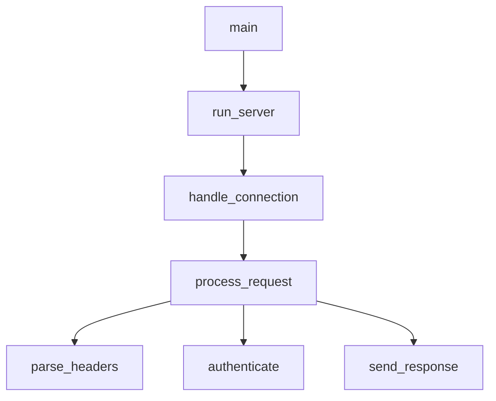

# Rust 调用图

使用 LSP 调用层次结构可视化函数调用关系。

## 用法

```
/rust-call-graph <function_name> [--depth N] [--direction in|out|both]
```

**选项：**
- `--depth N`：要遍历的层级数（默认值：3）
- `--direction`：`in`（调用方）、`out`（被调用方）、`both`（两者）

**示例：**
- `/rust-call-graph process_request` - 同时显示调用方和被调用方
- `/rust-call-graph handle_error --direction in` - 仅显示调用方
- `/rust-call-graph main --direction out --depth 5` - 深度分析被调用方

## LSP 操作

### 1. 准备调用层次结构

获取函数的调用层次结构项。

```
LSP(
  operation: "prepareCallHierarchy",
  filePath: "src/handler.rs",
  line: 45,
  character: 8
)
```

### 2. 传入调用（谁调用了此函数？）

```
LSP(
  operation: "incomingCalls",
  filePath: "src/handler.rs",
  line: 45,
  character: 8
)
```

### 3. 传出调用（此函数调用了什么？）

```
LSP(
  operation: "outgoingCalls",
  filePath: "src/handler.rs",
  line: 45,
  character: 8
)
```

## 工作流程

```
User: "Show call graph for process_request"
    │
    ▼
[1] Find function location
    LSP(workspaceSymbol) or Grep
    │
    ▼
[2] Prepare call hierarchy
    LSP(prepareCallHierarchy)
    │
    ▼
[3] Get incoming calls (callers)
    LSP(incomingCalls)
    │
    ▼
[4] Get outgoing calls (callees)
    LSP(outgoingCalls)
    │
    ▼
[5] Recursively expand to depth N
    │
    ▼
[6] Generate ASCII visualization
```

## 输出格式

### 传入调用（谁调用了此函数？）

```
## Callers of `process_request`

main
└── run_server
    └── handle_connection
        └── process_request  ◄── YOU ARE HERE
```

### 传出调用（此函数调用了什么？）

```
## Callees of `process_request`

process_request  ◄── YOU ARE HERE
├── parse_headers
│   └── validate_header
├── authenticate
│   ├── check_token
│   └── load_user
├── execute_handler
│   └── [dynamic dispatch]
└── send_response
    └── serialize_body
```

### 双向（两者）

```
## Call Graph for `process_request`

                    ┌─────────────────┐
                    │      main       │
                    └────────┬────────┘
                             │
                    ┌────────▼────────┐
                    │   run_server    │
                    └────────┬────────┘
                             │
                    ┌────────▼────────┐
                    │handle_connection│
                    └────────┬────────┘
                             │
        ┌────────────────────┼────────────────────┐
        │                    │                    │
┌───────▼───────┐   ┌───────▼───────┐   ┌───────▼───────┐
│ parse_headers │   │ authenticate  │   │send_response  │
└───────────────┘   └───────┬───────┘   └───────────────┘
                            │
                    ┌───────┴───────┐
                    │               │
             ┌──────▼──────┐ ┌──────▼──────┐
             │ check_token │ │  load_user  │
             └─────────────┘ └─────────────┘
```

## 分析洞察

生成调用图后，提供分析洞察：

```
## Analysis

**Entry Points:** main, test_process_request
**Leaf Functions:** validate_header, serialize_body
**Hot Path:** main → run_server → handle_connection → process_request
**Complexity:** 12 functions, 3 levels deep

**Potential Issues:**
- `authenticate` has high fan-out (4 callees)
- `process_request` is called from 3 places (consider if this is intentional)
```

## 常见模式

| 用户说法 | 方向 | 使用场景 |
|-----------|-----------|----------|
| “谁调用了 X？” | 入向 | 影响分析 |
| “X 调用了什么？” | 出向 | 理解实现 |
| “显示调用图” | 双向 | 全面了解 |
| “追踪从 main 到 X 的路径” | 出向 | 执行路径 |

## 可视化选项

| 样式 | 最适合 |
|-------|----------|
| 树形图（默认） | 简单层次结构 |
| 方框图 | 复杂关系 |
| 扁平列表 | 大量连接 |
| Mermaid | 导出到文档 |

### Mermaid 导出



## 相关技能

| 使用情形 | 参阅 |
|------|-----|
| 查找定义 | rust-code-navigator |
| 项目结构 | rust-symbol-analyzer |
| Trait 实现 | rust-trait-explorer |
| 安全重构 | rust-refactor-helper |