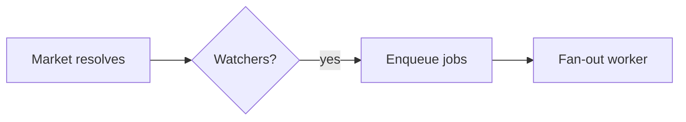

# Plan Canvas

用于计划和视觉制品的审阅循环：你编写制品，由人工在浏览器中进行审阅——为他们所指的确切元素添加批注、展开聊天，并给出**批准计划 / 请求更改**的结论——与此同时，你阻塞在单个 CLI 调用上，该调用会以 JSON 格式返回他们的反馈。

灵感来自 [lavish-axi](https://github.com/kunchenguid/lavish-axi)；围绕 `/plan` 确认关卡重新构建为 ECC 原生实现，且零依赖。

## 何时使用

- 你刚刚编写了一个计划制品（通过 `/plan` 生成的 `.claude/plans/*.plan.md`），并且
  需要获得 CONFIRM/批准决定——画布结论将取代手动输入的
  “是/继续”。
- 用户应该能够*指向*需要更改的内容：审阅设计、对比、
  报告，或任何本地 `.md` / `.html` 制品。
- 用户请求使用 `/plan-canvas`、进行视觉审阅，或“在浏览器中打开它”。

请勿用于：差异代码审阅（`/code-review`）、运行 Web 应用或
远程 URL。画布仅提供本地制品文件。

## 工作原理

以 `ecc-plan-canvas` 调用 CLI——它是 `ecc-universal`
包提供的可执行文件（全局安装或插件安装后位于 PATH 中；对于插件安装，也可以使用 `node "$CLAUDE_PLUGIN_ROOT/scripts/plan-canvas.js"`）。
请从正在审阅的项目中运行它；它可以在任何工作目录下工作。它管理一个由所有会话共享的、分离运行的环回服务器
（`127.0.0.1:4517`），并以制品路径为键——无需跟踪会话
ID。

该工作流是一个纯 CLI 加 JSON 的循环，因此与模型和工具框架无关：
任何能够运行 shell 命令并读取 stdout 的代理都可以用相同方式驱动它
（Claude Code、Codex、Cursor、Gemini、OpenCode、Copilot）。可通过你的
工具框架所提供的任意技能调用方式触发它——例如，在 Claude Code 中使用 `/plan-canvas`，在
Codex 中使用 `$plan-canvas`——也可以直接运行 `ecc-plan-canvas` 命令。

```bash
# 1. Open the artifact in the user's browser (returns immediately)
ecc-plan-canvas open .claude/plans/feature.plan.md

# 2. Block until the human responds. Leave running; re-run if interrupted:
#    queued feedback is never lost.
ecc-plan-canvas await .claude/plans/feature.plan.md
```

### 保持监听，否则人工就像在对着空椅子说话

只有当某个 `await` 实际上正在会话中等待时，反馈才能传递给你。
如果你的轮次结束时没有任何监听任务，消息就会留在队列中，而从
人工所在的另一端来看，发送消息似乎完全没有任何反应。

因此，当你的工具框架支持时，**请将 `await` 作为后台任务运行**（在
Claude Code 中，使用带有 `run_in_background: true` 的 Bash 调用）。一旦
反馈到达，它便会退出，工具框架随后会将 JSON 交给你，从而使循环能够
跨轮次保持活跃，而不会随前台调用一起终止。前台 `await`
也可以工作，但只能持续到工具框架对它执行超时限制为止。

存在两项兜底机制，但它们都不能成为跳过上述做法的借口：

- `ecc-plan-canvas pending` 会列出已排队但没有监听器的反馈。每当你
  不确定是否遗漏了某些内容时，请检查它。
- `stop:plan-canvas-pending` 钩子会在画布反馈尚未送达时阻止你的轮次
  结束，并将消息交给你。如果你正在通过该钩子读取
  反馈，说明你过早停止了监听。

`await` 会在人工操作后输出 JSON：

```json
{
  "status": "feedback",
  "items": [
    { "kind": "annotation", "text": "Split this into two phases",
      "anchor": { "selector": "h2:nth-of-type(3)", "tag": "h2", "snippet": "Phase 2: Migration" } },
    { "kind": "verdict", "verdict": "request-changes" }
  ]
}
```

- `kind: "chat"` — 自由形式的消息；请在画布中回复，而不是在终端中。
- `kind: "annotation"` — 锚定到某个元素的反馈（`anchor.selector`、
  `anchor.snippet` 会显示他们所指向的内容；如果他们高亮了一段文本，
  则通过 `anchor.textRange.text` 显示）。
- `kind: "verdict"` — `approve` 表示计划已确认：停止轮询、
  结束会话并开始实施。`request-changes` 表示修改工件
  （画布会实时重新加载它）并继续此循环。

**3. 始终在画布中回复**，然后继续监听。一个命令即可完成这两件事：

```bash
ecc-plan-canvas await <file> --reply "Split Phase 2 as requested. Take a look."
```

每条人工消息都要在画布中得到回复，即使只是一句
“正在处理，我现在重写风险表。”聊天面板中一片沉默
与画布损坏没有区别，而这正是此循环旨在防止的故障。
请在那里回复，而不应只在终端中回复。

工作期间，请使用活动指示器，让聊天如实反映当前状态：

```bash
# animated "agent is thinking..." bubble; refresh it during long work
ecc-plan-canvas typing <file> --state thinking
# switch to "agent is typing..." just before a reply lands
ecc-plan-canvas typing <file> --state typing
```

`await` 在将一批消息交给你的那一刻，会替你设置 `thinking`，而 `--reply`
会将其清除。这两种状态都会自行过期，因此崩溃的代理最终会如实显示为
“queued”，而不会让人工用户永远盯着跳动的圆点。如果修改耗时超过一分钟，
请刷新 `thinking`。

**4. 结束**：评审完成后，运行 `ecc-plan-canvas end <file>`。

## 图表（Mermaid）

当计划的一部分涉及流程、架构、序列、状态机、ER
模型或依赖关系图时，请将其编写为带围栏的 ` ```mermaid ` 代码块，
而不是 ASCII 图或大段文字——画布会将其渲染为带主题的图表，
人工用户可以直接在图表上指点。当一张图比一段文字更易于理解时使用它；
对于简单列表或表格则不必使用。

````markdown

````

图表会使用 ECC 深色主题和强调色板进行渲染。Mermaid 会在浏览器中
从固定版本的 CDN 加载；如果该 CDN 不可用（离线），代码块会降级为
显示其源代码，因此评审永远不会被阻塞。对于隔离网络环境，
可通过 `ECC_PLAN_CANVAS_MERMAID_URL` 指向本地镜像。

## 规则

- Markdown 工件使用 ECC 的计划模板进行渲染（包括 Mermaid 代码块）；
  `.html` 工件按原样渲染，并注入批注层。有关 HTML
  编写指南，请使用 `frontend-design-direction` 和 `artifact-design`
  技能。
- 通过编辑工件文件进行修改——保存时画布会实时重新加载。切勿
  重新运行 `open` 来刷新。
- `{"status": "ended", "endedBy": "user"}`（或反馈批次中的
  `sessionEnded: true`）表示用户已关闭评审：停止轮询，在聊天中
  提交剩余更新，并且不要重新打开。对该会话直接执行 `open`
  会被拒绝；仅当用户要求恢复时才传入 `--reopen`。
- 同级资源（图像、CSS）必须与工件放在一起，并通过相对路径
  引用。
- 服务器仅监听环回地址，并会在空闲 30 分钟后退出
  （`ECC_PLAN_CANVAS_IDLE_MS`）；`stop` 会显式将其关闭。状态保存在
  `~/.claude/plan-canvas/`（`ECC_PLAN_CANVAS_STATE_DIR`）中。

## 示例

**计划审批流程** — `/plan` 会写入
`.claude/plans/notifications.plan.md`，并且必须等待确认：

```bash
ecc-plan-canvas open .claude/plans/notifications.plan.md
ecc-plan-canvas await .claude/plans/notifications.plan.md
# → {"status":"feedback","items":[{"kind":"verdict","verdict":"approve"}]}
ecc-plan-canvas end .claude/plans/notifications.plan.md
# plan is confirmed — begin implementation
```

**修订循环** — 收到反馈后，编辑文件、回复并继续监听：

```bash
# await returned annotations → edit the .plan.md (canvas live-reloads)
ecc-plan-canvas await <file> --reply "Reworked the risk table."
# → blocks again until the next response
```

## 反模式

- 在循环中使用 `--timeout-ms` 进行轮询。它是为测试而存在的。应改为让不带参数的
  `await` 持续运行。
- 在审查仍处于打开状态时，结束当前轮次却没有运行任何 `await` 进行监听。
  这是会让用户感觉“我发了消息，
  但什么也没发生”的唯一一种故障。
- 阅读了反馈，却只在终端中回复。用户正在查看
  画布。
- 在用户主动结束后，“只是为了展示”某些内容而重新打开。
- 将整个计划粘贴到聊天中，*同时*又打开画布——应选择画布，
  并将终端摘要限制为一行。
- 从状态文件中解析画布聊天——你需要的一切都会通过
  `await` 到达。