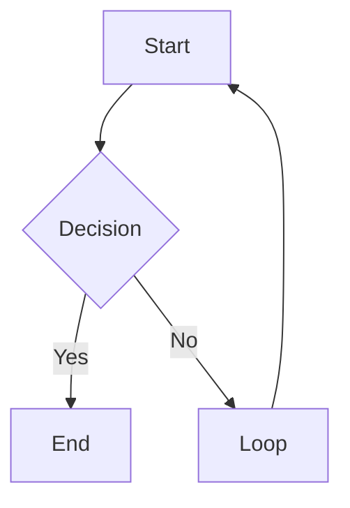

# obsidian-markdown：Obsidian 风格 Markdown

编写任何 wiki 页面时，请参考此技能。Obsidian 在标准 Markdown 的基础上扩展了双向链接、嵌入、标注框和属性。语法错误会导致链接失效、标注框不可见或 frontmatter 格式错误。

**底层方案偏好（v1.7+）**：此技能是一个自包含的后备方案。**优先使用 `kepano/obsidian-skills`**（作者为 Obsidian CEO Steph Ango）作为权威底层方案——其中的 `obsidian-markdown` 技能是所有 Agent-Skills 运行时的规范 Obsidian 语法参考。如果你看到一个可用但不带 `claude-obsidian:` 命名空间的 `obsidian-markdown` 技能，那就是 kepano 的版本：请使用它。提供下面的参考内容是为了确保未安装 kepano 市场时，该插件仍可正常运行。安装：`claude plugin marketplace add kepano/obsidian-skills`。仓库：[github.com/kepano/obsidian-skills](https://github.com/kepano/obsidian-skills)。

---

## 双向链接

内部链接使用双方括号。填写不带扩展名的文件名。

| 语法 | 作用 |
|---|---|
| `[[Note Name]]` | 基本链接 |
| `[[Note Name\|Display Text]]` | 别名链接（显示“Display Text”） |
| `[[Note Name#Heading]]` | 链接到特定标题 |
| `[[Note Name#^block-id]]` | 链接到特定块 |

规则：
- 在某些系统上区分大小写。请与确切的文件名保持一致。
- 无需路径：Obsidian 会根据文件名的唯一性进行解析。
- 如果两个文件同名，请使用 `[[Folder/Note Name]]` 来消除歧义。

---

## 嵌入

嵌入是在双向链接前使用 `!`。它们会以内联方式显示内容。

| 语法 | 作用 |
|---|---|
| `![[Note Name]]` | 嵌入完整笔记 |
| `![[Note Name#Heading]]` | 嵌入一个章节 |
| `![[image.png]]` | 嵌入图片 |
| `![[image.png\|300]]` | 嵌入宽度为 300px 的图片 |
| `![[document.pdf]]` | 嵌入 PDF（Obsidian 原生渲染） |
| `![[audio.mp3]]` | 嵌入音频 |

---

## 标注框

标注框是带有类型关键字的块引用。它们会渲染为带样式的提示框。

```markdown
> [!note]
> Default informational callout.

> [!note] Custom Title
> Callout with a custom title.

> [!note]- Collapsible (closed by default)
> Click to expand.

> [!note]+ Collapsible (open by default)
> Click to collapse.
```

### 所有标注框类型

| 类型 | 别名 | 用途 |
|------|---------|---------|
| `note` |: | 一般说明 |
| `abstract` | `summary`, `tldr` | 摘要 |
| `info` |: | 信息 |
| `todo` |: | 待办事项 |
| `tip` | `hint`, `important` | 提示和重点 |
| `success` | `check`, `done` | 正面结果 |
| `question` | `help`, `faq` | 开放性问题 |
| `warning` | `caution`, `attention` | 警告 |
| `failure` | `fail`, `missing` | 错误或失败 |
| `danger` | `error` | 严重问题 |
| `bug` |: | 已知错误 |
| `example` |: | 示例 |
| `quote` | `cite` | 引文 |
| `contradiction` |: | 冲突信息（wiki 惯例） |

---

## 属性（Frontmatter）

Obsidian 会将 YAML frontmatter 渲染为属性面板。规则：

```yaml
---
type: concept                    # plain string
title: "Note Title"              # quoted if it contains special chars
created: 2026-04-08              # date as YYYY-MM-DD (not ISO datetime)
updated: 2026-04-08
tags:
  - tag-one                      # list items use - format
  - tag-two
status: developing
related:
  - "[[Other Note]]"             # wikilinks must be quoted in YAML
sources:
  - "[[source-page]]"
---
```

规则：
- 仅使用扁平 YAML。绝不嵌套对象。
- 日期使用 `YYYY-MM-DD`，而不是 `2026-04-08T00:00:00`。
- 列表使用 `- item`，而不是行内形式 `[a, b, c]`。
- YAML 中的双向链接必须加引号：`"[[Page]]"`。
- `tags` 字段：Obsidian 将其作为标签列表读取，可在库中搜索。

---

## 标签

两种有效形式：

```markdown
#tag-name             : inline tag anywhere in the body
#parent/child-tag     : nested tag (shows hierarchy in tag pane)
```

在 frontmatter 中：
```yaml
tags:
  - research
  - ai/obsidian
```

不要在 frontmatter 标签列表中使用 `#`。只需使用标签名称。

---

## 文本格式

标准 Markdown 加 Obsidian 扩展：

| 语法 | 结果 |
|---|---|
| `**bold**` | 粗体 |
| `*italic*` | 斜体 |
| `~~strikethrough~~` | 删除线 |
| `==highlight==` | 高亮文本（在 Obsidian 中显示为黄色） |
| `` `inline code` `` | 行内代码 |

---

## 数学公式

Obsidian 使用 MathJax/KaTeX：

行内数学公式：
```markdown
$E = mc^2$
```

块级数学公式：
```markdown
$$
\int_0^\infty e^{-x} dx = 1
$$
```

---

## 代码块

标准围栏代码块。Obsidian 支持所有常见语言的语法高亮：

````markdown
```python
def hello():
    return "world"
```
````

---

## 表格

标准 Markdown 表格：

```markdown
| Column A | Column B | Column C |
|----------|----------|----------|
| Value    | Value    | Value    |
| Value    | Value    | Value    |
```

Obsidian 原生渲染表格。无需插件。

---

## Mermaid 图表

Obsidian 原生渲染 Mermaid：

````markdown

````

支持：`graph`、`sequenceDiagram`、`gantt`、`classDiagram`、`pie`、`flowchart`。

---

## 脚注

```markdown
This sentence has a footnote.[^1]

[^1]: The footnote text goes here.
```

---

## 不要这样做

- 不要使用 `[link text](path/to/note.md)` 创建内部链接：应改用 `[[Note Name]]`。
- 不要在标注框中使用 HTML：坚持使用 Markdown。
- 不要在标注框正文中使用 `##`：标题无法在标注框内渲染。
- 不要在 frontmatter 中以内联形式编写 `tags: [a, b, c]`：Obsidian 更推荐列表格式。
- 不要在 frontmatter 中写入 ISO 日期时间（`2026-04-08T00:00:00Z`）：请使用 `2026-04-08`。

---

## 如何思考（10 项原则映射）

使用此技能时，请应用 10 项原则循环。有关规范框架，请参阅 [`skills/think/SKILL.md`](../think/SKILL.md)。

| # | 原则 | 在此处的应用 |
|---|-----------|-------------------|
| 1 | 观察（外部） | 用户需要哪种语法？（双向链接？标注框？嵌入？数学公式？Mermaid？） |
| 2 | 观察（内部） | 我记录的是记忆中的 Obsidian 风格 Markdown，还是其当前实际状态？检查规范。 |
| 3 | 倾听 | 用户困惑的来源——他们具体弄错了哪种语法？ |
| 4 | 思考 | 提供最少且正确的示例。“不要怎么做”通常与“应该怎么做”同样有价值。 |
| 5 | 连接（横向） | OFM 与 CommonMark 和 GFM 有何不同？这些差异正是用户容易感到困惑的地方。 |
| 6 | 连接（系统） | 当 kepano/obsidian-skills 存在时，应遵循其底层实现——保持单一事实来源，减少偏差。 |
| 7 | 感受 | 提供一份可在 30 秒内快速浏览的速查表，而不是一大段密集文本。 |
| 8 | 接受 | 并非每个双向链接都需要别名；有些语法确实是可选的。不要过度规定。 |
| 9 | 创造 | 创建与 Obsidian X.Y 当前版本一致的语法参考。包含易错点部分。 |
| 10 | 成长 | 随着 OFM 的演进（新增 Mermaid 类型、标注框类型、cssclasses 等），及时更新。 |