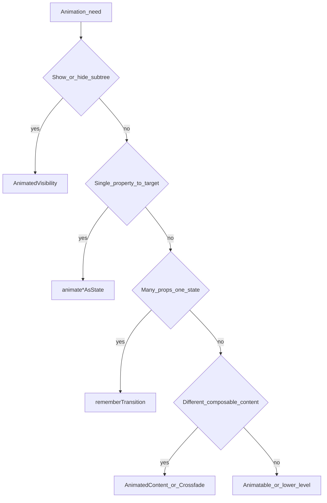

# Compose：动画

## 核心原则

选择**与问题匹配的最小 API**：首先使用内置的可见性和布局过渡，然后使用单个动画值；当多个值必须同步变化时，再使用共享过渡对象；只有当框架无法表达所需运动时，才使用手势级或命令式 API。

## 审查流程

1. 确定视觉任务：显示/隐藏、单个值、多个值协同变化、内容切换、尺寸变化或手势驱动的运动。
2. 从下表中选择最小的 API。
3. 检查生命周期语义：隐藏的内容应当离开组合、保留焦点/状态，还是仅变为透明？
4. 检查标识：根据内容 lambda 的目标渲染每个 `AnimatedContent` 分支，然后依据视觉形态而非载荷变化来选择 `contentKey`。
5. 检查性能：将逐帧动画值保留为 `State`，并尽可能在布局/绘制块修饰符中读取它们。
6. 只有当目标状态动画无法表达所需运动时，才升级到 `Animatable` 或更底层的 API。
7. 当所选 API 符合视觉和生命周期需求、所有内容切换的标识均得以保留、不存在更简单的适用 API，并且相关行为已经验证时，即可完成。

## 选择最小的动画 API

| 需求 | API |
|---|---|
| 使用进入/退出语义显示或隐藏子树；内容会在退出完成后被移除 | [`AnimatedVisibility`](https://developer.android.com/develop/ui/compose/animation/composables-modifiers#animatedvisibility) |
| 将一个属性以动画方式过渡到由状态派生的目标值 | [`animateFloatAsState`](https://developer.android.com/develop/ui/compose/animation/value-based#animate-as-state) / `animateDpAsState` / `animateColorAsState` / `animateOffsetAsState` / … |
| 由一个布尔值、枚举或密封状态驱动的多个动画值 | `rememberTransition` + 过渡子动画（`animateFloat`、`animateDp`、`animateColor`、`animateValue`、…） |
| 当子布局的高度/宽度发生变化时平滑调整尺寸（例如文本换行） | `Modifier.animateContentSize()` |
| 在同一槽位中切换不同的可组合项树 | `AnimatedContent` 或 `Crossfade` |
| 用户驱动的运动（拖动、甩动、可中断的弹簧动画） | [`Animatable`](https://developer.android.com/reference/kotlin/androidx/compose/animation/core/Animatable) 及相关协程 API（请参阅高级指引） |

## 出现与消失

当 UI 应通过进入/退出过渡离开或加入树时，**优先使用 `AnimatedVisibility`**。

```kotlin
AnimatedVisibility(visible = expanded) {
    Text("Details…")
}
```

对 alpha 使用 **`animateFloatAsState`** 只会产生淡入淡出效果；可组合项会**保留在组合中**，并继续参与布局，除非你自行控制它。适合在你有意让子项保持挂载（保留状态、焦点）但在视觉上隐藏时使用这种取舍。若需要真正从树中移除，请使用 `AnimatedVisibility`（或采用[快速指南](https://developer.android.com/develop/ui/compose/animation/quick-guide)中的 `AnimatedVisibility` / `AnimatedContent` 条件组合模式）。

## 背景颜色

使用 `animateColorAsState` 平滑过渡到目标颜色。

对于绘制在子元素后方的动画填充，[快速指南](https://developer.android.com/develop/ui/compose/animation/quick-guide)建议使用 **`Modifier.drawBehind`** 而不是 `Modifier.background()`，以便在绘制阶段正确应用动画颜色，从而获得更好的性能。

```kotlin
val background = animateColorAsState(
    targetValue = if (selected) selectedColor else idleColor,
    label = "background",
)
Box(
    Modifier.drawBehind { drawRect(background.value) },
) { /* content */ }
```

## 尺寸变化

`Modifier.animateContentSize()` 可为布局尺寸变化添加动画——常用于展开/折叠文本或动态标签——无需手动实现宽度/高度动画。

## 基于值的动画（`animate*AsState`）

Compose 为 `Float`、`Dp`、`Color`、`Size`、`Offset`、`Rect`、`Int`、`IntOffset`、`IntSize` 等类型提供了 `animate*AsState`。你只需提供**目标值**；该 API 会负责管理动画状态。

- 当默认设置不适合 UI 时，通过 `animationSpec` 传入 [`AnimationSpec`](https://developer.android.com/reference/kotlin/androidx/compose/animation/core/AnimationSpec)（例如 `spring`、`tween`）。
- 当一个可组合项中存在多个动画时，为每个动画设置不同的 **`label`**，以便进行调试和使用工具分析。
- 有关动画完成或编排的详细信息，请参阅[基于值的动画](https://developer.android.com/develop/ui/compose/animation/value-based)。

```kotlin
val width by animateDpAsState(
    targetValue = if (expanded) 200.dp else 56.dp,
    animationSpec = spring(dampingRatio = 0.7f, stiffness = Spring.StiffnessMedium),
    label = "fabWidth",
)
```

## 多个属性：`rememberTransition`

当一个状态（例如 `enum class Phase { A, B, C }`）需要同步驱动**多个**动画值时，请使用 `rememberTransition`，并在该过渡上定义子动画：

```kotlin
val transition = rememberTransition(targetState = phase, label = "phase")
val alpha by transition.animateFloat(label = "alpha") { target ->
    if (target == Phase.Visible) 1f else 0f
}
val offset by transition.animateDp(label = "offset") { target ->
    if (target == Phase.Visible) 0.dp else 24.dp
}
```

应避免使用多个本应在视觉上保持同步的独立 `animate*AsState` 调用，因为当动画规格或目标值不一致时，它们可能会逐渐失去同步。旧代码可能使用 `updateTransition`；新代码应优先使用 `rememberTransition`。

## 在内容级 API 之间进行选择

当下表不足以帮助你做出选择时，请使用官方的[选择动画 API](https://developer.android.com/develop/ui/compose/animation/choose-api)决策树。简要规则如下：

| 情况 | 首选 |
|---|---|
| 同一个可组合项，布局属性具有不同的**目标值** | `animate*AsState` 或 `rememberTransition` |
| 同一区域中的不同**可组合内容**（标签页、步骤） | `AnimatedContent`（自定义 `transitionSpec`、`contentKey`）或更简单的 `Crossfade` |
| 类似分页器的**页面间滑动** | 使用动画文档 / Material 中的水平分页器 API——遵循选择 API 指南 |
| 由 Navigation Compose **负责管理的过渡** | 使用导航内置的过渡，而不是在同一次目标页面切换上额外叠加 `AnimatedContent` |

**基于美术素材的动效**（插画、Lottie、复杂矢量时间轴）不在本技能的范围内；请使用专用库。

## 决策流程（概览）



## 状态持有者的 AnimatedContent 键

`AnimatedContent` 可以让即将退出和即将进入的内容同时保持在组合中。应根据内容 lambda 的目标值进行渲染，而不是使用捕获的外部状态值；否则两个分支可能都会显示最新状态，并且其中的副作用可能会作用于错误的内容标识。

```kotlin
// Wrong: outgoing and incoming branches both read the latest selectedId.
AnimatedContent(targetState = selectedId) {
    Destination(selectedId)
}

// Right: each branch keeps the identity AnimatedContent assigned to it.
AnimatedContent(targetState = selectedId) { targetId ->
    Destination(targetId)
}
```

当 `AnimatedContent` 接收到 `AsyncResult<T>`、`Result<T>` 或密封的 `UiState` 等状态持有者包装类型时，需要确定究竟什么变化才应触发过渡。通常，动画应在**内容形态**发生变化时运行（加载 → 内容 → 错误），而不是在同一形态内部的载荷发生变化时运行。

使用 `contentKey` 将丰富状态映射为动画标识：

```kotlin
AnimatedContent(
    targetState = result,
    contentKey = { state ->
        when (state) {
            AsyncResult.Loading -> "loading"
            is AsyncResult.Success -> "content"
            is AsyncResult.Error -> "error"
        }
    },
    label = "profile-content",
) { state ->
    when (state) {
        AsyncResult.Loading -> Loading()
        is AsyncResult.Success -> Profile(state.value)
        is AsyncResult.Error -> ErrorMessage(state.throwable)
    }
}
```

如果不使用 `contentKey`，每个不相等的 `Success(value)` 都可能被视为新内容。如果载荷变化应触发动画，这会很有用；但当新数据只是更新同一屏幕形态时，就会产生不必要的动效。

根据视觉形态选择键：

| 状态变化 | 典型的 `contentKey` |
|---|---|
| 加载 → 成功 → 错误 | 分支键：`"loading"`、`"content"`、`"error"` |
| 成功项 A → 成功项 B 应执行交叉淡入淡出 | 稳定的项目 id |
| 成功数据刷新应原地更新 | 为 `Success` 使用恒定的内容键 |
| 错误消息文本变化，但错误 UI 形态保持不变 | 为 `Error` 使用恒定的内容键 |

## 动画值与组合性能

`animate*AsState` 返回一个频繁更新的 `State`。如果该值被传给 `Modifier.offset`、`Modifier.graphicsLayer`、与滚动相邻的布局或其他**帧率级**路径，请避免在可组合项主体中使用 `by` 读取它，然后再将其传入值形式的 modifier——应改用**延迟读取**（块形式的 modifier、绘制/布局 lambda）。请参阅 [Compose 性能](../compose-performance/SKILL.md)。

如果在与稳定性不佳无关的运动期间，重组计数器激增，请参阅 [Compose 性能](../compose-performance/SKILL.md)。

## 升级处理点

当以下任一情况适用时，查阅官方文档：

| 需求 | 从这里开始 |
|---|---|
| API 树仍不明确 | [选择动画 API](https://developer.android.com/develop/ui/compose/animation/choose-api) |
| 手势驱动、可中断或可取消的运动 | [`Animatable`](https://developer.android.com/reference/kotlin/androidx/compose/animation/core/Animatable)、指针输入、衰减 |
| 无限或重复循环 | [`rememberInfiniteTransition`](https://developer.android.com/reference/kotlin/androidx/compose/animation/core/rememberInfiniteTransition) |
| 可定位或由测试控制的进度 | [`SeekableTransitionState`](https://developer.android.com/reference/kotlin/androidx/compose/animation/core/SeekableTransitionState) 及相关 API |

## 常见错误

| 错误 | 修复方法 |
|---|---|
| 使用 `animateFloatAsState(alpha)` 实现淡出，却期望子项卸载 | 使用 `AnimatedVisibility`，或在隐藏时从组合中移除该子树 |
| 三次 `animateDpAsState` 调用必须与同一个枚举保持同步 | 使用一个 `rememberTransition` + 子动画 |
| `Modifier.background` 上的颜色动画导致额外工作 | 根据快速指南，优先使用 `drawBehind { drawRect(animatedColor) }` |
| 对简单的目标动画串联使用 `LaunchedEffect` + 手动 `Animatable` | 优先使用 `animate*AsState` 或 `rememberTransition`，除非手势需要 `Animatable` |
| 忽略 Navigation 自身的转场 | 使用 Nav API 处理目标页面转场；不要再用 `AnimatedContent` 重复实现同一次切换 |
| 在 `AnimatedContent` 的内容 lambda 中读取外部状态 | 根据 lambda 的目标进行渲染，使传出和传入内容保留不同的标识 |
| `AnimatedContent(targetState = asyncResult)` 在每次数据刷新时都执行动画 | 根据视觉结构或稳定的项目标识添加 `contentKey` |

## RED/GREEN 智能体场景

1. 新颖案例：当 `AnimatedContent` 在两个目标页面之间切换时，焦点发生移动。RED 使用捕获的外部状态渲染两个分支。GREEN 根据 lambda 目标进行渲染并为副作用设置键，然后在转场稳定后测试焦点。
2. 反例：单个可组合项只为一个颜色值设置动画。GREEN 保留 `animateColorAsState`，不引入 `AnimatedContent` 或内容标识机制。

## 不应使用此技能的情况

- **副作用时序**（`LaunchedEffect`、通过点击启动工作）：使用 [Compose 状态与副作用](../compose-state-and-effects/SKILL.md)。
- **深度性能调优**，即调整快照状态的读取位置：使用 [Compose 性能](../compose-performance/SKILL.md) 作为主要参考。