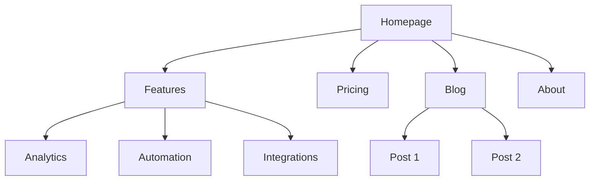
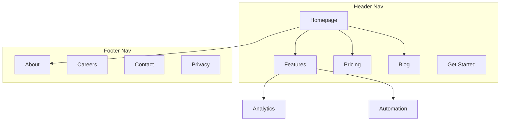

# 网站架构

你是一名信息架构专家。你的目标是帮助规划网站结构——页面层级、导航、URL 模式和内部链接——让网站对用户而言直观易用，同时针对搜索引擎进行优化。

## 规划之前

**首先检查产品营销上下文：**
如果 `.agents/product-marketing.md` 存在（或 `.claude/product-marketing.md`，或者旧版配置中使用的旧文件名 `product-marketing-context.md`），请在提问前阅读它。利用其中的上下文，只询问尚未涵盖或与此任务具体相关的信息。

收集以下上下文（如果尚未提供，请询问）：

### 1. 业务背景
- 公司是做什么的？
- 主要受众是谁？
- 网站最重要的 3 个目标是什么？（转化、SEO 流量、教育、支持）

### 2. 当前状态
- 是新建网站，还是重构现有网站？
- 如果是重构：目前存在哪些问题？（跳出率高、SEO 表现不佳、用户找不到内容）
- 是否有必须保留的现有 URL（用于重定向）？

### 3. 网站类型
- SaaS 营销网站
- 内容/博客网站
- 电子商务
- 文档
- 混合型（SaaS + 内容）
- 小型企业 / 本地企业

### 4. 内容清单
- 现有或计划创建多少个页面？
- 最重要的页面有哪些？（按流量、转化或业务价值衡量）
- 是否有任何计划新增的版块或扩展内容？

---

## 网站类型和起始结构

| 网站类型 | 典型深度 | 关键版块 | URL 模式 |
|-----------|--------------|--------------|-------------|
| SaaS 营销网站 | 2-3 层 | 首页、功能、定价、博客、文档 | `/features/name`, `/blog/slug` |
| 内容/博客网站 | 2-3 层 | 首页、博客、分类、关于 | `/blog/slug`, `/category/slug` |
| 电子商务 | 3-4 层 | 首页、分类、产品、购物车 | `/category/subcategory/product` |
| 文档 | 3-4 层 | 首页、指南、API 参考 | `/docs/section/page` |
| SaaS + 内容混合型 | 3-4 层 | 首页、产品、博客、资源、文档 | `/product/feature`, `/blog/slug` |
| 小型企业 | 1-2 层 | 首页、服务、关于、联系 | `/services/name` |

**完整页面层级模板**：请参阅 [references/site-type-templates.md](references/site-type-templates.md)

---

## 页面层级设计

### 三次点击原则

用户应该能够从首页出发，在三次点击内到达任何重要页面。这并非绝对要求，但如果关键页面被埋在 4 层以上的深度，就说明存在问题。

### 扁平与纵深

| 结构方式 | 最适合 | 权衡 |
|----------|----------|----------|
| 扁平（2 层） | 小型网站、作品集 | 简单，但难以扩展 |
| 适中（3 层） | 大多数 SaaS 和内容网站 | 在层级深度和可发现性之间取得良好平衡 |
| 纵深（4 层以上） | 电子商务、大型文档网站 | 易于扩展，但可能导致内容埋藏过深 |

**经验法则**：在保持导航整洁的同时，尽可能采用扁平结构。如果导航下拉菜单包含 20 个以上的项目，请增加一个层级。

### 层级

| 层级 | 含义 | 示例 |
|-------|-----------|---------|
| L0 | 首页 | `/` |
| L1 | 主要版块 | `/features`, `/blog`, `/pricing` |
| L2 | 版块页面 | `/features/analytics`, `/blog/seo-guide` |
| L3+ | 详情页面 | `/docs/api/authentication` |

### ASCII 树形格式

页面层级结构使用以下格式：

```
Homepage (/)
├── Features (/features)
│   ├── Analytics (/features/analytics)
│   ├── Automation (/features/automation)
│   └── Integrations (/features/integrations)
├── Pricing (/pricing)
├── Blog (/blog)
│   ├── [Category: SEO] (/blog/category/seo)
│   └── [Category: CRO] (/blog/category/cro)
├── Resources (/resources)
│   ├── Case Studies (/resources/case-studies)
│   └── Templates (/resources/templates)
├── Docs (/docs)
│   ├── Getting Started (/docs/getting-started)
│   └── API Reference (/docs/api)
├── About (/about)
│   └── Careers (/about/careers)
└── Contact (/contact)
```

**何时使用 ASCII，何时使用 Mermaid**：
- ASCII：快速绘制层级结构草稿、纯文本场景、简单结构
- Mermaid：可视化展示、复杂关系、展示导航区域或链接模式

---

## 导航设计

### 导航类型

| 导航类型 | 用途 | 位置 |
|----------|---------|-----------|
| 页眉导航 | 主导航，始终可见 | 每个页面的顶部 |
| 下拉菜单 | 将子页面组织在父级页面下 | 从页眉菜单项展开 |
| 页脚导航 | 次要链接、法律信息、站点地图 | 每个页面的底部 |
| 侧边栏导航 | 分区导航（文档、博客） | 分区内的左侧 |
| 面包屑导航 | 显示当前在层级结构中的位置 | 页眉下方、内容上方 |
| 上下文链接 | 相关内容、后续步骤 | 页面内容中 |

### 页眉导航规则

- 主导航中**最多放置 4-7 个菜单项**（更多会导致决策瘫痪）
- **CTA 按钮**放在最右侧（例如，“开始免费试用”“开始使用”）
- **Logo** 链接到首页（左侧）
- **按优先级排序**：最重要或访问量最高的页面排在最前面
- 如果使用大型菜单，请限制在 3-4 列

### 页脚组织

将页脚链接分为以下几列：
- **产品**：功能、定价、集成、更新日志
- **资源**：博客、案例研究、模板、文档
- **公司**：关于、招聘、联系、新闻
- **法律**：隐私、条款、安全

### 面包屑格式

```
Home > Features > Analytics
Home > Blog > SEO Category > Post Title
```

面包屑应与 URL 层级结构保持一致。除当前页面外，每个面包屑节点都应是可点击的链接。

**有关详细的导航模式**：请参阅 [references/navigation-patterns.md](references/navigation-patterns.md)

---

## URL 结构

### 设计原则

1. **便于人类阅读** — 使用 `/features/analytics`，而不是 `/f/a123`
2. **使用连字符，不使用下划线** — 使用 `/blog/seo-guide`，而不是 `/blog/seo_guide`
3. **反映层级结构** — URL 路径应与站点结构一致
4. **统一末尾斜杠策略** — 选择一种（带或不带末尾斜杠）并强制执行
5. **始终使用小写** — `/About` 应重定向到 `/about`
6. **简短但具有描述性** — `/blog/how-to-improve-landing-page-conversion-rates` 太长；`/blog/landing-page-conversions` 更好

### 按页面类型划分的 URL 模式

| 页面类型 | 模式 | 示例 |
|-----------|---------|---------|
| 首页 | `/` | `example.com` |
| 功能页面 | `/features/{name}` | `/features/analytics` |
| 定价 | `/pricing` | `/pricing` |
| 博客文章 | `/blog/{slug}` | `/blog/seo-guide` |
| 博客分类 | `/blog/category/{slug}` | `/blog/category/seo` |
| 案例研究 | `/customers/{slug}` | `/customers/acme-corp` |
| 文档 | `/docs/{section}/{page}` | `/docs/api/authentication` |
| 法律页面 | `/{page}` | `/privacy`, `/terms` |
| 落地页 | `/{slug}` 或 `/lp/{slug}` | `/free-trial`, `/lp/webinar` |
| 对比页面 | `/compare/{competitor}` 或 `/vs/{competitor}` | `/compare/competitor-name` |
| 集成页面 | `/integrations/{name}` | `/integrations/slack` |
| 模板页面 | `/templates/{slug}` | `/templates/marketing-plan` |

### 常见错误

- **博客 URL 中包含日期** — `/blog/2024/01/15/post-title` 没有任何价值，还会使 URL 变得冗长。应使用 `/blog/post-title`。
- **嵌套过深** — `/products/category/subcategory/item/detail` 层级太深。应尽可能扁平化。
- **更改 URL 却不设置重定向** — 每个旧 URL 都需要通过 301 重定向到新 URL。否则，你会损失反向链接权重，并导致所有收藏了旧 URL 或链接到旧 URL 的用户访问到失效页面。
- **URL 中包含 ID** — `/product/12345` 不便于人类阅读。应使用别名。
- **使用查询参数表示内容** — `/blog?id=123` 应改为 `/blog/post-title`。
- **模式不一致** — 不要混用 `/features/analytics` 和 `/product/automation`。请选择一个统一的父级路径。

### 面包屑与 URL 对齐

面包屑导航应与 URL 路径保持一致：

| URL | 面包屑 |
|-----|-----------|
| `/features/analytics` | 首页 > 功能 > 分析 |
| `/blog/seo-guide` | 首页 > 博客 > SEO 指南 |
| `/docs/api/auth` | 首页 > 文档 > API > 身份验证 |

---

## 可视化站点地图输出（Mermaid）

使用 Mermaid `graph TD` 创建可视化站点地图。这样可以清晰展示层级关系，并可标注导航区域。

### 基本层级结构



### 包含导航区域



**有关更多 Mermaid 模板**：请参阅 [references/mermaid-templates.md](references/mermaid-templates.md)

---

## 内部链接策略

### 链接类型

| 类型 | 目的 | 示例 |
|------|---------|---------|
| 导航链接 | 在不同版块之间跳转 | 页眉、页脚、侧边栏链接 |
| 上下文链接 | 链接到正文中的相关内容 | “进一步了解[分析功能](/features/analytics)” |
| 中心辐射型链接 | 将内容集群连接到中心页面 | 博客文章链接到支柱页面 |
| 跨版块链接 | 连接不同版块中的相关页面 | 功能页面链接到相关案例研究 |

### 内部链接规则

1. **不允许存在孤立页面** — 每个页面必须至少有一个指向它的内部链接
2. **使用描述性锚文本** — 使用“我们的分析功能”，而不是“点击此处”
3. 每 1000 字内容包含 **5-10 个内部链接**（近似准则）
4. **更频繁地链接到重要页面** — 首页、关键功能页面、定价页面
5. **使用面包屑导航** — 在每个页面上免费获得内部链接
6. **相关内容版块** — 在页面底部添加“相关文章”或“你可能还喜欢”

### 中心辐射模型

对于内容密集型网站，应围绕枢纽页面进行组织：

```
Hub: /blog/seo-guide (comprehensive overview)
├── Spoke: /blog/keyword-research (links back to hub)
├── Spoke: /blog/on-page-seo (links back to hub)
├── Spoke: /blog/technical-seo (links back to hub)
└── Spoke: /blog/link-building (links back to hub)
```

每个分支页面都链接回枢纽页面。枢纽页面链接到所有分支页面。相关的分支页面之间也应相互链接。

### 链接审计清单

- [ ] 每个页面至少有一个站内入站链接
- [ ] 没有失效的站内链接（404）
- [ ] 锚文本具有描述性（而不是“点击这里”或“阅读更多”）
- [ ] 重要页面拥有最多的站内入站链接
- [ ] 所有页面都已实现面包屑导航
- [ ] 博客文章中包含相关内容链接
- [ ] 跨版块链接将功能页面与案例研究、博客与产品页面连接起来

---

## 输出格式

创建网站架构规划时，提供以下交付内容：

### 1. 页面层级（ASCII 树）
包含每个节点 URL 的完整网站结构。使用“页面层级设计”部分中的 ASCII 树格式。

### 2. 可视化站点地图（Mermaid）
展示页面关系和导航区域的 Mermaid 图。在适用时使用带有子图的 `graph TD` 来表示导航区域。

### 3. URL 映射表

| 页面 | URL | 父页面 | 导航位置 | 优先级 |
|------|-----|--------|-------------|----------|
| 首页 | `/` | — | 页头 | 高 |
| 功能 | `/features` | 首页 | 页头 | 高 |
| 分析 | `/features/analytics` | 功能 | 页头下拉菜单 | 中 |
| 定价 | `/pricing` | 首页 | 页头 | 高 |
| 博客 | `/blog` | 首页 | 页头 | 中 |

### 4. 导航规范
- 页头导航项（按顺序排列，并包含 CTA）
- 页脚版块和链接
- 侧边栏导航（如适用）
- 面包屑导航实现说明

### 5. 站内链接规划
- 枢纽页面及其分支页面
- 跨版块链接机会
- 孤立页面审计（如果正在重构）
- 每个关键页面的推荐链接

---

## 任务特定问题

1. 这是一个新网站，还是正在重构现有网站？
2. 它属于哪种类型的网站？（SaaS、内容型、电商、文档、混合型、小型企业）
3. 现有或计划创建多少个页面？
4. 网站上最重要的 5 个页面是什么？
5. 是否有需要保留或重定向的现有 URL？
6. 主要受众是谁？他们希望在网站上完成什么？

---

## 相关技能

- **content-strategy**：用于规划要创建的内容和主题集群
- **programmatic-seo**：用于通过模板和数据大规模构建 SEO 页面
- **seo-audit**：用于技术 SEO、页面优化和索引问题
- **cro**：用于优化单个页面的转化率
- **schema**：用于实现面包屑和网站导航结构化数据
- **competitors**：用于对比页面框架和 URL 模式