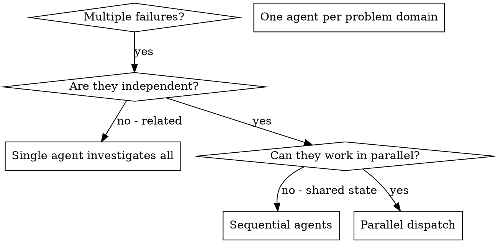

# 调度并行代理

## 概述

当你遇到多个互不相关的故障（不同的测试文件、不同的子系统、不同的 bug）时，按顺序逐一调查会浪费时间。每项调查都是独立的，可以并行进行。

**核心原则：**为每个独立的问题领域调度一个代理。让它们并发工作。

## 何时使用



**适合使用的情况：**
- 3 个以上的测试文件因不同的根本原因而失败
- 多个子系统各自独立出现故障
- 每个问题无需其他问题的上下文即可理解
- 各项调查之间不存在共享状态

**不适合使用的情况：**
- 故障彼此相关（修复一个可能会修复其他故障）
- 需要理解完整的系统状态
- 代理之间会相互干扰

## 模式

### 1. 识别独立领域

根据出现故障的部分对问题进行分组：
- 文件 A 的测试：工具审批流程
- 文件 B 的测试：批处理完成行为
- 文件 C 的测试：中止功能

每个领域都是独立的——修复工具审批不会影响中止测试。

### 2. 创建聚焦的代理任务

每个代理都会获得：
- **具体范围：**一个测试文件或子系统
- **明确目标：**让这些测试通过
- **约束条件：**不要修改其他代码
- **预期输出：**对发现和修复内容的总结

### 3. 并行调度

```typescript
// In Claude Code / AI environment
Task("Fix agent-tool-abort.test.ts failures")
Task("Fix batch-completion-behavior.test.ts failures")
Task("Fix tool-approval-race-conditions.test.ts failures")
// All three run concurrently
```

### 4. 审查并集成

代理返回结果后：
- 阅读每份总结
- 验证各项修复之间不存在冲突
- 运行完整测试套件
- 集成所有更改

## 代理提示词结构

好的代理提示词应具备以下特点：
1. **聚焦**——只针对一个明确的问题领域
2. **自包含**——提供理解问题所需的全部上下文
3. **明确说明输出**——代理应该返回什么？

```markdown
Fix the 3 failing tests in src/agents/agent-tool-abort.test.ts:

1. "should abort tool with partial output capture" - expects 'interrupted at' in message
2. "should handle mixed completed and aborted tools" - fast tool aborted instead of completed
3. "should properly track pendingToolCount" - expects 3 results but gets 0

These are timing/race condition issues. Your task:

1. Read the test file and understand what each test verifies
2. Identify root cause - timing issues or actual bugs?
3. Fix by:
   - Replacing arbitrary timeouts with event-based waiting
   - Fixing bugs in abort implementation if found
   - Adjusting test expectations if testing changed behavior

Do NOT just increase timeouts - find the real issue.

Return: Summary of what you found and what you fixed.
```

## 常见错误

**❌ 范围过大：** “修复所有测试”——智能体会迷失方向  
**✅ 具体明确：** “修复 agent-tool-abort.test.ts”——范围集中

**❌ 缺少上下文：** “修复竞态条件”——智能体不知道问题在哪里  
**✅ 提供上下文：** 粘贴错误消息和测试名称

**❌ 缺少约束：** 智能体可能会重构所有内容  
**✅ 明确约束：** “不要更改生产代码”或“仅修复测试”

**❌ 输出要求模糊：** “修复它”——你不知道发生了哪些更改  
**✅ 具体明确：** “返回根本原因和更改内容的摘要”

## 不应使用的场景

**故障相互关联：** 修复一个故障可能会修复其他故障——应先一起调查  
**需要完整上下文：** 必须查看整个系统才能理解问题  
**探索性调试：** 你还不知道哪里出了问题  
**共享状态：** 智能体之间会相互干扰（编辑相同文件、使用相同资源）

## 会话中的真实示例

**场景：** 大规模重构后，3 个文件中出现了 6 个测试失败

**失败情况：**
- agent-tool-abort.test.ts：3 个失败（时序问题）
- batch-completion-behavior.test.ts：2 个失败（工具未执行）
- tool-approval-race-conditions.test.ts：1 个失败（执行次数 = 0）

**决策：** 这些是相互独立的领域——中止逻辑、批量完成和竞态条件彼此分离

**分派：**
```
Agent 1 → Fix agent-tool-abort.test.ts
Agent 2 → Fix batch-completion-behavior.test.ts
Agent 3 → Fix tool-approval-race-conditions.test.ts
```

**结果：**
- 智能体 1：将超时等待替换为基于事件的等待
- 智能体 2：修复了事件结构错误（threadId 放置位置错误）
- 智能体 3：添加了等待异步工具执行完成的逻辑

**集成：** 所有修复相互独立，没有冲突，完整测试套件全部通过

**节省的时间：** 并行解决 3 个问题，而不是依次解决

## 主要优势

1. **并行化**——多项调查同时进行
2. **专注**——每个智能体的范围都很窄，需要跟踪的上下文更少
3. **独立性**——智能体之间不会相互干扰
4. **速度**——用解决 1 个问题的时间解决 3 个问题

## 验证

智能体返回结果后：
1. **审查每份摘要**——了解发生了哪些更改
2. **检查冲突**——智能体是否编辑了相同代码？
3. **运行完整测试套件**——验证所有修复能否协同工作
4. **抽查**——智能体可能会犯系统性错误

## 实际影响

来自调试会话（2025-10-03）：
- 3 个文件中有 6 个失败
- 并行分派了 3 个智能体
- 所有调查均同时完成
- 所有修复均成功集成
- 智能体的更改之间零冲突