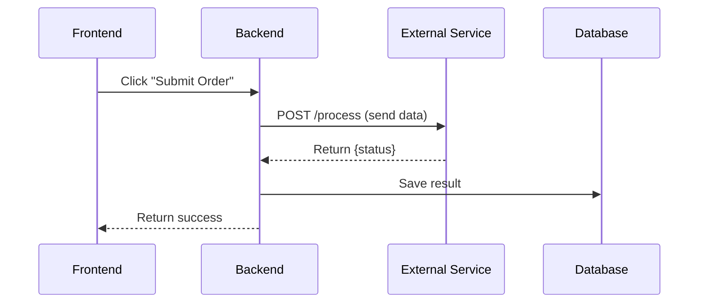
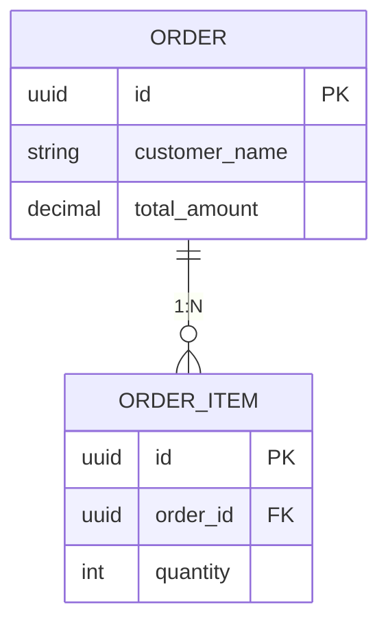
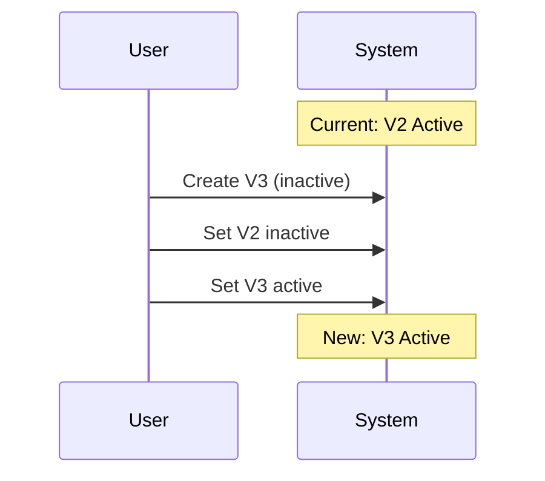

# 会议纪要整理

通过迭代审查，将原始会议转录稿转换为全面、有据可查的会议纪要。

## 快速开始

**预处理（可选但建议执行）：**
- **文档转换**：先使用 `doc-to-markdown` skill 将 .docx/.pdf 转换为 Markdown（保留表格/图片）
- **转录稿清理**：如果转录质量较差，使用 `transcript-fixer` skill 修复 ASR/STT 错误
- **上下文文件**：准备包含团队成员目录的 `context.md`，以便准确识别发言人

**核心工作流：**
1. 阅读用户提供的转录稿
2. 加载用户提供的项目特定上下文文件（可选）
3. **智能文件命名**：根据内容自动生成文件名（见下文）
4. **发言人识别**：如果转录稿中使用了“Speaker 1/2/3”，应首先要求用户在源平台上标注发言人并重新导出（参见步骤 1.5 阶段 0）；仅在无法采用该方式时，才根据文本进行推断
5. **多轮生成**：使用多次处理或具有独立上下文的子代理，并通过 UNION 方式合并
6. 使用 [references/completeness_review_checklist.md](references/completeness_review_checklist.md) 进行自我审查
7. 向用户提交草稿，供人工逐行审查
8. **跨 AI 对比**（可选）：人工可提供其他 AI 工具（例如 Gemini、ChatGPT）的输出——通过合并降低偏差
9. 根据反馈反复修改，直至人工批准最终版本

### 智能文件命名

根据转录稿内容自动生成输出文件名：

**格式**：`YYYY-MM-DD-<topic>-<type>.md`

| 组成部分 | 来源 | 示例 |
|-----------|--------|----------|
| 日期 | 转录稿元数据或首次提及的日期 | `2026-01-25` |
| 主题 | 主要讨论主题（2-4 个单词，kebab-case） | `api-design`、`product-roadmap` |
| 类型 | 会议类别 | `review`、`sync`、`planning`、`retro`、`kickoff` |

**示例：**
- `2026-01-25-order-api-design-review.md`
- `2026-01-20-q1-sprint-planning.md`
- `2026-01-18-onboarding-flow-sync.md`

写入前，**请用户确认**建议的文件名。

## 核心工作流

复制以下检查清单并跟踪进度：

```
Meeting Minutes Progress:
- [ ] Step 0 (Optional): Pre-process transcript with transcript-fixer
- [ ] Step 1: Read and analyze transcript
- [ ] Step 1.5: Speaker identification (if transcript has "Speaker 1/2/3")
  - [ ] Phase 0 FIRST: ask user to label speakers on the source platform (Feishu Minutes / Tencent Meeting), re-export, use labeled transcript
  - [ ] Fallback only (source labeling unavailable or declined by user):
    - [ ] Analyze speaker features (word count, style, topic focus)
    - [ ] Match against context.md team directory (if provided)
    - [ ] Present speaker mapping with per-speaker evidence to user for confirmation
- [ ] Step 1.6: Generate intelligent filename, confirm with user
- [ ] Step 1.7: Quality assessment (optional, affects processing depth)
- [ ] Step 2: Multi-turn generation (PARALLEL subagents with Task tool)
  - [ ] Create transcript-specific dir: <output_dir>/intermediate/<transcript-name>/
  - [ ] Launch 3 Task subagents IN PARALLEL (single message, 3 Task tool calls)
    - [ ] Subagent 1 → <output_dir>/intermediate/<transcript-name>/version1.md
    - [ ] Subagent 2 → <output_dir>/intermediate/<transcript-name>/version2.md
    - [ ] Subagent 3 → <output_dir>/intermediate/<transcript-name>/version3.md
  - [ ] Merge: UNION all versions, AGGRESSIVELY include ALL diagrams → draft_minutes.md
  - [ ] Final: Compare draft against transcript, add omissions
- [ ] Step 3: Self-review for completeness
- [ ] Step 3.5: Retrieval Self-Test (consumption-side verification)
  - [ ] Fresh-context subagent extracts future-query claims list from transcript ONLY (never sees draft) → intermediate/<transcript-name>/retrieval-claims.md
  - [ ] Hit-test each claim against retrievable layer (Key Decisions / Action Items / Parking Lot / Open Questions), by component, with lexical anchors
  - [ ] Revocation scan before ANY promotion; promote with [self-test promoted] tag + greppable verbatim quote; uncertain → Open Questions
  - [ ] Report "enumerated N / hits M / promoted K / uncertain list" (never a binary pass); fail-open with visible NOT-RUN note if extraction fails
- [ ] Step 4: Present draft to user for human review
- [ ] Step 5: Cross-AI comparison (if human provides external AI output)
- [ ] Step 6: Iterate on human feedback (expect multiple rounds)
- [ ] Step 7: Human approves final version

Note: <output_dir> = directory where final meeting minutes will be saved (e.g., project-docs/meeting-minutes/)
Note: <transcript-name> = name derived from transcript file (e.g., 2026-01-15-product-api-design)
```

### 第 1 步：阅读并分析会议转录

分析会议转录，识别：
- 会议主题和参会人员
- 关键决策及支持性引文
- 行动项及负责人
- 延后事项 / 待解决问题

### 第 1.5 步：发言人识别（需要时）

**触发条件**：会议转录中只有“Speaker 1”“Speaker 2”“发言人1”等通用标签。

#### 阶段 0：在源端标注（始终优先尝试）

当会议转录来自支持手动标注发言人的平台（飞书妙记、腾讯会议，或任何提供说话人分离结果编辑页面的工具）时，**停止处理，并要求用户在源端标注发言人，然后重新导出/重新导入已标注的会议转录**，之后再生成会议纪要。向用户发送源页面链接——该链接通常位于会议转录的 frontmatter 中（`minute_url`、会议 URL）。

这种方式优于推断的原因：
- 平台标注由人工实际听取声音完成——这是权威来源。基于文本的推断只能识别会议中恰好被点名的发言人；其他人的身份仍然只能靠猜测。
- 说话人分离时被合并的片段（多个人被合并到同一个标签下）无法仅通过文本恢复——无论进行多少推断都无法修复，但在源端重新标注可以解决。
- 推断结果需要到处添加 `[inferred]` 标记，还需要逐个发言人进行人工审核；源端标注则可以一次性生成干净的真实标注。

**仅在**以下情况下才回退到下方的阶段 A–C：(a) 用户明确要求通过推断继续处理，或 (b) 无法在源端进行标注（只有原始音频文件而没有平台页面，或没有编辑权限）。在回退方案中，每个映射关系都必须附带证据和置信度；未解决的标签保持原样（绝不强行分配）；如果用户之后在源端完成标注，则返回并修正会议纪要。

**回退方案**（受 Anker Skill 启发）：

#### 阶段 A：特征分析（模式识别）

针对每位发言人，分析：

| 特征 | 需要关注的内容 |
|---------|-----------------|
| **字数** | 发言总字数（多 = 资深人员/负责人，少 = 观察者） |
| **片段数** | 发言次数（频繁 = 活跃参与者） |
| **平均片段长度** | 每轮发言的平均字数（长 = 演示者，短 = 回应者） |
| **语气词比例** | 语气词（对/嗯/啊/就是/然后）所占百分比——低 = 有准备的发言人 |
| **发言风格** | 正式/非正式、技术深度、决策权限 |
| **主题重点** | 讨论最多的领域（后端、前端、产品等） |
| **互动模式** | 其他人是否向其提问？其是否分配任务？ |

**分析输出示例：**
```
Speaker Analysis:
┌──────────┬────────┬──────────┬─────────────┬─────────────┬────────────────────────┐
│ Speaker  │ Words  │ Segments │ Avg Length  │ Filler %    │ Role Guess             │
├──────────┼────────┼──────────┼─────────────┼─────────────┼────────────────────────┤
│ 发言人1  │ 41,736 │ 93       │ 449 chars   │ 3.6%        │ 主讲人 (99% of content)│
│ 发言人2  │ 101    │ 8        │ 13 chars    │ 4.0%        │ 对话者 (short responses)│
└──────────┴────────┴──────────┴─────────────┴─────────────┴────────────────────────┘

Inference rules:
- 占比 > 70% + 平均长度 > 100字 → 主讲人
- 平均长度 < 50字 → 对话者/响应者
- 语气词占比 < 5% → 正式/准备充分
- 语气词占比 > 10% → 非正式/即兴发言
```

#### 阶段 B：上下文映射（如果提供了上下文文件）

当用户提供项目上下文文件（例如 `context.md`）时：

1. 加载团队目录部分
2. 将功能模式与已知团队成员进行匹配
3. 将角色与发言模式进行交叉比对

**上下文文件应包括：**
```markdown
## Team Directory
| Name | Role | Communication Style |
|------|------|---------------------|
| Alice | Backend Lead | Technical, decisive, assigns backend tasks |
| Bob | PM | Product-focused, asks requirements questions |
| Carol | TPM | Process-focused, tracks timeline/resources |
```

#### 阶段 C：继续之前进行确认

**关键要求**：绝不能在未明确说明的情况下假定发言者身份。

向用户提供分析摘要：
```
Speaker Analysis:
- Speaker 1 → Alice (Backend Lead) - 80% confidence based on: technical focus, task assignment pattern
- Speaker 2 → Bob (PM) - 75% confidence based on: product questions, requirements discussion
- Speaker 3 → Carol (TPM) - 70% confidence based on: timeline concerns, resource tracking

Please confirm or correct these mappings before I proceed.
```

用户确认后，在整个文档中一致地应用这些映射。

### 步骤 1.7：转录质量评估（可选）

评估转录质量，以确定处理深度：

**评分标准（1-10 分）：**

| 因素 | 分数影响 |
|--------|-------------|
| **内容量** | >10k 字符：+2，5-10k：+1，<2k：最高 3 分 |
| **填充词比例** | <5%：+2，5-10%：+1，>10%：-1 |
| **发言者清晰度** | 主要发言者 >80%：+1（演讲者明确） |
| **技术深度** | 高技术含量：+1 |

**质量等级：**

| 分数 | 等级 | 处理方式 |
|-------|------|---------------------|
| ≥8 | **高** | 生成包含所有章节、图表和引述的完整结构化会议纪要 |
| 5-7 | **中** | 生成标准会议纪要，重点关注关键决策和行动项 |
| <5 | **低** | 仅生成摘要——简要列出重点，跳过详细转录 |

**评估示例：**
```
📊 Transcript Quality Assessment:
- Content: 41,837 chars (+2)
- Filler ratio: 3.6% (+2)
- Main speaker: 99% (+1)
- Technical depth: High (+1)
→ Quality Score: 10/10 (High)
→ Recommended: Full structured minutes with diagrams
```

**用户决策点**：如果质量为低（<5），询问用户：
> “转录质量较低（碎片对话/噪音较多）。要生成完整会议纪要，还是仅生成摘要？”

### 步骤 2：多轮初始生成（关键）

**单次处理必然会遗漏内容。** 使用多轮生成，并进行**冗余的完整处理**：

#### 核心原则：多次完整处理 + 并集合并

每次处理都根据完整转录生成**完整的会议纪要（包含所有章节）**。通过相互隔离上下文的多次处理捕获不同细节。并集合并会整合所有发现。

**❌ 错误：范围狭窄的处理**（浪费 token，并会造成偏差）
```
Pass 1: Only extract decisions
Pass 2: Only extract action items
Pass 3: Only extract discussion
```

**✅ 正确：使用隔离上下文进行完整处理**
```
Pass 1: Generate COMPLETE minutes (all sections) → version1.md
Pass 2: Generate COMPLETE minutes (all sections) with fresh context → version2.md
Pass 3: Generate COMPLETE minutes (all sections) with fresh context → version3.md
Merge: UNION all versions, consolidate duplicates → draft_minutes.md
```

#### 策略 A：顺序多轮处理（每轮生成完整会议纪要）

```
Pass 1: Read transcript → Generate complete minutes → Write to: <output_dir>/intermediate/version1.md
Pass 2: Fresh context → Read transcript → Generate complete minutes → Write to: <output_dir>/intermediate/version2.md
Pass 3: Fresh context → Read transcript → Generate complete minutes → Write to: <output_dir>/intermediate/version3.md
Merge: Read all versions → UNION merge (consolidate duplicates) → Write to: draft_minutes.md
Final: Compare draft against transcript → Add any remaining omissions → final_minutes.md
```

#### 策略 B：并行多智能体（每个智能体生成完整会议纪要）- 首选

**必须使用 Task 工具**生成多个具有**隔离上下文**的子智能体，每个子智能体均生成**完整会议纪要**：

**使用 Task 工具实现：**
```
// Launch ALL 3 subagents in PARALLEL (single message, multiple Task tool calls)
Task(subagent_type="general-purpose", prompt="Generate complete meeting minutes from transcript...", run_in_background=false) → version1.md
Task(subagent_type="general-purpose", prompt="Generate complete meeting minutes from transcript...", run_in_background=false) → version2.md
Task(subagent_type="general-purpose", prompt="Generate complete meeting minutes from transcript...", run_in_background=false) → version3.md

// After all complete:
Main Agent: Read all versions → UNION merge, consolidate duplicates → draft_minutes.md
```

**关键：子智能体提示词必须包含：**
1. 转写稿文件的完整路径
2. 输出文件的完整路径（转写稿专属子目录中的 version1.md、version2.md、version3.md）
3. 要加载的上下文文件（如有，则包括项目特定上下文以及 meeting_minutes_template.md）
4. 用户提供的参考图像/文档（如有）
5. 输出语言要求（符合用户的语言偏好，保留英文技术术语）
6. 引用格式要求（参见下方的引用格式要求部分）
7. 决策识别规则：根据**要素而非措辞**识别决策——即使一项指示嵌在叙述性发言/案例审查发言中，只要它包含权威主体（谁）、行动（做什么），以及可选的条件（持续到何时），它仍然是一项决策。准确性约束：当不确定某项内容是否是真正的决策时，应将其归入待解决问题，而非关键决策（绝不人为扩充决策表）。

**为什么多轮完整处理有效：**
- 每一轮都独立分析相同的内容
- 不同的上下文状态能够捕获不同的细节（没有任何一轮能够捕获全部内容）
- 第 1 轮可能捕获决策 X，但遗漏行动项 Y
- 第 2 轮可能捕获行动项 Y，但遗漏决策 X
- UNION 合并能够同时捕获 X 和 Y

**为什么隔离上下文很重要：**
- 每一轮/每个智能体都在没有先前假设的情况下从全新状态开始
- 各轮之间不会交叉污染
- 通过上下文隔离，会自然产生不同的“视角”

#### 渐进式上下文卸载（使用文件系统）

**关键：将每一轮的输出写入文件，而不是写入对话上下文。**

**路径约定：** 所有中间文件都应创建在 `<output_dir>/intermediate/` 下的**特定于转录稿的子目录**中，以避免处理不同转录稿时发生冲突。

**关键要求：使用特定于转录稿的子目录结构：**
```
<output_dir>/intermediate/<transcript-name>/version1.md
<output_dir>/intermediate/<transcript-name>/version2.md
<output_dir>/intermediate/<transcript-name>/version3.md
```

示例：如果最终会议纪要将保存为 `project-docs/meeting-minutes/2026-01-14-api-design.md`，那么：
- 中间文件：`project-docs/meeting-minutes/intermediate/2026-01-14-api-design/version1.md`
- 这可以防止在同一会话中处理多个转录稿时发生冲突
- 应将 `intermediate/` 文件夹添加到 `.gitignore`（临时工作文件）

```
// Create transcript-specific subdirectory first
mkdir: <output_dir>/intermediate/<transcript-name>/

// Launch all 3 subagents IN PARALLEL (must be single message with 3 Task tool calls)
Task 1 → Write to: <output_dir>/intermediate/<transcript-name>/version1.md (complete minutes)
Task 2 → Write to: <output_dir>/intermediate/<transcript-name>/version2.md (complete minutes)
Task 3 → Write to: <output_dir>/intermediate/<transcript-name>/version3.md (complete minutes)

Merge Phase:
  Read: <output_dir>/intermediate/<transcript-name>/version1.md
  Read: <output_dir>/intermediate/<transcript-name>/version2.md
  Read: <output_dir>/intermediate/<transcript-name>/version3.md
  → UNION merge, consolidate duplicates, INCLUDE ALL DIAGRAMS → Write to: draft_minutes.md

Final Review:
  Read: draft_minutes.md
  Read: original_transcript.md
  → Compare & add omissions → Write to: final_minutes.md
```

**基于文件的上下文卸载的优势：**
- 保持对话上下文整洁（避免 token 溢出）
- 中间结果可持久保留（需要时可重新读取）
- 每一轮处理都从全新的上下文窗口开始
- 合并阶段只读取其所需内容
- **人工可以检查中间文件以进行审查**——这对于了解每一轮处理捕获了哪些内容至关重要
- 支持超出上下文限制的超长转录稿
- **支持事后调试**——如果最终输出遗漏了某些内容，人工可以追踪是哪一轮处理出现了遗漏

**重要：始终将中间版本保留在特定于转录稿的子目录中：**
- `<output_dir>/intermediate/<transcript-name>/version1.md`、`version2.md`、`version3.md`——各 subagent 的输出
- 这些文件有助于人工审阅者理解合并过程
- 合并后请勿删除中间文件
- 人工可能需要比较中间版本，以了解内容覆盖方面的缺口
- **将 `intermediate/` 添加到 `.gitignore`**——这些是临时工作文件，并非最终交付物
- **特定于转录稿的子目录**可防止处理多个转录稿时发生冲突

#### 输出要求

- **中文输出**，同时保留英文技术术语
- **基于证据的决策**——每项重要决策都需要有支持该决策的引文
- **结构化章节**——Executive Summary、Key Decisions、Discussion、Action Items、Parking Lot
- **正确的引文格式**——请参阅下方的 Quote Formatting Requirements 章节
- **Mermaid 图表**（强烈建议）——可视化图表能让会议纪要超越纯文本：
  - 使用 **ER 图**呈现数据库/schema 讨论
  - 使用**时序图**呈现数据流和 API 交互
  - 使用**流程图**呈现流程/工作流决策
  - 使用**状态图**呈现状态机讨论
  - 图表可以显著提升会议纪要对人工审阅者的易读性和可理解性
- **上下文优先的文档结构**——将所有已审阅的材料（UI mockups、API docs、设计图像）放在文档顶部（位于 metadata 之后、Executive Summary 之前），以便在介绍决策前先建立上下文；将图像复制到 `meeting-media/<meeting-name>/` 文件夹，并使用 `` 语法以内联方式嵌入；为视觉材料附上简要说明——这可以打造“更高层次”的人类可读会议纪要，让读者在阅读讨论内容之前先了解讨论对象
- **发言人归属**——将决策正确归属于相应发言人

#### 关键规则

- 绝不自行假设——如有不清楚之处，请用户确认
- 对有争议的决策进行逐字引用
- 将行动项分配给具体人员，而不是团队
- 保留数值（范围、数量、优先级）
- **始终使用多轮处理**——单轮处理必然会丢失内容
- **统一等效术语**——将无关紧要的表述差异（例如，“backend architecture”与“backend”、“API endpoint”与“endpoint”）视为等效；不要指出或强调不同发言者之间的此类差异
- **单一事实来源**——每条信息只能放在一个位置；避免在不同章节中重复表格、列表或摘要（例如，API 列表应放在“讨论”或“参考资料”中，而不能两处都放）
- **根据构成要素而非措辞识别决策**——无需出现“We decided X”这样的表述；以叙述口吻给出的、包含谁 + 做什么（+ 条件）的指示应归入“关键决策”，而不是埋在“讨论”的正文中

### 第 3 步：完整性自查

初次生成后，立即对照转录文本进行检查：

```
Completeness Checklist:
- [ ] All discussion topics covered?
- [ ] All decisions have supporting quotes?
- [ ] All speakers attributed correctly?
- [ ] All action items have specific owners?
- [ ] Numerical values preserved (ranges, counts)?
- [ ] Entity relationships captured?
- [ ] State machines complete (all states listed)?
```

如果发现缺漏，直接补充缺失内容，不要提及遗漏了什么。

### 第 3.5 步：检索自测（使用侧验证）

**为什么需要此步骤。** 三个生成子智能体共享同一个提示词，以及同一个关于“决策是什么样的”的隐式模型——它们的错误存在相关性，因此 UNION 合并可以防止内容*丢失*，却无法防止共同的盲点。第 3 步的检查清单只能验证已经识别出的决策；它无法发现所有轮次都未归类为决策的内容。与此同时，会议纪要是通过*检索*来使用的：数周后，有人会询问“X 是否曾说过我们必须做 Y？”，然后查看“关键决策”/“行动项”表格。如果某项指示只存在于“讨论”的正文中，那么即使没有内容“丢失”，该查询也会失败。此步骤直接测试这一最终属性。（如实说明其范围：这是第二层、部分去相关的召回机制——并非万能工具。它无法覆盖的已知盲点包括：实际语用意图与字面措辞相矛盾的断言（“行吧，不做负载测试就上线，只是别说我没警告过你” = 有记录的反对意见），以及根本没有产生任何发言的默许时刻。）

**流程**（合并后、展示草稿前）：

1. **反向提取未来查询声明列表。** 启动一个具有全新上下文的子智能体，让其仅阅读转录文本——不得查看会议纪要草稿（可以提供发言者姓名映射；锚定风险来自草稿的结构，而不是人员名单）。其任务是：
   > 设想项目成员在未来 1–8 周后回来核实：“[person] 是否曾就 X 作出指示/承诺/决策/否决/数值承诺？”枚举所有此类声明。每条声明 = 谁 + 类型（指示/承诺/决策/否决/数值承诺/条件性共识）+ 内容 + 适用范围（+ 失效条件，如有）+ 时间戳。仅包括归属人明确的声明；跳过观点和背景叙述。

对于较长的转录文本（大致超过 60k 个字符或超过 90 分钟），应使用相互重叠的分块进行提取并合并——单次处理会受到中间信息注意力衰减的影响，而长时间会议往往恰恰会把指令埋在中间。将该列表写入 `<output_dir>/intermediate/<transcript-name>/retrieval-claims.md`（作为已运行检查的可审计证据，也便于之后由人工审核）。

2. **对照可检索层逐项命中测试每条声明**（主智能体）：可检索层 = 关键决策标题 + 决策行、行动事项表、暂存事项、开放问题——所谓命中，是指读者仅扫描这些内容就能找到该声明，无需阅读正文。应**按组成部分**判断是否命中：负责人 / 行动 / 截止日期 / 失效条件都需要存在（如果表格行写明了任务，却遗漏失效条件，则属于部分未命中）。要求存在**词汇锚点**——对应行必须与声明共享关键的行动者/行动词语；不要接受纯语义层面的“LLM 可以论证它们相匹配”，因为未来的读者是匆忙的人类，而不是愿意宽松理解的模型。

3. **处理未命中项。** 在提升任何内容之前，先执行一次**撤销扫描**：在转录文本中 grep 同一主题后续出现的推翻 / 修改 / 条件限制（“我们之前说要空运——先暂停，等海关确认后再说”）。会议中已被取代的声明绝不能按原样提升；应改为记录最终状态。此扫描是强制性的——提升一项已被撤销的决策，是此步骤可能让会议纪要变得比不执行它还糟糕的唯一方式。然后：
   - 未命中 + 确实是指令/承诺/决策 → 提升至关键决策或行动事项，并标记 `[自检提升]`，同时附上可通过 grep 回查到转录文本的逐字引文 + 时间戳（没有可 grep 引文的提升会被拒绝——这可以限制声明幻觉的风险）。
   - 未命中 + 不确定 → 转入开放问题 / 暂存事项。绝不能让不确定的提升内容使决策表膨胀；决策表的精确性**就是**其可检索性。
   - 未命中 + 确实只是细节 → 留在讨论部分，但要能够说明为什么它不会被查询。

4. **提供报告，绝不只给出二元的“通过”。** 输出：`已枚举 N / 命中 M / 已提升 K / 不确定项列表`，并将其与草稿一同展示。已提升的行正是人工最应严格审核的内容——与第 3 步静默填补缺口不同，提升操作绝不能静默进行。

5. **失败时保持开放。** 如果提取子智能体停滞或失败，仍然交付会议纪要，并附上醒目的说明“检索自检：未运行”。此门禁绝不能阻止交付——如果门禁错误地阻止了正常运行，操作人员就会逐渐养成永久跳过它的习惯。

6. **在迭代轮次中**（第 6 步的反馈循环、跨 AI 合并）：交付前，至少应针对最终版本重新运行命中测试——否则，后续轮次新增的内容会完全绕过检查。

### 第 4 步：提交给用户进行人工审核

将完整的会议纪要作为**供人工审核的草稿**提交。重点强调：
- 会议纪要需要由人工逐行仔细审核
- 领域专家能够发现 AI 可能遗漏的术语冲突
- 最终版本通过迭代完善形成

用户可能会：
- 直接接受当前版本（对于复杂会议来说较少见）
- 要求进行更深入的审查，以检查是否存在内容遗漏
- 指出术语问题（例如，与现有系统的命名冲突）
- 提供另一个 AI 的输出，以便进行交叉比较

### 第 5 步：跨 AI 比较（减少偏差）

**当用户提供另一个 AI 工具的输出时**（例如 Gemini、ChatGPT 等）：

此步骤很有价值，因为：
- **不同的 AI 模型具有不同的偏差** - 每个 AI 都能发现不同的细节
- **交叉验证** - 同时出现在两份输出中的内容很可能是准确的
- **遗漏检测** - 仅出现在其中一份输出中的内容可以揭示潜在遗漏
- **错误纠正** - 一个 AI 可能会发现另一个 AI 遗漏的事实性错误（例如日期错误、与会者姓名错误）

**比较流程：**
1. 仔细阅读外部 AI 的输出
2. 找出外部输出中存在、但我们的草稿中缺失的条目
3. 添加每个条目前，先对照原始会议记录进行核实（不要盲目复制）
4. 找出外部 AI 输出中存在错误的条目（事实错误）- 记录下来，但不要复制错误
5. 将有效的新内容以 UNION 方式合并到我们的草稿中
6. 记录根据交叉比较所做的所有修正

**跨 AI 比较发现的示例：**
- 遗漏了有关 API 身份验证方法的决策 ✓（添加到我们的草稿中）
- 遗漏了命名规范说明 ✓（添加到我们的草稿中）
- 日期错误（2026-01-13，实际为 2026-01-14）✗（不要复制错误）
- 与会者姓名错误 ✗（不要复制错误）
- 遗漏了数据库性能问题 ✓（添加到待议事项中）

### 第 6 步：根据用户反馈进行迭代（关键）

**当用户要求进行更深入的审查时**（“深入审查”“再检查一次”“还有什么遗漏吗”）：

1. 逐节重新阅读会议记录
2. 将每一节与当前会议纪要进行比较
3. 查找：实体、字段名称、数值范围、状态转换、权衡取舍、延期处理的事项
4. 添加所有遗漏的内容
5. 未经彻底的逐节审查，绝不能声称“没有遗漏”

**当用户提供另一个需要合并的版本时：**

合并原则：**UNION，绝不删除**

1. 保留现有版本中的所有内容
2. 添加传入版本中的所有新内容
3. 合并重复项（不要重复相同信息）
4. 当详细程度不同时，保留更详细的版本
5. 保持合理的章节编号

### 积极纳入图表（关键）

**在合并阶段，必须积极纳入所有版本中的全部图表。**

图表是经过投入精力生成的高价值内容。不同的子智能体可能会根据各自关注的重点生成不同的图表。在合并过程中遗漏图表会造成重大损失。

**图表合并策略：**
1. **盘点所有图表**，涵盖每个版本（v1、v2、v3）
2. **纳入所有独有图表** - 不要想当然地认为某个图表是重复的
3. **如果存在相似图表**，保留更详细、更完整的那个
4. **检查每个可能包含图表的章节**：执行摘要、讨论、API 设计、状态机、数据流等

**需要查找的常见图表类型：**
- 时序图（数据流、API 交互）
- ER 图（数据库模式、表关系）
- 状态图（状态机、状态转换）
- 流程图（决策流程、处理工作流）
- 组件图（系统架构）

**示例：遗漏了 v3 中的图表**
如果 v3 包含一个关于 "Status Query Mechanism" 的流程图，而 v1/v2 中没有，则该流程图必须出现在合并后的输出中。不要假定其他图表已经涵盖了它。

## 输出语言

- **主要语言：** 与转写稿的语言保持一致（如果用户指定了偏好，则遵循用户偏好）
- **保留英文：** Technical terms、entity names、abbreviations（标准做法）
- **引用：** 保留转写稿中的原始语言

## 参考文件

| 文件 | 加载时机 |
|------|--------------|
| [meeting_minutes_template.md](references/meeting_minutes_template.md) | 首次生成时——包含模板结构 |
| [completeness_review_checklist.md](references/completeness_review_checklist.md) | 审查步骤期间——包含完整性检查项 |
| [context_file_template.md](references/context_file_template.md) | 帮助用户创建 context.md 时——包含团队目录模板 |
| 项目上下文文件（用户提供） | 当用户提供项目特定上下文（团队目录、术语、约定）时 |

### 推荐的预处理 Pipeline

**适用于 .docx 转写稿的完整 pipeline：**

```
Step 0: doc-to-markdown      # Convert .docx → Markdown (preserves tables/images)
        ↓
Step 0.5: transcript-fixer  # Fix ASR errors (optional, if quality is poor)
        ↓
Step 1+: meeting-minutes-taker  # Generate structured minutes
```

**命令：**
```bash
# 1. Install markitdown (one-time)
uv tool install "markitdown[pdf]"

# 2. Convert .docx to markdown
markitdown "录音转写.docx" -o transcript.md

# 3. Then use meeting-minutes-taker on transcript.md
```

**组合工作流的优势：**
- **保留表格**：markitdown 将 Word 表格转换为 Markdown 表格
- **提取图像**：可嵌入最终会议纪要中
- **引用更整洁**：transcript-fixer 会在提取引用之前移除 ASR 错误
- **准确的 speaker ID**：Style analysis 在整洁文本上的效果更好
- **正交设计**：每个 skill 专注做好一件事，形成可组合的 pipeline

## 常见模式

### Architecture 讨论 → Mermaid Diagrams（进阶会议纪要）

**图表能够让会议纪要超越纯文本。** 它们可以让人工审阅者立即理解复杂的讨论。应始终寻找添加可视化图表的机会。

#### 何时使用图表：
- **Data flow 讨论** → Sequence diagram
- **Database schema 讨论** → ER diagram
- **Process/workflow 决策** → Flowchart
- **State machine 讨论** → State diagram
- **System architecture** → Component diagram

#### 示例：Data Flow（Sequence Diagram）



#### 示例：Database Schema（ER Diagram）



#### 示例：版本切换（工作流图）



### 引用格式要求（关键）

**引用必须在单独的行中使用正确的 Markdown 块引用格式：**

**❌ 错误：行内引用格式**
```markdown
* **Quote:** > "This is wrong" - **Speaker**
```

**✅ 正确：在单独的行中使用块引用**
```markdown
* **Quote:**
  > "This is the correct format" - **Speaker**
```

**✅ 正确：多个引用**
```markdown
* **Quote:**
  > "First quote from the discussion" - **Speaker1**
  > "Second quote supporting the same decision" - **Speaker2**
```

**关键格式规则：**
- `* **Quote:**` 单独占一行（此行不包含引用内容）
- `* **Quote:**` 后不需要空行
- 引用内容缩进 2 个空格，然后添加 `> ` 前缀
- 发言者署名位于引用行末尾：`- **SpeakerName**`
- 多个引用使用相同的缩进，每个引用单独占一行

### 技术决策 → 决策块

```markdown
### 2.X [Category] Decision Title

* **Decision:** Specific decision made
* **Logic:**
  * Reasoning point 1
  * Reasoning point 2
* **Quote:**
  > "Exact quote from transcript" - **Speaker Name**
```

### 延后事项 → 待办区

包含“defer to later”“Phase 2”“not in MVP”等关键词的事项，应连同上下文一起放入待办区。

## 人工参与的迭代（必不可少）

会议纪要**不是一次性输出**。高质量的会议纪要需要经过多轮审查：

### 人工审查为何至关重要

1. **术语冲突**：人类了解现有系统的命名方式（例如，“Note”在现有系统中已表示评论）
2. **领域上下文**：人类能够发现某个术语可能与其他术语混淆的情况（例如，“UserProfile”与“Account”）
3. **组织知识**：人类了解团队惯例和先前决策
4. **完整性缺口**：当感觉有内容遗漏时，人类可以要求进行“深度审查”

### 迭代模式示例

```
Round 1: Initial generation
  └─ Human review: "Check original transcript for missing items"
Round 2: Deep transcript review, add omitted content
  └─ Human review: "UserProfile conflicts with existing Account entity naming"
Round 3: Update terminology to use "CustomerProfile" instead
  └─ Human review: "Note field conflicts with existing Comment system"
Round 4: Update to use "Annotation" instead of "Note"
  └─ Human approval: Final version ready
```

### 核心原则

**AI 生成初稿；人类将其完善为最终版本。** 永远不要假定第一次输出是完整的，或使用了正确的术语。始终鼓励人工审查，并做好进行多轮迭代的准备。

## 反模式

- ❌ **在源平台支持标注时根据文本推断发言者身份**——首先要求用户在飞书妙记／腾讯会议中标注发言者并重新导出（步骤 1.5 阶段 0）；文本推断只能识别被点名的发言者，无法恢复因说话人分离而合并的片段
- ❌ **使用与生成草稿时相同的思维模型进行自我审查**——步骤 3 的检查清单只能验证各轮处理中已分类的内容；共有盲点（例如，以叙述口吻表达的指令）仍会被遗漏。运行步骤 3.5 中采用全新上下文的检索自测；其提取器绝不能看到草稿
- ❌ **在未执行撤销扫描的情况下提升自测中遗漏的内容**——如果会议后续推翻了某项决策，却仍原样提升该决策，就会将错误决策写入表格：这是自测让会议纪要比跳过自测更糟的唯一方式
- ❌ **将自测结果以二元的“通过”形式报告**——始终报告“枚举 N 项／命中 M 项／提升 K 项／不确定项列表”；没有数字的绿灯信号会让人类逐渐停止阅读
- ❌ **单轮生成**——只通读一遍文字记录必然会遗漏内容
- ❌ **无重叠地划分章节**——每轮处理都必须覆盖完整文字记录，而不是按章节拆分
- ❌ **范围狭窄的处理轮次**——每轮处理都必须生成完整的会议纪要（所有章节），而不能只生成某一种章节类型（这会浪费 token 并造成偏差）
- ❌ 没有支持性引用的泛泛总结
- ❌ 将行动项分配给“团队”而不是具体人员
- ❌ 遗漏数值（优先级、范围、状态数量）
- ❌ 状态不完整的状态机
- ❌ 逐字记录循环争论，而不是进行总结
- ❌ 在多版本合并过程中删除内容
- ❌ 未按章节逐一审查就声称“没有遗漏”
- ❌ 未经人工审查便将初稿视为最终版本
- ❌ 未检查是否与现有系统冲突就使用术语
- ❌ 子代理之间共享上下文（会导致交叉污染和内容遗漏）
- ❌ 将所有中间输出保留在对话上下文中（会导致 token 溢出，应使用文件系统）
- ❌ **只有纯文本会议纪要而没有图表**——架构／模式讨论应以可视化方式呈现
- ❌ **合并后删除中间文件**——应保留这些文件，以供人工审查和调试
- ❌ **盲目复制外部 AI 的输出**——合并前始终对照文字记录进行验证
- ❌ **忽视跨 AI 比较的机会**——不同的 AI 模型能捕捉到不同的细节
- ❌ **按顺序执行子代理**——必须在一条消息中通过多次 Task 工具调用并行启动 v1、v2、v3 子代理
- ❌ **扁平的中间文件目录**——必须使用特定于文字记录的子目录 `intermediate/<transcript-name>/`，以避免冲突
- ❌ **行内引用格式**——引用必须在单独的行中使用块引用格式，而不能使用行内 `> "quote"`
- ❌ **合并时遗漏图表**——必须尽可能纳入所有版本中的全部图表，即使它们看起来相似
- ❌ **突出无关紧要的术语差异**——不要指出不同发言者所用的“backend architecture”与“backend”或“API”与“endpoint”等差异；这些是等价术语，强调此类差异是不尊重人的表现
- ❌ **不同章节中存在重复内容**——不要在多个章节中重复相同的信息（例如，在“Discussion”和“Reference”中都放置 API 端点表）；应将内容放在一个权威位置，并在需要时引用该位置
- ❌ **创建不存在的链接**——不要创建指向仓库中不存在文件的 Markdown 链接（例如，`[doc.md](reviewed-document)`）；对于不在仓库中的外部／本地文档，应使用纯文本
- ❌ **整合过程中丢失内容**——移动或整合章节时，确认保留了所有要点和细节；绝不能通过总结省略“supports batch operations”或“button triggers auto-save”等具体细节
- ❌ **在角色名称后附加领域细节**——发言者署名只能使用 Team Directory 中的 Role 列（例如，“Backend”“Frontend”“TPM”）；不要附加“Backend, Infrastructure”或“Backend, Business Logic”等专业方向——角色相同的所有团队成员都应使用完全一致的署名

## 下一步：导出为可交付格式

完成会议纪要的结构化整理后，建议将其导出：

```
会议纪要已完成：记录了 [N] 项决策和 [M] 项行动事项。

选项：
A) 导出为 PDF — 运行 /daymade-docs:pdf-creator（推荐用于分享）
B) 导出为幻灯片 — 运行 /daymade-docs:ppt-creator（用于演示）
C) 不用了，谢谢 — markdown 已足够
```