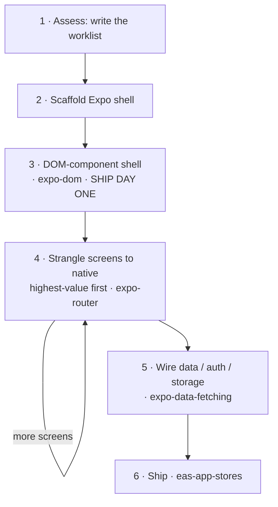

# 从 Web 到原生

Web React 应用并不会*转换*成原生应用——不存在这样的转译器。它需要逐个屏幕地**迁移**，就像绞杀榕环绕树木生长并逐渐取而代之一样：先搭建一个原生壳，从第一天起就在其中运行完整的 Web UI，然后按照优先级逐个将屏幕绞杀替换为原生实现。本技能是安排迁移工作的主干；每一步都会移交给现有的 Expo 技能，而不是重新解释一遍。它将 Expo 的[使用 React 从 Web 迁移到原生](https://expo.dev/blog/from-web-to-native-with-react)方法落实为可执行流程——请阅读该文章以了解这样做的原因。



## 原则

- **迁移，而不是重写。** 永远不要一次性彻底重做；每一步都要让应用保持可发布状态。
- **第一天就发布。** 在对任何内容进行原生化之前，Web UI 会先运行在 DOM 组件壳中（第 3 步）——这就是里程碑；之后的一切都是打磨优化。
- **按价值绞杀替换。** 将高频屏幕原生化，其余部分保留在 WebView 中。每个 DOM 屏幕都会携带约 2 MB 的 Web 运行时——仅凭这一点，就足以说明不应把所有内容都以 DOM 形式发布。
- **原生化意味着重新设计，而不是更换皮肤。** 绞杀替换后的屏幕应该看起来像是由 Apple/Google 发布的，而不是换了皮肤的网页。**优先选择 `@expo/ui`**——它会渲染真正的 SwiftUI/Compose，因此体验与操作系统*完全一致*；带样式的 RN 基础组件仅作为自定义布局的后备方案。此外，还应使用平台导航（`expo-router`：NativeTabs、大标题）、通过 `@expo/ui` 实现的液态玻璃和原生组件，以及移动端 UX（底部弹层、滑动、触觉反馈）。Web→原生模式映射参见 [`./references/native-patterns.md`](./references/native-patterns.md)。如果它仍然像一个网站，那么你做的是移植，而不是重新设计。
- **通过运行来验证，而不是通过编译来验证。** 构建无误并不能证明什么（空白 WebView 也能顺利编译）。运行每个屏幕——但应根据原始 Web 版本评判其*内容和行为*，而不是逐像素比较（原生化后的屏幕应该更像原生界面，而不是与原版完全一致）。
- **负责编排，不要重复造轮子。** 每一步都会转入一个现有技能。本技能的价值在于执行*顺序*和各种*陷阱*——逐个惯用法的映射位于 [`./references/false-friends.md`](./references/false-friends.md)。

## 以循环方式运行（推荐）

迁移是一个持续到完成为止的漫长循环，因此第一步是**编写目标任务并启动它**——而不是手动逐个处理屏幕。针对当前应用填写 [`./references/run-as-goal.md`](./references/run-as-goal.md) 中的目标任务并展示出来；它会在**每次迭代时重新读取本技能**，因此每次 `/goal` 轮次都会重新加载操作手册和工作清单，并推进下一个屏幕（它甚至会自行引导完成评估步骤）。然后使用该目标运行 `/goal`——或者，如果运行环境无法执行循环，则将其写入 `migration-goal.md`，并让用户启动它。以下步骤是每次迭代所执行的内容；只有在不使用循环时，才手动运行这些步骤。

## 迁移

> **没有需要迁移的代码仓库**——只是以 Web 开发者身份从零开始构建原生应用？你不需要执行这些步骤：使用 `expo-router`，并随时打开 [`./references/false-friends.md`](./references/false-friends.md)，查阅 Web→原生的惯用写法映射。以下所有内容均假设已有一个 Web 应用。

### 1. 评估 → 编写工作清单

阅读代码仓库并生成 `migration-progress.md`，将其作为后续迁移过程中逐项勾选的持久工作清单。需要从两个维度进行划分：

- **界面与后端。** 页面路由（`page.tsx`）是需要迁移的界面；服务端路由（`route.ts`）、ORM 和身份验证处理程序继续留在服务端。一次性确定后端方案：保持现有部署（原生应用成为 HTTP 客户端），或者将其迁移到 EAS Hosting（`eas-hosting`）。
- **为每个界面分类**，确定其最终形态：**原样移植**（展示型界面 → 在 DOM webview 中交付）、**立即原生化**（高频使用，或需要原生体验——手势、列表、键盘）、**稍后原生化**，或者**混合式**（用原生外壳包裹 Web 子树，例如用原生聊天列表包裹 Markdown 渲染器）。

阅读时记录框架特征——RSC 还是客户端组件、Tailwind/shadcn、数据获取位置——因为这些因素决定每个界面的移植方式（false-friends 中提供了对应映射；尤其是异步 Server Components，必须先拆分为客户端数据获取组件和展示组件，之后才能迁移）。**还要标记第三方服务/SDK**——浏览器 SDK 无法直接沿用（`false-friends` → *服务与 SDK*）；支付尤其是一次*分叉，而非替换*（应用内数字商品必须通过 RevenueCat 使用应用商店 IAP，费用约为 30%——不能使用 Stripe）。这是现在就需要作出的商业模式决策，而不是等到 App Store 审核时再考虑。只有对每条路由完成归类、为每个界面划定类别后，这份工作清单才值得信赖。

### 2. 搭建应用外壳

使用 `create-expo-app`，然后在 Expo Router 中复刻 Web 路由——Next 的目录树几乎可以一一映射（注意 `[id]/page.tsx` → `[id].tsx`，并且路由可能位于 `src/app/` 中）。为每条路由创建一个空界面。

### 3. 使用 DOM 组件构建外壳——第一天的里程碑

将每个界面作为 DOM 组件迁移过来（按照 `expo-dom` skill 使用 `'use dom'`），并由其对应的原生路由进行渲染，这样在任何内容完成原生化之前，整个应用就能先在手机上运行起来。预计每个界面都需要单独调整——解包 Server Components、替换框架导入（`next/link`）、迁移样式——这些内容都已在 false-friends 中涵盖。然后通过运行应用（见下文）进行验证；此时的应用已经可以直接发布到 TestFlight。

### 4. 按价值逐步将界面替换为原生实现

按照 `migration-progress.md` 从上到下逐项处理。对于每个界面，都要以原生方式对其进行*重新设计*——不要直接移植 Web 布局。**优先使用 `@expo/ui`**（真正的 SwiftUI/Compose——按钮、列表、工作表、选择器、滑块；[`./references/native-patterns.md`](./references/native-patterns.md) 映射了各种 Web 模式应转换成哪些原生组件），然后使用平台导航（`expo-router`——NativeTabs、大标题）和移动端 UX（滑动、触觉反馈、带惯性滚动/反向滚动）；仅在自定义布局中使用 RN 原语。针对每种惯用写法，查阅 [`./references/false-friends.md`](./references/false-friends.md)。`@expo/ui` 和 DOM 组件均可在 **Expo Go**（SDK 56+）中运行——只有使用*自定义*原生模块时，才需要开发构建（`expo-dev-client` skill）。对照正在运行的原始 Web 应用验证*内容和行为*（视觉效果应变得更具原生感），然后将该项勾选完成。每次只处理一个界面，并确保应用在整个过程中始终可发布。这是一个围绕持久工作清单执行的循环，因此可以无人值守运行——将其交给目标循环（[`./references/run-as-goal.md`](./references/run-as-goal.md)）。

### 5. 接入数据、身份验证和存储

Web 数据层无法原样迁移——相对路径 fetch、Cookie 会话、`localStorage` 和环境变量都会发生变化（会被替换为似是而非的对应物）。使用 `expo-data-fetching` 处理请求和缓存；如果后端已迁移到 EAS Hosting，则添加 `eas-hosting`。

### 6. 发布

使用 `eas-app-stores` 完成应用商店构建（App Store / Play / TestFlight），之后使用 EAS Update 进行 OTA 推送。

## 通过实际运行而非编译来验证

`expo export` 成功只能证明某个屏幕*能够打包*，不能证明它*能够渲染*——屏幕可能构建成功，却仍然显示空白或渲染错误。因此，在完成外壳之后，以及每完成一个原生化屏幕之后，都要针对同一路由比较两个**正在运行的**应用：

- **原始 Web 应用**——使用 **`agent-browser`**（vercel-labs CLI）进行捕获：用 `open` 打开路由，用 `snapshot --json` 获取无障碍树，再使用 `screenshot`。
- **原生应用**——使用 **`argent`** 驱动模拟器：用 `describe` / `debugger-component-tree` 查看结构，用 `flow` 在每轮检查中重放验证流程。

以**内容和行为**的一致性作为通过标准，而不是像素一致：原生化后的屏幕应该看起来*更具*原生感，而绝不应与 Web 完全相同（DOM 外壳阶段是例外——此时它*就是* Web UI，因此应该保持一致）。交互感受也是原生体验的一部分，无法通过截图体现——对于包含转场或手势的屏幕，应录制一段短视频，而不只是截取静态图片（参见 `native-patterns.md` → 交互感受）。此循环对所用工具有**明确要求**：如果尚未安装 `agent-browser` 或 `argent`，请询问用户并在继续之前安装——不要退而使用手动截图。完整流程和设置说明见 [`./references/verify-on-device.md`](./references/verify-on-device.md)。

## 参考资料

- [`./references/false-friends.md`](./references/false-friends.md) — Web 惯用方式 → 原生等效方式，以及每种方式的注意事项。用于查询步骤 3–5，也适用于纠正任何需要摒弃的 Web 开发惯用思维。
- [`./references/native-patterns.md`](./references/native-patterns.md) — Web UX *模式* → 原生重新设计（优先使用 `@expo/ui`）。这是步骤 4 的重新设计操作手册，可让屏幕具有操作系统原生感，而非仅仅换皮。
- [`./references/verify-on-device.md`](./references/verify-on-device.md) — 双代理一致性验证流程：分别驱动 Web 应用（浏览器代理）和原生应用（argent），打开同一路由并进行比较。
- [`./references/run-as-goal.md`](./references/run-as-goal.md) — 一个结构完备、专用于迁移的目标，可用于无人值守地推进步骤 4（每次迭代都会重新读取此技能）。
- [Expo — 使用 React 从 Web 迁移到原生应用](https://expo.dev/blog/from-web-to-native-with-react) — 此技能所落实的权威指南。

## 提交反馈
如果你在此技能中遇到错误、误导性信息或过时信息，请进行报告，以便 Expo 改进：
```bash
npx --yes submit-expo-feedback@latest --category skills --subject "expo-web-to-native" "<actionable feedback>"
```
仅当你有具体且可操作的问题需要报告时才提交。请尽可能包含相关上下文。
如果 AI 代理反复失败，或用户不得不接手 Expo 任务，请加载 expo-skill-feedback 技能并遵循其 eval-candidate 流程，而不要重复使用上述命令。