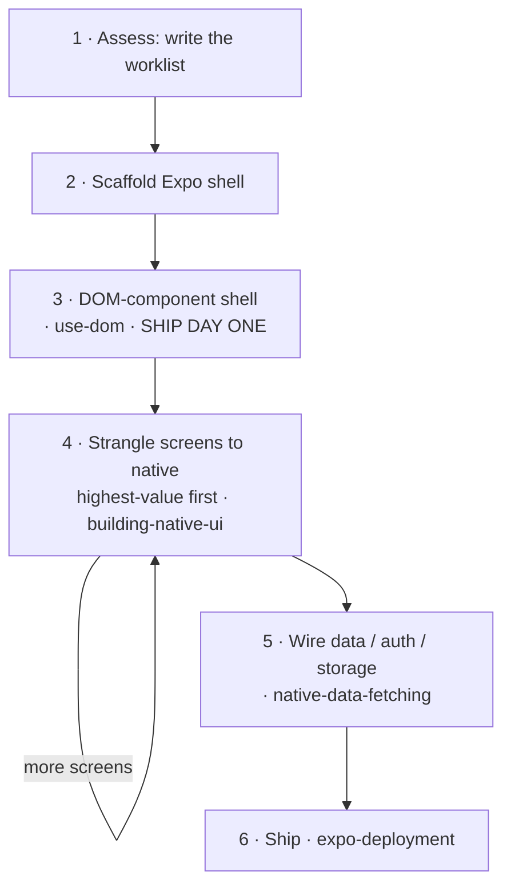

# 从 Web 到原生

Web React 应用并不会*转换*成原生应用——不存在这样的转译器。它需要逐个屏幕地**迁移**，就像绞杀榕环绕一棵树生长并逐渐取代它一样：先搭建一个原生外壳，第一天就让整个 Web UI 在其中运行，然后按优先级逐个将屏幕绞杀式迁移为原生实现。此技能是安排迁移工作的主干；每一步都会转交给现有的 Expo 技能，而不是重新解释一遍。它将 Expo 的[使用 React 从 Web 迁移到原生](https://expo.dev/blog/from-web-to-native-with-react)方法落地为可执行流程——请阅读该文章以了解原因。

## 原则

- **迁移，而非重写。** 永远不要采用大爆炸式重写；每一步都要确保应用可发布。
- **第一天就发布。** 在任何内容原生化之前，Web UI 都会先运行在 DOM 组件外壳中（第 3 步）——这就是里程碑；之后的一切都是完善优化。
- **按价值绞杀。** 将高频屏幕原生化，其余部分保留在 WebView 中。每个 DOM 屏幕都会携带约 2 MB 的 Web 运行时——仅凭这一点，就足以说明不应将所有内容都以 DOM 形式发布。
- **原生化意味着重新设计，而非换皮。** 完成绞杀式迁移的屏幕应当看起来像是由 Apple/Google 发布的，而不是换了皮的网页。**首先考虑 `@expo/ui`**——它会渲染真正的 SwiftUI/Compose，因此体验与操作系统*完全*一致；仅在自定义布局时，才回退使用带样式的 RN 基础组件。此外，还应使用平台导航（`expo-router`：NativeTabs、大标题）、通过 `@expo/ui` 实现的液态玻璃与原生组件，以及移动端 UX（底部弹层、滑动、触觉反馈）。Web→原生模式映射参见 [`./references/native-patterns.md`](./references/native-patterns.md)。如果它仍然感觉像个网站，那么你做的是移植，而不是重新设计。
- **通过运行来验证，而不是通过编译。** 构建无误并不能证明任何事情（空白 WebView 也能成功编译）。请运行每个屏幕——但要根据 Web 原版判断其*内容和行为*，而不是像素是否一致（原生化后的屏幕应该看起来更原生，而不是完全相同）。
- **编排，而非重复造轮子。** 每一步都会转入现有技能。这里的价值在于执行*顺序*和各种*陷阱*——逐个惯用法的映射位于 [`./references/false-friends.md`](./references/false-friends.md)。

## 以循环方式运行（推荐）

迁移是一个持续到完成为止的长循环，因此第一步是**编写目标任务并启动它**——而不是手动逐个处理屏幕。针对当前应用填写 [`./references/run-as-goal.md`](./references/run-as-goal.md) 中的目标任务并将其展示出来；它会在**每次迭代时重新读取此技能**，因此每轮 `/goal` 都会重新加载操作手册和工作清单，并推动下一个屏幕的迁移（它甚至会自行引导完成评估步骤）。然后使用该目标任务运行 `/goal`——或者，如果运行环境无法循环，则将其写入 `migration-goal.md`，并让用户启动它。下面的步骤就是每次迭代要执行的内容；只有在不使用循环时，才手动执行这些步骤。

## 迁移

> **没有要迁移的代码仓库**——只是以 Web 开发者的身份从头构建原生应用？你不需要执行这些步骤：使用 `building-native-ui`，并随时打开 [`./references/false-friends.md`](./references/false-friends.md)，查阅 Web→原生的惯用模式映射。以下所有内容都假定已有一个 Web 应用。

### 1. 评估 → 编写工作清单

阅读代码仓库并生成 `migration-progress.md`，将其作为后续迁移过程中逐项核销的持久工作清单。进行两项划分：

- **屏幕与后端。** 页面路由（`page.tsx`）是需要迁移的屏幕；服务端路由（`route.ts`）、ORM 和身份验证处理程序仍保留在服务端。一次性决定后端方案：继续保持其部署状态（原生应用将成为 HTTP 客户端），或者将其迁移到 EAS Hosting（`expo-api-routes`）。
- **将每个屏幕分类**，明确其最终的落地方式：**原样移植**（展示型页面 → 在 DOM WebView 中发布）、**立即原生化**（高频使用，或需要原生体验——手势、列表、键盘）、**稍后原生化**，或**混合模式**（用原生外壳包裹 Web 子树，例如用聊天列表包裹 Markdown 渲染器）。

阅读时记录框架特征——RSC 还是客户端组件、Tailwind/shadcn、数据获取位置——因为这些特征决定了每个屏幕的移植方式（false-friends 中提供了对应映射；尤其是异步 Server Components，必须先拆分为客户端数据获取组件和展示组件，之后才能迁移）。**还要标记第三方服务/SDK**——浏览器 SDK 无法直接沿用（`false-friends` → *服务与 SDK*）；支付尤其是一次*分流，而不是替换*（应用内数字商品必须通过 RevenueCat 使用应用商店 IAP，费用约为 30%——不能使用 Stripe）。这是现在就要做出的商业模式决策，而不是等到 App Store 审核时再决定。只有在每条路由都已归类、每个屏幕都已分组后，这份工作清单才是可信的。

### 2. 搭建应用外壳

使用 `create-expo-app`，然后在 Expo Router 中镜像 Web 路由——Next 的目录树几乎可以一一对应（注意 `[id]/page.tsx` → `[id].tsx`，且路由可能位于 `src/app/` 中）。为每条路由创建一个空屏幕。

### 3. 使用 DOM 组件构建外壳——首日里程碑

将每个屏幕都作为 DOM 组件迁移过来（使用 `'use dom'`，具体遵循 `use-dom` skill），并由对应的原生路由渲染。这样在对任何部分进行原生化之前，整个应用就能先在手机上运行。预计每个屏幕都需要单独修改——拆解 Server Components、替换框架导入（`next/link`）、迁移样式——这些内容都已在 false-friends 中涵盖。然后通过运行应用进行验证（见下文）；此时的版本已经可以直接发布到 TestFlight。

### 4. 按价值逐步将屏幕替换为原生实现

按照 `migration-progress.md` 从上到下逐项处理。对每个屏幕进行原生化*重新设计*——不要照搬 Web 布局。**优先使用 `@expo/ui`**（真正的 SwiftUI/Compose——按钮、列表、工作表、选择器、滑块；[`./references/native-patterns.md`](./references/native-patterns.md) 映射了各类 Web 模式对应的原生组件），然后使用平台导航（`expo-router`——NativeTabs、大标题）和移动端 UX（滑动、触觉反馈、惯性滚动/反向滚动）；仅在自定义布局中使用 RN 基础组件。针对每种惯用模式查阅 [`./references/false-friends.md`](./references/false-friends.md)。`@expo/ui` 和 DOM 组件都可以在 **Expo Go**（SDK 56+）中运行——只有使用*自定义*原生模块时，才需要开发构建（`expo-dev-client` skill）。对照正在运行的原始 Web 应用验证*内容和行为*（外观应变得更加原生），然后将该项标记为完成。每轮只处理一个屏幕，并确保应用始终处于可发布状态。这是一个围绕持久工作清单运行的循环，因此可以无人值守地执行——将其交给目标循环（[`./references/run-as-goal.md`](./references/run-as-goal.md)）。

### 5. 接通数据、认证和存储

Web 数据层无法原样迁移——相对路径 fetch、基于 cookie 的会话、`localStorage` 和环境变量都会发生变化（替换为看似相同实则不同的对应物）。使用 `native-data-fetching` 处理请求和缓存；如果后端已迁移到 EAS Hosting，则添加 `expo-api-routes`。

### 6. 发布

使用 `expo-deployment` 构建商店版本（App Store / Play / TestFlight），之后使用 EAS Update 进行 OTA 推送。

## 通过运行而非编译进行验证

成功执行 `expo export` 只能证明屏幕能够*打包*，不能证明它能够*渲染*——屏幕可能构建成功，却仍然显示空白或渲染错误。因此，在完成外壳后以及每个屏幕完成原生化后，都要针对同一路由比较两个**正在运行的**应用：

- **原始 Web 应用**——使用 **`agent-browser`**（vercel-labs CLI）捕获：对路由执行 `open`，使用 `snapshot --json` 获取无障碍树，再执行 `screenshot`。
- **原生应用**——使用 **`argent`** 驱动模拟器：通过 `describe` / `debugger-component-tree` 检查结构，并使用 `flow` 在每一轮中重放检查。

以**内容和行为**一致作为通过标准，而不是像素一致：原生化后的屏幕应该比 Web 更具*原生感*，而不是与 Web 完全相同（DOM 外壳阶段除外——该阶段展示的就是 Web UI，因此应该保持一致）。体验感是原生体验的一部分，无法通过截图体现——对于包含转场或手势的屏幕，应录制一段短视频，而不只是截取静态图片（参见 `native-patterns.md` → 体验感）。此循环对所用工具有**明确要求**：如果尚未安装 `agent-browser` 或 `argent`，请先询问用户并完成安装，再继续操作——不要退回到手动截图。完整流程和设置说明请参阅 [`./references/verify-on-device.md`](./references/verify-on-device.md)。

## 参考资料

- [`./references/false-friends.md`](./references/false-friends.md) — Web 惯用方式 → 原生对应方式，以及每种方式的注意事项。用于查询步骤 3–5，也适用于需要摒弃的任何 Web 开发惯用思维。
- [`./references/native-patterns.md`](./references/native-patterns.md) — Web UX *模式* → 原生重新设计（优先使用 `@expo/ui`）。这是步骤 4 的重新设计指南，旨在让屏幕具备操作系统原生体验，而不是仅仅换一层皮肤。
- [`./references/verify-on-device.md`](./references/verify-on-device.md) — 双智能体一致性验证流程：驱动 Web 应用（浏览器智能体）和原生应用（argent），打开同一路由并进行比较。
- [`./references/run-as-goal.md`](./references/run-as-goal.md) — 一个结构完整、专用于迁移的目标，可用于无人值守地推进步骤 4（每次迭代都会重新读取此 skill）。
- [Expo — 使用 React 从 Web 迁移到原生应用](https://expo.dev/blog/from-web-to-native-with-react) — 本 skill 将其转化为可执行流程的权威指南。