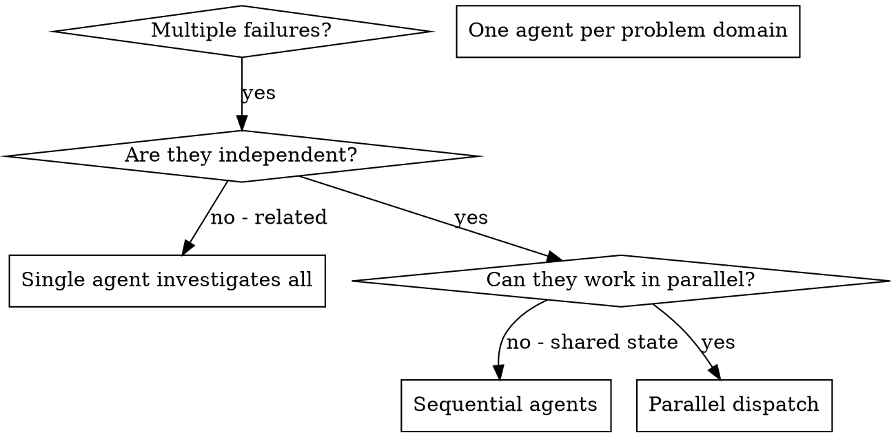

# 分派并行代理

## 概述

你将任务委派给具有隔离上下文的专用代理。通过精确编写它们的指令和上下文，你可以确保它们保持专注并成功完成任务。它们绝不应继承你会话的上下文或历史记录，你需要准确构建它们所需的内容。这也能为协调工作保留你自己的上下文。

当存在多个互不相关的失败情况时（不同的测试文件、不同的子系统、不同的错误），按顺序逐一调查会浪费时间。每项调查都是独立的，可以并行进行。

**核心原则：** 为每个独立的问题域分派一个代理。让它们并发工作。

## 何时使用



**适用场景：**
- 有 3 个或更多测试文件因不同根本原因而失败
- 多个子系统彼此独立地损坏
- 每个问题都可以在不依赖其他问题上下文的情况下理解
- 调查之间不存在共享状态

**不适用场景：**
- 失败之间有关联（修复一个可能会修复其他问题）
- 需要理解完整的系统状态
- 代理会相互干扰

### 基于事件的机会

在理解最低基线之后，当发生以下事件之一时，也可以考虑并行调查：

- 证据或测试结果相互矛盾，并且可以独立核查；
- 高风险变更需要独立的只读兼容性或影响审查；
- 受阻的尝试可以使用实质上不同的上下文或模型重试；
- 可以在没有共享写入的情况下检查不同的主机或安装表面。

这些事件不会覆盖安全门槛。未知依赖项、共享事务或资源、过时的工作区状态、不可信输入边界、不确定的主机能力，或无法紧凑综合的结果，都必须保持在当前上下文内。并行子代理是调查者，而不是第二个 Git 所有者或完成确认者。

## 模式

### 1. 识别独立域

按损坏内容对失败情况进行分组：
- 文件 A 测试：工具审批流程
- 文件 B 测试：批量完成行为
- 文件 C 测试：中止功能

每个域都是独立的，修复工具审批不会影响中止测试。

### 2. 创建聚焦的代理任务

每个代理应获得：
- **明确范围：** 一个测试文件或子系统
- **清晰目标：** 让这些测试通过
- **约束条件：** 不要修改其他代码
- **预期输出：** 总结你发现和修复的内容

### 3. 并行分派

```typescript
// In Claude Code / AI environment
Task("Fix agent-tool-abort.test.ts failures")
Task("Fix batch-completion-behavior.test.ts failures")
Task("Fix tool-approval-race-conditions.test.ts failures")
// All three run concurrently
```

### 4. 审查与集成

当代理返回后：
- 阅读每份摘要
- 验证修复之间没有冲突
- 运行完整测试套件
- 集成所有更改

## 代理提示结构

好的代理提示应当：
1. **聚焦** - 一个明确的问题领域
2. **自包含** - 包含理解问题所需的全部上下文
3. **明确输出要求** - 代理应返回什么？

```markdown
Fix the 3 failing tests in src/agents/agent-tool-abort.test.ts:

1. "should abort tool with partial output capture" - expects 'interrupted at' in message
2. "should handle mixed completed and aborted tools" - fast tool aborted instead of completed
3. "should properly track pendingToolCount" - expects 3 results but gets 0

These are timing/race condition issues. Your task:

1. Read the test file and understand what each test verifies
2. Identify root cause - timing issues or actual bugs?
3. Fix by:
   - Replacing arbitrary timeouts with event-based waiting
   - Fixing bugs in abort implementation if found
   - Adjusting test expectations if testing changed behavior

Do NOT just increase timeouts - find the real issue.

Return: Summary of what you found and what you fixed.
```

## 常见错误

**❌ 范围过宽：** “修复所有测试” - 代理会迷失方向  
**✅ 具体明确：** “修复 agent-tool-abort.test.ts” - 范围聚焦

**❌ 没有上下文：** “修复竞态条件” - 代理不知道具体问题  
**✅ 提供上下文：** 粘贴错误信息和测试名称

**❌ 没有约束：** 代理可能会重构所有内容  
**✅ 明确约束：** “不要修改生产代码”或“仅修复测试”

**❌ 输出模糊：** “修复它” - 你不知道改动了什么  
**✅ 具体明确：** “返回根本原因和改动摘要”

## 不应使用的场景

**相关联的失败：** 修复一个问题可能会解决其他问题 - 先一起调查  
**需要完整上下文：** 理解问题需要查看整个系统  
**探索性调试：** 你还不知道哪里出了问题  
**共享状态：** 代理会相互干扰（编辑相同文件、使用相同资源）

## 来自会话的真实示例

**场景：** 重大重构后，3 个文件中有 6 个测试失败

**失败：**
- agent-tool-abort.test.ts：3 个失败（时序问题）
- batch-completion-behavior.test.ts：2 个失败（工具未执行）
- tool-approval-race-conditions.test.ts：1 个失败（执行次数 = 0）

**决策：** 独立领域 - 中止逻辑、批量完成和竞态条件彼此分离

**分派：**
```
Agent 1 → Fix agent-tool-abort.test.ts
Agent 2 → Fix batch-completion-behavior.test.ts
Agent 3 → Fix tool-approval-race-conditions.test.ts
```

**结果：**
- Agent 1：将超时替换为基于事件的等待
- Agent 2：修复事件结构错误（threadId 位于错误位置）
- Agent 3：添加对异步工具执行完成的等待

**集成：**所有修复相互独立，无冲突，完整测试套件通过

**节省时间：**3 个问题并行解决，而非依次解决

## 主要优势

1. **并行化** - 同时进行多项调查
2. **专注** - 每个代理的范围较窄，需要跟踪的上下文更少
3. **独立性** - 代理之间不会相互干扰
4. **速度** - 用解决 1 个问题的时间解决 3 个问题

## 验证

代理返回后：
1. **审查每份摘要** - 了解发生了哪些变更
2. **检查冲突** - 代理是否编辑了相同的代码？
3. **运行完整测试套件** - 验证所有修复能否协同工作
4. **抽查** - 代理可能会产生系统性错误

## 现实影响

来自调试会话（2025-10-03）：
- 3 个文件中有 6 个失败项
- 并行调度了 3 个代理
- 所有调查均并发完成
- 所有修复均已成功集成
- 代理变更之间零冲突