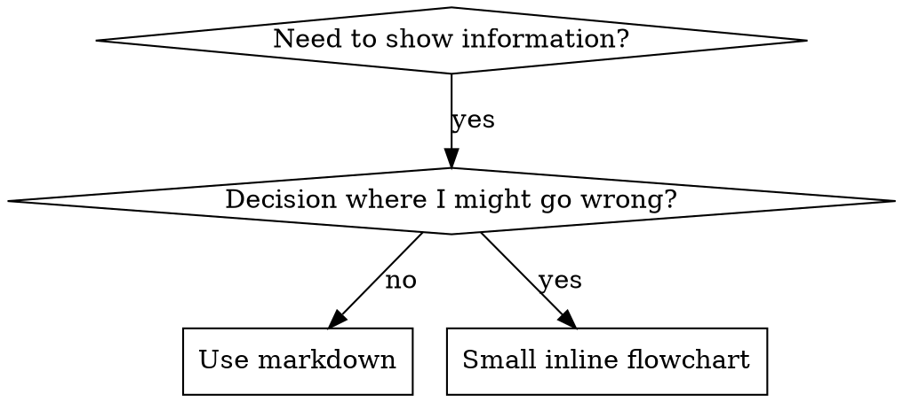

# 编写技能

## 概述

**技能编写采用压力场景验证，而不是代码 TDD 路线。**

**个人技能存放在特定于智能体的目录中（Claude Code 使用 `~/.claude/skills`，Codex 使用 `~/.agents/skills/`）**

你需要编写测试用例（使用子智能体的压力场景），观察它们失败（基线行为），编写技能（文档），观察测试通过（智能体遵循要求），然后进行重构（堵住漏洞）。

**核心原则：** 如果你没有观察过智能体在缺少该技能时失败，就无法知道该技能是否教授了正确的内容。

**验证要求：** 即使 TDD 模式为 `off`，技能变更也需要基线压力场景和变更后验证；这不要求加载 `aegis:test-driven-development`。

**官方指南：** 关于 Anthropic 官方的技能编写最佳实践，请参阅 anthropic-best-practices.md。本文档提供了额外的模式和指南，作为本技能中以 TDD 为重点的方法的补充。

除非另有说明，本技能中仅写出文件名时，均指相对于本技能目录的文件。

## 什么是技能？

**技能**是经过验证的技术、模式或工具的参考指南。技能可以帮助未来的 Claude 实例找到并应用有效的方法。

**技能包括：** 可复用的技术、模式、工具和参考指南

**技能不包括：** 关于你曾经如何解决某个问题的叙述

## 技能的验证映射

| 验证步骤 | 技能创建 |
|-------------|----------------|
| **测试用例** | 使用子智能体的压力场景 |
| **生产代码** | 技能文档（SKILL.md） |
| **测试失败（RED）** | 没有技能时，智能体违反规则（基线） |
| **测试通过（GREEN）** | 存在技能时，智能体遵循规则 |
| **重构** | 在保持遵循规则的同时堵住漏洞 |
| **先写测试** | 在编写技能之前运行基线场景 |
| **观察其失败** | 记录智能体使用的确切合理化理由 |
| **最小化代码** | 编写针对这些具体违规行为的技能 |
| **观察其通过** | 验证智能体现在会遵循规则 |
| **重构循环** | 找到新的合理化理由 → 堵住漏洞 → 重新验证 |

整个技能创建过程遵循 RED-GREEN-REFACTOR。

## 何时创建技能

**以下情况应创建：**
- 该技术对你而言并非显而易见
- 你会在不同项目中再次参考它
- 该模式具有广泛适用性（并非特定于某个项目）
- 其他人也能从中受益

**以下情况不应创建：**
- 一次性解决方案
- 已在其他地方有完善文档记录的标准实践
- 项目特定的约定（应放在 CLAUDE.md 中）
- 机械性约束（如果可以通过正则表达式/验证强制执行，就将其自动化——将文档留给需要判断的事项）

## 技能类型

### 技术
包含具体执行步骤的方法（condition-based-waiting、root-cause-tracing）

### 模式
思考问题的方式（flatten-with-flags、test-invariants）

### 参考
API 文档、语法指南、工具文档（办公文档）

## 目录结构

仓库的规范源布局：

```
skills/
  skill-name/
    SKILL.md              # Main reference (required)
    supporting-file.*     # Only if needed
```

**扁平命名空间** - 所有技能位于同一个可搜索的命名空间中

宿主可以通过不同的发现根目录，公开同一技能内容的已安装视图或生成视图，同时保留此仓库布局作为规范源代码树。

**以下内容使用单独的文件：**
1. **大型参考资料**（100+ 行）- API 文档、完整语法
2. **可复用工具** - 脚本、实用工具、模板

**以下内容保持内联：**
- 原则和概念
- 代码模式（< 50 行）
- 其他所有内容

## SKILL.md 结构

**前置元数据（YAML）：**
- 两个必填字段：`name` 和 `description`（有关所有受支持的字段，请参阅 [agentskills.io/specification](https://agentskills.io/specification)）
- 总计最多 1024 个字符
- `name`：仅使用字母、数字和连字符（不得使用括号、特殊字符）
- `description`：使用第三人称，描述何时应使用该技能，而不是它的工作流程
  - 以 "Use when..." 开头，聚焦于触发条件
  - 包含具体的症状、情形、上下文和面向用户的结果，以帮助识别触发条件
  - **绝不要总结技能的过程或工作流程**（原因请参阅 CSO 章节）
  - 如有可能，保持在 500 个字符以内

```markdown
---
name: Skill-Name-With-Hyphens
description: Use when [specific triggering conditions and symptoms]
---

# Skill Name

## Overview
What is this? Core principle in 1-2 sentences.

## When to Use
[Small inline flowchart IF decision non-obvious]

Bullet list with SYMPTOMS and use cases
When NOT to use

## Core Pattern (for techniques/patterns)
Before/after code comparison

## Quick Reference
Table or bullets for scanning common operations

## Implementation
Inline code for simple patterns
Link to file for heavy reference or reusable tools

## Common Mistakes
What goes wrong + fixes

## Real-World Impact (optional)
Concrete results
```


## Claude 搜索优化（CSO）

**对发现至关重要：**未来的 Claude 需要找到你的技能

### 1. 信息丰富的描述字段

**目的：**Claude 会读取描述，以决定针对给定任务加载哪些技能。请确保它能够回答：“我现在应该阅读这个技能吗？”

**格式：**以 "Use when..." 开头，聚焦于触发条件

**关键：描述 = 触发条件，而非工作流程摘要**

描述应说明触发条件。当面向用户的能力或结果有助于回答“我现在应该阅读这个技能吗？”时，可以提及这些内容。不要在描述中总结技能的过程或工作流程。

**这为何重要：**测试发现，当描述总结技能的工作流程时，Claude 可能会直接按照描述执行，而不是阅读完整的技能内容。一条写着“在任务之间进行代码审查”的描述会导致 Claude 只执行一次审查，尽管该技能的流程图明确展示了两次审查（先审查规范合规性，再审查代码质量）。

当描述被改为仅写“Use when executing implementation plans with independent tasks”（不含工作流程摘要）后，Claude 正确地阅读了流程图，并遵循了两阶段审查流程。

**陷阱：** 对工作流进行总结的描述会形成一条 Claude 将采用的捷径。技能正文会变成 Claude 跳过不读的文档。

```yaml
# ❌ BAD: Summarizes workflow - Claude may follow this instead of reading skill
description: Use when executing plans - dispatches subagent per task with code review between tasks

# ❌ BAD: Too much process detail
description: Use for TDD - write test first, watch it fail, write minimal code, refactor

# ✅ GOOD: Just triggering conditions, no workflow summary
description: Use when executing implementation plans with independent tasks in the current session

# ✅ GOOD: Triggering conditions only
description: Use when the user explicitly requests strict or test-first TDD, or when the current conversation already contains an explicit `TDD Route: strict` decision from another Aegis workflow.
```

**内容：**
- 使用具体的触发条件、症状和情形来表明此技能适用
- 描述*问题*（竞态条件、行为不一致），而不是*特定于语言的症状*（setTimeout、sleep）
- 除非技能本身特定于某项技术，否则触发条件应与技术无关
- 如果技能特定于某项技术，请在触发条件中明确说明
- 使用第三人称编写（会被注入系统提示词）
- **绝不要总结技能的过程或工作流**

```yaml
# ❌ BAD: Too abstract, vague, doesn't include when to use
description: For async testing

# ❌ BAD: First person
description: I can help you with async tests when they're flaky

# ❌ BAD: Mentions technology but skill isn't specific to it
description: Use when tests use setTimeout/sleep and are flaky

# ✅ GOOD: Starts with "Use when", describes problem, no workflow
description: Use when tests have race conditions, timing dependencies, or pass/fail inconsistently

# ✅ GOOD: Technology-specific skill with explicit trigger
description: Use when using React Router and handling authentication redirects
```

### 2. 关键词覆盖

使用 Claude 会搜索的词语：
- 错误消息："Hook timed out"、"ENOTEMPTY"、"race condition"
- 症状："flaky"、"hanging"、"zombie"、"pollution"
- 同义词："timeout/hang/freeze"、"cleanup/teardown/afterEach"
- 工具：实际的命令、库名称、文件类型

### 3. 描述性命名

**使用主动语态，以动词开头：**
- ✅ `creating-skills`，而不是 `skill-creation`
- ✅ `condition-based-waiting`，而不是 `async-test-helpers`

### 4. Token 效率（关键）

**问题：** getting-started 和频繁引用的技能会被加载到每一次对话中。每个 token 都很重要。

**目标字数：**
- getting-started 工作流：每个少于 150 词
- 频繁加载的技能：总计少于 200 词
- 其他技能：少于 500 词（仍应保持简洁）

**技巧：**

**将详细信息移至工具帮助中：**
```bash
# ❌ BAD: Document all flags in SKILL.md
search-conversations supports --text, --both, --after DATE, --before DATE, --limit N

# ✅ GOOD: Reference --help
search-conversations supports multiple modes and filters. Run --help for details.
```

**使用交叉引用：**
```markdown
# ❌ BAD: Repeat workflow details
When searching, dispatch subagent with template...
[20 lines of repeated instructions]

# ✅ GOOD: Reference other skill
Always use subagents (50-100x context savings). REQUIRED: Use [other-skill-name] for workflow.
```

**精简示例：**
```markdown
# ❌ BAD: Verbose example (42 words)
your human partner: "How did we handle authentication errors in React Router before?"
You: I'll search past conversations for React Router authentication patterns.
[Dispatch subagent with search query: "React Router authentication error handling 401"]

# ✅ GOOD: Minimal example (20 words)
Partner: "How did we handle auth errors in React Router?"
You: Searching...
[Dispatch subagent → synthesis]
```

**消除冗余：**
- 不要重复交叉引用的技能中已有的内容
- 不要解释从命令中显而易见的内容
- 不要包含同一模式的多个示例

**验证：**
```bash
wc -w skills/path/SKILL.md
# getting-started workflows: aim for <150 each
# Other frequently-loaded: aim for <200 total
```

**根据你所做的事情或核心洞见命名：**
- ✅ `condition-based-waiting` 优于 `async-test-helpers`
- ✅ 使用 `using-skills`，而不是 `skill-usage`
- ✅ `flatten-with-flags` 优于 `data-structure-refactoring`
- ✅ `root-cause-tracing` 优于 `debugging-techniques`

**动名词（-ing）很适合描述流程：**
- `creating-skills`、`testing-skills`、`debugging-with-logs`
- 使用主动形式，描述你正在执行的操作

### 4. 交叉引用其他技能

**编写引用其他技能的文档时：**

只使用技能名称，并带有明确的要求标记：
- ✅ 好：`**REQUIRED SUB-SKILL:** Use aegis:test-driven-development`
- ✅ 好：`**REQUIRED BACKGROUND:** You MUST understand aegis:systematic-debugging`
- ❌ 差：`See skills/testing/test-driven-development`（不清楚是否为必需）
- ❌ 差：`@skills/testing/test-driven-development/SKILL.md`（强制加载，消耗上下文）

**为什么不使用 @ 链接：** `@` 语法会立即强制加载文件，在你需要它们之前就消耗 200k+ 上下文。

## 流程图的使用



**仅在以下情况使用流程图：**
- 不明显的决策点
- 可能过早停止的流程循环
- “何时使用 A、何时使用 B”的决策

**切勿将流程图用于：**
- 参考资料 → 使用表格、列表
- 代码示例 → 使用 Markdown 块
- 线性指令 → 使用编号列表
- 没有语义含义的标签（step1、helper2）

有关 graphviz 样式规则，请参阅 @graphviz-conventions.dot。

**为你的协作伙伴进行可视化：** 使用此目录中的 `render-graphs.js` 将技能的流程图渲染为 SVG：
```bash
./render-graphs.js ../some-skill           # Each diagram separately
./render-graphs.js ../some-skill --combine # All diagrams in one SVG
```

## 代码示例

**一个优秀的示例胜过许多平庸的示例**

选择最相关的语言：
- 测试技术 → TypeScript/JavaScript
- 系统调试 → Shell/Python
- 数据处理 → Python

**好的示例：**
- 完整且可运行
- 注释清晰，解释为什么这样做
- 源自真实场景
- 清晰展示模式
- 易于调整使用（而非通用模板）

**不要：**
- 使用 5 种以上的语言实现
- 创建填空式模板
- 编写刻意编造的示例

你很擅长移植——一个出色的示例就足够了。

## 文件组织

### 自包含技能
```
defense-in-depth/
  SKILL.md    # Everything inline
```
适用情况：所有内容都能容纳，无需大量参考资料

### 包含可复用工具的技能
```
condition-based-waiting/
  SKILL.md    # Overview + patterns
  example.ts  # Working helpers to adapt
```
适用情况：工具是可复用的代码，而不只是叙述性内容

### 包含大量参考资料的技能
```
pptx/
  SKILL.md       # Overview + workflows
  pptxgenjs.md   # 600 lines API reference
  ooxml.md       # 500 lines XML structure
  scripts/       # Executable tools
```
适用情况：参考资料过多，不适合内联

## 验证规则

```
NO SKILL CHANGE WITHOUT A BASELINE BEHAVIOR SCENARIO
```

此规则适用于新技能，也适用于对现有技能的编辑。

在测试之前编写技能？删除它，重新开始。
编辑技能却不进行测试？同样属于违规。

**没有例外：**
- “简单补充”也不例外
- “只是添加一个章节”也不例外
- “文档更新”也不例外
- 不要把未经测试的更改保留为“参考”
- 不要在运行测试时进行“调整”
- 删除就是彻底删除

此规则独立于 `aegis:test-driven-development`，用于保障技能质量。

## 测试所有类型的技能

不同类型的技能需要采用不同的测试方法：

### 强制执行规范的技能（规则/要求）

**示例：** TDD、完成前验证、编码前设计

**测试方式：**
- 理论问题：是否理解这些规则？
- 压力场景：在压力下是否仍会遵守？
- 多重压力组合：时间压力 + 沉没成本 + 精疲力竭
- 识别合理化借口，并添加明确的反驳措施

**成功标准：** 代理在最大压力下仍会遵守规则

### 技术型技能（操作指南）

**示例：** 基于条件的等待、根因追踪、防御式编程

**测试方式：**
- 应用场景：能否正确应用该技术？
- 变化场景：能否处理边界情况？
- 信息缺失测试：说明中是否存在缺口？

**成功标准：** 代理能够成功地将该技术应用于新场景

### 模式型技能（思维模型）

**示例：** 降低复杂度、信息隐藏概念

**测试方式：**
- 识别场景：能否识别该模式适用的情况？
- 应用场景：能否使用该思维模型？
- 反例：是否知道何时不应应用？

**成功标准：** 代理能够正确识别何时以及如何应用该模式

### 参考型技能（文档/API）

**示例：** API 文档、命令参考、库指南

**测试内容：**
- 检索场景：它们能否找到正确的信息？
- 应用场景：它们能否正确使用所找到的信息？
- 缺口测试：是否涵盖了常见用例？

**成功标准：** 智能体能够找到并正确应用参考信息

## 跳过测试的常见借口

| 借口 | 事实 |
|--------|---------|
| “Skill 显然很清楚” | 对你来说清楚 ≠ 对其他智能体来说清楚。测试它。 |
| “它只是一份参考资料” | 参考资料可能存在缺漏或表述不清的部分。测试检索效果。 |
| “测试太小题大做了” | 未经测试的 Skill 总会有问题。无一例外。花 15 分钟测试可以节省数小时。 |
| “如果出现问题，我再测试” | 出现问题 = 智能体无法使用 Skill。在部署之前测试。 |
| “测试太繁琐了” | 与在生产环境中调试有问题的 Skill 相比，测试没那么繁琐。 |
| “我确信它做得很好” | 过度自信必然导致问题。无论如何都要测试。 |
| “学术审查已经足够了” | 阅读 ≠ 使用。测试应用场景。 |
| “没时间测试” | 部署未经测试的 Skill，会因为后续修复而浪费更多时间。 |

**所有这些都意味着：部署前进行测试。无一例外。**

## 让 Skill 不受合理化借口影响

强制执行纪律的 Skill（如 TDD）需要能够抵御合理化借口。智能体很聪明，在压力下会找到漏洞。

**心理学说明：** 理解说服技巧为何有效，有助于你系统地运用它们。有关权威、承诺、稀缺性、社会认同和一致性原则的研究基础（Cialdini，2021；Meincke 等，2025），请参阅 persuasion-principles.md。

### 明确堵住每一个漏洞

不要只陈述规则——还要禁止具体的变通方式：

<Bad>
```markdown
Write code before test? Delete it.
```
</Bad>

<Good>
```markdown
Write code before test? Delete it. Start over.

**No exceptions:**
- Don't keep it as "reference"
- Don't "adapt" it while writing tests
- Don't look at it
- Delete means delete
```
</Good>

### 回应“精神与字面规定”之争

尽早加入基本原则：

```markdown
**Violating the letter of the rules is violating the spirit of the rules.**
```

这能彻底杜绝“我遵循的是规则精神”这一整类合理化借口。

### 构建合理化借口表

记录基线测试中出现的合理化借口（参见下方的测试部分）。智能体提出的每个借口都应加入表中：

```markdown
| Excuse | Reality |
|--------|---------|
| "Too simple to test" | Simple code breaks. Test takes 30 seconds. |
| "I'll test after" | Tests passing immediately prove nothing. |
| "Tests after achieve same goals" | Tests-after = "what does this do?" Tests-first = "what should this do?" |
```

### 创建危险信号列表

让智能体在进行合理化时能够轻松自查：

```markdown
## Red Flags - STOP and Start Over

- Code before test
- "I already manually tested it"
- "Tests after achieve the same purpose"
- "It's about spirit not ritual"
- "This is different because..."

**All of these mean: Delete code. Start over with TDD.**
```

### 针对违规症状更新 CSO

在描述中添加即将违反规则时的症状：

```yaml
description: use when implementing any feature or bugfix, before writing implementation code
```

## 技能的红-绿-重构

遵循 TDD 循环：

### 红：编写失败测试（基线）

让子代理在没有该技能的情况下运行压力场景。记录确切行为：
- 它们做出了哪些选择？
- 它们使用了哪些合理化说辞（逐字记录）？
- 哪些压力触发了违规行为？

这就是“观察测试失败”——在编写技能之前，你必须了解代理自然情况下会怎么做。

### 绿：编写最小化技能

编写针对这些特定合理化说辞的技能。不要为假设性的情况添加额外内容。

在启用技能的情况下运行相同场景。代理现在应当遵守规则。

### 重构：堵住漏洞

代理找到了新的合理化说辞？添加明确的反驳措施。重新测试，直至无懈可击。

**测试方法：**完整的测试方法请参阅 @testing-skills-with-subagents.md：
- 如何编写压力场景
- 压力类型（时间、沉没成本、权威、疲惫）
- 系统性地堵住漏洞
- 元测试技术

## 反模式

### ❌ 叙事性示例
“在 2025-10-03 的会话中，我们发现空的 projectDir 导致……”
**为什么不好：**过于具体，无法复用

### ❌ 多语言稀释
example-js.js、example-py.py、example-go.go
**为什么不好：**质量平庸，维护负担重

### ❌ 在流程图中放置代码
```dot
step1 [label="import fs"];
step2 [label="read file"];
```
**为什么不好：**无法复制粘贴，难以阅读

### ❌ 通用标签
helper1、helper2、step3、pattern4
**为什么不好：**标签应当具有语义

## 停止：在转向下一个技能之前

**编写任何技能后，你都必须停下来完成部署流程。**

**不要：**
- 批量创建多个技能而不逐个测试
- 在当前技能验证完成之前转向下一个技能
- 因为“批处理效率更高”而跳过测试

**对于每一个技能，下方的部署检查清单都是强制性的。**

部署未经测试的技能 = 部署未经测试的代码。这违反了质量标准。

## 技能创建检查清单（适配 TDD）

**重要：使用 TodoWrite 为下方的每个检查清单项目创建待办事项。**

**红阶段——编写失败测试：**
- [ ] 创建压力场景（对于纪律类技能，组合使用 3 种以上压力）
- [ ] 在没有技能的情况下运行场景——逐字记录基线行为
- [ ] 识别合理化说辞/失败中的模式

**绿阶段——编写最小化技能：**
- [ ] 名称只能使用字母、数字、连字符（不能使用括号/特殊字符）
- [ ] YAML 前置元数据包含必需的 `name` 和 `description` 字段（最多 1024 个字符；参阅[规范](https://agentskills.io/specification)）
- [ ] 描述以 "Use when..." 开头，并包含具体的触发条件/症状
- [ ] 描述使用第三人称编写
- [ ] 在全文中使用便于搜索的关键词（错误、症状、工具）
- [ ] 提供包含核心原则的清晰概述
- [ ] 解决红阶段识别出的具体基线失败
- [ ] 将代码内联，或链接到单独的文件
- [ ] 提供一个优秀的示例（不要使用多语言示例）
- [ ] 在启用技能的情况下运行场景——验证代理现在会遵守规则

**重构阶段 - 堵住漏洞：**
- [ ] 找出测试中新出现的合理化借口
- [ ] 添加明确的反驳措施（如果是纪律类 Skill）
- [ ] 根据所有测试迭代构建合理化借口表
- [ ] 创建危险信号列表
- [ ] 重新测试，直至无懈可击

**质量检查：**
- [ ] 仅在决策并非显而易见时使用小型流程图
- [ ] 快速参考表
- [ ] 常见错误章节
- [ ] 不使用叙事性讲述
- [ ] 仅为工具或大量参考资料提供辅助文件

**部署：**
- [ ] 将 Skill 提交到 git 并推送到你的 fork（如果已配置）
- [ ] 如果具有广泛用途，考虑通过 PR 贡献回原项目

## 发现工作流

未来 Claude 如何找到你的 Skill：

1. **遇到问题**（“tests are flaky”）
3. **找到 SKILL**（描述匹配）
4. **浏览概述**（是否相关？）
5. **阅读模式**（快速参考表）
6. **加载示例**（仅在实现时）

**针对这一流程进行优化**——尽早并频繁地加入可搜索的术语。

## 核心要点

**创建 Skill 就是对流程文档实施 TDD。**

同一条铁律：没有先失败的测试，就不能创建 Skill。
同一个循环：RED（基线）→ GREEN（编写 Skill）→ REFACTOR（堵住漏洞）。
同样的收益：更高的质量、更少的意外、无懈可击的结果。

如果你对代码遵循 TDD，也应对 Skill 遵循 TDD。这是将同一种纪律应用于文档。