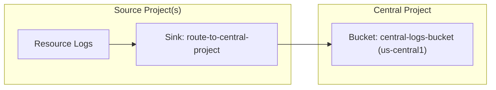
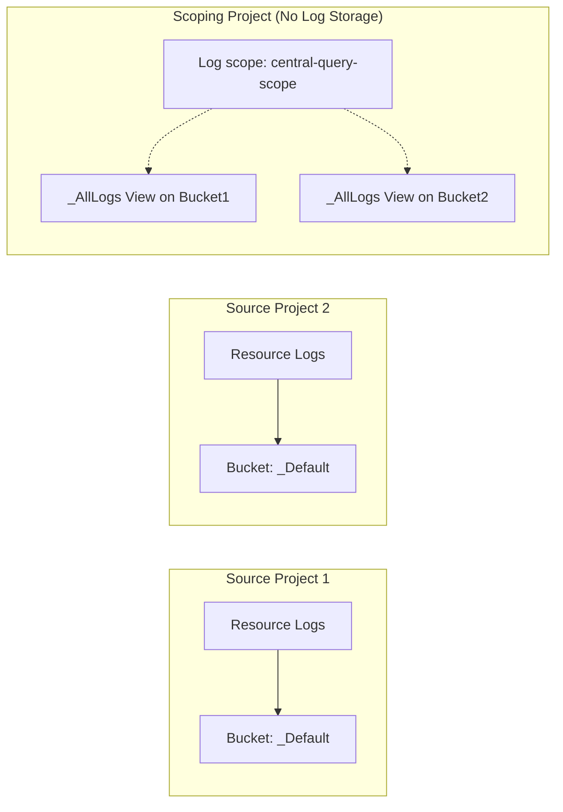

# 配置跨项目日志记录

本技能介绍如何使用 `gcloud` 命令配置 Cloud Logging，从而将日志数据存储在一个中心位置，而无论其来源位于何处。本技能还介绍了当日志数据存储在多个项目中时，如何查询这些数据。

> [!IMPORTANT] **沙盒网络限制（对代理测试至关重要）：**
> 在评估期间或受限的沙盒环境中，访问 GCP API 的网络流量会被阻止。请**不要**运行网络发现命令来查找资源名称、项目 ID 或组织 ID。始终使用用户提示或说明中提供的确切项目 ID 或占位符，例如 `{project_id}`、`{source_project_id}`、`{central_project_id}`。假定这些资源已存在，并直接执行配置命令。运行这些发现命令将导致执行挂起并超时。

## 安全与确认级别（至关重要）

在代表用户执行任何命令之前，你必须根据所请求的操作遵守以下安全级别：

1.  **级别 R：只读**
    *   **说明：** 仅用于读取状态或查询日志的命令。
    *   **命令示例：**
        *   `gcloud logging read`
        *   `gcloud logging buckets list`
    *   **规则：** 无需确认。你可以立即执行这些命令以收集信息。
2.  **级别 M：变更（不涉及计费）**
    *   **说明：** 不会产生直接存储或计费成本，也不会影响资源安全或访问策略的配置修改或免费元数据创建操作。
    *   **命令示例：**
        *   `gcloud logging views create`
        *   `gcloud logging views update`
        *   `gcloud logging scopes create`
        *   `gcloud logging buckets create`
    *   **规则：** 无需确认。你可以立即执行这些命令以应用配置。
3.  **级别 B：涉及计费和安全敏感的变更（高风险）**
    *   **说明：** 创建会产生计费成本的资源或集成，或修改安全和 IAM 访问控制策略（存在权限提升风险）的操作。
    *   **命令示例：**
        *   `gcloud logging metrics create`
        *   `gcloud logging links create`
        *   `gcloud projects add-iam-policy-binding`
    *   **规则：** **需要交互式确认。** 这些命令会创建产生计费成本的资源或更改安全访问权限。执行前，你必须展示确切的原始命令，并获得用户确认。绝不能在请求确认的同一轮中执行命令。
4.  **级别 D：导致不可逆的数据丢失**
    *   **说明：** 永久丢弃或删除日志的操作，例如接收器排除项。
    *   **命令示例：**
        *   `gcloud logging buckets delete`
        *   `gcloud logging sinks update --add-exclusion`
    *   **规则：** **需要明确的键入确认。** 这些命令会立即且不可逆地丢弃或删除日志，或可能导致日志数据不被存储。你必须要求用户键入明确的确认，例如“Yes, discard logs”，并暂停执行，直到用户回复。

## 决策矩阵：集中式存储与读取时聚合

使用此决策矩阵评估并选择 **集中式存储**
或**读取时聚合**。采用集中式存储时，无论数据源自何处，日志数据都会被路由到
一个日志存储桶。你需要针对集中式日志存储桶编写查询。
采用读取时聚合时，日志数据由其来源资源存储。不过，单个查询会通过
查询所有资源来聚合数据。

确定用于处理跨项目日志的最佳架构后，
请按照下文详述的相应配置步骤操作。

| 标准                  | 集中式存储               | 读取时聚合               |
| :-------------------- | :----------------------- | :----------------------- |
| **GCP 项目规模**      | 可扩展至数千个           | 最适合少于 375 个项目。  |
:                       : 项目。                   :                          :
| **日志存储**          | 集中在单个日志           | 驻留在来源               |
:                       : 存储桶中。               : 资源中。                 :
| **SQL 分析**          | 简单；通过可观测性       | 困难；需要查询           |
:                       : 分析进行统一查询。       : 多个日志存储桶。         :
:                       :                          :                          :
| **访问控制**          | 通过集中式日志存储桶上的 | 需要对存储日志数据的     |
:                       : 日志视图限定访问范围。   : 资源上的所有视图拥有     :
:                       :                          : IAM 访问权限。           :
| **配置**              | 选项因项目、文件夹、     | 不会干扰基于存储桶的     |
: **复杂性**            : 组织结构而异。           : 日志指标。               :
:                       :                          :                          :
| **成本**              | 如果未设置排除项，       | 经济高效；无需复制       |
:                       : 可能会导致日志存储桶中   : 数据。                   :
:                       : 的数据重复存储。         :                          :
:                       :                          :                          :

## 架构

### 集中式存储（日志路由）



### 读取时聚合（日志作用域）



## 设置步骤：集中式存储（日志路由）

按照以下步骤，将一个或多个源项目中的日志路由到某个项目的中央日志存储桶。创建或选择用于存储日志数据的 Google Cloud 项目。此项目即为中央项目。

### 1. 在中央项目中创建日志存储桶（层级 M）

创建一个启用了 Log Analytics 的自定义日志存储桶。

> [提示] 使用区域级日志存储桶，例如，将位置设置为
> `us-central1`。不要使用 `global` 位置。此方法可确保
> 与 Observability Analytics 和 SQL 查询兼容。

```bash
gcloud logging buckets create {bucket_id} \
    --project={central_project_id} \
    --location={region} \
    --retention-days={retention_days} \
    --enable-analytics
```

### 2. 在中央项目中创建日志接收器（层级 M）

在中央项目中创建一个指向中央日志存储桶的项目级接收器。此接收器会将在中央项目的日志路由器中收到的日志路由到中央日志存储桶。

```bash
gcloud logging sinks create {sink_name} \
    logging.googleapis.com/projects/{central_project_id}/locations/{region}/buckets/{bucket_id} \
    --project={central_project_id}
```

### 3. 在源资源中创建日志接收器（层级 M）

要将日志路由到中央项目，必须在每个源组织、文件夹或项目中创建一个日志接收器。虽然可以使用 `--log-filter` 参数将接收器配置为仅路由部分日志，但建议的做法是路由所有非审计日志，然后在目标位置使用中央日志存储桶上的自定义日志视图来限制访问或对日志进行分区。

*   **对于组织级日志接收器**

    ```bash
    gcloud logging sinks create {sink_name} \
        logging.googleapis.com/projects/{central_project_id} \
        --organization={source_organization_id} \
        --include-children \
        --exclusion=filter='LOG_ID("cloudaudit.googleapis.com/activity")' \
        --exclusion=filter='LOG_ID("externalaudit.googleapis.com/activity")' \
        --exclusion=filter='LOG_ID("cloudaudit.googleapis.com/system_event")' \
        --exclusion=filter='LOG_ID("externalaudit.googleapis.com/system_event")' \
        --exclusion=filter='LOG_ID("cloudaudit.googleapis.com/access_transparency")' \
        --exclusion=filter='LOG_ID("externalaudit.googleapis.com/access_transparency")'
    ```

*   **对于项目级日志接收器**

    ```bash
    gcloud logging sinks create {sink_name} \
        logging.googleapis.com/projects/{central_project_id} \
        --project={source_project_id} \
        --exclusion=filter='LOG_ID("cloudaudit.googleapis.com/activity")' \
        --exclusion=filter='LOG_ID("externalaudit.googleapis.com/activity")' \
        --exclusion=filter='LOG_ID("cloudaudit.googleapis.com/system_event")' \
        --exclusion=filter='LOG_ID("externalaudit.googleapis.com/system_event")' \
        --exclusion=filter='LOG_ID("cloudaudit.googleapis.com/access_transparency")' \
        --exclusion=filter='LOG_ID("externalaudit.googleapis.com/access_transparency")'
    ```

### 4. 向接收器写入者授予 IAM 权限（Tier B）

> [!IMPORTANT] **安全操作（Tier B）：** 授予 IAM 权限会更改
> 访问控制策略，因此在执行前必须由用户明确确认。

要允许源接收器将日志路由到中心项目的路由器，并允许中心接收器将日志写入中心存储桶：

1.  **向源接收器授予 Logs Writer 权限：** 获取源日志接收器的
    `writerIdentity`，并在中心项目中向其授予
    `roles/logging.logWriter`。

    ```bash
    # Get the writer identity of the source sink
    gcloud logging sinks describe {sink_name} \
        --project={source_project_id} \
        --format="value(writerIdentity)"
    ```

    输出是以下命令所需的 `{source_writer_identity}` 值（例如
    `serviceAccount:...`）：

    ```bash
    # Grant Logs Writer permissions on the central project
    gcloud projects add-iam-policy-binding {central_project_id} \
        --member={source_writer_identity} \
        --role=roles/logging.logWriter
    ```

2.  **向中心接收器授予 Bucket Writer 权限：** 获取中心日志接收器的
    `writerIdentity`，并在中心项目中向其授予
    `roles/logging.bucketWriter`。

    ```bash
    # Get the writer identity of the central sink
    gcloud logging sinks describe {central_sink_name} \
        --project={central_project_id} \
        --format="value(writerIdentity)"
    ```

    输出是以下命令所需的 `{central_writer_identity}` 值：

    ```bash
    # Grant Bucket Writer permissions on the central project
    gcloud projects add-iam-policy-binding {central_project_id} \
        --member={central_writer_identity} \
        --role=roles/logging.bucketWriter
    ```

### 5. 在中心存储桶上创建自定义 Log Views（Tier M）

由于所有日志都已路由到同一个中心存储桶，要按日志 ID 或项目对日志进行分区或限制访问，请在中心存储桶上创建自定义 Log Views。

*   **按日志 ID 筛选：**

    ```bash
    gcloud logging views create {view_id} \
        --bucket={bucket_id} \
        --location={region} \
        --project={central_project_id} \
        --log-filter='LOG_ID("{log_id}")'
    ```

*   **按源项目筛选：**

    ```bash
    gcloud logging views create {view_id} \
        --bucket={bucket_id} \
        --location={region} \
        --project={central_project_id} \
        --log-filter='project_id="{source_project_id}"'
    ```

### 验证集中式日志路由（Tier R）

要验证日志是否正从源项目路由到中心区域日志存储桶：

1.  **在源项目中写入一条测试日志：**

    ```bash
    gcloud logging write {test_log_id} "Test log entry for verification" \
        --severity=WARNING \
        --project={source_project_id}
    ```

2.  **从中心日志存储桶读取测试日志：** 对于区域日志存储桶，
    **必须**指定 `--view` 标志。由于默认视图 `_Default`
    仅包含与默认筛选条件匹配的日志，因此应查询中心存储桶上的
    **`_AllLogs`** 视图或自定义日志视图：

```bash
    gcloud logging read 'logName:"projects/{source_project_id}/logs/{test_log_id}"' \
        --bucket={bucket_id} \
        --location={region} \
        --view=_AllLogs \
        --project={central_project_id}
    ```

--------------------------------------------------------------------------------

## 设置步骤：读取时聚合（日志范围）

创建或选择一个用于查询日志数据的 Google Cloud 项目。该项目即范围项目。按照以下步骤配置日志范围。日志范围允许你查询存储在多个项目中的日志数据。

### 1. 创建自定义日志视图（可选但建议）（Tier M）

在源项目中创建日志视图，以限制可访问的日志。

> [!IMPORTANT] **注意事项：** 日志视图过滤器只能包含特定的限制条件。请参阅
> https://docs.cloud.google.com/logging/docs/logs-views.md.txt#view-filter

```bash
gcloud logging views create {view_id} \
    --bucket={bucket_id} \
    --location={region} \
    --project={source_project_id} \
    --log-filter='LOG_ID("{log_id}")'
```

*   `{bucket_id}`：例如，`_Default`
*   `{region}`：例如，`global`
*   `{view_id}`：例如，`app-logs-view`
*   如果要允许访问日志存储桶中的所有日志，请省略
    `--log-filter` 标志。

### 2. 在范围项目中创建日志范围（Tier M）

在范围项目中创建日志范围并列出源资源，这些资源可以是项目或特定的日志视图。

```bash
gcloud logging scopes create {log_scope_id} \
    --project={scoping_project_id} \
    --resource-names={resource_names}
```

*   `{log_scope_id}`：例如，`central-query-scope`
*   `{resource_names}`：以逗号分隔的日志视图列表。例如，
    `projects/source-project-1/locations/global/buckets/_Default/views/app-logs-view,projects/source-project-2/locations/global/buckets/_Default/views/app-logs-view`。
    范围中最多可以包含 100 个视图。

### 3. 更新默认可观测性范围（可选）（Tier M）

将日志范围关联到项目的默认可观测性范围，使其默认用于日志浏览器。

```bash
gcloud observability scopes update _Default \
    --project={scoping_project_id} \
    --location=global \
    --log-scope=//logging.googleapis.com/projects/{scoping_project_id}/locations/global/logScopes/{log_scope_id}
```

### 4. 向用户授予 IAM 权限（Tier B）

与集中式路由不同，系统会在查询时检查所有源项目的权限。运行查询的用户必须具备：

*   针对特定日志视图授予的 `roles/logging.viewAccessor`（使用 IAM
    条件），或针对源项目授予的 `roles/logging.viewer`。
*   对范围项目的访问权限。

## 排查跨项目日志路由和接收器权限故障

如果配置集中式日志记录后，日志没有出现在中央项目的存储桶中：

### 1. 验证源资源中的日志路由器接收器过滤器

*   确保日志接收器的过滤器与预期路由的日志匹配。

> [!IMPORTANT] **注意事项：** 在日志接收器中，`logName:abc` 或
    > `logName="projects/{project_id}/logs/abc"` 等标准过滤器表达式可能无法匹配。
    > 在日志接收器过滤器中，**始终**使用 `LOG_ID("abc")` 进行精确匹配。

*   验证是否配置了会意外丢弃这些日志的排除过滤器。

### 2. 验证并授予写入者身份权限（最常见的原因）

必须为源项目中日志接收器的写入者身份服务账号显式授予对中央资源的必要权限。

*   **步骤 A：获取写入者身份**

    ```bash
    gcloud logging sinks describe {sink_name} \
        --project={source_project_id} \
        --format="value(writerIdentity)"
    ```

*   **步骤 B：在中央项目中授予权限（Tier B）**

    > [!IMPORTANT] **安全操作（Tier B）：** 授予 IAM 权限会更改访问控制政策，
    > 执行前必须获得用户的明确确认。

    *   **对于 Cloud Logging 存储桶（标准方式）：** 授予
        `roles/logging.bucketWriter`：

        ```bash
        gcloud projects add-iam-policy-binding {central_project_id} \
            --member={writer_identity} \
            --role=roles/logging.bucketWriter
        ```

    *   **对于 GCS 存储桶：** 针对 GCS 存储桶授予 `roles/storage.objectCreator`。

    *   **对于 Pub/Sub 主题：** 针对 Pub/Sub 主题授予 `roles/pubsub.publisher`。

    *   **对于 BigQuery 数据集：** 针对 BigQuery 数据集授予 `roles/bigquery.dataEditor`。

--------------------------------------------------------------------------------

## 参考资料和支持链接

*   [GCP Cloud Logging - 路由和存储概览](https://docs.cloud.google.com/logging/docs/routing/overview.md.txt)
*   [GCP Cloud Logging - 日志范围](https://docs.cloud.google.com/logging/docs/log-scope/create-and-manage.md.txt)
*   [GCP Cloud Logging - 自定义日志视图](https://docs.cloud.google.com/logging/docs/logs-views.md.txt)