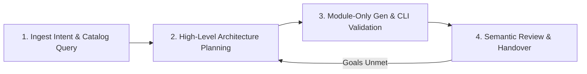

# 简化的 GCP 模块化 Terraform 架构师技能

此技能围绕一个四阶段生成管道执行智能体式设计循环：



你必须严格按顺序遵循这 4 个明确的阶段。不得跳过任何阶段。如果阶段 4 中的语义审查确定该配置未完全满足用户的架构目标或意图，则必须返回阶段 2，重新规划并生成。

--------------------------------------------------------------------------------

## ⚠️ 严格的架构约束

所有生成的配置都必须优先采用模块化结构，同时遵守命名和 HCL 样式约束。请参阅：

-   `../generator_instructions.md`，了解生成约束和项目默认设置。
-   `../terraform_validator_instructions.md`，了解语义验证规则。

常规默认设置和策略：

-   **默认网络和子网：** 除非另有指定，否则以 `<project_id>` 中名称均为 `"default"` 的现有 VPC 网络和子网为目标。
-   **密钥安全策略（强制）：** 绝不能在 HCL 代码或 `terraform.tfvars` 中写入明文密码、API 密钥或凭据。所有密钥都必须在 GCP Secret Manager 中声明为资源（使用 `terraform-google-secret-manager` 模块），并由目标服务动态引用。
-   **状态隔离策略（强制）：** 验证时将 Terraform 状态保留在临时文件夹本地。绝不能生成远程后端块（例如 `backend "gcs" {}`），因为远程状态由父级编排器/部署注册表动态管理。

--------------------------------------------------------------------------------

## 阶段 1：接收意图并查询目录

1.  **加载输入：** 接收用户目标和说明。
2.  **查询目录注册表（私有和公共）：** 为完善设计，请调用原生 **`manage_catalog`** MCP 工具并使用 **`CATALOG_OPERATION_LIST_COMPONENTS`** 操作，同时搜索项目的自定义私有目录和 Google 公共目录。

    *   **查询私有目录（目标空间）：**

        *   ServerName：`application_design_center`
        *   ToolName：`manage_catalog`
        *   参数：

            ```json
            {
              "project": "<project_id>",
              "location": "<location>",
              "spaceId": "<space_id>",
              "operation": "CATALOG_OPERATION_LIST_COMPONENTS"
            }
            ```

    *   **查询 Google 公共目录：**

        *   ServerName：`application_design_center`
        *   ToolName：`manage_catalog`
        *   参数：

            ```json
            {
              "project": "gcpdesigncenter",
              "location": "us-central1",
              "spaceId": "googlespace",
              "catalogId": "googlecatalog",
              "operation": "CATALOG_OPERATION_LIST_COMPONENTS"
            }
            ```

-   *优先级规则：* 你必须优先使用私有目录模板
        （位于目标空间中），而不是 Google 公共模板，以确保
        项目特定的自定义配置得到保留。

3.  **获取模块详细信息：** 通过调用原生 **`manage_catalog`** MCP
    工具并使用 **`CATALOG_OPERATION_GET_COMPONENT_METADATA`** 操作，获取包含输入、
    输出和依赖项的详细模块元数据（或使用
    **`CATALOG_OPERATION_GET_COMPONENT_IAC`** 直接检索底层
    Terraform 源代码）：

    *   **MCP 工具调用：**

        *   服务器名称：`application_design_center`
        *   工具名称：`manage_catalog`
        *   参数：

            ```json
            {
              "project": "<project_id>",
              "location": "<location>",
              "spaceId": "<space_id>",
              "catalogTemplateId": "<short_module_id>",
              "catalogTemplateRevisionId": "<revision_id>",
              "operation": "CATALOG_OPERATION_GET_COMPONENT_METADATA"
            }
            ```

    -   *约束：* 仅传递短模块 ID（例如 `cloud-run-job`，
        即完全限定资源名称的最后一段），不要传递
        列表命令返回的完整资源名称路径。

    > [!IMPORTANT] 为确保本地 HCL 声明与
    > Design Center 注册表验证的版本约束完全匹配，你必须
    > 从注册表中提取精确的 Git 仓库标签，并在
    > HCL 模块的 `source` 中使用该标签。
    >
    > `gitSource` 元数据块（包括 `refTag`、`repo` 和 `dir`）
    > 会直接在 **`manage_catalog`** MCP 工具的输出中返回
    > （位于 `gitSource` 字段下）。
    >
    > 如果需要回退到 CLI 来描述修订版本的详细信息，可以使用
    > 从 MCP 工具检索到的修订版本 URI 直接运行 `describe` 命令：
    >
    > ```bash
    >    gcloud design-center spaces catalogs templates revisions describe <revision_uri>
    > ```
    >
    > 1.  **从 `gitSource` 块中提取字段：**
    >
    >     ```yaml
    >     gitSource:
    >       dir: modules/v2
    >       refTag: v0.33.0
    >       repo: GoogleCloudPlatform/terraform-google-cloud-run
    >     ```
    >
    > 2.  **构造 HCL `source` URI**，使用模式
    >     `github.com/<repo>//<dir>?ref=<refTag>`：
    >
    >     ```hcl
    >     source = "github.com/GoogleCloudPlatform/terraform-google-cloud-run//modules/v2?ref=v0.33.0"
    >     ```

--------------------------------------------------------------------------------

## 阶段 2：高层架构规划

1.  **资源初始化（强制）：** 在制定任何计划之前，你
    必须读取 `../planner_instructions.md` 中的说明。在这些说明
    进入你的活动上下文之前，请勿继续。
2.  **设计高层架构：** 基于阶段 1 中确定的模块，
    规划连接关键模块化构建块
    （VPC、计算、数据库、安全）的设计拓扑。
3.  **制定集成模式决策：** 使用可用模块确定
    核心模式布局决策（例如 GKE 与 Cloud Run 计算模型的选择、存储引擎、
    网络边界、私有互连和数据库托管结构）。
    -   *注意：* 制定模式时应遵循 Google 最佳实践。例如：
        1.  始终使用 Secret Manager 存储和引用数据库
            凭据，而不是将口令用作输入参数。
        2.  使用 Private Service Connect 而不是公共访问来实现私有
            连接。
4.  **收集预先存在的可复用 TF 模块：** 检查目录中是否存在任何
    预先存在的 TF 模块，以了解可用于创建符合用户意图的
    端到端解决方案的构建块。目录包含
    公共目录中的模块（由 GCP 发布）以及客户拥有的私有目录中的模块。
    当公共目录与私有目录中存在重复模块时，始终优先选择
    私有目录组件/模块。通过调用原生 **`manage_catalog`** MCP 工具并使用
    **`CATALOG_OPERATION_GET_COMPONENT_METADATA`** 操作检查
    所选模块，以验证输入、输出、必需输入和引用输出：

*   **MCP 工具调用：**

        *   ServerName：`application_design_center`
        *   工具名称：`manage_catalog`
        *   参数：

            ```json
            {
              "project": "gcpdesigncenter",
              "location": "us-central1",
              "spaceId": "googlespace",
              "catalogId": "googlecatalog",
              "operation": "CATALOG_OPERATION_GET_COMPONENT_METADATA",
              "catalogTemplateId": "<module_id>"
            }
            ```

    -   *约束：* 使用简短模块 ID（即资源名称的最后一段，例如 `cloud-run-job`），
        而不要使用以 `projects/...` 开头的完整资源路径。如果查询私有目录，
        请相应更新 `project`、`spaceId` 和 `catalogId` 参数。

5.  **审查端到端解决方案模板：** 审查 GCP 发布的架构完善的解决方案，
    以及客户自己的组织发布的解决方案。在适用时，将这些解决方案用作
    参考架构。要浏览可用模板，请运行本地 CLI 脚本
    `list_terraform_templates`，查看是否有预先存在的应用程序模板可用作
    设计基线。你必须传入当前有效的目标项目 ID 和空间 ID，
    以检索 Google 公共模板和私有模板：

    ```bash
    python3 scripts/list_terraform_templates.py --project="<project_id>" --space_id="<space_id>" --catalog_id="<catalog_id>"
    ```

    -   *优先级规则：* 在返回的列表中，私有应用程序模板会优先显示
        （标记为 `"source": "private"`）。如果有合适的私有模板可用，
        你必须优先使用私有应用程序模板，而不是 Google 公共模板
        （标记为 `"source": "google"`）！

6.  **获取 Terraform 模板：** 运行本地 CLI 脚本 `fetch_terraform_template`，
    将基线模板配置获取到本地工作区。你必须传入当前有效的目标项目 ID
    和空间 ID：

    ```bash
    python3 scripts/fetch_terraform_template.py <template_id> --project="<project_id>" --space_id="<space_id>" --out_dir="<target_directory_path>"
    ```

    （如果输出目录不存在，将自动创建）。

7.  **审查规划器原则：** 对照检查
    [planner_instructions.md](../planner_instructions.md) 中的规划指令。

--------------------------------------------------------------------------------

## 阶段 3：仅模块生成器与 CLI 验证循环

1.  **资源初始化（强制）：** 在编写任何 HCL 之前，你必须阅读
    `../generator_instructions.md` 中的指令。在这些指令进入你的活动上下文之前，
    不要继续。
2.  **生成原始 HCL：** 根据已加载指令中的规则编写标准 Terraform 代码，
    尽可能优先使用模块块；如果没有合适的模块，则使用直接资源。
3.  **保存配置文件：** 创建一个此执行/会话专用的工作区临时目录
    （例如 `scratch/tf_validate_{session_id}/`，使用会话 ID、对话 ID
    或唯一运行 ID，以避免并发执行相互覆盖），并将生成的 HCL 代码拆分写入：
    -   `providers.tf`：提供程序和 terraform 块。
    -   `main.tf`：模块和资源声明。
    -   `variables.tf`：变量声明。
    -   `terraform.tfvars`：变量值。
    -   `outputs.tf`：输出声明。
4.  **语义架构验证（强制）：** 在运行任何 CLI 验证之前，你必须阅读
    `../terraform_validator_instructions.md` 中的指令。执行全面的语义审核，
    确保配置符合验证器准则（优先使用模块而不是资源、不使用自定义变量、
    使用正确的 GitHub 源格式等）。在这些指令进入你的活动上下文之前，
    不要继续。
5.  **执行本地 CLI 验证检查（关键）：**

-   直接使用 Terraform CLI 初始化目录，以拉取 CFT
        源代码并下载提供程序插件：

        ```bash
        terraform -chdir=scratch/tf_validate_{session_id}/ init
        ```

    -   直接使用 Terraform CLI 验证 HCL 块结构和类型连接：

        ```bash
        terraform -chdir=scratch/tf_validate_{session_id}/ validate
        ```

    -   使用 Terraform CLI 试运行资源变更并验证配置的可行性：

        ```bash
        terraform -chdir=scratch/tf_validate_{session_id}/ plan
        ```

    -   *修复循环：* 如果 Terraform CLI 在初始化、验证或规划期间报告错误或警告，
        请修正 `main.tf` 并重复执行检查命令，直至不再出现任何问题。

--------------------------------------------------------------------------------

## 阶段 4：语义审查与交付

最终的模块化代码必须整洁、健壮且以安全的方式连接。

1.  **语义审查与目标对齐：** 根据用户意图和架构约束审查已验证的配置。
    如果架构未能实现目标或需要调整，请返回**阶段 2：
    高层架构规划**，重新规划并生成。
2.  **提供架构设计依据：** 输出一份清晰、详尽的最终报告，
    其中描述：
    -   **高层架构布局：** 清晰概述每个模块或资源块及其在 GCP
        基础设施中的结构性作用。
    -   **架构设计依据：** 明确说明选择特定计算系统、边界和数据库模型的原因。
        如果创建了任何直接资源而不是使用模块，请解释其必要性。
        如果考虑了多种产品，请说明产品选择的依据。
    -   **模块间拓扑与数据流：** 以描述性文本逐步说明数据如何在 VPC 网络边界、
        计算块和依赖的数据库组件之间流动。
3.  **输出完整无损的 Terraform 代码：** 读取目标验证目录中生成的每个文件
    （包括 `.tf` 和 `.tfvars` 文件）（使用标准文件查看/读取工具），并在最终响应中
    输出其准确、完整无损的 HCL 配置。每个文件必须采用以下格式：

    ````markdown
    文件：`<path>`
    ```hcl
    [content]
    ```
    ````

    请确保输出所有最终验证文件的完整且准确的文件内容。

## 报告问题

请前往 [Google Skills Issues](https://github.com/google/skills/issues) 报告此 Skill 的错误或改进建议。