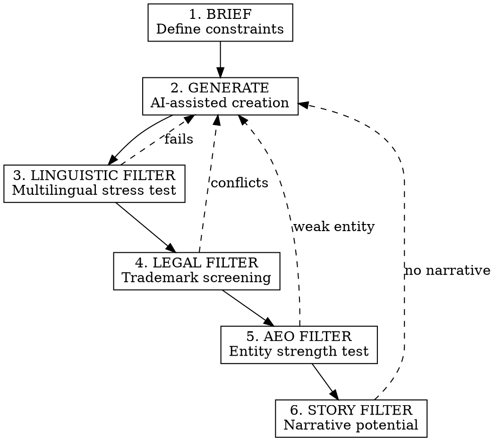

# 命名六道关卡协议

## 概述

2026 年的品牌命名是一项架构工程，而非创意头脑风暴。名称必须具备以下特点：
1. **机器兼容** - 能被大语言模型高效分词，并可被 AI 引擎引用
2. **法律可辩护** - 在不同司法管辖区均不存在商标冲突
3. **语音就绪** - 语音助手能够正确发音，并可顺畅唤起
4. **叙事承载力** - 能够承载品牌故事

**核心原则：** 优先针对 AEO（答案引擎优化）进行优化，其次才是美感。

## 适用场景

- 创建新的品牌、产品或公司名称
- 因商标冲突而更换名称
- 拓展国际市场（有多语言要求）
- 发布语音激活型产品或技能
- 面向 AI 优先的发现方式进行命名（ChatGPT、Perplexity、Gemini 推荐）

## 不适用场景

- 内部项目代号（无法律/AEO 要求）
- 临时活动名称
- 无商业意图的个人项目

## 命名六道关卡流程



---

## 第 1 关：简报（约束定义）

在生成名称之前定义硬性约束：

| 约束 | 目标 | 原因 |
|------------|--------|-----|
| **长度** | 最多 7-8 个字母 | 移动端图标、认知负荷、分词 |
| **音节数** | 1-3 个音节 | 语音唤起、易记性 |
| **字符集** | 仅限 A-Z | 域名可用性、全球键盘兼容性 |
| **禁用字母组合** | ght、ough、静音字母 | 发音障碍 |

**输出格式：**
```yaml
brief:
  max_letters: 8
  max_syllables: 3
  target_markets: [FR, ES, US, UK]
  nice_classes: [9, 35, 42]
  avoid_phonemes: [ʒ, θ, ð]  # Hard for non-native speakers
  competitor_names: [Notion, Figma, Linear]  # Style reference
  forbidden_associations: [medical, financial, religious]
```

---

## 第 2 关：生成（AI 辅助创作）

使用包含 5 种类型的结构化提示：

### 类型 1：类比型（真实词语迁移）
将不相关领域中的词语应用到新的语境中。
- 示例：Apple（科技）、Amazon（零售）、Jaguar（汽车）
- 提示词："从 [自然/神话/地理] 中寻找能够唤起 [核心属性] 的词语"

### 类型 2：隐喻型（抽象概念）
将抽象概念具象化。
- 示例：Slack（释放工作空间中的紧张感）、Notion（捕捉想法）
- 提示词："哪个单一词语能够概括从 [痛点] 到 [结果] 的转变？"

### 类型 3：新词（自造词）
通过语音设计创造的新词。
- 示例：Kodak、Xerox、Häagen-Dazs
- 提示词：“创造一个双音节单词，结构为 [爆破音开头] + [开元音] + [柔和结尾]”

### 类型 4：混成词（融合）
将两个有意义的单词融合在一起。
- 示例：Instagram（instant + telegram）、Pinterest（pin + interest）
- 提示词：“融合 [word1] + [word2]，同时保留两个词根的可识别性”

### 类型 5：空容器
没有含义，但在语音上悦耳。
- 示例：Rolex、Vimeo、Skype
- 提示词：“生成 5 个字母的组合：CVCVC 模式，不具有现有含义”

**生成契约：**
```
CONSTRAINTS:
- Max 8 letters
- Pronounceable in French, Spanish, English
- No existing trademark in Class 42
- Distinct from: [competitor list]

OUTPUT FORMAT per candidate:
- Name: [word]
- Typology: [1-5]
- Phonetic: /IPA transcription/
- Syllables: [count]
- Rationale: [1 sentence]
```

---

## 关卡 3：语言过滤（多语言压力测试）

在各目标市场中测试每个候选名称：

### 发音测试
通过 15 种以上语言的 TTS 引擎运行测试：
- Google TTS、Amazon Polly、Azure Speech
- 注意：误读、混淆、不自然

### 文化内涵检查
确认在以下方面不存在负面含义：
- 目标市场俚语（TikTok、Douyin、RedNote 趋势）
- 历史联想
- 宗教/政治敏感性
- 当地语言中的同音词

### 需要避免的语音风险
| 风险 | 示例 | 影响 |
|--------|---------|--------|
| 不发音字母 | "Knight" | 语音助手识别失败 |
| 辅音连缀 | "Strengths" | 非母语者难以发音 |
| 元音歧义 | "Read" (reed/red) | 造成混淆 |
| 跨语言同音词 | "Gift"（在德语中意为“毒药”） | 负面联想 |

**淘汰标准：**如果 TTS 在超过 2 个目标市场中出现误读，则淘汰。

---

## 关卡 4：法律过滤（商标筛查）

### 阶段 1：快速排除
- Google："[name] company" / "[name] brand" / "[name] trademark"
- 域名检查：.com、.co、.io、.fr、.eu
- 社交媒体账号：使用 Namechk 扫描所有平台

### 阶段 2：正式商标检索
| 注册机构 | 工具 | 检查内容 |
|----------|------|-----------|
| 法国 | INPI data.inpi.fr | 完全相同 + 语音相似性 |
| 欧盟 | EUIPO eSearch / TMview | 相同的尼斯分类 |
| 美国 | USPTO TESS | 已注册 + 申请中 |
| 国际 | WIPO Global Brand Database | 马德里体系 |

### 阶段 3：AI 辅助相似性检测
EUIPO 的 "Early TM Screening" 可检测：
- 语音相似性（听起来相似）
- 视觉相似性（看起来相似）
- 概念相似性（含义相似）

**淘汰标准：**目标尼斯分类中存在任何冲突 → 淘汰。

---

## 关卡 5：AEO 过滤（实体强度测试）

名称必须能被 AI 系统识别为一个独立实体。

### 实体强度检查清单
- [ ] **唯一词元：**该名称会被标记为单个词元，还是会被拆分？
- [ ] **无冲突：**搜索 "[name]" 时，返回的是预期语境还是无关噪声？
- [ ] **语义边界：**AI 能否区分 "[name] the company" 与通用用法？

### 测试 AEO 强度
```
Prompt to test:
"What is [NAME]?"

GOOD response: "I don't have information about [NAME]" (clean slate)
BAD response: "[NAME] is a common word meaning..." (collision)
BAD response: "[NAME] could refer to several things..." (ambiguity)
```

### 关键词难度检查
使用 Semrush/Ahrefs：
- 关键词难度 < 30 = 良好
- 关键词难度 > 60 = 会被通用词淹没

**淘汰标准：** 如果名称与高搜索量的通用词冲突，则淘汰。

---

## 门槛 6：故事筛选（叙事潜力）

名称必须是“可讲述的”——能够承载品牌故事。

### 五大叙事支柱测试
针对每个候选名称，验证是否可以构建以下内容：

| 支柱 | 问题 | 所需示例答案 |
|--------|----------|------------------------|
| **起源故事** | “为什么使用这个名称？” | 必须有真实且值得分享的理由 |
| **信念故事** | 品牌代表什么？ | 价值观必须与名称相关联 |
| **产品真相** | 它实际上有什么作用？ | 名称应暗示其功能 |
| **转变** | 客户会发生什么变化？ | 变化前后必须能用名称表达 |
| **文化** | 会形成什么样的社群？ | 名称应有助于塑造身份认同 |

### 空白容器与内涵名称
- **空白容器**（Kodak、Google）：品牌随时间推移为名称注入含义
- **内涵名称**（Instagram、Airbnb）：名称自带含义

两种方式都可行。但你必须有意识地作出选择，并据此进行构建。

### 发声特征测试
将名称大声说 10 遍。自问：
- 说起来是否顺口？
- 客户是否会喜欢说出这个名称？
- 它是否具有一种“让人难忘”的特质？

**淘汰标准：** 如果无法讲述一个引人入胜的起源故事，则淘汰。

---

## 语音助手限制（2026）

| 助手 | 调用规则 | 被拒风险 |
|-----------|-----------------|-----------------|
| **Alexa** | 要求 2 个或更多单词（已注册商标除外） | 单个通用词 |
| **Siri** | 必须在语音上具有明显区分度 | 与系统命令混淆 |
| **Google** | 需要在知识图谱中具有较强的存在度 | 与知名品牌过于相似的名称 |
| **Bixby** | 避免与唤醒词冲突 | “Open”“cancel”等常见动词 |

**测试流程：**
1. 对每个助手说出“[Name], do [action]”
2. 记录识别率
3. 如果准确调用率 < 80%，则淘汰

---

## 输出：命名档案

针对最终候选名称，生成：

```markdown
## [NAME] - Naming Dossier

### Basic Info
- **Name:** [word]
- **Typology:** [1-5]
- **Phonetic:** /IPA/
- **Length:** X letters, Y syllables

### Linguistic Clearance
- FR pronunciation: [pass/fail + notes]
- ES pronunciation: [pass/fail + notes]
- EN pronunciation: [pass/fail + notes]
- Cultural flags: [none / list]

### Legal Clearance
- INPI (FR): [clear / conflict]
- EUIPO (EU): [clear / conflict]
- USPTO (US): [clear / conflict]
- Domains available: [list]
- Social handles: [list]

### AEO Score
- Entity uniqueness: [1-10]
- Keyword difficulty: [score]
- Tokenization: [single/split]

### Narrative Potential
- Origin story hook: [1 sentence]
- Brand values connection: [1 sentence]
- Community identity: [suggested demonym]

### Voice Readiness
- Alexa: [pass/fail]
- Siri: [pass/fail]
- Google: [pass/fail]

### Recommendation
[APPROVED / NEEDS WORK / REJECTED]
[Final reasoning]
```

---

## 常见错误

| 错误 | 失败原因 | 修正方法 |
|---------|-------------|-----|
| 从头脑风暴开始 | 产生无法使用的名称 | 从约束条件（第 1 关）开始 |
| 跳过 TTS 测试 | 导致语音助手调用失败 | 始终测试发音 |
| 忽视尼斯分类类别重叠 | 引发商标冲突 | 检查具体类别，而不仅仅是完全匹配项 |
| 选择描述性名称 | AEO 表现弱，难以注册商标 | 优先选择独特名称或自造词 |
| 不进行叙事测试 | 品牌无法讲述自己的故事 | 始终验证其叙事潜力 |

---

## 快速参考

**7-8 字母法则：**越短越适合移动端、语音、记忆和分词。

**语音黄金标准：**CVCV 模式（辅音-元音-辅音-元音）在全球范围内均适用。

**AEO 优先：**如果 AI 无法将你作为一个独立实体引用，那么在 2026 年你就不存在。

**空容器策略：**无实际含义的名称（如 Kodak）需要投入更多品牌建设，但面临的冲突更少。

**语音优先：**如果 Alexa 无法调用它，那么 84 亿个助手也无法推荐它。

---

## Claude 负责什么，您决定什么

| Claude 负责 | 您提供 |
|---------------|-------------|
| 按类型生成候选名称 | 简报中的约束条件（市场、类别） |
| 运行语言压力测试 | 最终发音判断 |
| 查询商标数据库 | 法律专业人士的验证 |
| 评估 AEO／实体强度 | 战略品牌方向 |
| 生成命名档案 | 最终选择与批准 |

---

## 技能边界

### 此技能擅长：
- 品牌、产品或公司命名
- 需要进行国际化部署的名称
- 与语音助手兼容的名称
- 创建可被 AI 发现的实体

### 此技能不适合：
- 内部代号 → 没有法律／AEO 要求
- 临时活动名称 → 无须承担额外流程
- 个人项目 → 简化流程即可满足需求

---

## 技能元数据

```yaml
name: naming-6-gates
category: branding
version: 2.0
author: GUIA
source_expert: 6-Gate Protocol (AEO-first naming)
difficulty: advanced
mode: centaur
tags: [naming, branding, trademark, voice-assistant, aeo, entity]
created: 2026-02-03
updated: 2026-02-03
```