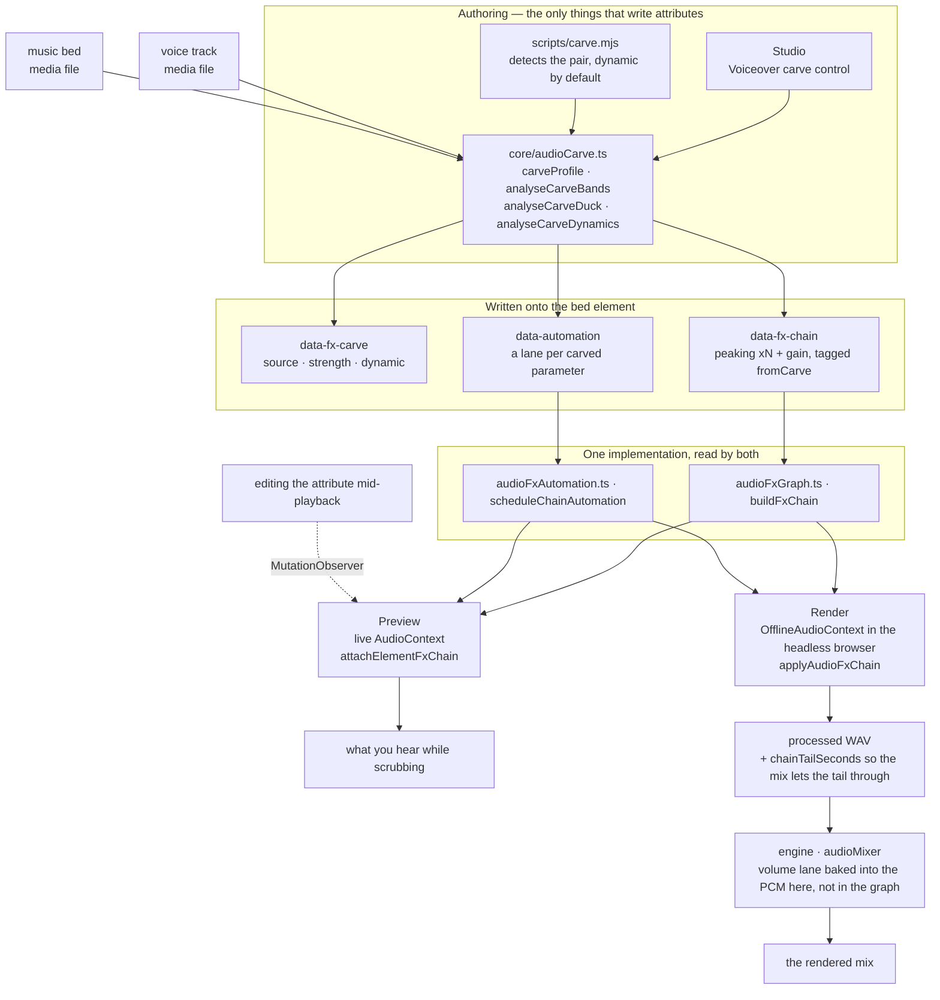
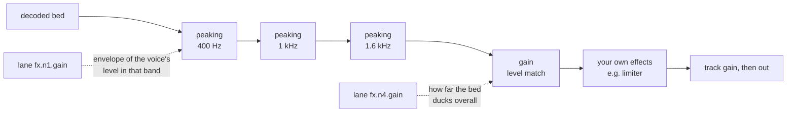

# HyperFrames 音频

混音是一组关系，而不是一摞处理器。两条轨道单独听都没问题，放在一起却可能完全无法聆听，而解决办法几乎从来不是“把其中一条调小”——而是找出它们在争夺什么，并把它交给真正需要它的那一条。这里的每个工具，都是为了表达其中一种关系而存在。

效果器以 `data-fx-chain` 的形式存在于元素上，预览和渲染运行的是同一个 Web Audio 图——工作室在实时上下文中运行，引擎则在它已经驱动的浏览器内部使用离线上下文运行。每种效果器只有一个实现，因此你拖动浏览时听到的内容，就是最终写入的内容。无需调校两遍。

片段时间范围仍由 `/hyperframes-core` 负责：音频/视频裁剪和源范围使用 `data-start`、`data-duration` 和 `data-media-start`，交叉淡化则让不同轨道上的片段彼此重叠。此 skill 负责已放置轨道的淡入/淡出、交叉淡化包络、轨道增益/轨道音量、音量和效果器自动化、闪避/旁白挖空，以及效果器链。`/media-use` 负责素材来源、生成和预处理。

恒定的 `data-playback-rate`（`0.1..5`）对于画面渲染是安全的；当匹配的音频/视频元素使用相同的时间安排、源偏移和速率时，对于保持音高的声音同样安全。不支持源速度渐变，因为没有速率包络；请预处理生成一个同步的派生素材。HyperFrames 不提供自动波形同步或漂移校正。  
如需可复制的剪辑/交叉淡化/重新定时配方，请使用 `/hyperframes-core` → `references/creator-editing-recipes.md`。

三个属性承载全部信息，并且都位于音频/视频元素自身上：

| 属性              | 存储内容                                                     |
| ----------------- | ------------------------------------------------------------ |
| `data-fx-chain`   | 按信号顺序排列的效果器                                       |
| `data-automation` | 此轨道音量或其效果器参数上的包络                             |
| `data-fx-carve`   | 挖空自身的设置，以便重新推导                                   |

已提供的效果器系列包括增益、EQ（高通、低通、峰值、搁架）、压缩器、限制器、门限器、饱和器、延迟、混响、合唱、移相器和位压碎。

每种效果器的确切 JSON，以及轨道必须满足的规则：`references/attributes.md`。  
每种效果器及其参数、范围和单位：`references/fx-registry.md`。  
如何判断一个你无法听到的文件出了什么问题：`references/diagnosis.md`。  
**预设、命名任务和单旋钮配置，以及从症状到修复的对照表：`references/presets.md`**——在手动搭建效果器链之前先阅读它，因为其中通常已经有某个预设或命名任务直接对应你的问题。

## 它如何协同工作

两个创作界面负责写入这些属性；两个运行时则通过同一组构建器读取它们。正是这层共享的中间部分，让预览能够预测渲染结果。



carve 自身的设置在播放时从不读取——实际播放的是它生成的 chain 和 lanes。`data-fx-carve` 的存在，是为了能够修改现有 carve 的 strength，而不是从滤波器中反向猜测出来。

在经过 carve 的 bed 内，信号会先经过各个 dips，然后经过电平匹配，最后经过你自行构建的任何处理——这就是为什么你添加的 limiter 仍然会作为最后一道上限：



静态 carve 是具有固定值且完全没有 lanes 的同一图表。

## 首先，找出问题所在

下表从“听起来轰隆隆的”开始——这意味着已经有人听过并这样描述了它。只给你一个文件并说“修复它”时，你没有这样的描述，而且也无法直接听到，所以必须进行测量。下面的一切都受一条规则约束：

> **无法诊断单个未知人声的绝对频谱。**
> 共振峰可能相差 ±10 dB，基频范围为 85–255 Hz，而句子在结尾时会衰减 5–6 dB。这些现象中的每一个单独看来都像缺陷，但它们其实都是说话者本身的特征。

因此要进行比较，而且要和**同一个文件中的某些内容**比较：如果存在，就使用干净的原始音频；否则使用停顿——间隙中能听到的任何内容都是叠加成分，而间隙的频谱代表的是通道，而不是人声。与已发布的平均频谱或合成的参考人声进行比较是行不通的：不同说话者之间的差异比大多数缺陷还大，而这份指导背后的评估中出现的两个错误答案，恰恰都来自这种比较。

当既没有原始音频，也没有可用的静音时，静态音调缺陷确实无法唯一确定。应说明这一点，并给出能够与现象相符的几种解读，而不是武断地选定一种并据此构建处理链。

命令、陷阱和完整示例：**`references/diagnosis.md`**。在诊断一个没有任何描述的文件之前，请先阅读它。

## 从症状入手

确定频段和问题类型后，要明确指出音频出了什么问题。大多数糟糕的音频都属于以下一种或两种情况，而且每种情况都有已经提供好的处理方案：

| 听起来像                         | 使用                                           |
| -------------------------------- | ---------------------------------------------- |
| 底下有嗡嗡声或砰砰声             | `rumble-cut`，或在 80 Hz 使用 `highpass`       |
| 浑浊、胸腔共鸣明显               | **Tame Boominess** job（200 Hz）                |
| 发闷、像隔着纸板                 | **Reduce Mud** job（250 Hz）                    |
| 听不清楚说的是什么               | **Add Clarity** job（3 kHz），或 carve bed     |
| 刺耳且令人疲劳                   | **Soften Harshness** job（3.2 kHz）             |
| 有些词比其他词响得多             | 压缩器上的 **Evenness**，或 Even Out Levels     |
| 句子之间有房间声                 | `room-gate`                                     |
| 人声和音乐互相争抢               | **Voiceover carve**——不要对任一方使用 EQ       |
| 干涩，听不出录音环境             | `room-tight` 或 `room-natural`                 |
| 只是听起来“业余”                 | `voice-clean`，它会按顺序执行上述四项处理       |

完整目录、每个预设包含的内容、频段术语，以及明确**不**涵盖的内容（去齿音、噪声移除、音色匹配）：
`references/presets.md`。

先减法，再加法；先滤波，再调电平；调完电平，再处理关系；最后处理音色与上限。每一步都会改变下一步听到的内容——如果在高通滤波器之前设置压缩器，它就会一直追着隆隆声工作。

## 根据问题选择族，而不是根据名称

**滤波器**（`highpass`、`lowpass`、`peaking`、`lowshelf`、`highshelf`）决定一条轨道可以占据哪些频率。这是解决两个声源相互冲突时的首选工具，因为冲突发生在频段中：背景音乐和人声都想要 1–3 kHz，而从背景音乐中削掉这部分，对背景音乐造成的损失远小于把整个混音调低所造成的损失。对人声使用高通滤波器是处理隆隆声的标准方法；低通滤波器则会有意地让声音变暗或变闷。

**动态处理**（`gain`、`compressor`、`limiter`、`gate`）决定一条轨道的电平如何随时间变化。压缩会缩小响与静之间的距离，让较安静的部分能够提升。限制器是一道上限——它不会塑造任何东西，只保证没有内容超过该上限。门限器会移除低于阈值的内容，这就是让语句之间的房间底噪静音的方法。`gain` 是一个普通的电平阶段，当一条轨道需要让开位置时，自动化轨道控制的就是它。

**非线性处理**（`saturate`、`bitcrush`）会改变波形形状，从而添加原本不存在的泛音。当一条轨道需要的是音色特征或颗粒感，而不是修正时，可以选择它——但要记住它具有生成性：它会让单薄的声源变得更密实，而不是更干净。

**时间效果**（`delay`、`reverb`、`chorus`、`phaser`）会把一条轨道置于某个空间中，或赋予它宽度。这些效果最容易破坏混音，因为尾音或失谐的复制声会占据人声所需的同一空间。将它们用于应该位于其他内容_后方_的对象，并把湿声量保持在低于单独试听时觉得合适的水平。

处理链是串行的：每个效果都会处理前一个效果产生的内容。因此，修正性滤波应放在前面，音色处理放在中间，而限制器放在最后，这样它才能真正充当上限。

## 人声旁路削频

**它解决的问题。** 人声下方铺着音乐时，人声会变得难以听清。常见的第一反应是把整条背景音乐压低，这确实有效，但会牺牲背景音乐的全部存在感——在人声出现的整个期间，音乐都会变得无力。但人声并不需要整个频谱。它只需要自己实际占据的几个频段。削频只处理这些频段，而背景音乐保留低频和高频，因此在人声仍然清晰可懂的同时，它依然是音乐。

**这是一种关系，而不是一种效果。** 设置位于_背景音乐_上——也就是接受处理的轨道——并指定要监听的人声，其逻辑与侧链压缩器完全相同：选择变安静的轨道，再选择让它变安静的内容。**绝不要在人声轨道上添加削频。** 让人声针对自身进行削频是一个 bug，而不是一种微妙的混音选择。

**每个人声，而不是其中一个。** `sources` 是一个列表，因为背景音乐通常会在整个片段序列下方播放——旁白、采访回答、第二位主持人。它们会先按照背景音乐自身的时钟相加，然后才进行任何测量（`mixCarveSources`），因此一次分析就能覆盖所有人声：频段来自全部语音内容，而包络会在任何语音发生的地方升起。背景音乐播放时从未出现的人声会被排除；它们不可能对背景音乐造成遮蔽。

**一个旋钮。** `strength` 的范围是 0..1，并由此推导出所有参数：切削深度、频段数量、频段宽度、在多大程度上优先保证可懂度而不是原始人声能量、音量最多可以降低多少，以及目标应低于人声多少。这六项在实际混音中会一起变化——温和的切削是在少数频段进行较浅的衰减并辅以少量闪避，强烈的切削则是在更多频段进行更深的衰减并辅以更多闪避——因此它们是一种关系，只在 `carveProfile` 中定义一次。默认值为 `0.25`——三个频段衰减 6 dB，并留出 6 dB 的音量空间，能够听见效果，但不会像挖出一个洞。在 `0.5` 时，衰减达到 10 dB，此时切削开始被听成一种效果，而不只是给人声让出空间；再往上则是为安静人声下铺设响亮音乐床而有意保留的范围。`0` 仅进行频谱处理——只使用一个频段，完全不做音量匹配。

**默认进行切削。** 旁白下方播放的音乐床需要进行切削；它不是一个有时间再做的润色步骤。放入两条轨道，运行下面的命令，然后试听。只有在音乐没有旁白可供衬托时才跳过它——例如音乐视频、标题卡，或根据音乐剪辑的蒙太奇。

**它始终跟随人声。** 不存在静态模式：固定深度会让音乐床在每次停顿期间都变薄，而一旦同时听过静态和动态两种效果，就没有理由再想要静态模式。每个参数值都会变成人声自身音量的包络——静音时让音乐床保持不变，响亮段落则将切削推到完整深度——并写成普通的自动化，因此这些轨道会显示在时间线中，之后也可以编辑。

**音量匹配是其中的一部分。** 频谱切削无法解决音乐床本身就比人声更响的问题。因此，切削还会测量音乐床高出人声多少，并写入一个 `gain` 阶段：静态切削时保持为一个固定值，动态切削时则由包络驱动。这个包络会刻意缓慢释放——一个词刚结束，音乐就瞬间恢复到完整音量，听起来像机器在操作。

**运行方式。** 在 Studio 中，切削是轨道效果架顶部的一个模块——人声、强度、动态模式，以及由此生成的分析结果，都集中在同一张卡片中。只要另一条轨道可能是人声，它就会出现；而当某条音乐床上方恰好只有**一个**候选轨道时，默认会以默认强度动态进行切削：这正是旁白下音乐床所需要的效果，而该模块就是修改设置或将其关闭的地方。存在多个候选轨道时，选择器会等待你选择，而不是擅自猜测。无头模式——
这正是编写合成内容而非编辑内容时所采用的路径：

```bash
node <SKILL_DIR>/scripts/carve.mjs --comp index.html
```

完整命令就是这些。它会自行找到人声和音乐床，以默认强度进行动态切削，并打印出它的判断结果：

```
bed    music-bed (name looks like music)
voice  narration (only track left)
carve  strength 0.25 dynamic
bands  400Hz -6dB q1.4, 1000Hz -3dB q1.4, 1600Hz -3.17dB q1.4
level  216-point envelope, floor -6 dB
```

当自动选择不正确时，使用 `--bed` / `--voice` 为轨道命名（可重复），使用 `--strength` 提高强度，使用 `--dry-run` 查看该报告而不写入任何内容。

**它如何选择音轨。** 优先看名称，因为这是你已经告诉它的信息，而且答案是可解释的——核心中的 `classifyAudioName` 使用的正是 Studio 自己的选择器所用的分类器，因此两者不可能产生分歧。id 或文件名看起来像音乐（`music`、`bgm`、`bed`、`score`……）的音轨会被视为铺底音乐；其他所有在其上播放、且不符合 SFX 特征的音轨都会被视为人声。音频元素优先：只有在没有音频轨道可作为人声，或者合成中的每个 B-roll 片段听起来都像有人在说话时，才会将视频计入。**当它无法判断哪条音轨是铺底音乐时，它会拒绝操作**，而不是错误地处理其中一条——手动输入一个 id 的成本很低。

使用与面板相同的分析函数，因此结果完全一致。需要 PATH 中存在 `ffmpeg`，并且项目中已安装 `@hyperframes/core`（`npm i -D
@hyperframes/core`）——CLI 会将 core 内联，而不是随 CLI 一起发布，因此无法从那里借用。

**它写入的内容**是由一串普通的峰值滤波器加上一个增益阶段组成的链，并标记为 `fromCarve`。这个标记就是整个技巧所在：重新运行时会替换之前的 carve，同时让你手动创建的每个效果——以及你手动绘制的每条控制轨——都保持原位。因此，以新的强度重新 carve 是安全且可重复的；而 `data-fx-carve` 的存在，则使设置可以被读回，而不必从滤波器中猜测。

## 自动化

一条控制轨是在一个参数上的一组断点：`{t, v}`，其中时间使用片段本地秒数，值使用该参数自身的单位。目标可以是用于控制音轨音量的 `volume`，也可以是用于控制效果旋钮的 `fx.<nodeId>.<param>`。

**只有部分参数可以自动化，而针对其他参数的控制轨会静默失效。** 当一个旋钮由 Web Audio `AudioParam` 支持时，它才可自动化。四种基于 worklet 的效果——`compressor`、`limiter`、`gate`、`bitcrush`——完全不公开任何 `AudioParam`，因此针对它们任何参数的控制轨都不会产生变化：如果要让压缩器的行为随时间变化，应改为自动化其之前的 `gain` 阶段。`references/fx-registry.md` 标记了每个参数。

## 验证

几乎没有静态检查会覆盖混音。代码检查器会读取 `data-automation`，但只检查一种冲突——`audio_volume_double_automation`：音轨上的音量控制轨同时存在针对 `volume` 的 GSAP 补间，此时控制轨优先，而补间会被忽略——除此之外，完全不会验证效果链或效果控制轨。真正强制执行这些规则的是渲染：无法解析的效果链会导致整个混音失败，而不是悄悄写入干声信号，因为一个听起来合理但实际上错误的混音，比直接拒绝更糟。预览则是刻意相反的设计：无法读取的效果链会以干声播放，以便合成仍然可用。

指向效果链中不存在的节点的控制轨，在读取时会被裁剪掉，而不是报错——因此，拼写错误的 `nodeId` 会让你的包络静默丢失。应从效果链中读回 id，而不是假定系统生成了什么 id。

带有尾音的效果（`reverb`、`delay`）会使渲染后的音轨**比源音频更长**，而混音会通过效果链获知延长了多少。因此，带混响的铺底音乐不再恰好于其 `data-duration` 处结束；这是预期行为，而不是 bug。

除此之外，还应通过渲染和试听来验证混音效果。对于 carve：人声应当清晰可辨，同时伴奏不应听起来像被挖空；使用 `dynamic` 时，伴奏应在短语之间恢复音量，而不是始终保持平坦。如果伴奏在人声下听起来像被切出凹槽，而不只是单纯变小声，说明强度过高——这是唯一一种有明显听感的失败模式。