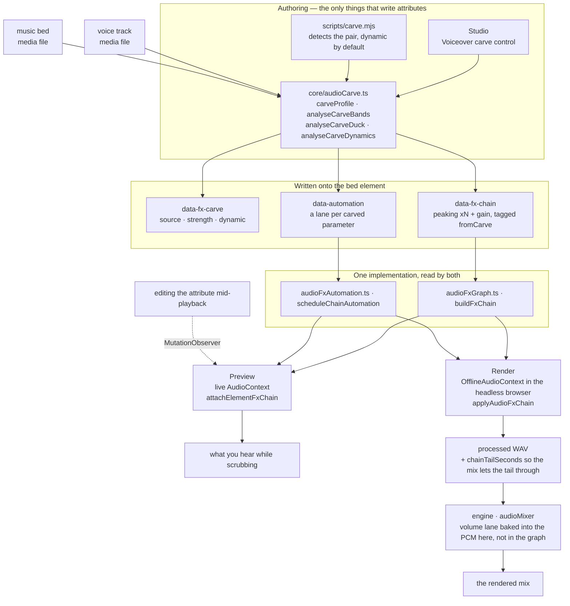
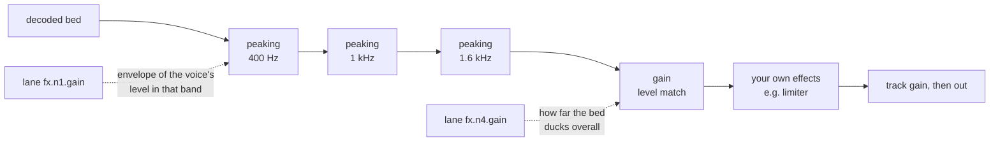

# HyperFrames 音频

混音是一组关系，而不是一叠处理器。两条音轨各自单独听起来都没问题，但放在一起可能无法入耳；解决办法几乎从来不是“调低其中一个”——而是找出它们在争夺什么，并把它交给真正需要它的那一个。这里的每个工具都用于表达其中一种关系。

效果通过元素上的 `data-fx-chain` 存在，预览和渲染运行的是同一套 Web Audio 图——前者是在实时上下文中的工作室，后者是在它已经驱动的浏览器内离线上下文中的引擎。每种效果都只有一个实现，因此拖动播放位置时听到的内容，就是最终写入的内容。你永远不需要调两次。

片段时序仍归 `/hyperframes-core` 管理：音频/视频裁剪和源范围使用 `data-start`、`data-duration` 与 `data-media-start`，交叉淡化会让不同轨道上的片段重叠。此 skill 负责已放置轨道的淡入/淡出、交叉淡化包络、轨道增益/轨道音量、音量和效果自动化、闪避/旁白挖空，以及效果链。`/media-use` 负责素材获取、生成和预处理。

当匹配的音频/视频元素使用相同的时序、源偏移和速率时，恒定的 `data-playback-rate`（`0.1..5`）可安全渲染画面和保留音高的声音。不支持源速度渐变，因为没有速率包络；请预处理出派生的同步素材。HyperFrames 不提供自动波形同步或漂移校正。
如需可复制的剪切/交叉淡化/变速方案，请使用 `/hyperframes-core` → `references/creator-editing-recipes.md`。

三个属性承载全部信息，且都位于音频/视频元素本身：

| 属性         | 包含内容                                                     |
| ----------------- | --------------------------------------------------------- |
| `data-fx-chain`   | 效果，按信号顺序排列                              |
| `data-automation` | 此轨道音量或其效果参数上的包络 |
| `data-fx-carve`   | 挖空自身的设置，以便可重新推导         |

随附的效果类别包括增益、EQ（高通、低通、峰值、搁架）、压缩器、限制器、门限、饱和、延迟、混响、合唱、移相器和位深压缩。

每种效果的精确 JSON，以及自动化轨必须满足的规则：`references/attributes.md`。
每种效果及其参数、范围和单位：`references/fx-registry.md`。
如何判断一个你无法听到的文件出了什么问题：
`references/diagnosis.md`。
**预设、命名任务和单旋钮配置，以及症状到修复方案的对照表：
`references/presets.md`** —— 在手动构建效果链之前先阅读它，因为其中的某个预设或命名任务通常已经为该问题命名。

## 它们如何协同工作

两个创作界面写入这些属性；两个运行时通过相同的构建器读取它们。这个共享的中间层正是预览能够预测渲染结果的原因。



carve 自身的设置在回放时绝不会被读取——实际播放的是它生成的链和轨道。`data-fx-carve` 的存在是为了让你能够修改现有 carve 的强度，而不必从滤波器中反推猜测出来。

在已 carve 的底音轨内部，信号会先经过下凹处理，然后进行电平匹配，接着才是你自己构建的任何处理——这就是为什么你添加的限制器仍然会作为最后一道上限：



静态 carve 使用相同的图，但使用固定值，且完全没有轨道。

## 首先，判断问题所在

下表从“听起来低频浑浊”开始——这假定已经有人听过并这样描述了。如果你拿到的是一个文件和一句“修好它”，则没有这样的描述，而且你无法聆听，因此必须进行测量。所有这些都遵循一条规则：

> **无法诊断单个未知人声的绝对频谱。**
> 共振峰会有 ±10 dB 的变化，基频范围为 85–255 Hz，并且句子在结束时会下降 5–6 dB。
> 单独看其中任何一项都像是缺陷，但它们全都是说话者自身的特征。

因此，要进行比较，并且要与**同一文件内部**的内容比较：如果有干净的原始音频，就与它比较；否则与停顿部分比较——间隙中能听到的任何声音都是叠加成分，而间隙的频谱代表的是通道，而非人声。与公开的平均频谱或合成的对照人声进行比较并不可行：两位说话者之间的差异比大多数缺陷更大，而本指南所依据的评估中，两个错误答案都恰恰源于这种做法。

当没有原始音频，也没有可用的静音部分时，静态音色缺陷确实是无法充分确定的。应当说明这一点，并提供符合观测结果的解读，而不是挑选一种解读并据此构建处理链。

命令、陷阱和完整示例：**`references/diagnosis.md`**。在诊断一份无人描述过的文件之前，请先阅读它。

## 从症状入手

一旦你知道了频段和类型，就要为音频问题命名。大多数糟糕的音频都包含以下一两种问题，并且每种都有内置解决方案：

| 听起来像                           | 可选用                                             |
| ---------------------------------- | -------------------------------------------------- |
| 底下有嗡声或闷响                   | `rumble-cut`，或在 80 Hz 使用 `highpass`           |
| 低频浑浊、胸腔感重                 | **抑制低频浑浊**任务（200 Hz）                     |
| 发闷，像隔着纸板                   | **减少浑浊**任务（250 Hz）                         |
| 词语难以听清                       | **增加清晰度**任务（3 kHz），或 carve 底音轨       |
| 刺耳且容易疲劳                     | **柔化刺耳感**任务（3.2 kHz）                      |
| 某些词比其他词响得多               | 在压缩器中使用**均匀度**，或进行电平拉平           |
| 句子之间存在房间底噪               | `room-gate`                                        |
| 人声与音乐互相冲突                 | **旁白 carve**——而非对任一方进行 EQ                |
| 干涩，像是在没有空间感的地方录制的 | `room-tight` 或 `room-natural`                     |
| 只是“很业余”                       | `voice-clean`，它会按顺序执行上述四项处理          |

完整目录、每个预设包含的内容、频段术语，以及刻意**不**涵盖的内容（去齿音、降噪、音色匹配）：
`references/presets.md`。

先减后加，先滤波后调电平，电平之后处理关系，最后再加特性和上限。每一步都会改变下一步所听到的内容——放在高通之前的压缩器会把时间花在追逐低频隆隆声上。

## 按问题而非名称选择类别

**滤波器**（`highpass`、`lowpass`、`peaking`、`lowshelf`、`highshelf`）决定轨道可以占据哪些频率。当两个声源发生冲突时，这是首选工具，因为冲突发生在频段中：音乐底和人声都想占用 1–3 kHz，从音乐底中削减这些频段的代价，远低于调低整体音量对混音造成的代价。对人声使用高通是处理低频隆隆声的标准方法；低通则会有意地让声音变暗或变闷。

**动态处理**（`gain`、`compressor`、`limiter`、`gate`）决定轨道的电平如何随时间变化。压缩会缩小响与轻之间的差距，从而让较轻的部分得以提高。限制器是一个上限——它不塑造任何内容，只保证没有内容能够越过它。噪声门会移除低于阈值的内容，这就是让短句之间的环境底噪静音的方法。`gain` 是一个普通的电平级，当轨道需要让出空间时，自动化通道所控制的就是它。

**非线性处理**（`saturate`、`bitcrush`）会改变波形的形状，从而加入原本不存在的谐波。当轨道需要的是特性或粗粝感而非校正时，就应使用它——并且记住，它是生成性的：它会让单薄的声源更饱满，而不是更干净。

**时间类效果**（`delay`、`reverb`、`chorus`、`phaser`）会将轨道置于一个空间中，或赋予它宽度。这些效果最容易毁掉混音，因为尾音或失谐的副本会占据人声所需的同一空间。将它们用在应当位于其他内容_后方_的对象上，并且让湿声量低于单独听起来恰到好处的程度。

链路是串行的：每个效果都会处理前一个效果产生的内容。因此，校正性滤波应放在前面，特性处理放在中间，限制器放在最后，这样它才能真正作为上限发挥作用。

## 旁白频段挖除

**它解决的问题。** 人声下方的音乐底会让人声难以听清。下意识的做法是压低整个音乐底，这确实有效，但代价是音乐底失去全部存在感——整段旁白期间，音乐都会变得无力。但人声并不需要整个频谱。它只需要自己实际占据的几个频段。挖除只会削减这些频段，而音乐底仍保留低频和高频，因此在人声依然清晰可懂的同时，它仍然是音乐。

**这是关系，而不是效果。** 设置位于_音乐底_上——即被处理的轨道——并且指定要监听的人声，这与侧链压缩器完全一致：选择会变小声的轨道，再选择使它变小声的内容。**绝不要在语音轨道上使用频段挖除。** 让人声针对自身进行挖除是一个错误，而不是一种微妙的混音选择。

**是每一条人声，而不只是其中一条。** `sources` 是一个列表，因为音乐底通常会贯穿整个片段——旁白、访谈回答、第二位主持人。它们会在测量任何内容之前，按照音乐底自身的时钟被混合在一起（`mixCarveSources`），因此一次分析就能覆盖所有人声：频段来自其中的全部语音，且只要任意语音正在发生，包络就会升起。从不与音乐底同时播放的人声会被排除；它们无法对其造成掩蔽。

**一个旋钮。** `strength` 取值为 0..1，并由此推导出一切：切削深度、频段数量、频段宽度、在可懂度与原始人声能量之间偏向多远、允许电平下降多少、目标设定在人声下方多远。这六项在任何实际混音中都会一同变化——轻度切削是在少数频段进行浅切削，辅以少量闪避；重度切削则是在更多频段进行更深切削，闪避也更多——因此它们是一种只在 `carveProfile` 中写一次的关系。默认值为 `0.25`——三个频段各下凹 6 dB，并留出 6 dB 的电平空间，听得出来但不会像挖了个洞。达到 `0.5` 时，下凹会达到 10 dB，此时切削开始被听成一种效果，而不只是为人声腾出的空间；高于此值则是有意用于安静人声下方铺设响亮底乐的范围。`0` 仅进行频谱处理——一个频段，完全不做电平匹配。

**默认进行切削。** 旁白下方播放的底乐需要切削；它并不是有时间时才去做的润色步骤。放置两条轨道，运行下面的命令，然后试听。只有在没有需要让音乐衬托的旁白时才跳过——例如音乐视频、标题卡，或跟随音乐剪辑的蒙太奇。

**它始终跟随人声。** 没有静态模式：固定深度会在每一次停顿期间削薄底乐，而一旦听过两者的效果，就没有理由再想要它。每个值都会变成人声自身电平的包络——静音时不影响底乐，响亮段落会将切削推至完整深度——并写入为普通的自动化，这就是为什么轨道中会显示自动化通道，而且之后可以进行编辑。

**电平匹配是其中的一部分。** 频谱切削无法修复仅仅只是比人声更响的底乐。因此，切削还会测量底乐高于人声多少，并写入一个 `gain` 阶段：静态切削时保持在一个值，动态切削时由包络驱动。该包络会有意缓慢释放——一个词刚结束音乐就立刻弹回全音量，听起来像机器在操作。

**运行方式。** 在 Studio 中，切削是轨道效果器架顶部的一个模块——人声、强度、动态设置，以及它生成的分析结果，都在一张卡片中。只要另一条轨道可能是人声，它就会出现；而上方恰好有**一个**候选轨道的底乐，默认会以默认强度进行动态切削：这正是旁白下方底乐所需要的，而该模块正是你修改设置或关闭它的地方。多个候选轨道时，选择器会等待而不是猜测。无头模式 —
也就是当你在编写合成而不是编辑合成时所走的路径：

```bash
node <SKILL_DIR>/scripts/carve.mjs --comp index.html
```

这就是完整命令。它会自行找到人声和底乐，以默认强度进行动态切削，并输出它的判定结果：

```
bed    music-bed (name looks like music)
voice  narration (only track left)
carve  strength 0.25 dynamic
bands  400Hz -6dB q1.4, 1000Hz -3dB q1.4, 1600Hz -3.17dB q1.4
level  216-point envelope, floor -6 dB
```

自动选择错误时，使用 `--bed` / `--voice`（可重复）指定轨道，使用 `--strength` 增强效果，使用 `--dry-run` 查看该报告且不写入任何内容。

**它如何选择轨道。** 首先看名称，因为这是你已经告诉它的信息，
并且结果可解释 — 核心中的 `classifyAudioName`，也就是 Studio 自己的选择器所用的同一分类器，
所以两者不可能产生分歧。id 或文件名
看起来像音乐（`music`、`bgm`、`bed`、`score`…）的轨道
就是底音；其上播放且不具有 SFX 特征的其他所有内容
都是人声。优先选择音频元素：只有在没有剩余音频轨道可作为人声时，视频才会被计入，
或者当合成中的每个 B-roll 片段都会像是有人在说话时才会如此。**当它无法判断哪条
轨道是底音时，它会拒绝处理**，而不是错误地把它切掉 — 输入一个 id 很容易。

与面板使用相同的分析函数，因此结果完全一致。需要在 PATH 中存在 `ffmpeg`
，并且项目中已安装 `@hyperframes/core`（`npm i -D
@hyperframes/core`）— CLI 会内联 core 而不是随附它，因此不能从那里
借用。

**它写入的内容** 是一条普通的峰值滤波器链加上一个增益级，
并标记为 `fromCarve`。这个标记就是全部关键：再次运行会替换之前的
carve，并保留你手工构建的每个效果 — 以及你手工绘制的每条自动化轨道 —
完全不动。因此，以新的强度重新 carve 是安全且可重复的，而且 `data-fx-carve`
的存在使设置可以被读回，而不是从滤波器中猜测。

## 自动化

一条轨道是一组针对一个参数的断点：`{t, v}`，以片段本地秒数表示，
并使用该参数自身的单位。目标可以是轨道音量的 `volume`，或者效果旋钮的
`fx.<nodeId>.<param>`。

**只有部分参数可以自动化，而其他参数上的轨道会静默失效。** 当一个 Web Audio `AudioParam` 支持某个旋钮时，
它才可以自动化。四个基于 worklet 的效果 — `compressor`、`limiter`、`gate`、`bitcrush` — 完全不暴露
任何可自动化参数，因此它们任何参数上的轨道都不会移动：要让
压缩器的行为随时间变化，应改为自动化其前面的一个 `gain` 级。
`references/fx-registry.md` 标记了每个参数。

## 验证

几乎没有静态检查覆盖混音。linter 会读取 `data-automation`，仅检查
一个冲突 — `audio_volume_double_automation`，即某条轨道上既有音量轨道
又有针对 `volume` 的 GSAP tween，此时轨道优先，tween 会被
忽略 — 以及 `audio_volume_tween_overrides_gain`，即某条轨道的 `volume`
被 tween 时存在人为设定的 `data-volume`，此时 tween 的值是绝对值，
会替换该增益而非对其缩放。完全不会验证
链或效果轨道。真正
强制执行这些的是渲染：无法解析的链会导致整个混音失败，
而不是悄悄写入干信号，因为听起来合理但实际错误的混音
比拒绝处理更糟。预览则有意采用相反的设计：不可读的链会播放干信号，
以便合成仍可继续工作。

指向链中不存在节点的轨道会在读取时被剔除，而不是报错 —
因此拼错 `nodeId` 会让你悄无声息地失去包络。应从链中读回 id，
而不是假定生成了什么。

带有尾音的效果（`reverb`、`delay`）会使渲染后的音轨比其源音轨**更长**，而效果链会告知混音应延长多少。因此，带有混响的底音不再恰好在其 `data-duration` 处结束；这是预期行为，不是 bug。

除此之外，混音需要通过渲染和试听来验证。对于 carve：人声应清晰可辨，同时底音不应听起来被掏空；使用 `dynamic` 时，底音应在乐句之间恢复音量，而不是始终保持平坦。如果底音听起来像是被切出了凹槽，而不只是在人声下方变得更安静，说明强度过高——这是唯一一种具有明显听感的失败模式。