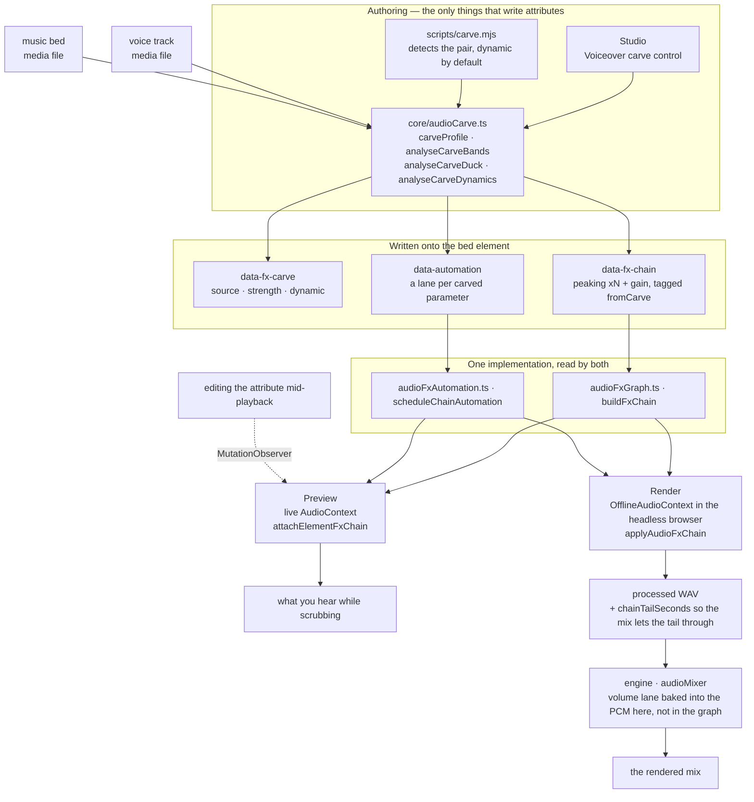
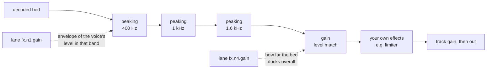

# HyperFrames 音频

混音是一组关系，而不是处理器的堆叠。两条单独听起来都不错的轨道，放在一起可能会难以入耳，而修复方法几乎从来不是“把其中一条调小”——而是找出它们在争夺什么，并把它交给真正需要它的那一条。这里的每个工具，都是为了表达其中一种关系。

效果器以 `data-fx-chain` 的形式存在于元素上，预览和渲染运行相同的 Web Audio 图——工作室使用实时上下文，浏览器中的引擎则使用离线上下文。每种效果器只有一个实现，因此你在拖动播放进度时听到的内容，就是最终写入的内容。你不需要调两遍。

片段时序仍由 `/hyperframes-core` 负责：音频/视频的裁剪和源范围使用 `data-start`、`data-duration` 和 `data-media-start`，交叉淡化会让不同轨道上的片段彼此重叠。本技能负责已放置轨道的淡入/淡出、交叉淡化包络、轨道增益/轨道音量、音量和效果器自动化、闪避/旁白避让，以及效果器链。`/media-use` 负责素材的获取、生成和预处理。

当匹配的音频/视频元素使用相同的时序、源偏移和速率时，恒定的 `data-playback-rate`（`0.1..5`）对画面和保持音高的声音都是安全的。由于没有速率包络，不支持源速度渐变；请预处理出一个派生的同步素材。HyperFrames 不提供自动波形同步或漂移校正。
如需可复制的剪辑/交叉淡化/变速配方，请使用 `/hyperframes-core` → `references/creator-editing-recipes.md`。

三个属性承载全部信息，这些属性位于音频/视频元素本身上；或者对于前两个属性，位于 `<hf-audio-group>` 总线（参见“多条轨道使用一条总线”）上：

| 属性              | 保存内容                                      |
| ----------------- | --------------------------------------------- |
| `data-fx-chain`   | 按信号顺序排列的效果器                        |
| `data-automation` | 此轨道音量或其效果器参数的包络                |
| `data-fx-carve`   | carve 自身的设置，以便重新派生                |

已提供的效果器系列包括增益、EQ（高通、低通、峰值、搁架）、压缩器、限制器、门限、饱和、延迟、混响、合唱、移相和位深削减。

每种效果器的确切 JSON，以及轨道必须满足的规则：`references/attributes.md`。
每种效果器及其参数、范围和单位：`references/fx-registry.md`。
如何判断一个无法听到的文件出了什么问题：
`references/diagnosis.md`。
**预设、命名任务和单旋钮配置文件，以及症状到修复方法的对照表：
`references/presets.md`** —— 在手动构建效果器链之前先阅读它，因为其中通常已经有某个预设或命名任务直接描述了问题。

## 它如何协同工作

两种创作界面会写入这些属性；两个运行时通过相同的构建器读取它们。正是这个共享的中间层，让预览能够预测渲染结果。



Carve 自身的设置在播放时永远不会被读取，实际播放的是它生成的链和通道。`data-fx-carve` 的存在，是为了让现有 carve 的强度可以被调整，而不必从滤波器中反向猜测。

在一个 carved bed 内，信号会先经过衰减处理，然后进行电平匹配，最后经过你自行构建的任何处理——这就是为什么你添加的 limiter 仍然会作为最后一道上限：



静态 carve 使用的是同一图形，只不过值是固定的，并且完全没有通道。

## 首先，找出问题所在

下表从“听起来很闷”开始——这意味着已经有人听过，并指出了这一点。面对一个文件和“修复它”的要求时，你没有这样的描述，也无法进行试听，因此必须通过测量来判断。整个过程遵循一条规则：

> **无法通过单个未知人声的绝对频谱进行诊断。**
> 共振峰可能相差 ±10 dB，基频范围为 85–255 Hz，而句子在结尾时会衰减 5–6 dB。这些现象单独看都像缺陷，但实际上每一个都可能只是说话人的特征。

因此要进行比较，而且要与**同一文件内的内容**比较：如果存在干净的原始信号，就使用它；否则使用停顿——间隙中能听到的任何内容都是叠加信号，而间隙的频谱反映的是通道，而不是人声。与公开发布的平均频谱或合成的参考人声进行比较是无效的：不同说话人的差异大于大多数缺陷，而这份指导背后的评估中两个错误答案，恰恰都来自这种做法。

如果既没有原始信号，也没有可用的静音片段，那么静态音调缺陷确实无法唯一确定。应明确说明这一点，并给出能够解释这些现象的各种判断，而不是武断地选择一种，然后据此构建处理链。

命令、陷阱和完整示例：**`references/diagnosis.md`**。在诊断一个没有任何问题描述的文件之前，请先阅读它。

## 从症状入手

确定频段和问题类型后，要明确说明音频出了什么问题。大多数糟糕的音频属于以下一种或两种问题，并且每种都有对应的现成方案：

| 听起来像                         | 采用的方案                                         |
| -------------------------------- | -------------------------------------------------- |
| 底部有嗡嗡声或砰砰声             | `rumble-cut`，或在 80 Hz 使用 `highpass`           |
| 浑浊、胸腔共鸣过重               | **Tame Boominess** 作业（200 Hz）                  |
| 声音发闷，像隔着纸板             | **Reduce Mud** 作业（250 Hz）                      |
| 说话内容难以听清                 | **Add Clarity** 作业（3 kHz），或 carve bed       |
| 刺耳、听起来疲劳                 | **Soften Harshness** 作业（3.2 kHz）              |
| 某些词明显比其他词响              | 压缩器上的 **Evenness**，或 Even Out Levels        |
| 句子之间有房间底噪               | `room-gate`                                        |
| 人声和音乐互相争抢               | **Voiceover carve**，而不是对任一方使用 EQ        |
| 声音干涩，听不出录音环境           | `room-tight` 或 `room-natural`                    |
| 只是听起来“业余”                 | `voice-clean`，按顺序组合上述四种处理              |

完整目录、每个预设包含的内容、频段术语，以及明确**不涵盖**的内容（去齿音、噪声消除、音色匹配）：
`references/presets.md`。

先减后加，先滤波后调电平，先调电平后处理关系，最后处理音色和上限。每一步都会改变下一步所听到的内容——如果压缩器放在高通滤波器之前，它就会一直追逐隆隆声。

## 根据问题选择系列，而不是根据名称选择

**滤波器**（`highpass`、`lowpass`、`peaking`、`lowshelf`、`highshelf`）决定一条轨道可以占据哪些频率。这是处理两个声源发生冲突时的首选工具，因为冲突发生在频段中：背景音乐和人声都想要 1–3 kHz，而从背景音乐中削掉这些频段，对背景音乐造成的损失远小于把整个背景音乐调低对混音造成的损失。对人声使用高通滤波器是处理隆隆声的标准方法；低通滤波器则可以有意地让声音变暗或变闷。

**动态处理**（`gain`、`compressor`、`limiter`、`gate`）决定一条轨道的电平如何随时间变化。压缩会缩小响亮部分和安静部分之间的距离，让安静部分可以被提升。限制器是一个上限——它不会塑造任何东西，只保证没有信号超过这个上限。门限器会移除低于阈值的内容，这也是让短语之间的房间底噪静音的方法。`gain` 是一个普通的电平阶段，当一条轨道需要让出空间时，自动化轨道控制的就是它。

**非线性处理**（`saturate`、`bitcrush`）会改变波形形状，从而增加原本不存在的谐波。当一条轨道需要的是个性或颗粒感，而不是修正时，可以使用它——但要记住它具有生成性：它会让单薄的声源更厚实，而不是让它更干净。

**时间类效果**（`delay`、`reverb`、`chorus`、`phaser`）会把一条轨道放进某个空间，或赋予它宽度。这些效果最容易毁掉混音，因为延迟尾音或失谐副本会占据人声所需的同一空间。把它们用在应该位于其他声音_后面_的对象上，并让湿声量低于单独试听时觉得合适的程度。

效果链是串行的：每个效果都会处理前一个效果产生的内容。因此，修正性滤波应放在前面，音色处理放在中间，限制器放在最后，这样它才能真正充当上限。

## 人声旁路

**它解决的问题。** 人声下方铺着音乐时，人声会变得难以听清。常见的直接反应是把整条背景音乐压低，这确实有效，但也会牺牲背景音乐的全部存在感——在人声旁白的整个过程中，音乐都会变得无力。但人声并不需要整个频谱。它只需要自己实际占据的那几个频段。旁路只处理这些频段，背景音乐就能保留低频和高频，因此它仍然是音乐，而人声也仍然清晰可懂。

**它是一种关系，而不是一个效果。** 设置位于_背景音乐_上，也就是接受处理的轨道上，并指定要监听的人声，这与侧链压缩器完全相同：选择会变安静的轨道，再选择让它变安静的内容。**绝不要在人声轨道上添加旁路。** 让人声与自身进行旁路处理是一个错误，而不是微妙的混音选择。

**处理每个人声，而不是其中一个。** `sources` 是一个列表，因为背景音乐通常会贯穿完整的片段序列——旁白、采访回答、第二位主持人。它们会先按照背景音乐自身的时钟相加，再进行任何测量（`mixCarveSources`），因此一次分析就能覆盖全部人声：频段来自所有语音内容，包络则会在任何人声出现时上升。背景音乐播放期间从未出现的人声会被排除；它们不可能对背景音乐造成遮蔽。

**针对多个剪辑 id 进行 carve 是错误的。应将剪辑分组，然后针对该组进行 carve。** 这是一个不变量，而不是建议。逐个列出剪辑名称不仅必须始终完整正确，而且只要下一次编辑发生就会失效——稍后添加的第四个旁白剪辑会在 carve 的感知范围之外播放，底床就会在不知不觉中无法在它下方进行闪避。改为命名分组后，成员关系会在分析时解析，因此之后添加到该组的剪辑也会被覆盖，无需修改 `sources`：

```html
<!-- group the narration, then carve the bed against the group -->
<audio id="vo-intro" data-audio-group="voiceover" …></audio>
<audio id="vo-middle" data-audio-group="voiceover" …></audio>
<audio id="vo-outro" data-audio-group="voiceover" …></audio>

<audio id="music" data-fx-carve='{"enabled":true,"sources":["voiceover"],"strength":0.8}' …></audio>
```

`sources` 列表中如果列出两个或更多普通剪辑 id，而不是一个分组，就会被 `audio_carve_ungrouped_sources` lint 规则捕获——它仍然可以工作，但当添加剪辑时会悄悄失效。

**让 carve 分组保持为语音分组：不要放底床、SFX 或音乐。** `sources` 中的分组 id 会在每次分析时解析为其中的所有_当前_成员，因此你命名的分组就是之后实际获取的分组，而不是写入时测量过的轨道。以下两种情况都会造成问题：

- **底床位于自己的源分组中。** 它会把自己当作语音，并针对自身内容进行 carve——“永远不要让轨道针对自身进行 carve”的规则会在下一次重新分析时出现。
- **语音分组中包含 SFX 或音乐剪辑。** 它会在下一次分析时进入侧链，导致底床开始在 whoosh 音效下方进行闪避，即使写入该属性的那次运行从未测量过它。

这些问题在写入 carve 时都不可见：分析会汇总它检测到的语音，却不会通过分组解析进行往返处理，因此第一次处理确实是正确的，只有下一次处理才会出错。因此，应为每种角色使用独立的分组——底床使用 `music`，旁白使用 `voiceover`，音效使用 `sfx`——并确保 `sources` 中指定的分组只包含语音。

`carve.mjs` 遇到上述任一情况时，会拒绝写入分组形式，记录剪辑 id，并在 stderr 中说明哪个成员阻止了写入。随后，`audio_carve_ungrouped_sources` 规则会指向该编排问题，而不是让 CLI 静默持久化一个范围比其测量结果更大的 carve。

本次运行未纳入的语音**不属于上述情况**，也不会阻止使用分组形式：`carve.mjs` 只会分析与底床重叠的语音，而无需修改 `sources` 就能识别稍后播放的剪辑，正是使用分组名称的全部意义。

### 一条总线承载多个轨道

仅凭成员关系就足以像上面那样针对分组进行 carve，但如果添加一个 id 与分组相同的 `<hf-audio-group>` 元素，该分组就会成为真正的子混音总线：所有成员共用一条链路、一个推子和一个自动化时钟。

```html
<hf-audio-group
  id="voiceover"
  data-label="Voiceover"
  data-volume="0.9"
  data-fx-chain='{"version":1,"nodes":[
    {"type":"compressor","id":"g1","params":{"threshold":-18,"ratio":3}},
    {"type":"peaking","id":"g2","params":{"frequency":3000,"gain":2,"q":1}}]}'
></hf-audio-group>

<audio id="vo-intro" data-audio-group="voiceover" …></audio>
<audio id="vo-middle" data-audio-group="voiceover" …></audio>
```

**当同样的处理属于多个音轨时，应使用总线。** 四个旁白片段如果都需要同一个压缩器，就意味着要维护四条保持同步的链路；而一旦编辑，它们就会逐渐偏离。在总线上只需一条链路，压缩器看到的是完整的人声，而不是每个片段各自孤立的信号——这正是关键，因为压缩器不可能对它只听到三分之一的连续内容进行整体控制。对于真正属于单个片段的处理，仍应保留片段级链路：例如某一段有噪声的录音需要单独使用去齿音器。

| 在总线上         | 作用                                      |
| ----------------- | ----------------------------------------- |
| `data-fx-chain`   | 对汇总后的成员信号应用一条链路             |
| `data-automation` | 总线上的包络，使用 COMPOSITION 时间       |
| `data-volume`     | 每个成员共用一个推子（默认值为 1）        |
| `data-label`      | 显示名称；未设置时回退为 id               |
| `data-hidden`     | 将所有成员从混音中移除                    |

**组自动化使用 composition time，而不是 clip time。** 总线没有 `data-start`——成员到达总线时，已经处于各自在 composition 中的位置——因此，组轨道中的 `t: 0` 表示 composition 的开始，而不是某个片段的开始。片段上的轨道使用 clip-local 时间；同一组数字在两者上代表不同的时刻。将包络从片段提升到其总线时，唯一必须正确处理的就是这一点。

**切除处理应保留在片段上。** `data-fx-carve` 不是组属性。被切除的 bed 是单个音轨，应该由该音轨携带 `data-fx-carve`——按照上述规则，指向一个组。组和 carve 的交汇点在 `sources` 中，而不在同一个元素上。将 carve 写到总线上，相当于让一个效果被部分应用两次：电平部分会测量 bed 自身的音频，但总线没有 bed 自身的音频，因此只剩下滤波器会生效；而且总线及其成员属于同一条信号路径，所以 bed 随后会同时经过总线的滤波器和自身的滤波器。`audio_group_carve_attr` lint 规则会捕获这种情况。

**一个片段不是总线。** 创建组的目的，是让多个音轨共用一条链路、一个推子和一个时钟。将单个片段包在总线中，并不会带来片段自身的 `data-fx-chain` 无法提供的好处，反而会让后续编辑必须修改的位置增加一倍。唯一可以这样做的理由是：总线的自动化时钟使用 composition time，因此单成员总线可以让该片段上的轨道获得 composition-time timing。

**一个旋钮。** `strength` 的范围是 0..1，并由它推导出所有其他参数：切除深度、频段数量、频带宽度、优先清晰度而非原始人声能量的程度、电平允许下降的幅度，以及目标压低到人声下方的程度。在真实混音中，这六项会一起变化——轻微的 carve 是在较少频段中进行浅切除并配合少量压低，强烈的 carve 则是在更多频段中进行更深的切除并配合更多压低——因此它们是一个关系，应在 `carveProfile` 中只定义一次。`carve.mjs` 的默认值为 `0.8`——从 250 Hz 到 2.5 kHz 的六个频段每个约切除 7 dB，在 1.6 kHz 处切除 15 dB，并预留 19 dB 的电平空间——因为旁白下方的 bed 首先必须让开位置，其次才是音乐；实践中，`0.25`（三个频段衰减 6 dB，预留 6 dB 的空间）虽然能让 bed 保持存在感，却仍会与人声争夺空间，因此被判断为过弱。在 `0.5` 时，衰减达到 10 dB，此时 carve 开始被听成一种效果，而不只是为人声留出空间。当 bed 才是重点、人声较为稀疏时，应降低 strength。`0` 仅进行频谱处理——使用一个频段，完全不进行电平匹配。

**默认进行频段挖空（carve）——音乐在语音下方播放时必须执行。** 任何语音轨道（旁白、头像说话、采访、配音）下方的音乐床，都应将频段挖空作为混音收尾的一部分，而不是有时间再做的润色步骤。放置两条轨道，运行下面的命令（默认强度为 `0.8`；检测错误时添加 `--bed` / `--voice`），使用 `npx hyperframes check` 确认已写入 `data-fx-carve`、`data-fx-chain` 和 `data-automation`，然后才能渲染。仅进行音量闪避并不算完成混音：这会让语音和音乐床在 1–3 kHz 频段持续争夺空间，并使音乐床在整个配音期间都失去存在感。只有在音乐不需要承托任何语音时，才跳过频段挖空——例如音乐视频、标题卡、随着音乐剪辑的蒙太奇。

**它始终跟随语音变化。** 不存在静态模式：固定深度会让音乐床在每次停顿期间都变薄，而一旦你听过动态模式和静态模式，就没有理由再选择静态模式。每个数值都会变成由语音自身电平驱动的包络——静音时音乐床保持不变，响亮的语句会将挖空推至最大深度——并以普通自动化的形式写入，因此这些通道会显示在时间线上，之后也可以编辑。

**电平匹配也是其中的一部分。** 频谱挖空无法修复音乐床仅仅比语音更响的问题。因此，挖空还会测量音乐床相对语音超出的幅度，并写入一个 `gain` 阶段：静态挖空时保持为一个值，动态挖空时由包络驱动。这个包络会有意缓慢释放——一个词结束的瞬间音乐就立刻恢复到满电平，听起来像机器在操作。

**运行方式。** 在 Studio 中，挖空是轨道效果机架顶部的一个模块——语音、强度、动态设置以及生成的分析结果都集中在同一张卡片中。只要另一条轨道可能充当语音，它就会存在；当音乐床上方恰好只有**一个**候选轨道时，系统默认会以默认强度对其进行动态挖空：这正是旁白下方音乐床所需要的效果，而模块就是修改或关闭该效果的位置。无头模式——当你是在编写合成内容而不是编辑内容时使用的路径：

```bash
node <SKILL_DIR>/scripts/carve.mjs --comp index.html
```

这就是完整命令。它会自行找到语音和音乐床，以默认强度进行动态挖空，并打印出它的判断结果：

```
bed    music-bed (name looks like music)
voice  narration (only track left)
carve  strength 0.8 dynamic
bands  250Hz -7.4dB q2.06, 400Hz -7.4dB q2.06, 630Hz -7.4dB q2.06, 1000Hz -7.4dB q2.06, 1600Hz -14.8dB q2.06, 2500Hz -7.4dB q2.06
level  273-point envelope, floor -19.2 dB
```

当自动选择错误时，使用 `--bed` / `--voice` 指定轨道名称（可重复），使用 `--strength` 提高强度，使用 `--dry-run` 查看报告但不写入任何内容。

**它如何选择轨道。** 优先依据名称，因为这是你已经提供的信息，而且结果可解释——核心中的 `classifyAudioName` 与 Studio 自己的选择器使用相同的分类器，因此两者不会产生分歧。id 或文件名看起来像音乐（`music`、`bgm`、`bed`、`score` 等）的轨道会被视为音乐床；其他在其上播放且不属于 SFX 特征的轨道都会被视为语音。系统优先选择音频元素：只有在没有剩余音频轨道可作为语音时，或者合成内容中的每个 B-roll 片段都会被判断为有人说话时，才会将视频计入。**当无法判断哪条轨道是音乐床时，它会拒绝执行，而不是对错误的轨道进行挖空**——输入一个 id 的代价很低。

与面板使用相同的分析函数，因此结果完全一致。需要确保 `ffmpeg`
位于 PATH 中，并且项目中已安装 `@hyperframes/core`（`npm i -D
@hyperframes/core`）——CLI 会将 core 内联，而不是随 CLI 一起提供，因此无法从
那里借用。

**它写入的内容**是一个普通的削峰滤波器链加增益阶段，并标记为
`fromCarve`。这个标记就是关键所在：重新运行时会替换之前的 carve，同时保留你手动构建的每个效果，以及你手动绘制的每条音轨，位置完全不变。因此，在新的强度下重新 carve 是安全且可重复的；而 `data-fx-carve` 的存在意味着可以读回设置，而不必从滤波器中猜测。

## 自动化

一条 lane 是某个参数上的一组断点：`{t, v}`，其中时间使用片段本地秒数，值使用参数自身的单位。目标可以是表示音轨音量的 `volume`，也可以是表示效果旋钮的 `fx.<nodeId>.<param>`。

**只有部分参数可以自动化，而针对其他参数的 lane 会静默失效。** 当某个旋钮由 Web Audio `AudioParam` 提供支持时，它才可自动化。基于 worklet 的四种效果——`compressor`、`limiter`、`gate`、`bitcrush`——完全不提供任何此类参数，因此针对它们任意参数的 lane 都不会产生变化：若要让 compressor 的行为随时间改变，请改为自动化其前方的 `gain` 阶段。`references/fx-registry.md` 标明了每个参数。

## 验证

几乎没有静态检查会覆盖混音。linter 会读取 `data-automation`，仅检查一种冲突——`audio_volume_double_automation`：音轨上存在音量 lane，同时 `volume` 上还有 GSAP tween，此时 lane 优先，tween 会被忽略；以及 `audio_volume_tween_overrides_gain`：音轨上有作者设置的 `data-volume`，同时 `volume` 被 tween，此时 tween 的值是绝对值，会替换该增益，而不是对其进行缩放。它完全不会验证链或效果 lane。真正执行这些验证的是渲染：无法解析的链会导致整个混音失败，而不是悄悄写入干信号，因为听起来合理但实际错误的混音，比直接拒绝更糟糕。预览则有意采取相反的设计：无法读取的链会以干声播放，以便组合过程仍然可用。

指向链中不存在节点的 lane 会在读取时被清理，而不是报错——因此拼错的
`nodeId` 会让你无声无息地失去该包络。请从链中读回 id，而不要假定生成了什么 id。

带有尾音的效果（`reverb`、`delay`）会使渲染后的音轨**长于**其源文件，而混音会通过链获知延长了多少。因此，带有 reverb 的 bed 不再恰好在其 `data-duration` 处结束；这是预期行为，不是 bug。

除此之外，混音需要通过渲染和试听来验证。对于 carve：人声应当清晰可辨，同时 bed 不应听起来像被挖空；使用 `dynamic` 时，bed 应在语句之间恢复音量，而不是始终保持平坦。如果在人声下方的 bed 听起来像被切出了一道道凹槽，而不只是变得更安静，说明强度过高——这是唯一一种声音表现明显的失败模式。