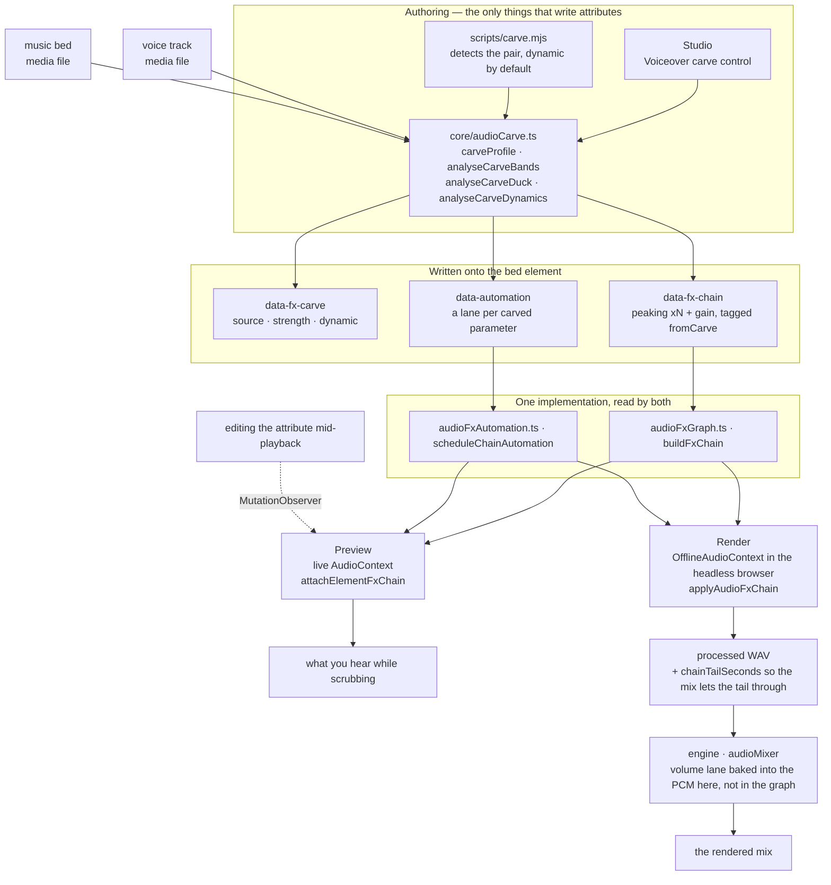
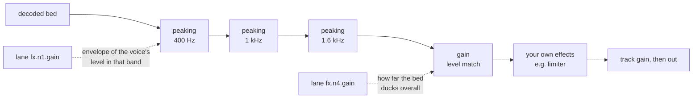

# HyperFrames 音频

混音是一组关系，而不是一堆处理器的叠加。两条单独听起来都没问题的轨道，
放在一起却可能令人难以忍受，而解决办法几乎从来都不是“把其中一条调小声”
——而是找出它们在争夺什么，并将其留给更需要它的那一条。
这里的每一种工具，都是为了表达其中一种关系而存在的。

效果以 `data-fx-chain` 的形式存在于元素上，预览和渲染运行的是同一个
Web Audio 图——实时上下文中的工作室，以及它已经驱动的浏览器内部离线上下文中的引擎。
每种效果都只有一个实现，因此你在拖动浏览时听到的内容，就是最终写入的内容。
你永远不需要调校两次。

剪辑时序仍由 `/hyperframes-core` 负责：音频/视频裁剪和源范围使用
`data-start`、`data-duration` 和 `data-media-start`，交叉淡化则让不同轨道上的
剪辑相互重叠。此技能负责已放置轨道的淡入/淡出、交叉淡化包络、轨道增益/轨道音量、
音量和效果自动化、闪避/旁白腾挪，以及效果链。`/media-use` 负责素材获取、
生成和预处理。

当匹配的音频/视频元素使用相同的时序、源偏移和速率时，恒定的
`data-playback-rate`（`0.1..5`）可安全渲染画面和保持音高的声音。
由于不存在速率包络，因此不支持源速度渐变；请预处理一个派生的同步素材。
HyperFrames 不提供自动波形同步或漂移校正。
有关可复制的剪切/交叉淡化/重定时方案，请使用 `/hyperframes-core` → `references/creator-editing-recipes.md`。

三个属性承载全部内容，它们位于音频/视频元素本身之上——或者，对于前两个属性，
位于 `<hf-audio-group>` 总线上（参见“一个总线用于多条轨道”）：

| 属性              | 承载内容                                                  |
| ----------------- | --------------------------------------------------------- |
| `data-fx-chain`   | 按信号顺序排列的效果                                      |
| `data-automation` | 此轨道音量或其效果参数上的包络                            |
| `data-fx-carve`   | 腾挪自身的设置，以便能够重新推导                          |

随附的效果类别包括增益、EQ（高通、低通、峰值、搁架）、压缩器、限制器、
噪声门、饱和、延迟、混响、合唱、移相器和位元压碎。

每种效果的准确 JSON，以及自动化通道必须满足的规则：`references/attributes.md`。
所有效果及其参数、范围和单位：`references/fx-registry.md`。
如何判断一个你无法听到的文件出了什么问题：
`references/diagnosis.md`。
**预设、命名任务和单旋钮配置，以及症状到修复方法的对照表：
`references/presets.md`**——请在手动构建效果链之前阅读该文档，因为通常已有某个
预设或命名任务准确描述了这个问题。

## 各部分如何协同工作

两个创作界面写入这些属性；两个运行时通过相同的构建器读取它们。
正是这个共享的中间层，让预览能够准确预测渲染结果。



雕刻本身的设置在播放时永远不会被读取——实际播放的是它所生成的链和自动化通道。`data-fx-carve` 的存在，是为了让你能够修改现有雕刻的强度，而不必尝试从滤波器中反向推算。

在经过雕刻的底层音轨中，信号会先经过各个衰减滤波器，然后进行电平匹配，最后再经过你自行构建的任何效果——因此，你添加的限制器仍然会充当最后一道上限：



静态雕刻使用相同的信号图，只不过参数值固定，而且完全没有自动化通道。

## 首先，弄清楚问题出在哪里

下表从“听起来低频浑浊”这一描述出发——这意味着已经有人听过并作出了判断。如果你拿到的只有一个文件和一句“修一下”，就没有这样的描述可供参考；而且你无法聆听，因此必须进行测量。所有情况都遵循一条原则：

> **无法根据单个未知人声的绝对频谱作出诊断。**
> 共振峰的变化范围可达 ±10 dB，基频范围为 85–255 Hz，而句子在结尾时会衰减 5–6 dB。
> 单独来看，其中任何一种现象都像是缺陷，但它们实际上都属于说话者本人的声音特征。

因此要进行比较，而且要与**同一文件内部**的内容比较：如果有干净的原始音频，就与其比较；否则就与停顿部分比较——间隙中能够听到的任何声音都是叠加上去的，而间隙的频谱反映的是通道特征，而非人声特征。与公开发布的平均频谱或合成的对照人声比较并不可行：两位说话者之间的差异会大于大多数缺陷，而本指南所依据的评估中，两个错误答案恰恰都源于这种做法。

如果既没有原始音频，也没有可用的静音片段，那么静态音色缺陷实际上是无法唯一确定的。应当明确说明这一点，并提供符合测量结果的各种可能解释，而不是任选一种并据此构建效果链。

命令、陷阱和完整示例：**`references/diagnosis.md`**。在诊断一个无人描述过的文件之前，请先阅读该文档。

## 从症状入手

确定频段和问题类型后，明确指出音频出了什么问题。大多数糟糕的音频都存在以下一两个问题，并且每个问题都有随附的解决方案：

| 听起来像                         | 可采用的方案                                         |
| -------------------------------- | -------------------------------------------------- |
| 底部有嗡声或低沉撞击声           | `rumble-cut`，或设置为 80 Hz 的 `highpass`          |
| 低频浑浊、胸腔感过重             | **抑制低频浑浊**任务（200 Hz）                       |
| 发闷，像隔着纸板                 | **减少泥泞感**任务（250 Hz）                         |
| 难以听清说了什么                 | **增加清晰度**任务（3 kHz），或雕刻底层音轨          |
| 刺耳且容易令人疲劳               | **柔化刺耳感**任务（3.2 kHz）                        |
| 有些词比其他词响得多             | 在压缩器上使用**均匀度**，或执行均衡电平             |
| 句子之间存在房间底噪             | `room-gate`                                        |
| 人声与音乐相互争抢               | **旁白雕刻**——而不是在其中任一音轨上使用 EQ          |
| 声音干涩，仿佛没有录音空间       | `room-tight` 或 `room-natural`                      |
| 只是听起来“不专业”               | `voice-clean`，它会依次执行上述四项处理              |

完整目录、每个预设包含的内容、频段术语，以及特意**未**涵盖的内容（齿音消除、噪声去除、音色匹配），请参阅：
`references/presets.md`。

先减后加，滤波后再调电平，调好电平后再处理相互关系，最后添加音色特征并设置上限。每一步都会改变下一步所听到的内容——放在高通滤波器之前的压缩器，会一直忙于追逐低频隆隆声。

## 根据问题选择类别，而不是根据名称

**滤波器**（`highpass`、`lowpass`、`peaking`、`lowshelf`、`highshelf`）决定允许一条轨道占据哪些频率。当两个声源发生冲突时，这是首选工具，因为冲突发生在具体频段中：铺底音乐和人声都需要 1–3 kHz，而从铺底音乐中削减这个频段，对铺底音乐造成的损失，远小于调低整体音量对混音造成的损失。对人声使用高通滤波器是处理低频隆隆声的标准方法；低通滤波器则用于有意让声音变暗或变闷。

**动态处理**（`gain`、`compressor`、`limiter`、`gate`）决定轨道电平随时间变化的方式。压缩会缩小响亮部分与安静部分之间的差距，从而让安静部分能够被提升。限制器是一道上限——它不塑造任何声音，只保证没有声音能够超过上限。噪声门会移除低于阈值的声音，这正是让语句之间的房间底噪静音的方法。`gain` 是一个单纯的电平级，当一条轨道需要避让时，自动化曲线控制的就是它。

**非线性处理**（`saturate`、`bitcrush`）会改变波形的形状，从而添加原本不存在的谐波。当轨道需要的是音色特征或粗粝感，而不是修正时，请选择这类处理——并且要记住，它具有生成性：它会让单薄的声源变得更饱满，而不是更干净。

**时间处理**（`delay`、`reverb`、`chorus`、`phaser`）会将轨道置于某个空间中，或赋予其宽度。这些处理最容易毁掉混音，因为混响尾音或失谐副本会占据人声所需的同一空间。应将它们用在需要位于其他内容_后方_的声音上，并且湿声比例要低于单独聆听时感觉合适的程度。

效果链是串行的：每个效果都会处理前一个效果产生的结果。因此，修正性滤波应放在前面，音色处理放在中间，而限制器应放在最后，这样它才能真正充当上限。

## 旁白频段避让

**它解决的问题。** 人声下方的铺底音乐会让人声变得难以听清。直觉反应是压低整段铺底音乐，这确实有效，但代价是铺底音乐会失去全部存在感——在整段旁白期间，音乐都会变得软弱无力。但人声并不需要整个频谱。它只需要自己实际占据的几个频段。频段避让只会削减这些频段，而铺底音乐可以保留低频和高频，因此音乐仍然像音乐，同时人声也依然清晰可懂。

**它是一种相互关系，而不是一种效果。** 设置位于_铺底音乐_上——也就是被处理的轨道——并指定要监听的人声，这与侧链压缩器的工作方式完全相同：选择要被压低的轨道，再选择触发其压低的内容。**绝不要在人声轨道上使用频段避让。** 让人声针对自身进行频段避让是一个错误，而不是什么微妙的混音选择。

**使用所有人声，而不是其中一个。** `sources` 是一个列表，因为铺底音乐通常会贯穿整个连续段落——包括旁白、采访回答、第二位主持人。它们会先按照铺底音乐自身的时钟进行合并，然后才进行任何测量（`mixCarveSources`），因此一次分析即可涵盖所有人声：频段取自其中的全部语音，而包络会在任意语音出现时升高。与铺底音乐从不同时播放的人声会被排除；它们不可能对铺底音乐造成掩蔽。

**针对多个 clip id 进行 carve 是错误的。应将这些 clip 分组，并针对该组进行 carve。** 这是一条不变规则，而非建议。逐一指定 clip 不仅必须做到毫无遗漏，而且只有在下一次编辑前才能保持正确——如果之后添加了第四个旁白 clip，它就会脱离 carve 的感知范围播放，底乐也不会在它出现时自动压低音量。改为指定组后，成员关系会在分析时解析，因此之后添加到该组的 clip 无需对 `sources` 做任何修改即可被覆盖：

```html
<!-- group the narration, then carve the bed against the group -->
<audio id="vo-intro" data-audio-group="voiceover" …></audio>
<audio id="vo-middle" data-audio-group="voiceover" …></audio>
<audio id="vo-outro" data-audio-group="voiceover" …></audio>

<audio
  id="music"
  data-fx-carve='{"enabled":true,"sources":["voiceover"],"strength":0.25}'
  …
></audio>
```

如果 `sources` 列表指定了两个或更多普通 clip id，而不是一个组，`audio_carve_ungrouped_sources` lint 规则会将其检出——这种写法仍然有效，但在添加 clip 后会悄无声息地失效。

**确保 carve 组是纯人声组：不要包含底乐、SFX 或音乐。** `sources` 中的组 id 会在*每次*分析时解析为其*当前*的所有成员，因此你指定的组就是之后实际使用的组——而不是写入该属性时所测量的那些轨道。这会以两种方式造成问题：

- **底乐位于它自己的源组中。** 它会被作为人声交给自己，并针对自身内容进行 carve——“绝不能让轨道针对自身进行 carve”这条规则会在下一次重新分析时触发。
- **人声组中包含 SFX 或音乐 clip。** 它会在下一次分析时进入侧链，导致底乐开始在一声呼啸音下压低音量，尽管写入该属性的那次运行从未测量过它。

在写入 carve 时，这两种问题都不可见：分析会汇总它检测到的人声，且绝不会通过组解析进行往返处理，因此第一次处理确实是正确的，只有下一次才会出错。所以，应为每种角色分别设置自己的组——底乐使用 `music`，旁白使用 `voiceover`，音效使用 `sfx`——并确保 `sources` 中指定的组只包含人声。

当 `carve.mjs` 发现上述任一情况时，它会拒绝写入组形式，改为记录 clip id，并在 stderr 中说明是哪个成员阻止了该操作。随后，`audio_carve_ungrouped_sources` 规则会指出这种编排问题，而不是让 CLI 悄无声息地持久化一个范围大于其实际测量范围的 carve。

本次运行未纳入分析的人声**不**属于上述情况，也不会阻止使用组形式：`carve.mjs` 只分析与底乐重叠的人声，而无需编辑 `sources` 就能自动纳入之后播放的 clip，正是指定组的根本目的。

### 多条轨道共用一条总线

如上所示，仅凭成员关系就足以作为 carve 的依据——但如果添加一个具有相同 id 的 `<hf-audio-group>` 元素，该组就会成为一条真正的子混音总线：所有成员共用一条处理链、一个推子和一个自动化时钟。

```html
<hf-audio-group
  id="voiceover"
  data-label="Voiceover"
  data-volume="0.9"
  data-fx-chain='{"version":1,"nodes":[
    {"type":"compressor","id":"g1","params":{"threshold":-18,"ratio":3}},
    {"type":"peaking","id":"g2","params":{"frequency":3000,"gain":2,"q":1}}]}'
></hf-audio-group>

<audio id="vo-intro" data-audio-group="voiceover" …></audio>
<audio id="vo-middle" data-audio-group="voiceover" …></audio>
```

**当多个轨道需要相同的处理时，应使用总线。** 四个旁白片段都需要相同的压缩器，就意味着有四条处理链需要保持同步；只要其中一条被编辑，它们就会出现偏差。放在总线上则只需一条处理链，而且压缩器看到的是完整的人声，而不是彼此孤立的各个片段——这正是关键所在，因为如果压缩器每次只能听到序列的三分之一，就无法跟随整个序列进行调整。对于真正需要逐片段处理的情况，仍应使用逐片段处理链：例如某一条噪声较多、需要单独使用齿音消除器的录音。

| 总线上的属性      | 作用                                      |
| ----------------- | ----------------------------------------- |
| `data-fx-chain`   | 对汇总后的成员应用一条处理链              |
| `data-automation` | 总线上的包络，使用 COMPOSITION 时间       |
| `data-volume`     | 用一个推子控制所有成员（默认值为 1）      |
| `data-label`      | 显示名称；未设置时回退到 id               |
| `data-hidden`     | 从混音中移除所有成员                      |

**组自动化使用的是合成时间，而不是片段时间。** 总线没有 `data-start`——成员到达总线时已经位于各自在合成中的位置——因此，组自动化通道中的 `t: 0` 表示合成的起点，而不是任何片段的起点。片段上的自动化通道以片段自身为时间基准；同样的数值在二者中代表不同的时刻。将包络从片段上移到其总线时，最需要确保正确的就是这一点。

**凿刻效果应保留在片段上。** `data-fx-carve` 不是组属性。被凿刻的铺底音是单个轨道，因此应由该轨道携带 `data-fx-carve`——并按照上述规则指向一个组。组与凿刻效果在 `sources` 中相遇，而不是位于同一个元素上。写在总线上的凿刻效果，相当于将半套效果应用了两次：电平处理部分会测量铺底音自身的音频，而总线本身并没有这样的音频，因此只会留下滤波器；同时，总线及其成员又处于同一条信号路径中，于是铺底音既会经过总线的滤波器，也会经过自身的滤波器。`audio_group_carve_attr` lint 规则会捕获这种情况。

**一个片段不等于一条总线。** 组的作用是让多个轨道共享一条处理链、一个推子和一个时钟。用总线包裹单个片段，并不能提供该片段自身的 `data-fx-chain` 尚未具备的能力，反而会使后续编辑需要同时修改两处。尽管如此，仍有一个理由可以这样做：总线的自动化时钟使用合成时间，因此，要让该片段上的自动化通道使用合成时间计时，就需要使用仅包含一个成员的总线。

**一个旋钮。** `strength` 的取值范围是 0..1，并由它派生出所有参数：削减多深、使用多少个频段、频段多宽、在多大程度上偏向可懂度而不是原始人声能量、允许电平下降多少，以及应将铺底音压到人声下方多远。在任何实际混音中，这六项都会联动——轻柔的凿刻会在少量频段中进行较浅的削减，并只做少量闪避；强烈的凿刻则会在更多频段中进行更深的削减，并增加闪避量——因此它们是一组只需在 `carveProfile` 中定义一次的关系。默认值为 `0.25`——在三个频段中形成 6 dB 的凹陷，并保留 6 dB 的电平调整空间；效果清晰可闻，但不会听起来像挖出了一个洞。当值为 `0.5` 时，凹陷会达到 10 dB，此时凿刻开始被听成一种效果，而不再只是为人声腾出空间；高于这个值则属于有意为之的范围，适用于安静人声下方的响亮铺底音。`0` 表示仅进行频谱处理——一个频段，完全不做电平匹配。

**默认就进行频谱挖空。** 在旁白下播放的衬底音乐需要进行挖空；这并不是有时间才做的
润色步骤。放入两条轨道，运行下面的命令，然后试听。只有在音乐不需要垫在旁白之下时才跳过此步骤——例如
音乐视频、标题卡，或按照音乐节奏剪辑的蒙太奇。

**它始终跟随人声。** 不存在静态模式：固定深度会在每一处停顿期间持续削弱
衬底音乐，而一旦你听过两种效果，就没有理由再选择它。
每个值都会成为跟随语音自身电平的包络——静音时不影响衬底音乐，
响亮的段落会将挖空推至完整深度——并以常规自动化形式写入，
因此这些自动化通道会显示在时间线上，之后也可以编辑。

**电平匹配也是其中的一部分。** 频谱挖空无法修复
衬底音乐单纯比人声更响的问题。因此，挖空还会测量衬底音乐高出人声
多少，并写入一个 `gain` 级：静态挖空时保持为单一数值，
动态挖空时则由包络驱动。该包络被有意设置为缓慢释放——
音乐在一个词结束的瞬间猛然恢复到完整音量，听起来就像机器在操作。

**运行方式。** 在 Studio 中，挖空是轨道效果架顶部的一个模块——
人声、强度、动态设置以及它生成的分析结果，全都位于同一张卡片中。
只要另一条轨道可能是人声，它就会出现；如果某条衬底音乐上方恰好只有**一个**
候选轨道，则默认会以默认强度对其进行动态挖空：
这正是旁白下方的衬底音乐所需要的，而你可以在该模块中更改设置或将其
关闭。如果存在多个候选轨道，选择器会等待你选择，而不会自行猜测。
无头模式——
也就是你在创作合成而非编辑合成时使用的方式：

```bash
node <SKILL_DIR>/scripts/carve.mjs --comp index.html
```

完整命令就是这样。它会自行找到人声和衬底音乐，
以默认强度进行动态挖空，并输出它所作的判断：

```
bed    music-bed (name looks like music)
voice  narration (only track left)
carve  strength 0.25 dynamic
bands  400Hz -6dB q1.4, 1000Hz -3dB q1.4, 1600Hz -3.17dB q1.4
level  216-point envelope, floor -6 dB
```

当自动选择有误时，使用 `--bed` / `--voice` 指定轨道名称（可重复使用）；
使用 `--strength` 增加强度；使用 `--dry-run` 查看该报告而不写入任何内容。

**它如何选择轨道。** 首先检查名称，因为这是你已经提供的信息，
而且选择依据可以解释——使用核心中的 `classifyAudioName`，也就是
Studio 自身选择器所使用的同一个分类器，因此两者不可能产生分歧。id 或文件名
看起来像音乐（`music`、`bgm`、`bed`、`score`……）的轨道会被视为衬底音乐；
所有在其上方播放且不具备音效特征的其他轨道都会被视为人声。优先选择音频元素：
只有没有可作为人声的音频轨道时，视频才会被纳入考虑，否则合成中的每个 B-roll
片段都会被当成有人在说话。**当它无法判断哪条轨道是衬底音乐时，它会拒绝执行**，
而不是对错误的轨道进行挖空——手动输入一个 id 并不麻烦。

它使用与面板相同的分析函数，因此结果完全一致。需要 PATH 中存在 `ffmpeg`，
并在项目中安装 `@hyperframes/core`（`npm i -D
@hyperframes/core`）——CLI 会内联核心模块，而不是随自身一起分发，
因此无法从 CLI 中借用该模块。

**它写入的内容**是一条普通的峰值滤波器链，外加一个增益级，并标记为 `fromCarve`。这个标记就是整个机制的关键：再次运行时会替换上一次的 carve，同时让你手动创建的每个效果——以及手动绘制的每条自动化曲线——完全保持原位。因此，以新的强度重新执行 carve 是安全且可重复的，而 `data-fx-carve` 的存在则是为了能直接读回设置，而不必根据滤波器进行猜测。

## 自动化

一条自动化曲线就是某个参数上的一组断点：以片段本地时间的秒数和参数自身单位表示为 `{t, v}`。目标可以是表示轨道电平的 `volume`，也可以是表示效果旋钮的 `fx.<nodeId>.<param>`。

**只有部分参数可以自动化，其他参数上的自动化曲线会在不发出提示的情况下失效。** 当一个旋钮由 Web Audio `AudioParam` 支持时，它才可以自动化。四种基于 worklet 的效果——`compressor`、`limiter`、`gate`、`bitcrush`——完全不公开任何此类参数，因此其任何参数上的自动化曲线都不会产生变化：若要让压缩器的行为随时间变化，应改为自动化其前面的一个 `gain` 级。`references/fx-registry.md` 标明了每个参数的情况。

## 验证

几乎没有任何静态门禁会检查混音。linter 读取 `data-automation` 时只检查一种冲突——`audio_volume_double_automation`，即某条轨道既有 `volume` 自动化曲线，又有针对 `volume` 的 GSAP tween；此时自动化曲线优先，tween 会被忽略——此外还会检查 `audio_volume_tween_overrides_gain`，即某条轨道设有编写的 `data-volume`，同时其 `volume` 又由 tween 控制；此时 tween 的值是绝对值，会替代该增益，而不是对其进行缩放。根本不会验证效果链或效果自动化曲线。真正执行这些约束的是渲染过程：无法解析的效果链会导致整个混音失败，而不是悄悄写入干声信号，因为一个听起来合理但实际错误的混音，比直接拒绝处理更糟。预览的设计则正好相反：无法读取的效果链会以干声播放，使作品仍可继续编辑。

指向效果链中不存在节点的自动化曲线会在读取时被裁剪，而不会报错——因此，`nodeId` 中的拼写错误会让你在毫无提示的情况下丢失包络。应从效果链中读回这些 id，而不要想当然地猜测生成了什么。

带有尾音的效果（`reverb`、`delay`）会使渲染后的轨道比其源音频**更长**，并且效果链会告知混音延长了多少。因此，带有混响的铺底音轨不再恰好结束于其 `data-duration`；这是预期行为，不是错误。

除此之外，混音需要通过渲染和试听来验证。对于 carve：人声应该清晰可辨，同时铺底音轨不应听起来像被掏空；启用 `dynamic` 时，铺底音轨应该在人声语句之间重新升高，而不是始终保持平坦。如果铺底音轨在人声下方听起来像被挖出了一道缺口，而不只是单纯变得更轻，那么强度就过高了——这是唯一一种具有明显听觉特征的失败模式。