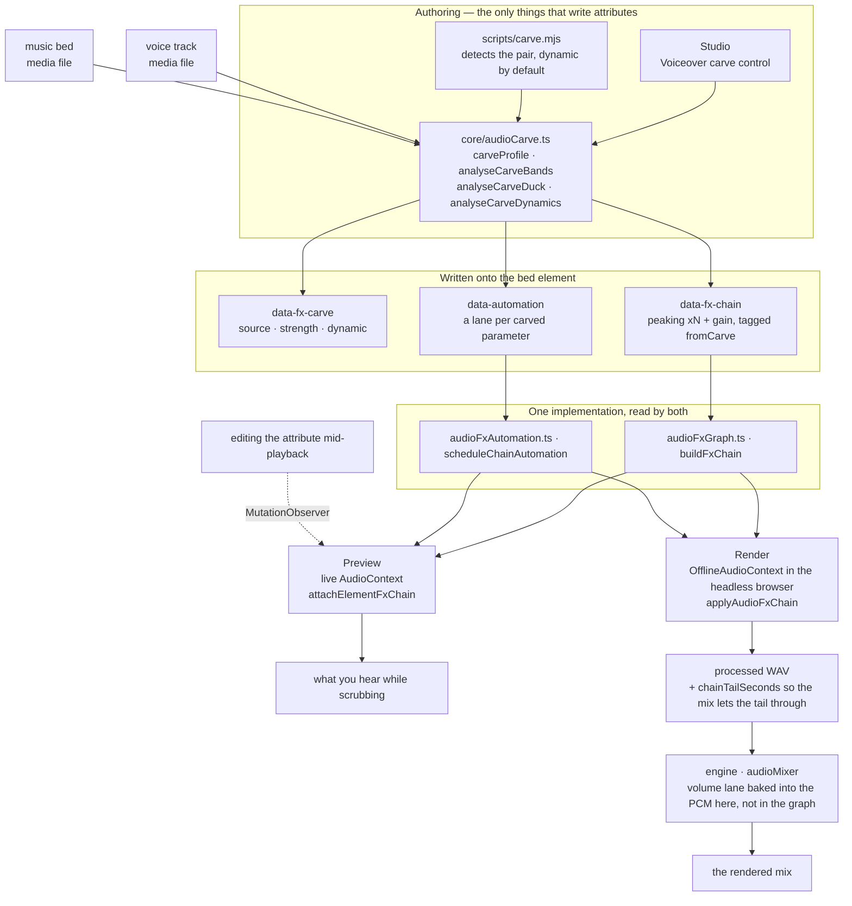
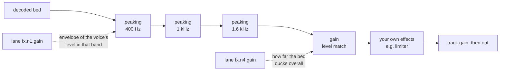

# HyperFrames 音频

混音是一组关系，而不是一堆处理器的叠加。两条单独听起来都没问题的轨道，放在一起却可能让人无法忍受，而解决办法几乎从来都不是“把其中一条调小声”——而是找出它们在争夺什么，并把它让给更需要的一方。这里的每个工具都是为了表达其中一种关系而存在的。

效果以 `data-fx-chain` 的形式存在于元素上，预览和渲染运行相同的 Web Audio 图——工作室在实时上下文中运行，引擎则在其已经驱动的浏览器内的离线上下文中运行。每种效果都只有一套实现，因此你在拖动浏览时听到的内容，就是最终写入的内容。你永远不需要调校两次。

剪辑时间控制仍归 `/hyperframes-core` 所有：音频/视频裁剪和源范围使用 `data-start`、`data-duration` 和 `data-media-start`，交叉淡化则让不同轨道上的剪辑相互重叠。本技能负责已放置轨道的淡入/淡出、交叉淡化包络、轨道增益/轨道音量、音量和效果自动化、闪避/旁白避让，以及效果链。`/media-use` 负责素材获取、生成和预处理。

当匹配的音频/视频元素使用相同的时间、源偏移和速率时，恒定的 `data-playback-rate`（`0.1..5`）可以安全地渲染画面和保持音高的声音。不支持源速度渐变，因为不存在速率包络；请预处理生成一个派生的同步素材。HyperFrames 不提供自动波形同步或漂移校正。
有关可直接复制的剪切/交叉淡化/变速方案，请参阅 `/hyperframes-core` → `references/creator-editing-recipes.md`。

三个属性承载全部内容，它们都位于音频/视频元素本身：

| 属性              | 内容                                                     |
| ----------------- | --------------------------------------------------------- |
| `data-fx-chain`   | 按信号顺序排列的效果                                      |
| `data-automation` | 此轨道音量或其效果参数的包络                              |
| `data-fx-carve`   | carve 自身的设置，以便能够重新推导                        |

随附的效果系列包括 gain、EQ（highpass、lowpass、peaking、shelves）、compressor、limiter、gate、saturate、delay、reverb、chorus、phaser 和 bitcrush。

每种效果的确切 JSON，以及 lane 必须满足的规则：`references/attributes.md`。
所有效果及其参数、范围和单位：`references/fx-registry.md`。
如何判断一个你无法听到的文件出了什么问题：
`references/diagnosis.md`。
**预设、命名任务和单旋钮配置，以及症状到修复方案的对照表：
`references/presets.md`**——请在手动构建效果链之前阅读它，因为通常已有某个预设或命名任务准确描述了问题。

## 各部分如何协同工作

两个创作界面写入这些属性；两个运行时通过相同的构建器读取它们。正是这个共享的中间层，让预览能够准确预测渲染结果。



避让处理自身的设置在播放时从不会被读取——实际播放的是它所生成的处理链和自动化轨道。`data-fx-carve` 的存在，是为了可以在现有避让处理上更改强度，而不必根据滤波器反向猜测原来的强度。

在经过避让处理的背景音中，信号会先通过衰减滤波器，然后进行电平匹配，最后再通过你自行构建的任何效果——因此，你添加的限制器仍会充当最后一道上限：



静态避让处理采用相同的图结构，但使用固定值，且完全没有自动化轨道。

## 首先，判断问题所在

下表从“听起来轰鸣浑厚”这一描述出发——这意味着已经有人听过并作出了判断。如果只交给你一个文件，并说“修复这个”，你就没有这样的描述，而且你也无法试听，因此必须进行测量。所有情况都遵循一条规则：

> **无法根据单个未知人声的绝对频谱作出诊断。**
> 共振峰会有 ±10 dB 的变化，基频范围为 85–255 Hz，而句子结尾时通常会衰减 5–6 dB。
> 这些现象单独看起来都像缺陷，但实际上每一种都可能只是说话者自身的特征。

因此要进行比较，并且要与**同一文件内部**的内容比较：如果存在干净的原始音频，就与其比较；否则就与停顿部分比较——间隙中任何可听见的声音都是叠加噪声，而间隙的频谱反映的是通道特性，而非人声特性。与公开发布的平均频谱或合成的对照人声比较是行不通的：两名说话者之间的差异会大于大多数缺陷，而本指南所依据的评估中，两次错误判断恰恰都源于这种做法。

如果既没有原始音频，也没有可用的静音片段，那么静态音色缺陷实际上就是欠定问题。应当明确说明这一点，并提供与测量结果相符的各种可能解释，而不是随意选择一种并据此构建处理链。

相关命令、陷阱和完整操作方案见：**`references/diagnosis.md`**。在诊断一个无人描述过的文件之前，请先阅读该文档。

## 从症状入手

确定频段和问题类型后，明确指出音频出了什么问题。大多数劣质音频都包含以下一两种问题，而且每种问题都有内置的解决方案：

| 听起来像是                         | 可采用                                             |
| ---------------------------------- | -------------------------------------------------- |
| 底部存在嗡声或低频冲击声           | `rumble-cut`，或设置为 80 Hz 的 `highpass`         |
| 轰鸣、胸腔感过重                   | **抑制轰鸣感**任务（200 Hz）                       |
| 发闷，像隔着纸板                   | **减少浑浊感**任务（250 Hz）                       |
| 难以听清说了什么                   | **增强清晰度**任务（3 kHz），或对背景音进行避让处理 |
| 刺耳且容易让人疲劳                 | **柔化刺耳感**任务（3.2 kHz）                      |
| 某些词比其他词响得多               | 压缩器上的**均匀度**，或均衡电平                   |
| 句子之间存在房间底噪               | `room-gate`                                        |
| 人声与音乐相互争抢                 | **旁白避让处理**——而不是对其中任何一方使用均衡器   |
| 声音干涩，缺乏空间感               | `room-tight` 或 `room-natural`                     |
| 只是听起来“不专业”                 | `voice-clean`，它会按顺序执行上述四项处理           |

完整目录、每个预设包含的内容、频段术语，以及刻意不涵盖的内容
（齿音消除、噪声去除、音色匹配），请参阅：
`references/presets.md`。

先做减法，再做加法；先滤波，再调整电平；先调整电平，再处理相互关系；
最后添加声音特质并设置上限。每一步都会改变下一步所听到的内容——如果将
压缩器放在高通滤波器之前，它就会一直忙于追赶低频隆隆声。

## 根据问题选择处理类别，而不是根据名称

**滤波器**（`highpass`、`lowpass`、`peaking`、`lowshelf`、`highshelf`）决定
允许一条音轨占据哪些频率。当两个声源发生冲突时，这是首选工具，因为冲突发生
在特定频段：背景音乐和人声都需要 1–3 kHz，而从背景音乐中削减这个频段，对背景
音乐造成的损失远小于调低其整体音量对混音造成的损失。对人声应用高通滤波器是
消除低频隆隆声的标准做法；低通滤波器则用于有意让声音变暗或变闷。

**动态处理**（`gain`、`compressor`、`limiter`、`gate`）决定音轨电平随时间
变化的方式。压缩会缩小响亮部分与安静部分之间的差距，从而可以提升安静部分。
限制器是一道上限——它不会塑造任何声音，只保证没有任何信号能够超过上限。
噪声门会移除低于阈值的内容，这正是你消除语句间房间底噪的方式。`gain` 是一个
普通的电平级，当一条音轨必须让出空间时，自动化曲线所控制的正是它。

**非线性处理**（`saturate`、`bitcrush`）会改变波形的形状，从而添加原本
不存在的谐波。当音轨需要的是声音特质或粗粝感，而不是修正时，就应使用这类
处理——并且要记住，它具有生成性：它会让单薄的声源变得更稠密，而不是更干净。

**时间类处理**（`delay`、`reverb`、`chorus`、`phaser`）会将音轨置于某个
空间中，或赋予其宽度。这类处理最容易毁掉混音，因为混响尾音或失谐的副本会
占据人声所需的同一空间。应将它们用于应该位于其他内容_之后_的声音，并将湿声
比例保持在低于单独聆听时感觉合适的水平。

处理链是串行的：每个效果都会处理前一个效果产生的结果。因此，修正性滤波应
放在前面，声音特质处理放在中间，而限制器应放在最后，这样它才能真正充当上限。

## 旁白频段避让

**它解决的问题。** 人声下方的背景音乐会让人声变得难以听清。直觉反应通常是
压低整个背景音乐的音量，这样做确实有效，但代价是背景音乐会失去全部存在感——
在整段旁白期间，音乐都会变得软弱无力。但人声并不需要整个频谱。它只需要自己
实际占据的少数几个频段。频段避让只削减这些频段，而背景音乐仍能保留低频和
高频，因此音乐仍然像音乐，同时人声也依然清晰可懂。

**它是一种相互关系，而不是一种效果。** 设置位于_背景音乐_上——也就是接受
处理的音轨——并指定要监听的人声，其方式与侧链压缩器完全相同：你选择要变小声
的音轨，并选择是什么让它变小声。**绝不要在人声音轨上应用频段避让。** 让人声
相对于自身进行频段避让是一个错误，而不是什么微妙的混音选择。

**要包含所有人声，而不是其中一个。** `sources` 是一个列表，因为一条背景音乐
通常会贯穿整个序列——旁白、采访回答、第二位演讲者。所有人声都会先汇总到背景
音乐自身的时钟上，然后再进行任何测量（`mixCarveSources`），因此一次分析即可
覆盖所有人声：频段来自所有现有语音，而只要其中任何人声出现，包络就会上升。
从未在背景音乐播放期间出现的人声会被排除；它们不可能对背景音乐造成掩蔽。

**对多个剪辑 ID 分别执行 carve 是错误的。应将这些剪辑编组，然后针对该组执行 carve。**
这是一条不变量，而不是建议。逐个列出剪辑时，必须确保一个不漏地全部列对，而且这种正确性只能维持到下一次编辑——如果稍后添加了第四个旁白剪辑，它就会游离在 carve 的感知范围之外，铺底音轨不会在其下方自动压低，而且不会有任何提示。改为指定组后，成员关系会在分析时解析，因此以后添加到该组的剪辑也会自动纳入处理，完全不需要修改 `sources`：

```html
<!-- group the narration, then carve the bed against the group -->
<audio id="vo-intro" data-audio-group="voiceover" …></audio>
<audio id="vo-middle" data-audio-group="voiceover" …></audio>
<audio id="vo-outro" data-audio-group="voiceover" …></audio>

<audio
  id="music"
  data-fx-carve='{"enabled":true,"sources":["voiceover"],"strength":0.25}'
  …
></audio>
```

如果 `sources` 列表指定了两个或更多普通剪辑 ID，而不是一个组，`audio_carve_ungrouped_sources` lint 规则就会捕获这一问题——这种写法仍然有效，但一旦添加剪辑，就会在不知不觉中逐渐失效。

**只需一个旋钮。** `strength` 的取值范围是 0..1，并由它推导出一切：削减多深、使用多少个频段、频段多宽、在可懂度与原始人声音量之间偏向前者到什么程度、电平最多可降低多少，以及应将铺底音轨压到人声下方多远。在任何真实混音中，这六项都会联动——轻柔的 carve 会在少数频段进行较浅的削减，并只做少量压低；强力的 carve 则会在更多频段进行更深的削减，并加大压低幅度——因此，这种关系只需在 `carveProfile` 中定义一次。默认值为 `0.25`——在三个频段产生 6 dB 的凹陷，并留出 6 dB 的电平空间；效果听得出来，却不会让人觉得频谱上挖了一个洞。当值为 `0.5` 时，凹陷会达到 10 dB，此时 carve 开始会被听成一种效果，而不只是为人声腾出空间；再高的值则适用于有意让响亮铺底音轨衬在轻声人声之下的场景。`0` 表示仅进行频谱处理——一个频段，完全不做电平匹配。

**默认使用 carve。** 在旁白下方播放的铺底音轨需要 carve；它不是有时间才做的润色步骤。放置好两条音轨，运行下面的命令，然后试听。只有在音乐上方没有旁白时才跳过它——例如音乐视频、标题卡，或按音乐节奏剪辑的蒙太奇。

**它始终跟随人声。** 不存在静态模式：固定的削减深度会让铺底音轨在每一次停顿期间都显得单薄，而一旦对比听过两种效果，就没有理由选择这种方式。每个值都会变成人声自身电平的包络——静音时铺底音轨不受影响，响亮段落则会将 carve 推至最大深度——并以普通自动化的形式写入，因此这些自动化通道会显示在时间线上，之后仍可编辑。

**电平匹配是其中的一部分。** 如果铺底音轨只是单纯比人声更响，频谱 carve 无法解决问题。因此，carve 还会测量铺底音轨比人声高出多少，并写入一个 `gain` 级：静态 carve 时保持在一个固定值，动态 carve 时则由包络驱动。该包络会有意缓慢释放——音乐若在一个词刚结束时瞬间恢复到完整音量，听起来就像机器在操作。

**运行方式。** 在 Studio 中，carve 是音轨效果机架顶部的一个模块——人声、强度、动态设置及其生成的分析结果都集中在一张卡片中。只要另一条音轨有可能作为人声，该模块就会出现；如果某条铺底音轨上方恰好只有**一个**候选音轨，系统默认就会以默认强度动态执行 carve：这正是旁白下方的铺底音轨所需要的，而该模块就是你调整或关闭它的地方。如果有多个候选音轨，选择器会等待你选择，而不是自行猜测。无头模式——
也就是在创作合成内容而不是编辑现有内容时采用的路径：

```bash
node <SKILL_DIR>/scripts/carve.mjs --comp index.html
```

这就是完整的命令。它会自行找到人声和底乐，以默认强度动态执行避让，并输出其判断结果：

```
bed    music-bed (name looks like music)
voice  narration (only track left)
carve  strength 0.25 dynamic
bands  400Hz -6dB q1.4, 1000Hz -3dB q1.4, 1600Hz -3.17dB q1.4
level  216-point envelope, floor -6 dB
```

当自动选择有误时，使用 `--bed` / `--voice` 指定轨道（可重复使用）；使用 `--strength` 增强处理；使用 `--dry-run` 查看该报告而不写入任何内容。

**它如何选择轨道。** 首先依据名称，因为这是你已经提供的信息，并且判断结果可以解释——它使用 core 中的 `classifyAudioName`，也就是 Studio 自身的选择器所使用的同一个分类器，因此两者不可能出现分歧。id 或文件名看起来像音乐（`music`、`bgm`、`bed`、`score`……）的轨道会被视为底乐；所有与其同时播放且不具备音效特征的其他轨道都会被视为人声。优先选择音频元素：只有在没有音频轨道可作为人声时，视频才会被纳入考虑，否则合成中的每个 B-roll 片段看起来都会像是有人在说话。**如果无法判断哪条轨道是底乐，它会拒绝执行**，而不是对错误的轨道进行避让处理——输入一个 id 并不麻烦。

它使用与面板相同的分析函数，因此结果完全一致。需要 PATH 中存在 `ffmpeg`，并且项目中已安装 `@hyperframes/core`（`npm i -D
@hyperframes/core`）——CLI 会内联 core，而不是随附它，因此无法从 CLI 中借用。

**它写入的内容**是一条普通的峰值滤波器链，外加一个增益级，并标记为 `fromCarve`。这个标记就是全部诀窍：再次运行时会替换先前的避让处理，同时让你手动创建的每个效果以及手动绘制的每条自动化轨道都原封不动地保留在原位。因此，以新的强度重新执行避让既安全又可重复，而 `data-fx-carve` 的存在使这些设置能够被读回，而不必根据滤波器进行猜测。

## 自动化

一条自动化轨道是作用于一个参数的一组断点：`{t, v}`，其中时间采用片段局部时间的秒数，值则采用该参数自身的单位。目标可以是表示轨道音量的 `volume`，也可以是表示效果旋钮的 `fx.<nodeId>.<param>`。

**只有部分参数可以自动化，作用于其他参数的自动化轨道不会产生任何效果，也不会提示。** 当一个旋钮由 Web Audio `AudioParam` 支持时，它才可以自动化。四种基于 worklet 的效果——`compressor`、`limiter`、`gate`、`bitcrush`——完全不公开任何此类参数，因此作用于它们任何参数的自动化轨道都不会发生变化：若要让压缩器的行为随时间变化，应改为自动化其前面的 `gain` 级。`references/fx-registry.md` 标明了每个参数。

## 验证

几乎没有静态检查能够覆盖混音。linter 读取 `data-automation` 时只检查一种冲突——`audio_volume_double_automation`，即轨道上存在音量自动化轨道，同时又存在针对 `volume` 的 GSAP 补间动画；在这种情况下，自动化轨道优先，补间动画会被忽略——此外还会检查 `audio_volume_tween_overrides_gain`，即 `volume` 被补间的轨道上存在自行设置的 `data-volume`；在这种情况下，补间值是绝对值，会替换该增益，而不是对其进行缩放。链或效果自动化轨道完全不会得到验证。真正强制检查它们的是渲染过程：无法解析的链会导致整个混音失败，而不是悄悄写入未经处理的信号，因为听起来似乎合理但实际错误的混音，比直接拒绝处理更糟。预览则有意采用相反的设计：无法读取的链会以未经处理的方式播放，从而让合成保持可用。

指向链中不存在节点的通道会在读取时被修剪，而不会报错——因此，拼写错误的 `nodeId` 会导致包络被静默丢弃。应从链中重新读取 ID，而不要假定实际生成了哪些 ID。

带有尾音的效果（`reverb`、`delay`）会使渲染后的轨道比源轨道**更长**，而链会告知混音延长了多少。因此，带混响的底音不再恰好结束于其 `data-duration`；这是预期行为，并非错误。

除此之外，还应通过渲染和试听来验证混音。对于挖槽处理：人声应当清晰可辨，同时底音不能听起来像被掏空；使用 `dynamic` 时，底音应在语句间隙重新升高，而不是始终保持不变。如果底音在人声下方听起来像是被挖掉了某个频段，而不只是变得更轻，那么强度就太高了——这是唯一一种具有明显听觉特征的失败模式。