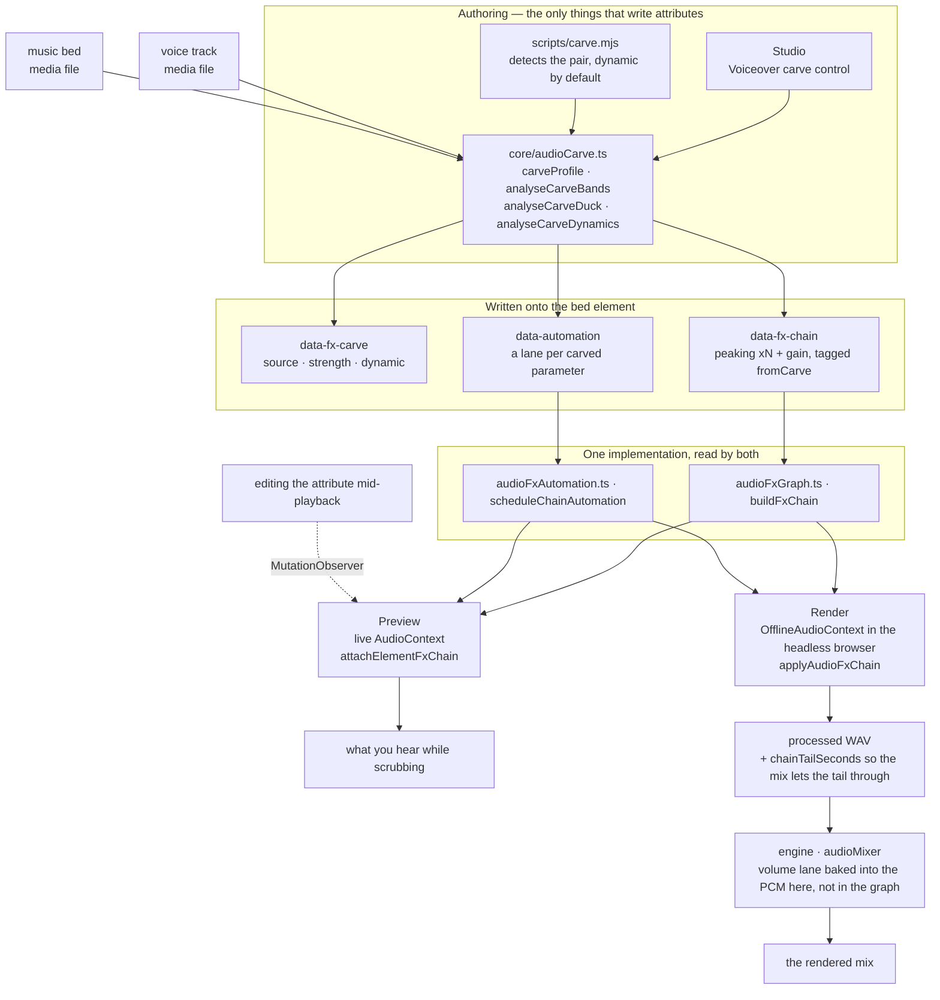
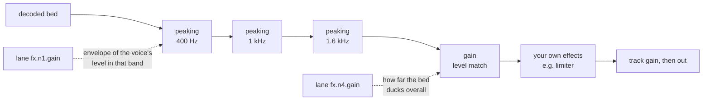

# HyperFrames 音频

混音是一组关系，而不是一堆处理器的叠加。两条单独听起来都没问题的轨道，放在一起却可能让人无法忍受，而解决方法几乎从来都不是“把其中一条调小声”——而是找出它们在争夺什么，并将其让给更需要它的那一条。这里的每个工具都是为了表达其中一种关系而存在的。

效果以 `data-fx-chain` 的形式存在于元素上，预览和渲染运行的是同一个 Web Audio 图——工作室在实时上下文中运行，引擎则在它已经驱动的浏览器内以离线上下文运行。每种效果只有一套实现，因此你在拖动浏览时听到的效果，就是最终写入的效果。你永远不需要调校两次。

三个属性承载了全部信息，而且都位于音频/视频元素本身：

| 属性              | 保存的内容                                                |
| ----------------- | --------------------------------------------------------- |
| `data-fx-chain`   | 按信号顺序排列的效果                                      |
| `data-automation` | 此轨道音量或其效果参数上的包络                            |
| `data-fx-carve`   | carve 自身的设置，以便重新推导                            |

每个属性的确切 JSON，以及一条 lane 必须满足的规则：`references/attributes.md`。
所有效果及其参数、范围和单位：`references/fx-registry.md`。
如何判断一个你无法听到的文件出了什么问题：
`references/diagnosis.md`。
**预设、具名任务和单旋钮 profile，以及从症状到修复方法的对照表：
`references/presets.md`**——在手动构建 chain 之前请先阅读该文档，因为通常已有某个预设或具名任务准确描述了这个问题。

## 工作原理

两个创作界面会写入这些属性；两个运行时则通过相同的 builder 读取它们。正是由于共享了中间层，预览才能准确预测渲染结果。



在播放时绝不会读取 carve 自身的设置——实际播放的是它所生成的效果链和自动化轨道。`data-fx-carve` 的存在，是为了能在已有 carve 上调整强度，而不必根据滤波器反向猜测原来的强度。

在经过 carve 处理的底音中，信号会先经过衰减滤波器，再经过电平匹配，
最后经过你自己构建的任何效果——因此，你添加的限制器仍然会作为
最后一道上限：



静态 carve 使用相同的图，但所有值都是固定的，并且完全没有自动化轨道。

## 首先，弄清楚问题出在哪里

下表从“听起来低频轰鸣”开始——这意味着已经有人听过，并给出了这样的判断。
如果只给你一个文件并要求“修好它”，你就没有这样的描述，
而且你也无法试听，因此必须进行测量。所有测量都遵循一条规则：

> **无法根据单个未知人声的绝对频谱作出诊断。**
> 共振峰的变化可达 ±10 dB，基频范围为 85–255 Hz，而句子在结尾时通常会衰减 5–6 dB。
> 其中任何一项单独看来都像是缺陷，但它们其实全都来自说话者本身。

因此要进行比较，并且比较对象应当来自**同一个文件内部**：如果存在干净的原始音频，
就与它比较；否则就与停顿部分比较——间隙中能听到的任何声音都是叠加成分，
而间隙的频谱反映的是通道，而不是人声。与已发布的平均频谱或合成的对照人声进行比较
并不可行：两名说话者之间的差异大于大多数缺陷，而本指南所依据的评估中，
两个错误答案恰恰都源于这种做法。

如果既没有原始音频，也没有可用的静音片段，那么静态音色缺陷确实是
无法唯一确定的。应明确说明这一点，并给出与读数相符的各种可能性，
而不是随意选定一种并据此构建效果链。

命令、陷阱和完整操作方案：**`references/diagnosis.md`**。在诊断一个
无人描述过的文件之前，请先阅读它。

## 从症状入手

确定频段和问题类型后，请明确说出音频出了什么问题。大多数劣质音频都存在
以下一到两个问题，并且每种问题都有随附的解决方案：

| 听起来像                         | 可采用                                            |
| -------------------------------- | ------------------------------------------------- |
| 底部有嗡声或低沉撞击声           | `rumble-cut`，或设置为 80 Hz 的 `highpass`        |
| 低频轰鸣、胸腔感过重             | **抑制低频轰鸣**任务（200 Hz）                    |
| 发闷，像隔着硬纸板               | **减少浑浊感**任务（250 Hz）                      |
| 话语难以听清                     | **增加清晰度**任务（3 kHz），或对底音进行 carve   |
| 刺耳且容易引起听觉疲劳           | **柔化刺耳感**任务（3.2 kHz）                     |
| 有些词比其他词响得多             | 在压缩器上使用**均匀度**，或执行均衡电平          |
| 句子之间存在房间底噪             | `room-gate`                                       |
| 人声与音乐相互争抢               | **旁白 carve**——而不是对其中任一方进行均衡处理    |
| 声音干涩，像是在无环境空间中录制 | `room-tight` 或 `room-natural`                    |
| 只是听起来“业余”                 | `voice-clean`，它会按顺序执行上述四种处理          |

完整目录、每个预设包含的内容、频段术语，以及刻意**未**涵盖的内容（去齿音、降噪、音色匹配），请参阅：
`references/presets.md`。

先做减法，再做加法；先滤波，再调电平；先处理电平，再处理相互关系；
最后才添加特性并设置上限。每一步都会改变下一步听到的内容——如果将压缩器设在高通滤波器之前，
它就会一直忙于追踪低频隆隆声。

## 根据问题而非名称选择类别

**滤波器**（`highpass`、`lowpass`、`peaking`、`lowshelf`、`highshelf`）决定
允许一条轨道占据哪些频率。当两个声源发生冲突时，这是首选工具，
因为冲突发生在频段中：铺底音乐和人声都想占据 1–3 kHz，而从铺底音乐中削减这一频段，
对铺底音乐造成的损失远小于调低整体音量对混音造成的损失。对人声使用高通滤波器是处理
低频隆隆声的标准方法；低通滤波器则用于刻意让声音变暗或变闷。

**动态处理**（`gain`、`compressor`、`limiter`、`gate`）决定轨道电平
随时间变化的方式。压缩会缩小响亮部分与安静部分之间的差距，从而可以提升
安静部分。限制器是一道上限——它不会塑造任何声音，只保证没有任何信号能够越过它。
门限器会移除低于阈值的内容，这正是让语句之间的房间底噪静音的方法。`gain` 是一个普通的电平级，
当轨道必须让出空间时，自动化曲线控制的就是它。

**非线性处理**（`saturate`、`bitcrush`）会改变波形的形状，从而添加
原本不存在的谐波。当轨道需要的是特性或粗粝感而非修正时，就应使用它——
并且要记住，它具有生成性：它会让单薄的声源变得更厚实，而不是更干净。

**时间类处理**（`delay`、`reverb`、`chorus`、`phaser`）会将轨道置于某个空间中，或赋予其
宽度。这些处理最容易毁掉混音，因为混响尾音或失谐的副本会占据
人声所需的同一空间。将它们用在应该位于其他内容_后方_的对象上，并将湿声比例保持在
低于单独聆听时感觉合适的水平。

处理链是串行的：每个效果都会处理前一个效果产生的结果。因此，
修正性滤波应放在前面，特性处理放在中间，而限制器放在最后，
这样它才能真正充当上限。

## 为旁白挖出空间

**它所解决的问题。** 人声下方的铺底音乐会让人声难以听清。本能反应是压低整个铺底音乐，
这种方法确实有效，但会牺牲铺底音乐的全部存在感——在整段旁白期间，音乐都会变得软弱无力。
但人声并不需要整个频谱。它只需要自己实际占据的少数几个频段。
挖频只会削减这些频段，而铺底音乐仍会保留低频和高频，因此在保证人声清晰可懂的同时，
音乐听起来仍然像音乐。

**这是一种相互关系，而不是一种效果。** 设置位于_铺底音乐_上——也就是被处理的轨道——
并指定要监听的人声，其方式与侧链压缩器完全相同：先选择要变小声的轨道，
再选择让它变小声的对象。**绝不要在人声轨道上放置挖频处理。** 让人声相对于自身挖频
是一个错误，而不是什么微妙的混音选择。

**每一条人声，而非其中一条。** `sources` 是一个列表，因为铺底音乐通常会贯穿
一整个序列——旁白、采访回答、第二位主持人。在进行任何测量之前，它们会按照铺底音乐自身的时钟
合并到一起（`mixCarveSources`），因此一次分析就能涵盖全部人声：频段来自所有存在的语音，
而包络会在任意语音出现时升起。那些从未在铺底音乐播放期间出现的人声会被排除；
它们不可能对铺底音乐造成掩蔽。

**一个旋钮。** `strength` 的取值范围是 0..1，并由它派生出一切：切削多深、使用多少个频段、频段多宽、在可懂度与原始人声音量之间多大程度上偏向可懂度、整体电平最多可降低多少，以及目标电平要比人声低多少。在任何真实的混音中，这六项都会联动——轻柔的切削是在少量频段中进行浅度切削，并伴随轻微的闪避；强力的切削则是在更多频段中切得更深，并进行更多闪避——因此，它们是一组只需定义一次的关系，写在 `carveProfile` 中。默认值是 `0.25`——在三个频段中产生 6 dB 的凹陷，并留出 6 dB 的电平空间，效果听得出来，但不会像挖了一个洞。达到 `0.5` 时，凹陷会达到 10 dB，此时切削开始更像一种可闻的效果，而不只是为人声腾出空间；高于这个值则属于有意为之的范围，适用于在安静人声下方放置响亮的底乐。`0` 仅进行频谱处理——一个频段，完全不做电平匹配。

**默认进行切削。** 在旁白下方播放的底乐需要切削；它不是有时间才做的润色步骤。放置好两条轨道，运行下面的命令，然后试听。只有当音乐不需要位于任何旁白下方时才跳过它——例如音乐视频、标题卡，或按照曲目节奏剪辑的蒙太奇。

**它始终跟随人声。** 不存在静态模式：固定深度会在每次停顿期间都让底乐变薄，而一旦听过两者的差异，就没有理由再选择固定深度。每个值都会变成人声自身电平的包络——静音时底乐保持不变，响亮的段落会将切削推至最大深度——并以普通自动化的形式写入，因此这些自动化轨道会显示在时间线上，并可在之后进行编辑。

**电平匹配是其中的一部分。** 频谱切削无法修复底乐单纯比人声更响的问题。因此，切削还会测量底乐比人声高出多少，并写入一个 `gain` 阶段：静态切削时保持为单一数值，动态切削时则由包络驱动。该包络会有意缓慢释放——如果一个词刚结束，音乐就瞬间恢复到完整音量，听起来会像机器在操作。

**运行方式。** 在 Studio 中，切削是轨道效果架顶部的一个模块——人声、强度、动态设置及其生成的分析结果都集中在一张卡片中。只要另一条轨道可能是人声，它就会出现；如果底乐上方恰好有**一个**候选轨道，则默认会以默认强度对其进行动态切削：这正是旁白下方的底乐所需要的，而该模块就是修改或关闭此功能的地方。如果有多个候选轨道，选择器会等待选择，而不是自行猜测。无界面模式——
也就是在创作合成作品而非编辑现有作品时所采用的方式：

```bash
node <SKILL_DIR>/scripts/carve.mjs --comp index.html
```

完整命令仅此而已。它会自行找到人声和底乐，使用默认强度进行动态切削，并输出它所做的判断：

```
bed    music-bed (name looks like music)
voice  narration (only track left)
carve  strength 0.25 dynamic
bands  400Hz -6dB q1.4, 1000Hz -3dB q1.4, 1600Hz -3.17dB q1.4
level  216-point envelope, floor -6 dB
```

当自动选择有误时，使用 `--bed` / `--voice` 指定轨道（可重复使用）；使用 `--strength` 增加强度；使用 `--dry-run` 查看该报告而不写入任何内容。

**它如何选择音轨。** 首先看名称，因为这是你已经提供的信息，
而且结果可解释——使用 core 中的 `classifyAudioName`，即 Studio 自己的选择器
所使用的同一个分类器，因此两者不可能产生分歧。id 或文件名看起来像音乐
（`music`、`bgm`、`bed`、`score`……）的音轨会被视为铺底音轨；所有叠加在它之上播放、
且名称不像音效的其他音轨都会被视为人声。优先选择音频元素：只有在没有剩余音频轨道
可作为人声时，才会考虑视频，否则合成中的每个 B-roll 片段看起来都会像有人在说话。
**当它无法判断哪条音轨是铺底音轨时，它会拒绝执行**，而不是对错误的音轨进行避让处理——
输入一个 id 并不费事。

它使用与面板相同的分析函数，因此结果完全一致。需要 PATH 中存在 `ffmpeg`，
并且项目中已安装 `@hyperframes/core`（`npm i -D
@hyperframes/core`）——CLI 会内联 core，而不是将其一同发布，因此无法从 CLI
中借用它。

**它写入的内容**是一个普通的峰值滤波器链加上一个增益级，
并标记为 `fromCarve`。这个标记就是全部诀窍：重新运行时会替换
之前的避让处理，同时让你手工构建的每个效果——以及手工绘制的每条自动化轨道——
保持原位。因此，以新的强度重新进行避让是安全且可重复的，
而 `data-fx-carve` 的存在使设置可以直接读回，而不必根据滤波器进行猜测。

## 自动化

一条自动化轨道是某个参数上的一组断点：`{t, v}` 中的值分别采用片段局部时间的秒数
以及该参数自身的单位。目标可以是表示音轨电平的 `volume`，或表示效果旋钮的
`fx.<nodeId>.<param>`。

**只有部分参数可以自动化，其他参数上的自动化轨道会悄无声息地失效。**
当一个旋钮由 Web Audio `AudioParam` 提供支持时，它才可自动化。四种基于
worklet 的效果——`compressor`、`limiter`、`gate`、`bitcrush`——
完全不公开任何此类参数，因此其任何参数上的自动化轨道都永远不会产生变化：若要让
压缩器的行为随时间变化，应改为自动化其前面的一个 `gain` 级。
`references/fx-registry.md` 标出了每个参数。

## 验证

几乎没有静态门禁会检查混音。linter 读取 `data-automation` 时只检查
一种冲突——`audio_volume_double_automation`，即某条音轨上既有音量自动化轨道，
又有针对 `volume` 的 GSAP tween；此时自动化轨道优先，tween 会被忽略——
除此之外，完全不会验证效果链或效果自动化轨道。真正强制执行这些规则的是渲染过程：
无法解析的效果链会导致整个混音失败，而不是悄悄写入干声，因为听起来似乎合理但实际错误的
混音，比直接拒绝更糟。预览则有意采用相反的设计：无法读取的效果链会播放干声，
以便合成仍可继续操作。

指向效果链中不存在节点的自动化轨道会在读取时被剔除，而不会报错——因此，拼错
`nodeId` 会让包络悄无声息地丢失。应从效果链中读回 id，而不要想当然地认为生成了什么。

带有尾音的效果（`reverb`、`delay`）会使渲染后的音轨比其源音轨**更长**，
效果链会告知混音具体延长多少。因此，添加了混响的铺底音轨不再恰好结束于其
`data-duration`；这是预期行为，而不是 bug。

除此之外，还需要通过渲染和试听来验证混音效果。对于挖空处理：人声
应当清晰可辨，同时底音不应听起来像被挖空；使用 `dynamic` 时，底音
应在语句间隙重新回升，而不是始终保持平坦。如果人声出现时，底音听起来
像是被切出了一道缺口，而不只是音量变小，就说明强度过高——
这是唯一一种具有明显听觉特征的故障模式。