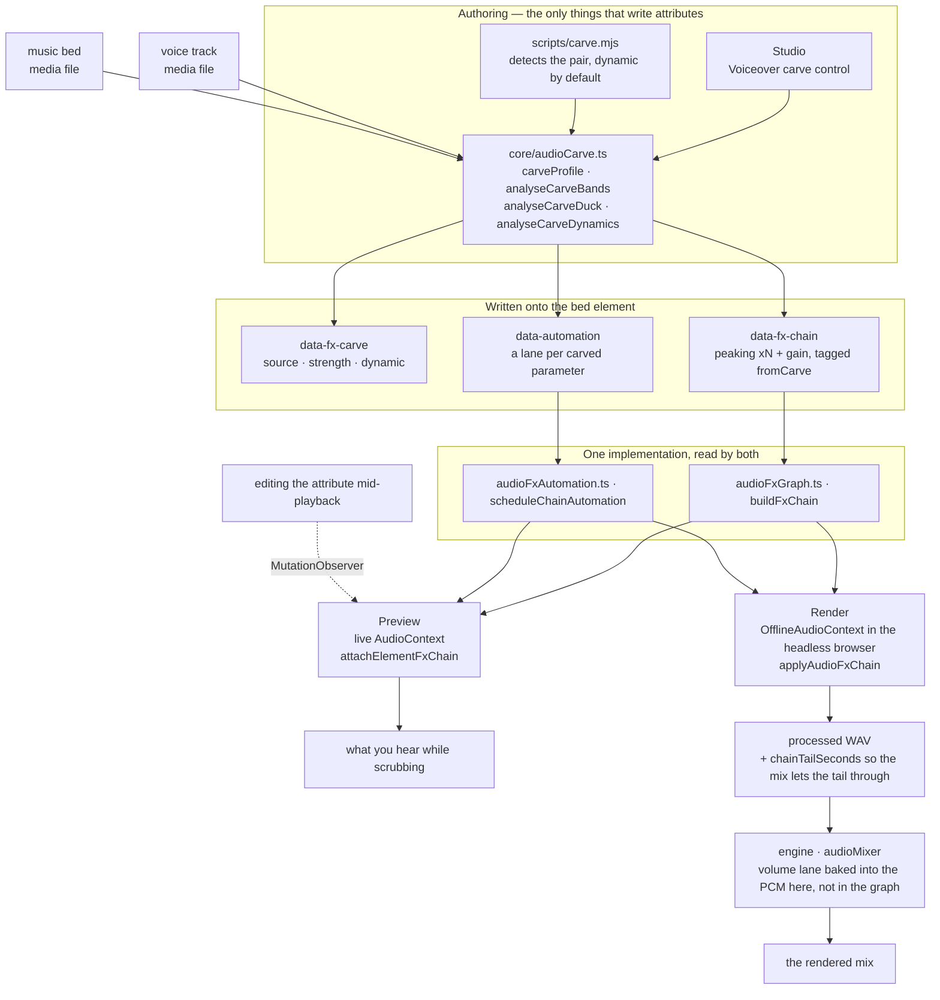
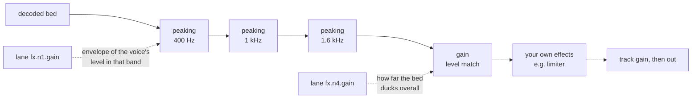

# HyperFrames 音频

混音是一组关系，而不是一堆处理器。两条单独听起来都没问题的轨道，放在一起却可能令人难以忍受，而解决办法几乎从来都不是“把其中一条调小声”——而是找出它们在争夺什么，并把它让给更需要它的一方。这里的每个工具都是为了表达其中一种关系而存在的。

效果以 `data-fx-chain` 的形式存在于元素上，预览和渲染运行相同的 Web Audio 图——实时上下文中的工作室，以及它已驱动的浏览器内部离线上下文中的引擎。每种效果都只有一种实现，因此拖动浏览时听到的内容就是最终写入的内容。你永远不需要调校两次。

剪辑时间控制仍归 `/hyperframes-core` 所有：音频/视频修剪和源范围使用 `data-start`、`data-duration` 和 `data-media-start`，交叉淡化则让不同轨道上的剪辑相互重叠。此技能负责已放置轨道的淡入/淡出、交叉淡化包络、轨道增益/轨道音量、音量和效果自动化、闪避/旁白挖槽，以及效果链。`/media-use` 负责素材获取、生成和预处理。

当匹配的音频/视频元素使用相同的时间、源偏移和速率时，恒定的 `data-playback-rate`（`0.1..5`）可安全用于画面渲染和保留音高的声音。由于没有速率包络，因此不支持源速度渐变；请预处理派生的同步素材。HyperFrames 不提供自动波形同步或漂移校正。
如需可复制的剪切/交叉淡化/变速方案，请使用 `/hyperframes-core` → `references/creator-editing-recipes.md`。

三个属性承载所有内容，并且全部位于音频/视频元素本身：

| 属性              | 包含                                                      |
| ----------------- | --------------------------------------------------------- |
| `data-fx-chain`   | 按信号顺序排列的效果                                      |
| `data-automation` | 此轨道音量或其效果参数上的包络                            |
| `data-fx-carve`   | 挖槽自身的设置，以便重新推导                              |

随附的效果系列包括增益、EQ（高通、低通、峰值、搁架）、压缩器、限制器、门限、饱和、延迟、混响、合唱、移相器和位深压缩。

每种效果的确切 JSON，以及自动化通道必须满足的规则：`references/attributes.md`。
所有效果及其参数、范围和单位：`references/fx-registry.md`。
如何判断一个你无法试听的文件出了什么问题：
`references/diagnosis.md`。
**预设、命名任务和单旋钮配置文件，以及症状到修复方案的对照表：
`references/presets.md`**——在手动构建效果链之前请先阅读，因为通常已有某个预设或命名任务准确描述了该问题。

## 各部分如何协同工作

两个创作界面写入这些属性；两个运行时通过相同的构建器读取它们。正是这个共享的中间层，让预览能够准确预测渲染结果。



挖槽自身的设置在播放时绝不会被读取——实际播放的是它所生成的处理链和自动化轨道。`data-fx-carve` 的存在，是为了能够修改现有挖槽的强度，而不必根据滤波器反向猜测。

在经过挖槽处理的底层音频中，信号会先经过衰减滤波器，再经过电平匹配，然后经过你自行构建的任何效果——因此，你添加的限制器仍会充当最后一道上限：



静态挖槽使用的是同一张处理图，只不过采用固定值，并且完全没有自动化轨道。

## 首先，弄清楚问题出在哪里

下表从“听起来低频浑厚发闷”开始——这意味着已经有人听过音频并作出了这样的判断。如果你拿到的只有一个文件和一句“修一下”，就没有这样的描述可用；而且你无法聆听，因此必须进行测量。所有这些情况都遵循一条规则：

> **无法根据一个未知人声的绝对频谱作出诊断。**
> 共振峰会有 ±10 dB 的变化，基频范围为 85–255 Hz，而句子在结尾时会下降 5–6 dB。
> 单独看时，其中每一项都像是缺陷，但它们其实都只是说话者本身的特征。

因此要进行比较，并且要与**同一个文件内部**的内容比较：如果有干净的原始音频，就与原始音频比较；否则就与停顿处比较——间隙中任何可听见的内容都是附加成分，而间隙的频谱反映的是声道特征，而不是人声特征。与已发布的平均频谱或合成的对照人声比较是行不通的：两位说话者之间的差异会超过大多数缺陷，而本指南所依据的评估中，两个错误答案恰恰都源于这种做法。

如果既没有原始音频，也没有可用的静音片段，那么静态音色缺陷实际上就是欠定问题。应明确说明这一点，并列出与测量结果相符的可能情况，而不是随意选择一种并据此构建处理链。

命令、陷阱和完整示例：**`references/diagnosis.md`**。在诊断一个未附带任何描述的文件之前，请先阅读它。

## 从症状入手

确定频段和问题类型后，指出音频究竟出了什么问题。大多数劣质音频都存在以下一两个问题，并且每个问题都有随附的解决方案：

| 听起来像                           | 采用                                               |
| ---------------------------------- | -------------------------------------------------- |
| 底下有嗡声或低频冲击声             | `rumble-cut`，或设为 80 Hz 的 `highpass`           |
| 低频浑厚、胸腔感过重               | **抑制低频浑厚感**任务（200 Hz）                   |
| 发闷，像隔着纸板                   | **减少浑浊感**任务（250 Hz）                       |
| 话语难以听清                       | **增加清晰度**任务（3 kHz），或对底层音频进行挖槽  |
| 刺耳且容易令人疲劳                 | **柔化刺耳感**任务（3.2 kHz）                      |
| 有些词比其他词响得多               | 对压缩器使用**均匀度**，或执行均衡电平             |
| 句子之间有房间底噪                 | `room-gate`                                        |
| 人声和音乐相互争抢                 | **旁白挖槽**——而不是对其中任一方使用均衡器         |
| 声音干涩，像是在没有空间感的地方录制 | `room-tight` 或 `room-natural`                    |
| 只是听起来“业余”                   | `voice-clean`，它会按顺序执行上述四项处理           |

完整目录、每个预设包含的内容、频段术语，以及有意不涵盖的内容
（齿音消除、噪声去除、音色匹配），请参阅：
`references/presets.md`。

先减后加，先滤波后调电平，先调电平后处理关联关系，最后再加音色特性和上限控制。每一步都会改变下一步所听到的内容——如果将压缩器放在高通滤波器之前，它就会一直忙于追踪低频隆隆声。

## 根据问题选择类别，而不是根据名称

**滤波器**（`highpass`、`lowpass`、`peaking`、`lowshelf`、`highshelf`）决定
一条轨道可以占据哪些频率。当两个声源发生冲突时，这是首选工具，因为冲突发生在具体频段中：背景音乐和人声都需要 1–3 kHz，而从背景音乐中削减这个频段，对背景音乐造成的损失远小于调低整个背景音乐对混音造成的损失。对人声使用高通滤波器是处理低频隆隆声的标准方法；低通滤波器则用于有意让声音变暗或变闷。

**动态处理**（`gain`、`compressor`、`limiter`、`gate`）决定一条轨道的电平
随时间如何变化。压缩会缩小响亮与轻柔部分之间的差距，从而让轻柔部分能够被提升。限制器是一道上限——它不会塑造任何声音，只保证没有任何信号能够越过上限。门限器会移除低于阈值的内容，这正是消除语句间隙中房间底噪的方法。`gain` 是一个单纯的电平级，当一条轨道需要让出空间时，自动化曲线控制的就是它。

**非线性处理**（`saturate`、`bitcrush`）会改变波形的形状，从而添加
原本不存在的谐波。当一条轨道需要的是音色特性或粗粝感而不是修正时，请使用它——并且要记住，它具有生成性：它会让单薄的声源变得更密实，而不是更干净。

**时间类处理**（`delay`、`reverb`、`chorus`、`phaser`）会将一条轨道置于某个空间中，或
赋予它宽度。这些效果最容易毁掉混音，因为混响尾音或失谐的副本会占据人声所需的同一空间。将它们用于应该位于其他内容_后方_的对象，并让湿声比例低于单独聆听时感觉恰当的程度。

处理链是串行的：每个效果都会处理前一个效果所产生的结果。因此，
修正性滤波应放在前面，音色塑造放在中间，限制器则放在最后，这样它才能真正发挥上限控制的作用。

## 旁白频段避让

**它解决的问题。** 人声下方的背景音乐会让人声难以听清。直觉反应是压低整个背景音乐，这样做确实有效，但代价是背景音乐会完全失去存在感——在整段旁白期间，音乐都会变得软弱无力。但人声并不需要整个频谱。它只需要自己实际占据的少数几个频段。频段避让只会削减这些频段，而背景音乐仍能保留低频和高频，因此在保持人声清晰可懂的同时，它听起来依然像音乐。

**它是一种关联关系，而不是一种效果。** 设置位于_背景音乐_上——也就是
被处理的轨道——并指定需要监听的人声，原理与侧链压缩器完全相同：选择要变小声的轨道，再选择使它变小声的内容。**绝不要在人声轨道上放置频段避让。** 让人声针对自身进行频段避让是一个错误，而不是什么微妙的混音选择。

**所有人声，而不是其中一个。** `sources` 是一个列表，因为背景音乐通常会贯穿
整个片段序列——旁白、采访回答、第二位主持人。它们会先按照背景音乐自身的时钟进行合并，然后再测量任何内容（`mixCarveSources`），因此一次分析就能涵盖所有人声：频段来自其中的全部语音，而包络会在任意语音出现的位置上升。与背景音乐从未同时播放的人声会被排除；它们不可能对其造成掩蔽。

**针对多个剪辑 id 分别执行 carve 是错误的。应将这些剪辑编组，并针对该组执行 carve。** 这是一条不变规则，而非建议。逐一列出剪辑名称不仅必须做到毫无遗漏，而且只能在下一次编辑前保持正确——如果之后添加了第四个旁白剪辑，它就会在 carve 的感知范围之外播放，而底乐不会在它出现时自动压低音量，且不会给出任何提示。改为指定组名后，成员关系会在分析时解析，因此之后添加到该组的剪辑无需对 `sources` 做任何改动也能被覆盖：

```html
<!-- group the narration, then carve the bed against the group -->
<audio id="vo-intro" data-audio-group="voiceover" …></audio>
<audio id="vo-middle" data-audio-group="voiceover" …></audio>
<audio id="vo-outro" data-audio-group="voiceover" …></audio>

<audio
  id="music"
  data-fx-carve='{"enabled":true,"sources":["voiceover"],"strength":0.25}'
  …
></audio>
```

如果 `sources` 列表指定了两个或更多普通剪辑 id，而不是一个组，`audio_carve_ungrouped_sources` lint 规则就会将其检出——这种写法仍然有效，但会在添加剪辑时悄无声息地逐渐失效。

**确保 carve 组是纯人声组：不要包含底乐、SFX 或音乐。** `sources` 中的组 id 会在_每次_分析时解析为该组的_当前_所有成员，因此你指定的组就是之后实际使用的组——而不是写入该属性时测量过的那些轨道。这会在两种情况下造成问题：

- **底乐位于它自己的源组中。** 它会被作为人声提供给自身，并依据自身内容对自己执行 carve——“绝不能让轨道针对自身执行 carve”这条规则会在下一次重新分析时显现。
- **人声组中包含 SFX 或音乐剪辑。** 它会在下一次分析时进入侧链，导致底乐在呼啸音效出现时开始压低音量，即使写入该属性的那次运行从未测量过它。

写入 carve 时，这两种问题都不可见：分析会汇总其检测到的人声，但绝不会通过组解析进行往返处理，因此第一次处理确实是正确的，只有下一次才会出错。所以应为每种角色分别建立自己的组——底乐使用 `music`，旁白使用 `voiceover`，音效使用 `sfx`——并确保 `sources` 中指定的组只包含人声。

当 `carve.mjs` 发现上述任一情况时，它会拒绝写入组形式，转而记录剪辑 id，并在 stderr 中说明是哪个成员造成了阻碍。随后，`audio_carve_ungrouped_sources` 规则会指出这种编排问题，而不是让 CLI 悄无声息地持久化一个范围比实际测量结果更广的 carve。

本次运行遗漏的人声**不**属于上述情况，也不会阻止使用组形式：`carve.mjs` 只分析与底乐重叠的人声，而无需编辑 `sources` 就能纳入稍后播放的剪辑，正是指定组名的全部意义所在。

**一个旋钮。** `strength` 的取值范围是 0..1，并由此推导出所有参数：削减多深、使用多少个频段、频段多宽、在可懂度与原始人声能量之间多大程度上偏向可懂度、允许电平下降多少，以及目标应设在人声下方多远。在任何真实混音中，这六项都会协同变化——轻柔的 carve 会在较少的频段中进行较浅的削减，并伴随较少的闪避压低；强烈的 carve 则会在更多频段中削减得更深，并伴随更多的闪避压低——因此它们被定义为单一关系，只在 `carveProfile` 中写入一次。默认值为 `0.25`——在三个频段中产生 6 dB 的凹陷，并留出 6 dB 的电平空间，能够被听见，但不会听起来像挖出了一个空洞。当值为 `0.5` 时，凹陷会达到 10 dB，此时 carve 开始被听成一种效果，而不只是为人声留出空间；高于该值则属于有意为之的范围，适用于安静人声下方响亮的底乐。`0` 表示仅进行频谱处理——一个频段，完全不进行电平匹配。

**默认进行声谱挖槽。** 在旁白下播放的铺底音乐需要挖槽；这并不是有时间才做的润色步骤。放置好两条轨道，运行下面的命令，
然后试听。只有当音乐上方没有旁白时才跳过此步骤——例如音乐视频、标题卡，或依照音乐节奏剪辑的蒙太奇。

**它始终跟随人声。** 不存在静态模式：固定的深度会在每个停顿期间持续削薄铺底音乐，而一旦你听过两者的效果，就没有理由再选择固定深度。
每个值都会成为跟随语音自身电平的包络——静音时铺底音乐保持不变，响亮的段落会将挖槽推至完整深度——并以普通自动化的形式写入，
因此这些自动化通道会显示在时间线上，之后也可以编辑。

**电平匹配也是其中一部分。** 声谱挖槽无法修复铺底音乐单纯比人声更响的问题。因此，挖槽还会测量铺底音乐高出人声多少，
并写入一个 `gain` 阶段：对于静态挖槽，它会保持在一个固定值；对于动态挖槽，则由包络驱动。这个包络会有意缓慢释放——
如果一个词刚结束，音乐就立即恢复到完整音量，听起来会像是机器在操作。

**运行方式。** 在 Studio 中，挖槽是轨道效果机架顶部的一个模块——人声、强度、动态模式以及它生成的分析结果，都集中在一张卡片中。
只要另一条轨道可能是人声，这个模块就会出现；如果一条铺底轨道上方恰好只有**一个**候选轨道，则默认会以默认强度动态挖槽：
这正是旁白下的铺底音乐所需要的效果，而你可以在该模块中进行调整或将其关闭。如果有多个候选轨道，选择器会等待你选择，而不是自行猜测。
无界面模式——
也就是你在创作合成项目而非编辑项目时采用的方式：

```bash
node <SKILL_DIR>/scripts/carve.mjs --comp index.html
```

完整命令就这一条。它会自行找出人声和铺底音乐，以默认强度进行动态挖槽，并输出它的判断结果：

```
bed    music-bed (name looks like music)
voice  narration (only track left)
carve  strength 0.25 dynamic
bands  400Hz -6dB q1.4, 1000Hz -3dB q1.4, 1600Hz -3.17dB q1.4
level  216-point envelope, floor -6 dB
```

当自动选择有误时，使用 `--bed` / `--voice` 指定轨道（可重复使用）；使用 `--strength` 增加强度；
使用 `--dry-run` 查看该报告而不写入任何内容。

**它如何选择轨道。** 首先依据名称，因为这是你已经提供的信息，而且选择结果容易解释——使用 core 中的 `classifyAudioName`，
也就是 Studio 自身选择器所使用的同一个分类器，因此两者不会产生分歧。id 或文件名看起来像音乐（`music`、`bgm`、`bed`、`score`……）的轨道会被视为铺底音乐；
在其上方播放且特征不像音效的其他所有内容都会被视为人声。优先选择音频元素：只有在没有音频轨道可作为人声时，才会将视频纳入考虑，
否则合成项目中的每个 B-roll 片段都会被识别成有人在说话。**如果无法判断哪条轨道是铺底音乐，它会拒绝执行**，而不是错误地挖槽——
输入一个 id 并不费事。

它使用与面板相同的分析函数，因此结果完全一致。需要 PATH 中存在 `ffmpeg`，并且项目中已安装 `@hyperframes/core`（`npm i -D
@hyperframes/core`）——该 CLI 会内联 core，而不是随附它，因此无法从 CLI 中借用。

**它写入的内容**是一条普通的峰值滤波器链，外加一个增益级，
并标记为 `fromCarve`。这个标记就是整个机制的关键：重新运行时会替换
上一次的削切效果，并让你手动创建的每个效果以及手动绘制的每条自动化轨道
都原封不动地保留在原位。因此，以新的强度重新执行削切既安全又可重复，
而 `data-fx-carve` 的存在使设置可以被读回，而不必根据滤波器进行猜测。

## 自动化

自动化轨道是某个参数上的一组断点：`{t, v}` 中的值分别使用剪辑局部时间的秒数
和该参数自身的单位。目标可以是表示音轨电平的 `volume`，也可以是表示效果器旋钮的
`fx.<nodeId>.<param>`。

**只有部分参数可以自动化，其他参数上的自动化轨道会静默失效。**
当一个旋钮由 Web Audio `AudioParam` 支持时，它才可以自动化。四种基于
worklet 的效果器——`compressor`、`limiter`、`gate`、`bitcrush`——
完全没有暴露任何此类参数，因此它们任何参数上的自动化轨道都永远不会产生变化：
要让压缩器的行为随时间变化，应改为自动化位于它之前的 `gain` 级。
`references/fx-registry.md` 标记了每一个参数。

## 验证

几乎没有静态检查覆盖混音。linter 读取 `data-automation` 时，只检查一个冲突——
`audio_volume_double_automation`，即某条音轨既有 volume 自动化轨道，
又有针对 `volume` 的 GSAP 补间动画；此时自动化轨道优先，补间动画会被忽略——
另外还会检查 `audio_volume_tween_overrides_gain`，即某条 `volume` 被补间的音轨上
存在手动设置的 `data-volume`；此时补间动画的值是绝对值，会替换该增益，
而不是对其进行缩放。完全没有任何机制验证
效果链或效果器自动化轨道。真正强制执行这些规则的是渲染：
无法解析的效果链会导致整个混音失败，而不是悄悄写入干声信号，因为一个听起来合理
但实际上错误的混音，比直接拒绝处理更糟糕。预览则有意采用相反的设计：
无法读取的效果链会播放干声，以便作品仍可继续编辑。

指向效果链中不存在节点的自动化轨道会在读取时被移除，而不会报错——因此，
`nodeId` 中的拼写错误会让包络静默丢失。应从效果链中读回这些 id，
而不是假定生成了哪些 id。

带有尾音的效果器（`reverb`、`delay`）会使渲染后的音轨比其源音频**更长**，
效果链会告知混音系统具体延长多少。因此，带有混响的铺底音轨不再恰好结束于
其 `data-duration`；这是预期行为，而不是 bug。

除此之外，混音需要通过渲染和试听来验证。对于削切：人声应当清晰可辨，
同时铺底音轨听起来不应像被掏空；使用 `dynamic` 时，铺底音轨应在语句间隙
重新升高，而不是始终保持平坦。如果铺底音轨在人声下方听起来像是被挖出缺口，
而不只是单纯变小，则说明强度过高——这是唯一一种具有明显听觉特征的失败模式。