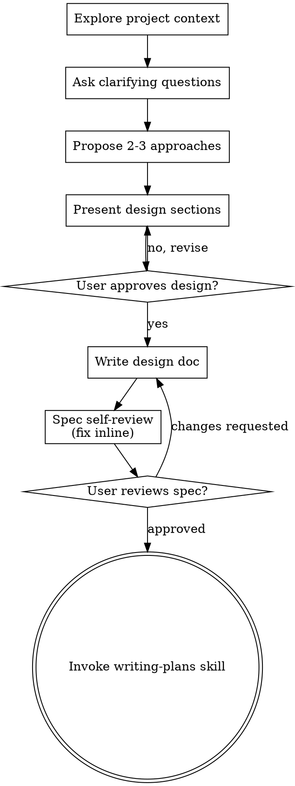

# 将头脑风暴想法转化为设计

通过自然的协作式对话，帮助将想法转化为完整的设计和规格说明。

首先了解当前项目的上下文，然后每次提出一个问题，逐步完善想法。一旦理解了你要构建的内容，就展示设计并获得用户批准。

<HARD-GATE>
在展示设计并获得用户批准之前，不得调用任何实现技能、编写任何代码、搭建任何项目脚手架，也不得采取任何实现操作。无论项目看起来多么简单，这都适用于每一个项目。
</HARD-GATE>

## 反模式：“这太简单了，不需要设计”

每个项目都必须经过这一流程。待办事项列表、单函数工具、配置变更——无一例外。“简单”的项目往往会因未经审视的假设而造成最多的无效工作。设计可以很简短（对于真正简单的项目，只需几句话），但你必须展示设计并获得批准。

## 检查清单

你必须为以下每一项创建任务，并按顺序完成：

1. **探索项目上下文**——检查文件、文档和近期提交
2. **在恰当时机提供视觉辅助工具**——不要一开始就提供。当某个问题第一次确实更适合通过展示而非描述来说明时，再单独发送一条消息提供它；经用户批准后，其浏览器标签页会为你打开。如果始终没有出现需要视觉展示的问题，则绝不提供。请参阅下方的“视觉辅助工具”章节。
3. **提出澄清问题**——每次一个，了解目的、约束条件和成功标准
4. **提出 2-3 种方案**——说明权衡取舍并给出你的建议
5. **展示设计**——按复杂程度划分章节，并在每个章节后获得用户批准
6. **编写设计文档**——保存到 `docs/superpowers/specs/YYYY-MM-DD-<topic>-design.md` 并提交
7. **规格说明自审**——快速进行行内检查，查找占位符、矛盾、歧义和范围问题（见下文）
8. **用户审阅已编写的规格说明**——在继续之前，请用户审阅规格说明文件
9. **过渡到实现阶段**——调用 writing-plans 技能创建实现计划

## 流程

**终端状态正在调用 writing-plans。** 请勿调用 frontend-design、mcp-builder 或任何其他实现技能。在 brainstorming 之后，你调用的唯一技能是 writing-plans。

## 流程

**理解想法：**

- 首先检查当前项目状态（文件、文档、最近的提交）
- 在询问详细问题之前，先评估范围：如果请求描述了多个相互独立的子系统（例如，“构建一个包含聊天、文件存储、计费和分析功能的平台”），应立即指出这一点。不要把问题浪费在细化一个本应先拆分的项目上。
- 如果项目规模过大，无法用单份规范涵盖，请帮助用户将其拆分为多个子项目：哪些部分是相互独立的，它们之间如何关联，应按什么顺序构建？然后按照正常的设计流程，对第一个子项目进行 brainstorming。每个子项目都应有各自的规范 → 计划 → 实现周期。
- 对于范围适当的项目，每次提出一个问题来细化想法
- 尽可能优先使用选择题，但开放式问题也可以
- 每条消息只提出一个问题——如果某个主题需要进一步探讨，请将其拆分为多个问题
- 重点理解：目的、约束条件、成功标准

**探索方案：**

- 提出 2-3 种不同的方案，并说明各自的权衡
- 以对话方式呈现选项，同时给出你的建议和理由
- 先介绍你推荐的选项，并解释原因

**呈现设计：**

- 一旦你认为自己已经理解要构建的内容，就呈现设计
- 根据复杂度调整每个章节的篇幅：简单内容用几句话说明；复杂、需要细致分析的内容最多可写 200-300 词
- 在每个章节之后询问当前内容是否合理
- 涵盖：架构、组件、数据流、错误处理、测试
- 如果有内容不合理，应随时准备返回并进一步澄清

**为隔离性和清晰度而设计：**

- 将系统拆分为更小的单元，每个单元都有单一且明确的用途，通过定义清晰的接口进行通信，并且能够被独立理解和测试
- 对于每个单元，你都应该能够回答：它做什么、如何使用它，以及它依赖什么？
- 是否有人无需阅读单元内部实现就能理解它的作用？是否可以在不破坏使用方的情况下修改其内部实现？如果不能，说明边界还需要改进。
- 更小、边界清晰的单元也更便于你处理——对于能够一次性完整纳入上下文的代码，你可以进行更好的推理；当文件职责集中时，你的编辑也会更加可靠。文件变得很大时，通常意味着它承担了过多职责。

**在现有代码库中工作：**

- 在提出更改建议之前，先了解当前结构。遵循现有模式。
- 如果现有代码中存在会影响当前工作的缺陷（例如，某个文件变得过大、边界不清晰、职责相互纠缠），应将有针对性的改进纳入设计——就像优秀的开发者会在工作过程中改进正在处理的代码一样。
- 不要提出无关的重构。始终聚焦于服务当前目标的工作。

## 设计完成后

**文档：**

- 将经过验证的设计（规格）写入 `docs/superpowers/specs/YYYY-MM-DD-<topic>-design.md`
  - （用户对规格存放位置的偏好优先于此默认设置）
- 如果可用，使用 elements-of-style:writing-clearly-and-concisely skill
- 将设计文档提交到 git

**规格自检：**
编写规格文档后，以全新的视角审视它：

1. **占位符扫描：** 是否存在任何 "TBD"、"TODO"、未完成的章节或模糊的需求？修正它们。
2. **内部一致性：** 是否有任何章节相互矛盾？架构是否与功能描述相符？
3. **范围检查：** 范围是否足够聚焦，可用单个实施计划完成，还是需要拆分？
4. **歧义检查：** 是否有任何需求可能产生两种不同的理解？如果有，选择一种并明确说明。

直接修正所有问题。无需重新审查——修正后继续。

**用户审查关卡：**
规格审查循环通过后，在继续之前请用户审查已编写的规格：

> "规格已编写并提交至 `<path>`。请审查并告诉我，在开始编写实施计划之前是否需要进行任何更改。"

等待用户回复。如果他们要求更改，请进行更改并重新运行规格审查循环。只有在用户批准后才能继续。

**实施：**

- 调用 writing-plans skill 创建详细的实施计划
- 不要调用任何其他 skill。下一步是 writing-plans。

## 关键原则

- **每次只问一个问题** - 不要用多个问题让用户不知所措
- **优先使用多项选择** - 在可行的情况下，这比开放式问题更容易回答
- **坚决遵循 YAGNI** - 从所有设计中移除不必要的功能
- **探索替代方案** - 在确定方案之前，始终提出 2-3 种方法
- **渐进式验证** - 展示设计并获得批准后再继续
- **保持灵活** - 当某些内容不合理时，返回并澄清

## 可视化助手

一种基于浏览器的助手，用于在头脑风暴期间展示模型图、示意图和可视化选项。它作为工具提供，而非一种模式。接受使用该助手意味着它可用于适合通过可视化方式处理的问题；这并不意味着每个问题都要通过浏览器进行。

**适时提供助手：** 不要一开始就主动提供。等到某个问题确实用展示比用文字描述更清晰时——必须是真正的模型图、布局或示意图问题，而不仅仅是涉及 UI 的*话题*。第一次出现这种情况时，再以单独一条消息提供该选项：
> "接下来的部分如果由我展示给你看，可能会更容易理解——在我们推进过程中，我可以在浏览器标签页中制作模型图、示意图和对比内容。它仍然是新功能，并且可能消耗较多 token。你希望我这样做吗？我会为你打开它。"

**此提议必须作为单独一条消息发送。** 消息中只能包含该提议——不得包含澄清问题、总结或其他内容。等待用户回复。如果他们接受，请使用 `--open` 启动服务器，以便其浏览器自动打开第一个界面。如果他们拒绝，则继续仅使用文本，并且不要再次提供，除非他们主动提起。

**逐个问题决定：** 即使用户接受使用视觉伴侣，也要针对每个问题分别决定是使用浏览器还是终端。判断标准是：**相比阅读文字，让用户直接看到相关内容是否能帮助他们更好地理解？**

- **使用浏览器**处理视觉化内容——模型图、线框图、布局对比、架构图、并排展示的视觉设计
- **使用终端**处理文本内容——需求问题、概念选择、权衡项列表、A/B/C/D 文本选项、范围决策

关于 UI 主题的问题不一定就是视觉问题。“在这个语境中，个性是什么意思？”是一个概念问题——使用终端。“哪种向导布局效果更好？”是一个视觉问题——使用浏览器。

如果用户同意使用视觉伴侣，请在继续操作前阅读详细指南：
`skills/brainstorming/visual-companion.md`