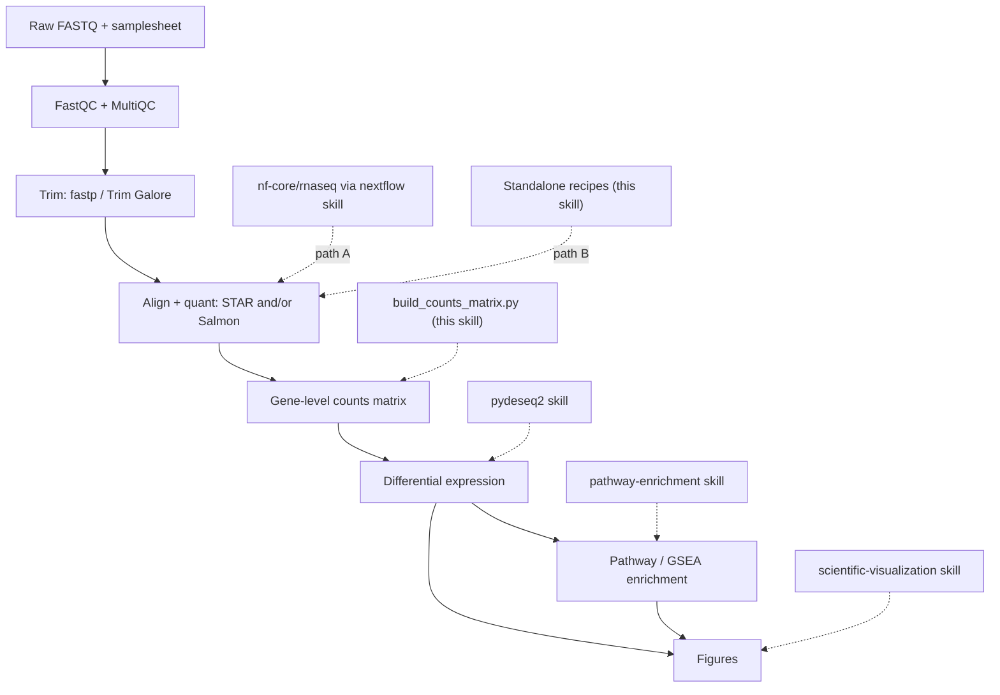

# 批量 RNA-seq

## 概述

此技能可协调完成一项完整、**经得起检验的** 批量 RNA-seq 差异表达研究，从原始测序读段到富集通路和图形。它是一个路由器，而非重新实现：大多数阶段在此仓库中已有专用技能，而此技能会以正确的顺序连接它们，填补唯一真正的缺口（原始读段 → 基因层面的计数矩阵），并强制执行决定最终结果是否可信的设计和 QC 决策。

“经得起检验”在整个过程中意味着三件事：
- **可复现** — 固定的流程/工具版本，在可能的情况下使用容器，记录参数，固定随机种子。
- **质量把关** — 在定量之前、期间和之后都会检查并据此采取行动，而不是跳过 QC。
- **统计稳健** — 足够的重复数、与生物学相匹配的设计、正确处理计数，以及 FDR 控制的检验。

流程为：**FastQC/修剪 → 比对/定量 (STAR/Salmon) → 计数 → DE (pydeseq2) → 富集 (pathway-enrichment) → 图形**。

## 何时使用此技能

当用户希望：
- 从 FASTQ 文件（或一次测序运行）得到差异表达基因和通路。
- 运行或配置 `nf-core/rnaseq`，或使用 STAR、Salmon 或 featureCounts 进行比对/定量。
- 将 Salmon/STAR/featureCounts 输出转换为可用于 DESeq2/PyDESeq2 的计数矩阵。
- 在投入计算资源前设计或合理性检查批量 RNA-seq 实验（重复、批次、链特异性）。
- 规划端到端 RNA-seq 分析，并决定要串联哪些工具和技能。

这是**批量** RNA-seq（样本 = 生物学标本）。对于单细胞/细胞核数据，请使用 `scanpy`；仅进行 DE 统计时，请使用 `pydeseq2`；仅进行富集分析时，请使用 `pathway-enrichment`。

## 流程概览



## 两条上游路径——选择其一

读段 → 计数阶段可通过两种方式运行。它们会产生等效的基因计数；请根据具体情境选择，然后始终沿用该路径。

| 在以下情况使用 **路径 A — `nf-core/rnaseq`** | 在以下情况使用 **路径 B — 独立工具** |
|------------------------------------------|------------------------------------------|
| 你希望通过一条命令使用领域标准、经审计、可引用的流程 | 你只有少量样本，并且希望学习/检查每个步骤 |
| 样本较多，或你将扩展至 HPC/云端 | 没有可用的 Nextflow/容器，或者环境受限 |
| 可复现性和完整的 MultiQC 报告最为重要 | 你需要该流程未公开提供的非标准步骤 |
| → 通过 **`nextflow`** 技能驱动它 | → 遵循 `references/upstream-manual.md` |

不确定时，优先选择 **路径 A**：`nf-core/rnaseq` 已将 FastQC → 修剪 → STAR/Salmon → 定量 → tximport → MultiQC 串联起来，并提供合理且经过审查的默认设置，这是最站得住脚的选择。路径 B 用于透明性要求更高或环境受限的场景。

两条路径都会汇聚为一个**基因层面的计数矩阵**，此后的工作流完全相同。

## 设置

```bash
# This skill's glue (bridge + handoffs) — Python
uv pip install pytximport pandas

# Downstream skills install their own deps:
#   pydeseq2 skill           -> uv pip install pydeseq2
#   pathway-enrichment skill -> uv pip install gseapy gprofiler-official

# Path A (nf-core): only Nextflow + a container engine are needed — see the `nextflow` skill.

# Path B (standalone tools): install via bioconda. Pin versions for reproducibility.
conda create -n rnaseq -c bioconda -c conda-forge \
  fastqc fastp trim-galore "star=2.7.11b" "salmon=1.10.3" subread multiqc
```

记录所使用的确切版本（流程修订版本、工具版本、参考基因组 + 注释发布版本）——它们应写入方法部分，并使分析可复现。

## 快速开始

### 路径 A — nf-core/rnaseq（推荐）

```bash
# 0. Validate the samplesheet first (catches the most common failures early)
python scripts/validate_samplesheet.py --samplesheet samplesheet.csv

# 1. Smoke-test the environment with tiny bundled data
nextflow run nf-core/rnaseq -r 3.26.0 -profile test,docker --outdir test_results

# 2. Real run: pin the revision, pick an aligner, pass a samplesheet + reference
nextflow run nf-core/rnaseq -r 3.26.0 \
  -profile docker \
  --input samplesheet.csv \
  --genome GRCh38 \
  --aligner star_salmon \
  --outdir results \
  -resume
```

`nf-core/rnaseq` 会在内部运行 tximport，因此基因计数输出时**已经合并**——无需桥接脚本。使用 `results/star_salmon/salmon.merged.gene_counts_length_scaled.tsv` 进行 DE。有关样本表格式、比对器选择和输出，请参阅：`references/upstream-nfcore.md`。有关引擎/HPC/云/容器的详细信息，请使用 **`nextflow`** skill。

### 路径 B — 独立 STAR/Salmon（简略版）

```bash
fastqc -o qc/ reads/*.fastq.gz                      # 1. QC raw reads
fastp -i s1_R1.fq.gz -I s1_R2.fq.gz \
      -o s1_R1.trim.fq.gz -O s1_R2.trim.fq.gz \
      --thread 4 -j s1.fastp.json                   # 2. Trim adapters/low-quality
salmon quant -i salmon_index -l A \
      -1 s1_R1.trim.fq.gz -2 s1_R2.trim.fq.gz \
      --gcBias --seqBias -p 8 -o quant/s1            # 3. Quantify (per sample)
```

完整操作指南（FastQC、fastp/Trim Galore、STAR 索引+比对+`--quantMode GeneCounts`、Salmon decoy-aware 索引、featureCounts、链特异性）：`references/upstream-manual.md`。

### 计数 → DE → 富集（两条路径均适用）

```bash
# Path B only: assemble a gene x sample counts matrix + metadata template for PyDESeq2
python scripts/build_counts_matrix.py --from salmon \
  --quant-dir quant/ --tx2gene tx2gene.tsv --output-dir counts/

# Then hand off (see the dedicated skills):
#   pydeseq2:           counts.csv + metadata.csv -> DE table (log2FC, padj, stat)
#   pathway-enrichment: rank by `stat` (GSEA) or padj+|LFC| hit list (ORA)
#   scientific-visualization / matplotlib: volcano, MA, heatmap, PCA, enrichment dotplot
```

## 分阶段工作流

从上到下依次执行。每个阶段都注明了负责具体细节的 skill 或文件。不要跳过设计/QC 阶段——大多数 bulk RNA-seq 研究最容易在这些环节出错。

1. **设计与样本表。** 确认每组至少有 3 个生物学重复，识别批次/混杂因素，并选择比较组。构建 samplesheet，并使用 `scripts/validate_samplesheet.py` 验证。原理与规则：`references/design-and-qc.md`。
2. **原始读段 QC。** 对每个文件运行 FastQC；使用 MultiQC 汇总。检查每碱基质量、接头含量、重复率和过度代表序列。阈值：`references/design-and-qc.md`。
3. **剪切。** 去除接头和低质量末端（通过 `fastp` 或 `Trim Galore`）。重新运行 FastQC 进行确认。操作方案：`references/upstream-manual.md`（Path A 会自动执行此步骤）。
4. **比对 / 定量。** STAR（基因组比对 + `--quantMode GeneCounts`）和/或 Salmon（转录本准比对，支持 decoy-aware）。确定链特异性——这一点很容易设错，并会在无提示的情况下使计数减半。详情：`references/upstream-manual.md`；流程参数：`references/upstream-nfcore.md`。
5. **构建计数矩阵。** 将定量输出转换为基因 × 样本的整数矩阵和元数据模板（`scripts/build_counts_matrix.py`）。估计计数和基因 ID 映射的细节见 `references/counts-and-handoff.md`。
6. **差异表达 → `pydeseq2` skill。** 加载 `counts.csv` + `metadata.csv`，设置设计公式（例如 `~batch + condition`），拟合并使用 FDR 控制进行检验。将 PCA 和 p 值直方图作为 QC 检查。
7. **富集分析 → `pathway-enrichment` skill。** 对于 GSEA，按 DESeq2 `stat` 对*完整*基因列表排序；对于 ORA，传入经过阈值筛选的命中列表（padj < 0.05，可选地 |log2FC| > 1）。请先将基因 ID 映射为符号。
8. **图形 → `scientific-visualization` skill。** 火山图、MA 图、样本距离热图、PCA 和富集点图，以及用于 QC 叙述的 MultiQC 报告。

## counts → DE 桥接（关键衔接）

这是唯一一个没有上游/下游 skill 的阶段，因此由此 skill 负责。`scripts/build_counts_matrix.py` 会将定量输出转换为 `pydeseq2` 所需的准确格式：

- **Salmon** (`--from salmon`)：使用 `pytximport` 按样本将 `quant.sf` 聚合到基因层面，并采用 `counts_from_abundance="length_scaled_tpm"`（基因层面 DE 的正确选择）；需要 `tx2gene` 映射。
- **STAR** (`--from star`)：读取每个 `ReadsPerGene.out.tab`，选择与您的 `--strandedness` 对应的列（非链特异性/正向/反向）。
- **featureCounts** (`--from featurecounts`)：解析合并后的 `featureCounts` 矩阵。

它会写出 `counts.csv`（基因 × 样本，整数）和 `metadata_template.csv`（每个样本一行），供您填写。**Salmon/RSEM 计数是估计值（非整数）；由于 PyDESeq2 要求整数计数，因此会将其四舍五入为整数**——有关为何使用 `length_scaled_tpm` 时这样做可以接受，以及它与基于偏移量的 DESeq2+tximport 路径有何不同，请参阅 `references/counts-and-handoff.md`。该参考文档还涵盖 Ensembl→symbol 映射（富集分析前需要进行此操作）以及 PyDESeq2 所需的确切矩阵方向。

## 常见陷阱

以下问题会导致大多数错误或不可复现的 bulk RNA-seq 结果：

1. **重复样本过少。** 每组少于 3 个生物学重复几乎没有统计效力，并且离散度估计不稳定。增加重复优于加深测序深度。
2. **批次与条件混杂。** 如果每个处理组样本都在与对照组不同的日期/测序通道中处理，那么该效应无法恢复。应进行随机化，并对已知批次建模（`~batch + condition`）。参见 `references/design-and-qc.md`。
3. **链特异性设置错误。** 选择错误的 STAR 列或 featureCounts `-s`/Salmon 文库类型会悄无声息地丢弃约一半的 reads。使用 Salmon `-l A` 或推断链特异性，并验证已分配 reads 的比例。
4. **将 TPM/FPKM 输入 DESeq2。** DESeq2 需要原始（或经长度缩放的）**计数**，绝不能使用 TPM/FPKM/归一化值。该桥接流程会处理这一点。
5. **非整数计数。** PyDESeq2 要求整数；应对 Salmon 估计值进行四舍五入（桥接流程会这样做）。
6. **用于富集分析的基因 ID 不匹配。** DESeq2 输出通常是 Ensembl ID；Enrichr/MSigDB 需要基因符号。在运行 `pathway-enrichment` 之前映射 ID，否则会出现“没有任何结果显著”。
7. **跳过定量后的 QC。** 在信任 DE 结果之前，始终查看 PCA 和样本距离热图——它们能够暴露标签互换、离群值和隐藏批次。
8. **在样本之间混用比对工具。** 应使用相同的工具、版本、参考数据和参数对每个样本进行定量。
9. **未固定版本。** 使用“latest”流程/基因组会导致结果不可复现；固定 `-r`、工具版本以及基因组/注释发布版本。

## 与其他技能的集成

- **上游执行：** `nextflow`（运行 `nf-core/rnaseq`、路径 A；HPC/云端/容器）。
- **参考数据 / 基因 ID：** `gget`（使用 `gget ref` 获取基因组+GTF，使用 `gget info`/`gget search` 进行 ID 映射）、`database-lookup`（Ensembl/NCBI）、`biopython`/`pysam`（FASTA/BAM 处理）。
- **差异表达：** `pydeseq2`（该技能将计数交给它的 DE 引擎）。
- **富集分析：** `pathway-enrichment`（ORA + GSEA；其 `scripts/run_enrichment.py` 可直接读取 DESeq2 结果 CSV）。
- **图表与报告：** `scientific-visualization`、`matplotlib`、`seaborn`；使用 `scientific-writing` 编写方法/结果叙述。
- **相关但不同：** `scanpy`（单细胞）、`statistical-analysis`（多重检验深度）。

## 参考文件

需要深入了解时，请阅读相关文件——每个文件都是自包含的：

- `references/upstream-nfcore.md` — 路径 A：samplesheet 格式、`--aligner`/`--pseudo_aligner` 选择、关键参数、`salmon.merged.gene_counts*.tsv` 输出、MultiQC，以及应交给 `pydeseq2` 的内容。
- `references/upstream-manual.md` — 路径 B：FastQC、fastp/Trim Galore、STAR 基因组索引 + 比对 + `--quantMode GeneCounts`、Salmon decoy-aware 索引 + `quant`、featureCounts，以及如何确定链特异性。
- `references/counts-and-handoff.md` — 将定量输出转换为适用于 PyDESeq2 的 `counts.csv`/`metadata.csv`（pytximport、STAR 列选择、featureCounts）、整数/估计计数的细微差别、Ensembl→symbol 映射，以及 DE→富集的排序/命中列表方案。
- `references/design-and-qc.md` — 实验设计（重复、批次、混杂、设计公式）和 QC 指标解读（比对率、重复率、rRNA、复杂度、PCA/离群值）——构成可辩护流程的基础。

## 资源

- nf-core/rnaseq: https://nf-co.re/rnaseq · STAR: https://github.com/alexdobin/STAR · Salmon: https://salmon.readthedocs.io
- fastp: https://github.com/OpenGene/fastp · Trim Galore: https://github.com/FelixKrueger/TrimGalore · MultiQC: https://multiqc.info
- pytximport: https://pytximport.complextissue.com · featureCounts (Subread): https://subread.sourceforge.net
- 方法背景：Love 等人 2014（DESeq2）DOI 10.1186/s13059-014-0550-8 · Soneson 等人 2015（tximport）DOI 10.12688/f1000research.7563.2