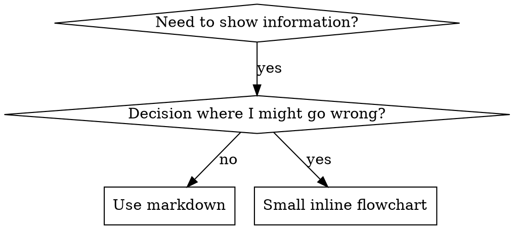

# 创建技能命令

此命令提供有关创建有效技能的指导。

## 概述

**编写技能就是将测试驱动开发应用于流程文档。**

**个人技能存放在特定于智能体的目录中（Claude Code 为 `~/.claude/skills`，Codex 为 `~/.codex/skills`）**

你编写测试用例（使用子智能体的压力场景），观察它们失败（基线行为），编写技能（文档），观察测试通过（智能体遵从要求），然后进行重构（堵住漏洞）。

**核心原则：** 如果你没有观察过智能体在没有该技能时失败，就无法知道该技能是否教授了正确的内容。

**必备背景：** 使用此技能之前，你必须理解测试驱动开发。该技能定义了基础的红灯—绿灯—重构循环。本技能将 TDD 应用于文档。

**官方指导：** Anthropic 的官方技能编写最佳实践可通过 `/apply-anthropic-skill-best-practices` 命令获取，它们对 `prompt-engineering` 技能进行了增强。请结合使用该技能和本文档，因为二者并非内容重复，而是相互补充。本文档提供了额外的模式和指导原则，以补充本技能中以 TDD 为重点的方法。

## 关于技能

技能是模块化、自包含的软件包，通过提供专业知识、工作流和工具来扩展 Claude 的能力。可以将它们视为针对特定领域或任务的“入职指南”——它们将 Claude 从通用智能体转变为具备程序性知识的专业智能体，而这些知识是任何模型都无法完全掌握的。

## 什么是技能？

**技能**是经过验证的技术、模式或工具的参考指南。技能可帮助未来的 Claude 实例找到并应用有效的方法。

**技能是：** 可复用的技术、模式、工具和参考指南

**技能不是：** 关于你曾经如何解决某个问题的叙述

### 技能提供的内容

1. 专业工作流——针对特定领域的多步骤流程
2. 工具集成——使用特定文件格式或 API 的说明
3. 领域专业知识——公司特有的知识、模式和业务逻辑
4. 捆绑资源——用于复杂且重复性任务的脚本、参考资料和资产

## 技能的 TDD 映射

| TDD 概念 | 技能创建 |
|-------------|----------------|
| **测试用例** | 使用子智能体的压力场景 |
| **生产代码** | 技能文档（SKILL.md） |
| **测试失败（红灯）** | 智能体在没有技能时违反规则（基线） |
| **测试通过（绿灯）** | 智能体在提供技能后遵从要求 |
| **重构** | 在保持遵从性的同时堵住漏洞 |
| **先写测试** | 在编写技能之前运行基线场景 |
| **观察其失败** | 记录智能体使用的确切合理化说辞 |
| **最少代码** | 编写针对这些具体违规行为的技能 |
| **观察其通过** | 验证智能体现在是否遵从要求 |
| **重构循环** | 找出新的合理化说辞 → 堵住漏洞 → 重新验证 |

整个技能创建流程都遵循红灯—绿灯—重构循环。

## 何时创建技能

**适合创建的情况：**

- 该技术对你而言并非直观易懂
- 你会在不同项目中再次查阅它
- 该模式具有广泛适用性（并非特定于某个项目）
- 其他人也能从中受益

**不适合创建的情况：**

- 一次性解决方案
- 已在其他地方得到充分记录的标准实践
- 项目特定约定（应放在 CLAUDE.md 中）

## 技能类型

### 技术

包含具体操作步骤的方法（condition-based-waiting、root-cause-tracing）

### 模式

思考问题的方式（flatten-with-flags、test-invariants）

### 参考资料

API 文档、语法指南、工具文档（办公文档）

## 目录结构

```
skills/
  skill-name/
    SKILL.md              # Main reference (required)
    supporting-file.*     # Only if needed
```

**扁平命名空间**——所有技能都位于同一个可搜索的命名空间中

**以下内容应使用单独文件：**

1. **大量参考资料**（100 行以上）——API 文档、完整语法说明
2. **可复用工具**——脚本、实用工具、模板

**以下内容应保留在正文中：**

- 原则和概念
- 代码模式（少于 50 行）
- 其他所有内容

## 技能的组成

每个技能都包含一个必需的 SKILL.md 文件，以及可选的配套资源：

```
skill-name/
├── SKILL.md (required)
│   ├── YAML frontmatter metadata (required)
│   │   ├── name: (required)
│   │   └── description: (required)
│   └── Markdown instructions (required)
└── Bundled Resources (optional)
    ├── scripts/          - Executable code (Python/Bash/etc.)
    ├── references/       - Documentation intended to be loaded into context as needed
    └── assets/           - Files used in output (templates, icons, fonts, etc.)
```

## SKILL.md（必需）

**元数据质量：** YAML frontmatter 中的 `name` 和 `description` 决定 Claude 何时使用该技能。应明确说明该技能的作用及其适用时机。使用第三人称（例如，使用“This skill should be used when...”，而不是“Use this skill when...”）。

### SKILL.md 结构

**Frontmatter（YAML）：**

- 仅支持两个字段：`name` 和 `description`
- 总长度最多 1024 个字符
- `name`：仅使用字母、数字和连字符（不得使用括号或特殊字符）
- `description`：使用第三人称，同时包含技能的作用和使用时机
  - 以“Use when...”开头，重点描述触发条件
  - 包含具体症状、情形和上下文
  - 如有可能，控制在 500 个字符以内

```markdown
---
name: Skill-Name-With-Hyphens
description: Use when [specific triggering conditions and symptoms] - [what the skill does and how it helps, written in third person]
---

# Skill Name

## Overview
What is this? Core principle in 1-2 sentences.

## When to Use
[Small inline flowchart IF decision non-obvious]

Bullet list with SYMPTOMS and use cases
When NOT to use

## Core Pattern (for techniques/patterns)
Before/after code comparison

## Quick Reference
Table or bullets for scanning common operations

## Implementation
Inline code for simple patterns
Link to file for heavy reference or reusable tools

## Common Mistakes
What goes wrong + fixes

## Real-World Impact (optional)
Concrete results
```

#### 捆绑资源（可选）

##### 脚本（`scripts/`）

用于需要确定性可靠性或会被反复重写的任务的可执行代码（Python/Bash 等）。

- **何时包含**：当同一段代码被反复重写，或需要确定性可靠性时
- **示例**：用于 PDF 旋转任务的 `scripts/rotate_pdf.py`
- **优势**：节省 token、结果确定，并且无需加载到上下文中即可执行
- **注意**：Claude 可能仍需读取脚本，以便进行补丁修改或针对特定环境作出调整

##### 参考资料（`references/`）

按需加载到上下文中的文档和参考材料，用于为 Claude 的处理过程和思考提供信息。

- **何时包含**：当 Claude 工作时应参考相关文档
- **示例**：用于财务模式的 `references/finance.md`、用于公司 NDA 模板的 `references/mnda.md`、用于公司政策的 `references/policies.md`、用于 API 规范的 `references/api_docs.md`
- **使用场景**：数据库模式、API 文档、领域知识、公司政策、详细工作流指南
- **优势**：使 SKILL.md 保持精简，仅在 Claude 确定需要时加载
- **最佳实践**：如果文件较大（>10k 词），请在 SKILL.md 中包含 grep 搜索模式
- **避免重复**：信息应存放在 SKILL.md 或参考资料文件中，而不应同时存在于两者之中。除非信息确实是该技能的核心内容，否则应优先放入参考资料文件——这样既能使 SKILL.md 保持精简，又能确保信息易于发现，而不会过度占用上下文窗口。SKILL.md 中仅保留必要的操作说明和工作流指导；将详细的参考资料、模式和示例移至参考资料文件。

##### 资源文件（`assets/`）

不用于加载到上下文中，而是供 Claude 在生成的输出中使用的文件。

- **何时包含**：当技能需要在最终输出中使用相关文件时
- **示例**：作为品牌资源的 `assets/logo.png`、作为 PowerPoint 模板的 `assets/slides.pptx`、作为 HTML/React 样板代码的 `assets/frontend-template/`、用于排版的 `assets/font.ttf`
- **使用场景**：模板、图片、图标、样板代码、字体、会被复制或修改的示例文档
- **优势**：将输出资源与文档分离，使 Claude 无需将文件加载到上下文中即可使用它们

### 渐进式披露设计原则

技能采用三级加载系统来高效管理上下文：

1. **元数据（名称 + 描述）** - 始终位于上下文中（约 100 词）
2. **SKILL.md 正文** - 当技能被触发时加载（<5k 词）
3. **捆绑资源** - 由 Claude 按需加载（无限制*）

*之所以无限制，是因为脚本无需读入上下文窗口即可执行。

## Claude 搜索优化（CSO）

**对发现至关重要：**未来的 Claude 需要找到你的技能

### 1. 丰富的描述字段

**目的：**Claude 通过阅读描述来决定针对给定任务应加载哪些技能。确保它能够回答：“我现在应该阅读这个技能吗？”

**格式：** 以“Use when...”开头，聚焦于触发条件，然后说明它的作用

**内容：**

- 使用具体的触发因素、症状和情境来表明此技能适用
- 描述*问题*（竞态条件、行为不一致），而不是*特定于语言的症状*（setTimeout、sleep）
- 除非技能本身特定于某项技术，否则触发条件应与技术无关
- 如果技能特定于某项技术，请在触发条件中明确说明
- 使用第三人称编写（将被注入系统提示词）

```yaml
# ❌ BAD: Too abstract, vague, doesn't include when to use
description: For async testing

# ❌ BAD: First person
description: I can help you with async tests when they're flaky

# ❌ BAD: Mentions technology but skill isn't specific to it
description: Use when tests use setTimeout/sleep and are flaky

# ✅ GOOD: Starts with "Use when", describes problem, then what it does
description: Use when tests have race conditions, timing dependencies, or pass/fail inconsistently - replaces arbitrary timeouts with condition polling for reliable async tests

# ✅ GOOD: Technology-specific skill with explicit trigger
description: Use when using React Router and handling authentication redirects - provides patterns for protected routes and auth state management
```

### 2. 关键词覆盖

使用 Claude 会搜索的词语：

- 错误消息："Hook timed out"、"ENOTEMPTY"、"race condition"
- 症状："flaky"、"hanging"、"zombie"、"pollution"
- 同义词："timeout/hang/freeze"、"cleanup/teardown/afterEach"
- 工具：实际的命令、库名称、文件类型

### 3. 描述性命名

**使用主动语态，并以动词开头：**

- ✅ `creating-skills`，而不是 `skill-creation`
- ✅ `testing-skills-with-subagents`，而不是 `subagent-skill-testing`

### 4. Token 效率（关键）

**问题：** getting-started 和经常引用的技能会加载到每个对话中。每个 token 都很重要。

**目标字数：**

- getting-started 工作流：每个少于 150 个单词
- 经常加载的技能：总计少于 200 个单词
- 其他技能：少于 500 个单词（仍需保持简洁）

**技巧：**

**将详细信息移至工具帮助中：**

```bash
# ❌ BAD: Document all flags in SKILL.md
search-conversations supports --text, --both, --after DATE, --before DATE, --limit N

# ✅ GOOD: Reference --help
search-conversations supports multiple modes and filters. Run --help for details.
```

**使用交叉引用：**

```markdown
# ❌ BAD: Repeat workflow details
When searching, dispatch subagent with template...
[20 lines of repeated instructions]

# ✅ GOOD: Reference other skill
Always use subagents (50-100x context savings). REQUIRED: Use [other-skill-name] for workflow.
```

**压缩示例：**

```markdown
# ❌ BAD: Verbose example (42 words)
your human partner: "How did we handle authentication errors in React Router before?"
You: I'll search past conversations for React Router authentication patterns.
[Dispatch subagent with search query: "React Router authentication error handling 401"]

# ✅ GOOD: Minimal example (20 words)
Partner: "How did we handle auth errors in React Router?"
You: Searching...
[Dispatch subagent → synthesis]
```

**消除冗余：**

- 不要重复交叉引用的技能中已有的内容
- 不要解释从命令中显而易见的内容
- 不要包含同一模式的多个示例

**验证：**

```bash
wc -w skills/path/SKILL.md
# getting-started workflows: aim for <150 each
# Other frequently-loaded: aim for <200 total
```

**根据你所做的事情或核心洞见来命名：**

- ✅ `condition-based-waiting` > `async-test-helpers`
- ✅ 使用 `using-skills`，不要使用 `skill-usage`
- ✅ `flatten-with-flags` > `data-structure-refactoring`
- ✅ `root-cause-tracing` > `debugging-techniques`

**动名词（`-ing`）很适合表示流程：**

- `creating-skills`、`testing-skills`、`debugging-with-logs`
- 使用主动形式，描述你正在执行的操作

### 4. 交叉引用其他技能

**编写引用其他技能的文档时：**

仅使用技能名称，并带有明确的要求标记：

- ✅ 推荐：`**REQUIRED SUB-SKILL:** Use superpowers:test-driven-development`
- ✅ 推荐：`**REQUIRED BACKGROUND:** You MUST understand superpowers:systematic-debugging`
- ❌ 不推荐：`See skills/testing/test-driven-development`（不清楚是否为必需项）
- ❌ 不推荐：`@skills/testing/test-driven-development/SKILL.md`（强制加载，消耗上下文）

**为什么不使用 @ 链接：** `@` 语法会立即强制加载文件，在你需要它们之前就消耗 200k+ 的上下文。

## 流程图的使用



**仅在以下情况使用流程图：**

- 不明显的决策点
- 可能过早停止的流程循环
- “何时使用 A，何时使用 B”的决策

**切勿将流程图用于：**

- 参考资料 → 使用表格、列表
- 代码示例 → 使用 Markdown 代码块
- 线性指令 → 使用编号列表
- 没有语义含义的标签（`step1`、`helper2`）

有关 graphviz 样式规则，请参阅 [graphviz-conventions.dot](https://github.com/obra/superpowers/blob/main/skills/writing-skills/graphviz-conventions.dot)。

## 代码示例

**一个出色的示例胜过多个平庸的示例**

选择最相关的语言：

- 测试技术 → TypeScript/JavaScript
- 系统调试 → Shell/Python
- 数据处理 → Python

**优秀的示例：**

- 完整且可运行
- 有充分的注释来解释原因
- 来自真实场景
- 清晰展示模式
- 可直接调整使用（而不是通用模板）

**不要：**

- 使用 5 种以上的语言实现
- 创建填空式模板
- 编写刻意编造的示例

你很擅长移植——一个优秀的示例就足够了。

## 文件组织

### 自包含技能

```
defense-in-depth/
  SKILL.md    # Everything inline
```

适用场景：所有内容都能容纳，无需大量参考资料

### 带有可复用工具的技能

```
condition-based-waiting/
  SKILL.md    # Overview + patterns
  example.ts  # Working helpers to adapt
```

适用场景：工具是可复用的代码，而不仅仅是叙述性内容

### 包含大量参考资料的 Skill

```
pptx/
  SKILL.md       # Overview + workflows
  pptxgenjs.md   # 600 lines API reference
  ooxml.md       # 500 lines XML structure
  scripts/       # Executable tools
```

适用场景：参考资料过多，不适合内联

## 铁律（与 TDD 相同）

## 测试所有类型的 Skill

不同类型的 Skill 需要采用不同的测试方法：

### 强制纪律型 Skill（规则/要求）

**示例：** TDD、完成前验证、编码前设计

**测试方式：**

- 理论问题：它们是否理解规则？
- 压力场景：它们在压力下是否仍然遵守？
- 多重压力叠加：时间压力 + 沉没成本 + 精疲力竭
- 识别合理化借口，并添加明确的反制措施

**成功标准：** Agent 在最大压力下仍然遵守规则

### 技巧型 Skill（操作指南）

**示例：** 基于条件的等待、根因追踪、防御式编程

**测试方式：**

- 应用场景：它们能否正确应用该技巧？
- 变体场景：它们能否处理边缘情况？
- 信息缺失测试：说明中是否存在缺漏？

**成功标准：** Agent 成功将技巧应用于新场景

### 模式型 Skill（思维模型）

**示例：** 降低复杂性、信息隐藏概念

**测试方式：**

- 识别场景：它们能否识别何时适用该模式？
- 应用场景：它们能否运用该思维模型？
- 反例：它们是否知道何时不应应用？

**成功标准：** Agent 正确识别何时以及如何应用模式

### 参考型 Skill（文档/API）

**示例：** API 文档、命令参考、库指南

**测试方式：**

- 检索场景：它们能否找到正确的信息？
- 应用场景：它们能否正确使用找到的信息？
- 缺漏测试：是否涵盖常见用例？

**成功标准：** Agent 找到并正确应用参考信息

## 防止 Skill 被合理化借口绕过

强制执行纪律的 Skill（如 TDD）需要能够抵御合理化借口。Agent 很聪明，在压力下会寻找漏洞。

**心理学说明：** 理解说服技巧为何有效，有助于你系统地运用这些技巧。有关权威、承诺、稀缺性、社会认同和一致性原则的研究基础，请参阅 persuasion-principles.md（Cialdini，2021；Meincke 等，2025）。

### 明确堵住每一个漏洞

不要只是陈述规则——还要禁止具体的变通方式：

<Bad>
```markdown
Write code before test? Delete it.
```
</Bad>

<Good>
```markdown
Write code before test? Delete it. Start over.

**No exceptions:**

- Don't keep it as "reference"
- Don't "adapt" it while writing tests
- Don't look at it
- Delete means delete

```
</Good>

### 回应“精神与字面”之争

尽早加入基本原则：

```markdown
**Violating the letter of the rules is violating the spirit of the rules.**
```

这可以堵住一整类“我遵循的是规则精神”的合理化借口。

### 构建合理化借口表

记录基线测试中的合理化借口（参见下方的测试章节）。智能体提出的每个借口都应纳入表中：

```markdown
| Excuse | Reality |
|--------|---------|
| "Too simple to test" | Simple code breaks. Test takes 30 seconds. |
| "I'll test after" | Tests passing immediately prove nothing. |
| "Tests after achieve same goals" | Tests-after = "what does this do?" Tests-first = "what should this do?" |
```

### 创建危险信号列表

让智能体在进行合理化辩解时能够轻松自查：

```markdown
## Red Flags - STOP and Start Over

- Code before test
- "I already manually tested it"
- "Tests after achieve the same purpose"
- "It's about spirit not ritual"
- "This is different because..."

**All of these mean: Delete code. Start over with TDD.**
```

### 更新 CSO 以涵盖违规征兆

在描述中添加即将违反规则时会出现的征兆：

```yaml
description: use when implementing any feature or bugfix, before writing implementation code
```

## 技能的红灯-绿灯-重构

遵循 TDD 循环：

### 红灯：编写失败测试（基线）

让未使用该技能的子智能体运行压力场景。记录其确切行为：

- 它们做出了哪些选择？
- 它们使用了哪些合理化借口（逐字记录）？
- 哪些压力触发了违规行为？

这就是“观察测试失败”——在编写技能之前，你必须先了解智能体自然状态下会做什么。

### 绿灯：编写最小化技能

编写能够应对这些特定合理化借口的技能。不要为假设性的情况添加额外内容。

使用该技能运行相同场景。智能体现在应当遵守要求。

### 重构：堵住漏洞

智能体找到了新的合理化借口？添加明确的反驳。重新测试，直到无懈可击。

**必需的子技能：** 使用 superpowers:testing-skills-with-subagents 获取完整的测试方法：

- 如何编写压力场景
- 压力类型（时间、沉没成本、权威、疲惫）
- 系统性地堵住漏洞
- 元测试技术

## 反模式

### ❌ 叙事性示例

“在 2025-10-03 的会话中，我们发现空的 projectDir 导致……”
**为什么不好：** 过于具体，无法复用

### ❌ 多语言稀释

example-js.js、example-py.py、example-go.go
**为什么不好：** 质量平庸，增加维护负担

### ❌ 在流程图中放置代码

```dot
step1 [label="import fs"];
step2 [label="read file"];
```

**为什么不好：** 无法复制粘贴，难以阅读

### ❌ 泛化标签

helper1、helper2、step3、pattern4
**为什么不好：** 标签应具有语义含义

## 停止：在继续下一个技能之前

**编写任何技能后，你都必须停止并完成部署流程。**

**不要：**

- 批量创建多个技能而不逐一测试
- 在当前技能得到验证之前继续下一个技能
- 因为“批处理效率更高”而跳过测试

**下方的部署检查清单对每个技能都是强制性的。**

部署未经测试的技能 = 部署未经测试的代码。这违反了质量标准。

## 技能创建检查清单（TDD 改编版）

**重要：使用 TodoWrite 为下面的每个检查清单项创建待办事项。**

**RED 阶段——编写失败测试：**

- [ ] 创建压力场景（对于纪律类技能，组合 3 个以上压力因素）
- [ ] 在不使用技能的情况下运行场景——逐字记录基线行为
- [ ] 识别合理化借口/失败中的模式

**GREEN 阶段——编写最小化技能：**

- [ ] 名称仅使用字母、数字和连字符（不得使用括号/特殊字符）
- [ ] YAML 前置元数据仅包含 name 和 description（最多 1024 个字符）
- [ ] Description 以 "Use when..." 开头，并包含具体的触发条件/症状
- [ ] Description 使用第三人称编写
- [ ] 全文包含用于搜索的关键词（错误、症状、工具）
- [ ] 提供包含核心原则的清晰概述
- [ ] 处理在 RED 阶段识别出的具体基线失败
- [ ] 内联代码或链接到单独的文件
- [ ] 提供一个出色的示例（不要使用多种语言）
- [ ] 在使用技能的情况下运行场景——验证智能体现在能够遵循要求

**REFACTOR 阶段——堵住漏洞：**

- [ ] 识别测试中出现的新合理化借口
- [ ] 添加明确的反驳措施（如果是纪律类技能）
- [ ] 根据所有测试迭代构建合理化借口表
- [ ] 创建危险信号列表
- [ ] 重新测试，直至无懈可击

**质量检查：**

- [ ] 仅在决策并非显而易见时使用小型流程图
- [ ] 快速参考表
- [ ] 常见错误章节
- [ ] 不使用叙事性讲述
- [ ] 仅为工具或大量参考资料提供辅助文件

**部署：**

- [ ] 将技能提交到 git 并推送到你的 fork（如果已配置）
- [ ] 考虑通过 PR 回馈贡献（如果具有广泛用途）

## 发现工作流

未来 Claude 如何找到你的技能：

1. **遇到问题**（“测试不稳定”）
3. **找到 SKILL**（description 匹配）
4. **浏览概述**（这是否相关？）
5. **阅读模式**（快速参考表）
6. **加载示例**（仅在实施时）

**针对这一流程进行优化**——尽早并频繁地加入可搜索的术语。

## 核心结论

**创建技能就是针对流程文档进行 TDD。**

同一条铁律：没有先失败的测试，就不能有技能。
同一个循环：RED（基线）→ GREEN（编写技能）→ REFACTOR（堵住漏洞）。
同样的好处：质量更高、意外更少、结果无懈可击。

如果你对代码遵循 TDD，也应对技能遵循 TDD。这是将同一种纪律应用于文档。

## 技能创建流程

要创建技能，请按顺序遵循“技能创建流程”，只有在有明确理由表明某些步骤不适用时，才能跳过这些步骤。

### 第 1 步：通过具体示例理解技能

只有在已经清楚理解技能的使用模式时，才跳过此步骤。即使是在处理现有技能时，此步骤仍然很有价值。

要创建有效的技能，需要清楚理解该技能将如何使用的具体示例。这种理解既可以来自用户直接提供的示例，也可以来自经过用户反馈验证的生成示例。

例如，在构建图像编辑器技能时，相关问题包括：

- “图像编辑器技能应支持哪些功能？编辑、旋转，还有其他功能吗？”
- “你能提供一些如何使用此技能的示例吗？”
- “我可以想象用户会提出‘去除这张图像中的红眼’或‘旋转这张图像’之类的请求。你还设想过此技能有哪些其他使用方式吗？”
- “用户说什么内容时应该触发此技能？”

为避免让用户不知所措，不要在一条消息中提出过多问题。先询问最重要的问题，并根据需要继续追问，以提高效果。

当能够清楚确定该技能应支持的功能时，即可结束此步骤。

### 步骤 2：规划可复用的技能内容

要将具体示例转化为有效的技能，请通过以下方式分析每个示例：

1. 考虑如何从头开始完成该示例
2. 确定在重复执行这些工作流时，哪些脚本、参考资料和资源会有所帮助

示例：构建一个 `pdf-editor` 技能来处理“帮我旋转这个 PDF”之类的查询时，分析结果如下：

1. 旋转 PDF 每次都需要重新编写相同的代码
2. 将 `scripts/rotate_pdf.py` 脚本存储在技能中会很有帮助

示例：为“帮我构建一个待办事项应用”或“帮我构建一个用于追踪步数的仪表盘”之类的查询设计 `frontend-webapp-builder` 技能时，分析结果如下：

1. 编写前端 Web 应用每次都需要相同的 HTML/React 样板代码
2. 将包含 HTML/React 项目样板文件的 `assets/hello-world/` 模板存储在技能中会很有帮助

示例：构建一个 `big-query` 技能来处理“今天有多少用户登录过？”之类的查询时，分析结果如下：

1. 查询 BigQuery 每次都需要重新了解表结构及其关系
2. 将记录表结构的 `references/schema.md` 文件存储在技能中会很有帮助

为了确定技能的内容，请分析每个具体示例，列出需要纳入的可复用资源：脚本、参考资料和资源文件。

### 步骤 3：创建技能目录

如果技能已经存在，只需要迭代，请跳过此步骤。

创建技能目录和所需文件：

1. 创建技能文件夹：`mkdir -p skills/<skill-name>`
2. 创建带有 YAML 前置元数据的 `SKILL.md`：

```markdown
---
name: skill-name
description: Use when [triggering conditions] - [what the skill does]
---

# Skill Name

## Critical Guidlines
[Core principle in 1-2 sentences. Each start wit "You MUST ..."]

## How to Use
[Think in steps, use problem decomposition, etc.]

## Guide
[Procedures, patterns]

## Examples
[Examples of how to use the skill, include agent input and output]

## Troubleshooting
[Common mistakes and how to avoid them]

## Resources
[Scripts, references, assets]
```

3. 仅在需要时添加资源子目录：
   - `scripts/` — 可复用的可执行代码
   - `references/` — 按需加载的文档
   - `assets/` — 输出中使用的文件（模板、图像）

### 步骤 4：编辑技能

编辑（新生成或现有的）技能时，请记住，该技能是为另一个 Claude 实例创建的。重点纳入对 Claude 有益且并非显而易见的信息。考虑哪些程序性知识、特定领域的细节或可复用资源能够帮助另一个 Claude 实例更有效地执行这些任务。

#### 从可复用的技能内容开始

开始实施时，先处理上文确定的可复用资源：`scripts/`、`references/` 和 `assets/` 文件。请注意，此步骤可能需要用户提供内容。例如，在实施 `brand-guidelines` 技能时，用户可能需要提供品牌素材或模板，以存储在 `assets/` 中；或者提供文档，以存储在 `references/` 中。

删除该技能不需要的所有资源子目录。大多数技能只需要 SKILL.md。

#### 更新 SKILL.md

**写作风格：** 整个技能使用**祈使式/不定式形式**（以动词开头的指令）编写，不使用第二人称。使用客观的指导性语言（例如，使用“要完成 X，执行 Y”，而不是“你应该执行 X”或“如果你需要执行 X”）。这样可以保持内容的一致性和清晰度，便于 AI 使用。

要完成 SKILL.md，请回答以下问题：

1. 用几句话说明该技能的用途是什么？
2. 应在何时使用该技能？
3. 在实践中，Claude 应如何使用该技能？应引用上文创建的所有可复用技能内容，以便 Claude 知道如何使用它们。

### 第 5 步：验证技能

部署前，验证技能是否符合要求：

1. **Frontmatter** — YAML 仅包含 `name` 和 `description`（总计最多 1024 个字符）
2. **名称** — 仅使用字母、数字和连字符
3. **描述** — 以“Use when...”开头，使用第三人称编写，并包含具体的触发条件
4. **结构** — `SKILL.md` 位于 `skills/<skill-name>/SKILL.md`
5. **资源** — 所有被引用的脚本、参考资料或素材均存在于其声明的路径中

### 第 6 步：迭代

测试技能后，用户可能会要求改进。此类请求通常会在刚使用完技能后提出，此时仍保留着关于技能实际表现的最新上下文。

**迭代工作流：**

1. 将技能用于实际任务
2. 观察遇到的困难或效率低下之处
3. 确定应如何更新 SKILL.md 或捆绑资源
4. 实施更改并再次测试