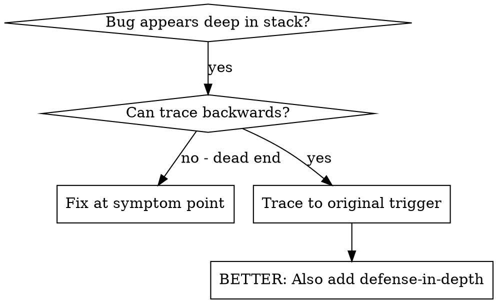
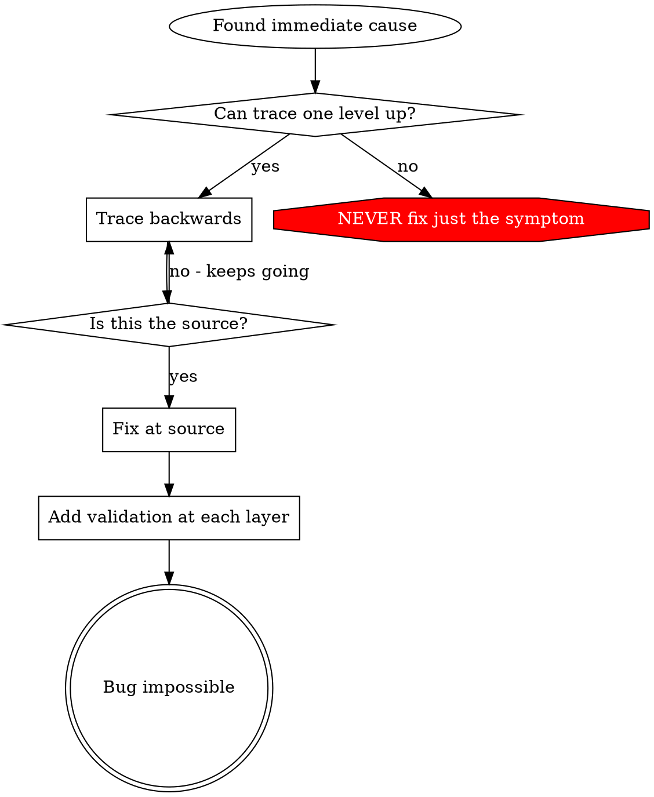

# 根因追踪

## 概述

错误通常会在调用栈深处显现（在错误的目录中执行 git init、在错误的位置创建文件、使用错误的路径打开数据库）。你的本能反应可能是在错误出现的位置进行修复，但这只是在处理症状。

**核心原则：** 沿调用链向后追踪，直到找到最初的触发因素，然后从源头进行修复。

## 何时使用



**适用于以下情况：**

- 错误发生在执行过程的深处（而非入口点）
- 堆栈跟踪显示出很长的调用链
- 不清楚无效数据源自何处
- 需要找出是哪个测试或哪段代码触发了问题

## 追踪过程

### 1. 观察症状

```
Error: git init failed in /Users/jesse/project/packages/core
```

### 2. 找到直接原因

**哪段代码直接导致了这个问题？**

```typescript
await execFileAsync('git', ['init'], { cwd: projectDir });
```

### 3. 追问：谁调用了它？

```typescript
WorktreeManager.createSessionWorktree(projectDir, sessionId)
  → called by Session.initializeWorkspace()
  → called by Session.create()
  → called by test at Project.create()
```

### 4. 继续向上追踪

**传入了什么值？**

- `projectDir = ''`（空字符串！）
- 空字符串作为 `cwd` 时会解析为 `process.cwd()`
- 那正是源代码目录！

### 5. 找到最初的触发因素

**空字符串来自哪里？**

```typescript
const context = setupCoreTest(); // Returns { tempDir: '' }
Project.create('name', context.tempDir); // Accessed before beforeEach!
```

## 添加堆栈跟踪

当你无法手动追踪时，添加检测代码：

```typescript
// Before the problematic operation
async function gitInit(directory: string) {
  const stack = new Error().stack;
  console.error('DEBUG git init:', {
    directory,
    cwd: process.cwd(),
    nodeEnv: process.env.NODE_ENV,
    stack,
  });

  await execFileAsync('git', ['init'], { cwd: directory });
}
```

**关键：** 在测试中使用 `console.error()`（不要使用 logger——它可能不会显示）

**运行并捕获输出：**

```bash
npm test 2>&1 | grep 'DEBUG git init'
```

**分析堆栈跟踪：**

- 查找测试文件名
- 找到触发调用的行号
- 识别其中的模式（同一个测试？同一个参数？）

## 查找导致污染的测试

如果测试期间出现了某些内容，但你不知道是哪个测试导致的：

使用二分查找脚本：@find-polluter.sh

```bash
./find-polluter.sh '.git' 'src/**/*.test.ts'
```

逐个运行测试，并在发现第一个污染源时停止。用法请参阅脚本。

## 真实示例：空的 projectDir

**症状：** `.git` 被创建在 `packages/core/`（源代码）中

**追踪链：**

1. `git init` 在 `process.cwd()` 中运行 ← cwd 参数为空
2. 调用 WorktreeManager 时传入了空的 projectDir
3. 向 Session.create() 传入了空字符串
4. 测试在 beforeEach 之前访问了 `context.tempDir`
5. setupCoreTest() 最初返回 `{ tempDir: '' }`

**根本原因：** 顶层变量初始化时访问了空值

**修复：** 将 tempDir 改为 getter，如果在 beforeEach 之前访问则抛出异常

**还添加了纵深防御：**

- 第 1 层：Project.create() 验证目录
- 第 2 层：WorkspaceManager 验证目录不为空
- 第 3 层：NODE_ENV 防护机制拒绝在 tmpdir 之外执行 git init
- 第 4 层：在 git init 之前记录堆栈跟踪

## 关键原则



**绝不要只修复错误出现的位置。** 向上回溯，找到最初的触发因素。

## 堆栈跟踪技巧

**在测试中：** 使用 `console.error()`，不要使用 logger——logger 可能被抑制  
**操作之前：** 在执行危险操作之前记录日志，而不是等操作失败之后  
**包含上下文：** 目录、cwd、环境变量、时间戳  
**捕获堆栈：** `new Error().stack` 会显示完整的调用链

## 实际影响

来自调试会话（2025-10-03）：

- 通过 5 级追踪找到了根本原因
- 在源头完成修复（getter 验证）
- 添加了 4 层防御
- 1847 项测试通过，零污染