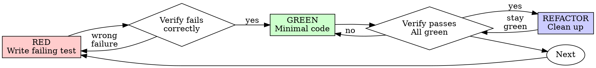

# 测试驱动开发（TDD）

## 概述

先编写测试。观察它失败。编写能够通过测试的最少代码。

**核心原则：** 如果你没有观察测试失败，就不知道它是否测试了正确的内容。

**违反规则的字面要求，就是违反规则的精神实质。**

## 适用时机

**始终适用：**

- 新功能
- Bug 修复
- 重构
- 行为变更

**例外情况（询问你的人工协作者）：**

- 一次性原型
- 生成的代码
- 配置文件

正在想“这次就跳过 TDD，应该没关系吧”？停下。这是在自我合理化。

## 铁律

```
没有先编写失败的测试，就不能编写生产代码
```

在测试之前编写了代码？删除它。重新开始。

**没有例外：**

- 不要把它留作“参考”
- 不要在编写测试时对它进行“改造”
- 不要看它
- 删除就意味着删除

从测试出发重新实现。仅此而已。

## Red-Green-Refactor



### RED - 编写失败的测试

编写一个展示预期行为的最小测试。

<Good>
```typescript
test('retries failed operations 3 times', async () => {
  let attempts = 0;
  const operation = () => {
    attempts++;
    if (attempts < 3) throw new Error('fail');
    return 'success';
  };

  const result = await retryOperation(operation);

  expect(result).toBe('success');
  expect(attempts).toBe(3);
});

```
名称清晰，测试真实行为，只测试一件事
</Good>

<Bad>
```typescript
test('retry works', async () => {
  const mock = jest.fn()
    .mockRejectedValueOnce(new Error())
    .mockRejectedValueOnce(new Error())
    .mockResolvedValueOnce('success');
  await retryOperation(mock);
  expect(mock).toHaveBeenCalledTimes(3);
});
```

名称含糊，测试的是 mock 而不是代码
</Bad>

**要求：**

- 一个行为
- 清晰的名称
- 真实代码（除非无法避免，否则不要使用 mocks）

### 验证 RED - 观察它失败

**强制要求。绝不能跳过。**

```bash
npm test path/to/test.test.ts
```

确认：

- 测试失败（而不是报错）
- 失败消息符合预期
- 失败原因是功能缺失（而不是拼写错误）

**测试通过了？** 你测试的是已有行为。修复测试。

**测试报错了？** 修复错误，重新运行，直到它正确失败。

### GREEN - 最少代码

编写能够通过测试的最简单代码。

<Good>
```typescript
async function retryOperation<T>(fn: () => Promise<T>): Promise<T> {
  for (let i = 0; i < 3; i++) {
    try {
      return await fn();
    } catch (e) {
      if (i === 2) throw e;
    }
  }
  throw new Error('unreachable');
}
```
只编写足以通过测试的代码
</Good>

<Bad>
```typescript
async function retryOperation<T>(
  fn: () => Promise<T>,
  options?: {
    maxRetries?: number;
    backoff?: 'linear' | 'exponential';
    onRetry?: (attempt: number) => void;
  }
): Promise<T> {
  // YAGNI
}
```
过度设计
</Bad>

不要添加功能、重构其他代码，或超出测试范围进行“改进”。

### 验证 GREEN - 观察它通过

**强制要求。**

```bash
npm test path/to/test.test.ts
```

确认：

- 测试通过
- 其他测试仍然通过
- 输出干净（没有错误、警告）

**测试失败？** 修复代码，而不是测试。

**其他测试失败？** 立即修复。

### 重构 - 清理代码

仅在通过后执行：

- 移除重复代码
- 改进命名
- 提取辅助函数

保持测试通过。不要添加行为。

### 重复

为下一个功能处理下一个失败的测试。

## 好的测试

| 质量 | 好 | 坏 |
|---------|------|-----|
| **最小化** | 一件事。如果名称中有“和”？拆分它。 | `test('validates email and domain and whitespace')` |
| **清晰** | 名称描述行为 | `test('test1')` |
| **体现意图** | 展示期望的 API | 让代码应实现的功能变得晦涩 |

## 为什么顺序很重要

**“我会在之后编写测试来验证它是否有效”**

代码编写完成后再写的测试会立即通过。立即通过并不能证明任何事情：

- 可能测试了错误的内容
- 可能测试的是实现，而不是行为
- 可能遗漏了你忘记的边界情况
- 你从未看到它捕获 bug

测试优先会迫使你看到测试失败，从而证明它确实在测试某些内容。

**“我已经手动测试了所有边界情况”**

手动测试是临时性的。你以为自己测试了所有内容，但实际上：

- 没有你测试过什么的记录
- 代码变更后无法重新运行
- 在压力下很容易忘记某些情况
- “我尝试时它能工作” ≠ 全面测试

自动化测试是系统性的。它们每次都以相同的方式运行。

**“删除 X 小时的工作太浪费了”**

这是沉没成本谬误。时间已经花掉了。现在你的选择是：

- 删除并用 TDD 重写（再花 X 小时，但具有高可信度）
- 保留代码并在之后添加测试（30 分钟，但可信度低，很可能有 bug）

真正的“浪费”是保留你无法信任的代码。没有真实测试的可运行代码就是技术债务。

**“TDD 太教条了，务实就意味着要灵活调整”**

TDD 就是务实：

- 在提交前发现 bug（比之后调试更快）
- 防止回归（测试会立即捕获破坏）
- 记录行为（测试展示如何使用代码）
- 支持重构（可以自由更改，测试会捕获破坏）

“务实”的捷径 = 在生产环境中调试 = 更慢。

**“之后再写测试也能达到相同目标——重要的是精神，而不是仪式”**

不是这样。之后再写的测试回答的是“这段代码做什么？”测试优先回答的是“这段代码应该做什么？”

之后再写的测试会受到你的实现影响。你测试的是自己构建的内容，而不是需求要求的内容。你验证的是自己记得的边界情况，而不是发现的边界情况。

测试优先会在实现之前迫使你发现边界情况。之后再写的测试只能验证你是否记住了所有内容（你没有）。

写 30 分钟的事后测试 ≠ TDD。你获得了覆盖率，却失去了测试有效的证明。

## 常见的合理化借口

| 借口 | 现实 |
|--------|---------|
| “太简单了，不值得测试” | 简单代码也会出问题。测试只需 30 秒。 |
| “我之后会测试” | 测试立即通过并不能证明任何事情。 |
| “之后再写测试也能达到相同目标” | 之后再写测试 = “这段代码做什么？”测试优先 = “这段代码应该做什么？” |
| “我已经手动测试过了” | 临时测试 ≠ 系统性测试。没有记录，也无法重新运行。 |
| “删除 X 小时的工作太浪费了” | 沉没成本谬误。保留未经验证的代码就是技术债务。 |
| “保留它作为参考，先写测试” | 你会调整它。这就是之后再写测试。删除就意味着删除。 |
| “我需要先探索一下” | 没问题。丢弃探索结果，从 TDD 开始。 |
| “测试很难 = 设计不清晰” | 听从测试的反馈。难以测试 = 难以使用。 |
| “TDD 会拖慢我的速度” | TDD 比调试更快。务实 = 测试优先。 |
| “手动测试更快” | 手动测试无法证明边界情况。每次变更后你都要重新测试。 |
| “现有代码没有测试” | 你正在改进它。为现有代码添加测试。 |

## 危险信号——停止并重新开始

- 先写代码再写测试
- 实现后再写测试
- 测试立即通过
- 无法解释测试为何失败
- “稍后”再添加测试
- 为“就这一次”找借口
- “我已经手动测试过了”
- “实现后再写测试也能达到同样的目的”
- “重要的是精神，不是仪式”
- “保留作为参考”或“改编现有代码”
- “已经花了 X 个小时，删除太浪费了”
- “TDD 太教条了，我是在务实地做事”
- “这次不一样，因为……”

**所有这些都意味着：删除代码。使用 TDD 重新开始。**

## 示例：修复 Bug

**Bug：** 接受空电子邮件地址

**RED**

```typescript
test('rejects empty email', async () => {
  const result = await submitForm({ email: '' });
  expect(result.error).toBe('Email required');
});
```

**验证 RED**

```bash
$ npm test
FAIL: expected 'Email required', got undefined
```

**GREEN**

```typescript
function submitForm(data: FormData) {
  if (!data.email?.trim()) {
    return { error: 'Email required' };
  }
  // ...
}
```

**验证 GREEN**

```bash
$ npm test
PASS
```

**REFACTOR**
如果需要，为多个字段提取验证逻辑。

## 验证清单

在将工作标记为完成之前：

- [ ] 每个新增函数/方法都有测试
- [ ] 在实现之前观察每个测试失败
- [ ] 每个测试都因预期原因失败（功能缺失，而不是拼写错误）
- [ ] 编写了通过每个测试所需的最少代码
- [ ] 所有测试均通过
- [ ] 输出干净（无错误、无警告）
- [ ] 测试使用真实代码（仅在不可避免时使用 mock）
- [ ] 已覆盖边界情况和错误

无法勾选所有项目？说明你跳过了 TDD。重新开始。

## 遇到困难时

| 问题 | 解决方案 |
|---------|----------|
| 不知道如何测试 | 写出理想中的 API。先写断言。向与你协作的人寻求帮助。 |
| 测试过于复杂 | 设计过于复杂。简化接口。 |
| 必须 mock 所有内容 | 代码耦合过于严重。使用依赖注入。 |
| 测试设置过于庞大 | 提取辅助函数。仍然复杂？简化设计。 |

## 调试集成

发现 Bug？编写能够重现该问题的失败测试。遵循 TDD 循环。测试既能证明修复有效，也能防止回归。

绝不要在没有测试的情况下修复 Bug。

## 最终规则

```
Production code → test exists and failed first
Otherwise → not TDD
```

未经与你协作的人许可，不得有任何例外。

---

# 测试反模式

## 概述

测试必须验证真实行为，而不是 mock 的行为。Mock 是用于隔离的手段，而不是被测试的对象。

**核心原则：** 测试代码做了什么，而不是 mock 做了什么。

**遵循严格的 TDD 可以避免这些反模式。**

## 铁律

```
1. NEVER test mock behavior
2. NEVER add test-only methods to production classes
3. NEVER mock without understanding dependencies
```

## 反模式 1：测试 Mock 行为

**违规示例：**

```typescript
// ❌ BAD: Testing that the mock exists
test('renders sidebar', () => {
  render(<Page />);
  expect(screen.getByTestId('sidebar-mock')).toBeInTheDocument();
});
```

**为什么这是错误的：**

- 你验证的是 mock 是否正常工作，而不是组件是否正常工作
- mock 存在时测试通过，不存在时测试失败
- 无法告诉你任何关于真实行为的信息

**你的人类伙伴的纠正：**“我们是在测试 mock 的行为吗？”

**修复方法：**

```typescript
// ✅ GOOD: Test real component or don't mock it
test('renders sidebar', () => {
  render(<Page />);  // Don't mock sidebar
  expect(screen.getByRole('navigation')).toBeInTheDocument();
});

// OR if sidebar must be mocked for isolation:
// Don't assert on the mock - test Page's behavior with sidebar present
```

### 门禁函数

```
BEFORE asserting on any mock element:
  Ask: "Am I testing real component behavior or just mock existence?"

  IF testing mock existence:
    STOP - Delete the assertion or unmock the component

  Test real behavior instead
```

## 反模式 2：生产代码中的仅用于测试的方法

**违规示例：**

```typescript
// ❌ BAD: destroy() only used in tests
class Session {
  async destroy() {  // Looks like production API!
    await this._workspaceManager?.destroyWorkspace(this.id);
    // ... cleanup
  }
}

// In tests
afterEach(() => session.destroy());
```

**错误原因：**

- 生产类中混入了仅用于测试的代码
- 如果在生产环境中被意外调用，会很危险
- 违反 YAGNI 和关注点分离原则
- 混淆了对象生命周期与实体生命周期

**修复方法：**

```typescript
// ✅ GOOD: Test utilities handle test cleanup
// Session has no destroy() - it's stateless in production

// In test-utils/
export async function cleanupSession(session: Session) {
  const workspace = session.getWorkspaceInfo();
  if (workspace) {
    await workspaceManager.destroyWorkspace(workspace.id);
  }
}

// In tests
afterEach(() => cleanupSession(session));
```

### 门禁函数

```
BEFORE adding any method to production class:
  Ask: "Is this only used by tests?"

  IF yes:
    STOP - Don't add it
    Put it in test utilities instead

  Ask: "Does this class own this resource's lifecycle?"

  IF no:
    STOP - Wrong class for this method
```

## 反模式 3：在不了解的情况下进行 mock

**违规示例：**

```typescript
// ❌ BAD: Mock breaks test logic
test('detects duplicate server', () => {
  // Mock prevents config write that test depends on!
  vi.mock('ToolCatalog', () => ({
    discoverAndCacheTools: vi.fn().mockResolvedValue(undefined)
  }));

  await addServer(config);
  await addServer(config);  // Should throw - but won't!
});
```

**错误原因：**

- 被 mock 的方法具有测试所依赖的副作用（写入配置）
- 为了“安全”而过度 mock，破坏了实际行为
- 测试因错误的原因通过，或莫名其妙地失败

**修复方法：**

```typescript
// ✅ GOOD: Mock at correct level
test('detects duplicate server', () => {
  // Mock the slow part, preserve behavior test needs
  vi.mock('MCPServerManager'); // Just mock slow server startup

  await addServer(config);  // Config written
  await addServer(config);  // Duplicate detected ✓
});
```

### 门禁函数

```
BEFORE mocking any method:
  STOP - Don't mock yet

  1. Ask: "What side effects does the real method have?"
  2. Ask: "Does this test depend on any of those side effects?"
  3. Ask: "Do I fully understand what this test needs?"

  IF depends on side effects:
    Mock at lower level (the actual slow/external operation)
    OR use test doubles that preserve necessary behavior
    NOT the high-level method the test depends on

  IF unsure what test depends on:
    Run test with real implementation FIRST
    Observe what actually needs to happen
    THEN add minimal mocking at the right level

  Red flags:
    - "I'll mock this to be safe"
    - "This might be slow, better mock it"
    - Mocking without understanding the dependency chain
```

## 反模式 4：不完整的 Mock

**违规示例：**

```typescript
// ❌ BAD: Partial mock - only fields you think you need
const mockResponse = {
  status: 'success',
  data: { userId: '123', name: 'Alice' }
  // Missing: metadata that downstream code uses
};

// Later: breaks when code accesses response.metadata.requestId
```

**为什么这是错误的：**

- **不完整的 mock 会隐藏结构假设** - 你只 mock 了自己了解的字段
- **下游代码可能依赖你未包含的字段** - 导致静默失败
- **测试通过但集成失败** - mock 不完整，而真实 API 是完整的
- **虚假的信心** - 测试无法证明真实行为

**铁律：** Mock 真实存在的完整数据结构，而不只是当前测试直接使用的字段。

**修复方法：**

```typescript
// ✅ GOOD: Mirror real API completeness
const mockResponse = {
  status: 'success',
  data: { userId: '123', name: 'Alice' },
  metadata: { requestId: 'req-789', timestamp: 1234567890 }
  // All fields real API returns
};
```

### 门禁函数

```
BEFORE creating mock responses:
  Check: "What fields does the real API response contain?"

  Actions:
    1. Examine actual API response from docs/examples
    2. Include ALL fields system might consume downstream
    3. Verify mock matches real response schema completely

  Critical:
    If you're creating a mock, you must understand the ENTIRE structure
    Partial mocks fail silently when code depends on omitted fields

  If uncertain: Include all documented fields
```

## 反模式 5：将集成测试视为事后工作

**违规示例：**

```
✅ Implementation complete
❌ No tests written
"Ready for testing"
```

**为什么这是错误的：**

- 测试是实现的一部分，而不是可选的后续工作
- TDD 本可以发现这个问题
- 没有测试就不能声称实现完成

**修复方法：**

```
TDD cycle:
1. Write failing test
2. Implement to pass
3. Refactor
4. THEN claim complete
```

## Mock 变得过于复杂时

**警告信号：**

- Mock 设置代码比测试逻辑还长
- 为了让测试通过而 mock 一切
- Mock 缺少真实组件具备的方法
- Mock 发生变化时测试就会中断

**你的人工搭档的问题：**“这里真的需要使用 mock 吗？”

**考虑：** 使用真实组件的集成测试通常比复杂的 mock 更简单

## TDD 可以防止这些反模式

**TDD 的帮助：**

1. **先编写测试** → 迫使你思考自己实际要测试的内容
2. **观察测试失败** → 确认测试测试的是真实行为，而不是 mock
3. **最小化实现** → 不会有仅用于测试的方法混入生产代码
4. **真实依赖** → 在进行 mock 之前，你会看到测试实际需要什么

**如果你测试的是 mock 的行为，就违反了 TDD** - 你在没有先观察测试针对真实代码失败的情况下添加了 mock。

## 快速参考

| 反模式 | 修复方法 |
|--------------|-----|
| 断言 mock 元素 | 测试真实组件，或取消 mock |
| 生产代码中的仅测试方法 | 移至测试工具 |
| 在不了解依赖的情况下进行 mock | 先了解依赖，再进行最小化 mock |
| 不完整的 mock | 完整复刻真实 API |
| 将测试视为事后工作 | TDD - 先写测试 |
| 过于复杂的 mock | 考虑集成测试 |

## 危险信号

- 针对 `*-mock` 测试 ID 的断言检查
- 只在测试文件中调用的方法
- Mock 设置占测试内容的 50% 以上
- 移除 mock 后测试失败
- 无法解释为什么需要 mock
- “只是为了保险起见”而进行 Mock

## 最重要的一点

**Mock 是用于隔离的工具，而不是需要测试的对象。**

如果 TDD 暴露出你正在测试 mock 的行为，那就说明你已经走偏了。

修正方法：测试真实行为，或者质疑为什么要进行 mock。