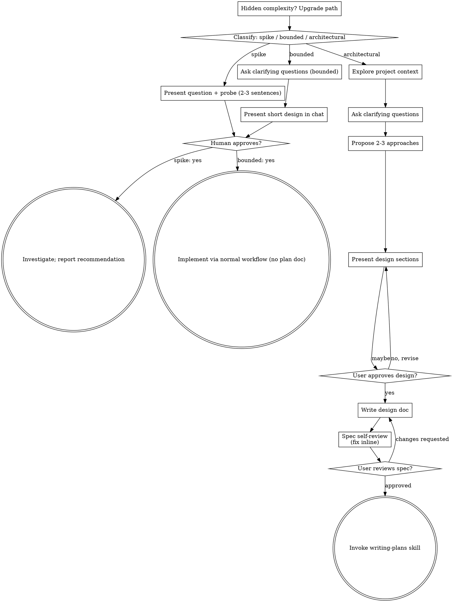

# 将创意转化为设计

通过自然的协作式对话，将想法转化为完整的设计和规格说明。

先开始判断请求所需的流程程度，然后按路径推进：理解上下文、细化想法、展示设计并获得你的审核。

<HARD-GATE>
在获得你的确认并告知你的意图之前，请不要调用任何实现技能、编写任何代码、搭建任何项目或采取任何实现行动。这适用于下方的**每一类任务**——流程规模会随任务变化而变化，但审批门槛不会改变。
</HARD-GATE>

## 三种路径

在你第一个问题之前，先进行分类并大声说出分类——“这看起来是 bounded，因此我在这里先给出一个简短设计而不是写规格”——这样你的人工合作伙伴可以进行覆盖修正：

- **Spike** — 一类可行性问题（“我们能否……”、“是否可能……”、“速成和粗糙也可以”），其输出应是答案，而不是你保留的代码。用 2-3 句话说明问题和你计划尝试的内容，获得认可后按正确性要求以最低成本去验证。无需设计文档或规格文件。将发现作为建议报告；你构建的任何内容都应标记为临时可丢弃。
- **Bounded** — 对这个仓库中已存在代码的一个范围明确的改动：新增一个 flag、一个小型接口点、一个单文件修复。仅了解应用类型是不够的——bounded 意味着你要改动的流程已在此仓库中可阅读到。如果没有现有流程可改，任务就不算 bounded。提出必要的澄清问题，在聊天里给出一个简短设计（几句话到几段短文）并停止。只有在得到人工合作伙伴对该设计的同意后才开始实现——bounded 任务的审批门槛与架构任务一样严格。无需规格文件，也不需要实现计划文档。
- **Architectural** — 新建项目、子系统，或重构组件组合方式、修改其他组件依赖的接口。按完整流程执行：提问、备选方案、分章节设计、书面规格，之后再调用 writing-plans 技能。

若有疑虑，两个路径之间取更重的那一个。路径是单向的：任务中途发现隐藏复杂度时应升级路径——停止并说明，随后上调。任务中途不允许降级。

## 反模式：“太简单，不需要审批”

每条路径都必须在实现前获得你的审核。一个待办列表、单函数工具、配置变更都一样——设计可能只需两句话，但你仍必须给出并获得同意。所谓“简单”任务恰恰是未被审视假设导致大量返工的来源。简单度影响的是产物规模，而不是审批规模。

## 风险信号

| 思考 | 现实 |
|---------|---------|
| “这任务太简单，不需要设计” | 简单只意味着设计很短，不意味着不需要设计。两句话即可先说明，再审批。 |
| “我把它定为 bounded 就能跳过规格” | 用标签去跳过工作本身就是疑点——应选择更重的路径。 |
| “它 bounded 且设计很明显，我就边看边写” | 门槛是审批，而不是设计长度。先给出并提交，再等待明确同意。 |
| “我懂这类应用，所以它是 bounded” | bounded 评估的是仓库现状，而非你的熟悉程度。新项目没有现成流程，因此是架构类任务。 |
| “spike 可行了，所以我保留这段代码” | spike 的输出应是结论。保留代码是一个新请求，应重新分类。 |
| “它变大了，但我快做完了——不需要重新分类” | 隐藏复杂度会在任务中途升级路径。停止并说明。 |
| “他们已经批准了 spike，所以后续改动也算批准” | 每个任务都需要独立分类并独立审批。 |

## 检查清单

先分类，宣布路径，再按路径逐项创建任务并按顺序完成。

**Spike:**
1. **探索项目上下文** — 提供足够线索以定义探查范围
2. **提交问题与探测方案** — 2-3 句话
3. **获得审批** — 点头即可
4. **调研** — 在正确性允许的范围内以最小成本进行
5. **汇报发现** — 给出建议；把已构建内容标记为临时可丢弃

**Bounded:**
1. **探索项目上下文** — 检查文件、文档和近期提交
2. **提澄清问题** — 一次只问一个，优先关键问题
3. **在聊天中给出简短设计** — 说明思路、涉及文件、测试方式
4. **获得审批** — 停止并等待明确“是”；在同一句里先展示设计后立刻开工等于跳过审批
5. **实施** — 按常规开发流程进行（适用 TDD）；不写计划文档

**Architectural:**
1. **探索项目上下文** — 检查文件、文档和近期提交
2. **提供即时视觉助手** — 不是预先给出。第一次出现“图示能比文字更清楚”的问题时再提出（另起一条消息）；若获批，该浏览器标签会为你打开。若全程不出现此类问题，则不提供。详见下方 Visual Companion 部分。
3. **提澄清问题** — 一次只问一个，确认目标、约束与成功标准
4. **提出 2-3 个方案** — 给出权衡与推荐选项
5. **提交设计** — 按复杂度分章节展示，每个章节后获取用户批准
6. **编写设计文档** — 保存到 `docs/superpowers/specs/YYYY-MM-DD-<topic>-design.md` 并提交
7. **规格自检** — 快速内联检查占位符、矛盾、含糊、范围问题（见下）
8. **用户评审书面规格** — 在继续前请用户审阅规格文件
9. **转入实施** — 调用 writing-plans 技能创建实现计划

## 流程图

已收到。我先按流程确认：在开始翻译前，请你先指定要启用的 **skill / plugin 整组**（可直接选择具体 skill 或按整组）。当前可用组包括：`agent-reach`、`baoyu-skills`、`delegate`、`lark`、`ljg-skills`、`local-tools`、`matt-pocock-skills`、`openspec`、`product-workflow`、`skill-creator`、`skills-ecosystem`，以及 `unclassified`。  
你也可以先直接回复“本次不额外启用”。
