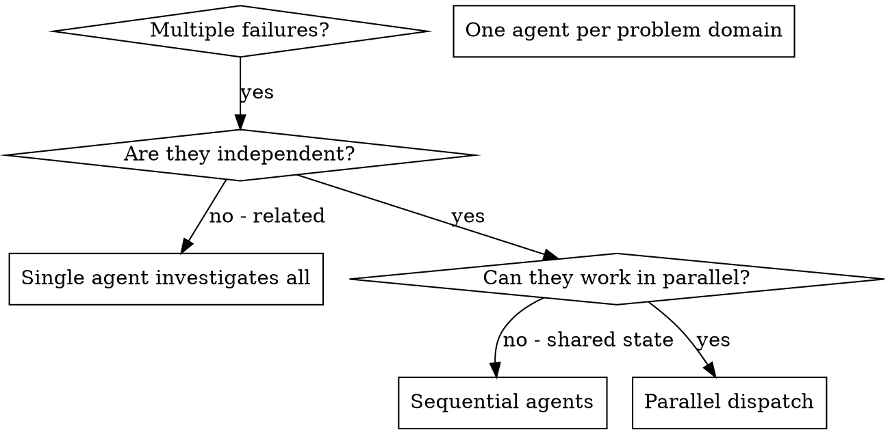

# 并行派发子代理

## 概览

你会将任务委派给具有隔离上下文的特定代理。通过精确编写他们的指令和上下文，你可以确保他们保持专注并完成任务。它们不应继承你会话的上下文或历史——你要构造它们所需的全部内容。这也能在你进行协调工作时，保持自己的上下文完整。

当你遇到多个不相关的故障（不同测试文件、不同子系统、不同缺陷）时，按顺序逐一调查会浪费时间。每次调查都是独立的，并且可以并行进行。

**核心原则：** 每个独立问题域派遣一个代理，让它们并行工作。

## 何时使用



**适合使用的场景：**
- 3 个及以上测试文件因不同根因失败
- 多个子系统独立损坏
- 每个问题可在不依赖其他问题上下文的前提下理解
- 调查之间没有共享状态

**不适合使用的场景：**
- 失败之间存在关联（修复一个可能会修复其他）
- 需要理解完整系统状态
- 代理之间可能互相干扰

## 工作模式

### 1. 识别独立问题域

按故障类型分组：
- 文件 A 的测试：工具授权流程
- 文件 B 的测试：批量完成行为
- 文件 C 的测试：中止功能

每个问题域都是独立的——修复工具授权不会影响中止测试。

### 2. 创建聚焦代理任务

每个代理都会获得：
- **明确范围：** 一个测试文件或一个子系统
- **明确目标：** 让这些测试通过
- **约束条件：** 不要修改其他代码
- **预期输出：** 总结你发现并修复了什么

### 3. 并行派发

在同一条回复中下发所有三个子代理任务——它们会并行运行：

```text
Subagent (general-purpose): "Fix agent-tool-abort.test.ts failures"
Subagent (general-purpose): "Fix batch-completion-behavior.test.ts failures"
Subagent (general-purpose): "Fix tool-approval-race-conditions.test.ts failures"
# All three run concurrently.
```

同一回复中的多个派发调用 = 并行执行。每条回复一个派发 = 串行执行。

### 4. 审核与整合

代理返回后：
- 阅读每个总结
- 验证修复之间不冲突
- 运行完整测试套件
- 整合全部变更

## 代理提示词结构

好的代理提示词应具备：
1. **聚焦**——单一明确的问题域
2. **自包含**——包含理解问题所需的全部上下文
3. **输出清晰具体**——要求代理返回什么内容？

```markdown
Fix the 3 failing tests in src/agents/agent-tool-abort.test.ts:

1. "should abort tool with partial output capture" - expects 'interrupted at' in message
2. "should handle mixed completed and aborted tools" - fast tool aborted instead of completed
3. "should properly track pendingToolCount" - expects 3 results but gets 0

These are timing/race condition issues. Your task:

1. Read the test file and understand what each test verifies
2. Identify root cause - timing issues or actual bugs?
3. Fix by:
   - Replacing arbitrary timeouts with event-based waiting
   - Fixing bugs in abort implementation if found
   - Adjusting test expectations if testing changed behavior

Do NOT just increase timeouts - find the real issue.

Return: Summary of what you found and what you fixed.
```

## 常见错误

**❌ 过于宽泛：** “修复所有测试”——代理会失去焦点  
**✅ 聚焦明确：** “Fix agent-tool-abort.test.ts”——明确范围

**❌ 缺乏上下文：** “修复竞态条件”——代理不知道问题在哪里  
**✅ 具备上下文：** 粘贴错误信息和测试名称

**❌ 无约束：** 代理可能重构过多内容  
**✅ 明确约束：** “不要更改生产代码”或“仅修复测试”

**❌ 输出模糊：** “修好了”——你不知道改了什么  
**✅ 具体说明：** “返回根因与变更摘要”

## 不适用的场景

**相关故障：** 修复一个可能会修复其他故障——应先一起排查  
**需要完整上下文：** 理解问题需要查看整个系统  
**探索性调试：** 你还不知道具体坏在哪  
**共享状态：** 代理之间会互相干扰（编辑同一文件、使用同一资源）

## 会话中的真实示例

**场景：** 大规模重构后，3 个文件出现 6 个测试失败

**失败项：**
- agent-tool-abort.test.ts：3 个失败（时序问题）
- batch-completion-behavior.test.ts：2 个失败（工具未执行）
- tool-approval-race-conditions.test.ts：1 个失败（执行计数为 0）

**决策：** 问题域独立——中止逻辑、批量完成和竞态条件彼此独立

**派发：**
```
Agent 1 → Fix agent-tool-abort.test.ts
Agent 2 → Fix batch-completion-behavior.test.ts
Agent 3 → Fix tool-approval-race-conditions.test.ts
```

**结果：**
- Agent 1：将超时替换为基于事件的等待
- Agent 2：修复事件结构问题（threadId 放在错误位置）
- Agent 3：添加了异步工具执行完成的等待

**整合：** 所有修复互不冲突，完整套件通过

## 验证

代理返回后：
1. **查看每个总结**——理解改动内容
2. **检查冲突**——代理是否编辑了相同代码？
3. **运行完整套件**——验证所有修复可协同工作
4. **抽样检查**——代理可能会出现系统性错误
