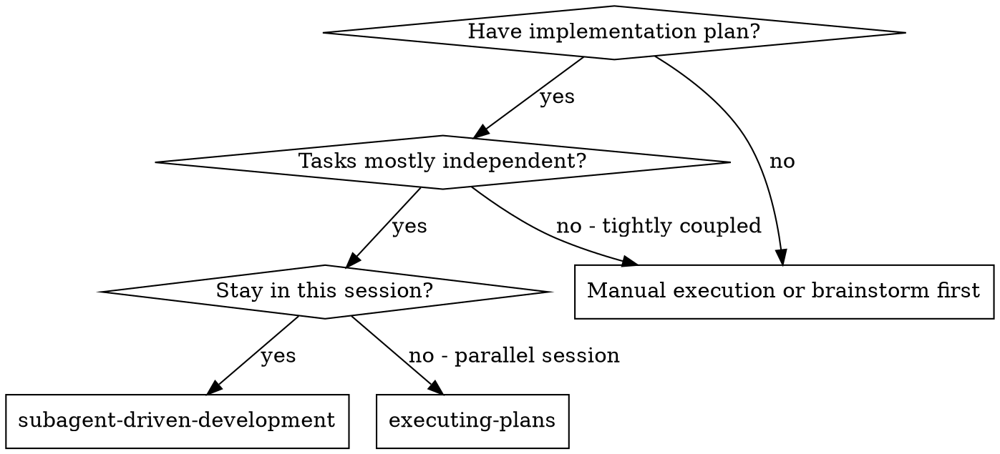
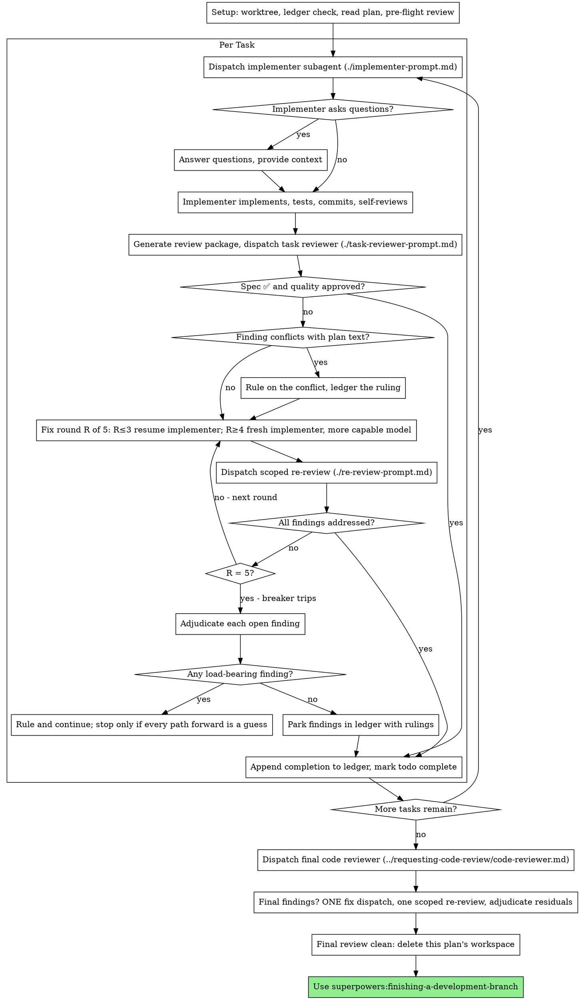

# 子代理驱动开发

按每个任务派发一个全新的实现子代理，在每个任务后进行一次任务评审（规格符合性 + 代码质量），并在最后进行一次全分支的广泛复核。

**为什么使用子代理：** 你向专门化代理分派任务，并隔离其上下文。通过精确设计它们的指令和上下文，可以让它们保持专注并顺利完成任务。它们不应继承你会话的上下文或历史——你只提供它们所需的内容。这样也能保留你自身上下文，用于协同管理工作。

**核心原则：** 每任务全新子代理 + 任务评审（规格 + 质量）+ 最终整体复核 = 高质量、快速迭代

**叙事要求：** 在工具调用之间，最多只写一句简短说明——台账与工具结果会记录过程。

**持续执行：** 不要在任务之间停下来向你的人工合作方汇报。按计划执行所有任务，不要中断。唯一停止原因只有下面四条，或所有任务完成。  
“要继续吗？”这类提示和进度汇报会浪费他们的时间——他们要求你执行计划，因此请执行计划。

**裁定，而非停滞。** 运行中的计划不应等待人工。冲突、歧义、计划缺陷、你本会提出但被限制的上限，均由你裁定。规范是最高约束，计划是其论据，而你的判断决定那些未明确的内容。将每次决定记录到台账中：`裁定：<你的决定> — <原因> — <错误决策的代价>`，并继续前进。一次错误裁定会带来可见返工；把问题搁置一天会浪费对方整天时间且一无所获。

以下四类情况会让你停止，并且只有这四类：不可逆或破坏性操作；安全敏感行为；本工作树之外可能产生影响且按常规需要先征询你的操作（如合并、推送到共享分支、发布）；以及计划已如此破损，以致每条路径都只能靠猜测。出现这些情况时，停止并询问。

## 使用场景



**vs. 执行计划（并行会话）：**
- 同一会话（无上下文切换）
- 每任务全新子代理（无上下文污染）
- 每个任务后复核（规格符合性 + 代码质量），最终再进行一次广泛复核
- 更快迭代（任务间无需人工回路）

## 流程



## 准备工作

确保工作在隔离工作区进行：使用
`superpowers:using-git-worktrees` 创建一个工作区或验证现有工作区。
未经你的人工合作方明确同意，不得在 main/master 分支上开始实施。

会话记忆在上下文压缩后无法保留。真实会话中，丢失执行位置的控制器会重新派发整段已完成的任务序列——这是观察到最昂贵的一类失败。请在账本文件中跟踪进度，而不仅仅依赖待办事项。

- 每个计划拥有一个工作区：在技能启动时，运行该技能的
  `scripts/sdd-workspace PLAN_FILE`，它会输出该计划的 git 忽略目录（`<repo-root>/.superpowers/sdd/<plan-basename>/`），其中存放该计划的全部产物：账本、简报、报告、评审包。其他计划的目录不属于你读取或写入的权限范围。
- 检查该计划的账本在 `<workspace>/progress.md`。如果其第一行标明了你的计划文件，那么带有 `Task <N>: complete` 一行的任务即已完成——不要重新派发它们；从第一个没有该行的任务继续。若某个任务的最后一行是一次修复轮次，说明该任务处于中间循环：从下一轮继续。若第一行标明的是其他计划文件，或在旧的扁平路径 `.superpowers/sdd/progress.md` 上发现了游离账本，则说明这是其他计划的进度：保留它，并开始你自己的全新账本。
- 用身份信息创建账本，作为第一行：
  `# SDD ledger — plan: <plan file path>`。
- 账本是你的恢复地图：其中记录的提交即使上下文不再记得你也创建过，也会保留在 git 中。上下文丢失后，应信任账本和 `git log`，胜过自身记忆。
- `git clean -fdx` 会销毁工作区（它是 git 忽略的临时内容）；若发生这种情况，请从 `git log` 恢复。

先完整阅读计划，记录其上下文与全局约束，并为每个任务创建一条待办。如果计划引用了 Spec，也要阅读它：计划的论据基于该 Spec，内部冲突应以 Spec 为准。没有可达 Spec 的计划需在账本中注明——没有 Spec 的裁决是临时性的。

在派发任务 1 之前，先快速扫描计划中的冲突，并在检查时记录你的核对内容：

- 互相冲突的任务或与计划全局约束冲突的任务
- 计划明确要求但评审量规会视为缺陷的内容（例如：断言为空的测试、逻辑块逐字重复）

扫描结果是表格，而非结论。每一行对应一对共享文件或接口的任务：这两个任务中，一个产出什么、另一个消费什么，以及你的发现。每个任务也应有一行：它的文本是否自洽——任务指定的测试是否与其指定的代码匹配，创建的文件是否与后续触及的文件一致。没有这些行的“The scan is clean”都不算是真正的扫描。

将该表写入账本。在执行开始前先对所有发现做裁决——每一项裁决都要依据计划文本中的强制性说明——并将裁决逐条写入账本。若扫描结果是“干净”，则直接执行，不再附加说明。对扫描发现的每个冲突都要裁决——以 Spec 为绑定依据，计划为论据——并在对应行旁记录裁决后再派发任务 1。复审循环仍用于处理实现过程中才显现的冲突。

## 模型选择

使用每个角色所需的最低强度模型，以节省成本并提升速度。

**机械化实施任务**（独立函数、明确规格、1–2 个文件）：使用快速且廉价的模型。多数实施任务在计划定义清晰时都是机械化任务。

**集成与判断任务**（多文件协同、模式匹配、调试）：使用标准模型。

**架构与设计任务**：使用可用的最强模型。最终整分支评审属于此类——请在最强可用模型上派发，而不是会话默认模型。

**评审任务**：按 diff 的规模、复杂度与风险选择匹配的模型。小型机械化 diff 不需要最强模型；对细微并发变更则需要更强模型。对小规模修复 diff 的复审可用便宜到中等层级。

**修复循环升级（第 4–5 轮）**：使用至少比卡住时的实施者高一个层级的模型。

**派发子代理时必须显式指定模型。** 省略模型会继承你的会话模型——通常是最强且最贵的模型，这会悄然违背本节要求。

**轮次比 token 价格更重要。** 子代理在多步工作中常耗费 2–3 倍轮次，因此即使最便宜的模型也更省总体成本。审阅者与实施者的默认层级至少应为中等。若任务计划文本中包含完整代码，实施则是“抄写+测试”，请使用最便宜的层级来完成该实施者。单文件的机械修复也应使用最便宜层级。

**任务复杂度信号（实施任务）：**
- 修改 1–2 个文件且规格完整 → 廉价模型
- 涉及多文件并有集成关注点 → 标准模型
- 需要设计判断或广泛的代码库理解 → 最强模型

## 任务循环

**批量处理小型同构工作。** 当计划列出若干任务，每个都是同类的小型独立改动——例如相同的一行修复、常量变更、跨文件重复字段新增——不要给每个任务都派发一个子代理。将涉及的文件及其变更一次性整理为一个派发说明，发给单一子代理，并将其 diff 作为一个整体进行复核。仅对需要独立判断、独立测试或独立评审面的工作保留“每任务一派发”。
你在派发提示中粘贴的所有内容，以及子代理返回的所有内容，都将保留在会话上下文并在后续轮次重新读取。请将制品通过文件交接。

**等待已派发子代理：** 切勿用很短超时轮询等待界面，也不要长时间静默无期限等待。只要你有本地工作可做（账本更新、打包下一次评审、阅读报告），就继续工作；子代理结果会自行返回。若你确实空闲，请以五到十分钟为一次有界等待，并在每个间隔发送一行状态更新、列出当前子代理，并追踪任何已完成但未汇报的子代理。有界等待既保留了大部分长时等待效率，也能在数分钟内发现卡住或丢失的子代理，而不是等到会话结束。

### 1. 派发实施者

在派发前记录 BASE（`git rev-parse HEAD`）——评审包和修复轮次 diff 需要它。

- **任务说明：** 在派发实施者前，运行该技能的
  `scripts/task-brief PLAN_FILE N`，它会将任务全文提取到一个唯一命名的文件并输出路径。你的派发内容应使该说明成为需求唯一来源。派发说明中应包含：
  （1）该任务在项目中的位置的一行说明；
  （2）说明文件路径，以“请先阅读——这是你的需求，包含必须逐字使用的精确值”作为引导；
  （3）该任务说明中无法获知的来自前置任务的接口与决策；
  （4）你在说明中发现的模糊点的裁决；
  （5）报告文件路径与报告约定。精确值（数字、关键字符串、签名、测试用例）只应在说明中出现。严禁让子代理读取整份计划文件。
- **报告文件：** 按照说明文件命名报告文件（说明为
  `…/task-N-brief.md` 时，报告文件为 `…/task-N-report.md`），并将其写入派发提示。实施者将完整报告写入该文件，仅返回状态、提交、单行测试摘要和关注点。
- 派发提示应只描述一个任务，不应包含会话历史。不要在后续派发中粘贴累计的先前任务总结（如“Tasks 1-3 之后的状态”）——真实会话中曾出现 42k 字符中有 99% 是历史粘贴。一个新子代理只需要任务、它触及的接口和全局约束。除此之外不需要任何内容。
- 派发中应包含“禁止再派生子代理”的约束（见实施者模板）：实施者不得派发子代理——无论助手、评审都不行。评审由你在事后进行。在真实会话中，每个审阅者子代理都重复执行了你已派发的任务评审——相当于为每个任务额外增加了一名复审席位。
- 如果前置任务在该任务触及区域留下了发现，请在派发中携带该账本条目的引用。
- 记录实施者的代理身份（来自派发结果）——修复循环第 1–3 轮将继续使用该代理。
- 切勿并行派发多个实现子代理（会产生冲突）。

Template: [implementer-prompt.md](implementer-prompt.md)

### 2. 处理报告

Implementer 子代理会报告四种状态之一。请按对应方式处理：

**DONE:** 生成审查包（`scripts/review-package PLAN_FILE BASE HEAD`，在该技能目录下运行——它会打印出写入的唯一文件路径；BASE 是你在分派 implementer 之前记录的提交，不要使用 `HEAD~1`，因为它会在多提交任务中默默只保留最后一次提交），然后将该路径用于分派任务审查员。

**DONE_WITH_CONCERNS:** Implementer 已完成工作但提出了疑虑。继续之前先阅读这些疑虑。如果疑虑涉及正确性或范围，请先处理完再进行审查；如果只是观察类内容（例如“这个文件越来越大”），记录下来并继续审查。

**NEEDS_CONTEXT:** Implementer 需要未提供的信息。补充缺失上下文后重新分派。

**BLOCKED:** Implementer 无法完成任务。评估阻塞原因：
1. 如果是上下文问题，补充更多上下文并使用同一模型重新分派  
2. 如果任务需要更多推理，使用更强的模型重新分派  
3. 如果任务过大，则拆分为更小的任务  
4. 如果计划本身有误，做出修正裁决，写入账本，并带着裁决结果重新分派  

**Never** 忽略升级请求，也不要在不做修改的情况下强迫同一模型重试。如果 Implementer 说自己卡住了，说明必须做出变更。

若 Implementer 提问——无论是在开始前还是执行中——请明确完整地回答，按需补充上下文，不要仓促进入实现。

### 3. 审查任务

每个任务的审查是按任务范围设定的门禁。广泛审查只在最终整分支审查中进行一次。不要跳过任务审查，也不要接受缺少任一裁决的报告——必须同时具备 spec 合规 与任务质量两项。Implementer 自审不能替代任务审查，两者都必须完成。

- 将 reviewer 的 diff 作为一个文件交付：运行此技能的 `scripts/review-package PLAN_FILE BASE HEAD` 并将其打印的文件路径传给 reviewer（或在不用 bash 的情况下，将 `git log --oneline`、`git diff --stat` 和 `git diff -U10` 对应提交范围输出到一个唯一命名文件中）。该输出不会进入你自己的上下文，reviewer 可以在一次 Read 调用中看到提交列表、统计摘要和带上下文的完整 diff。必须使用在分派 implementer 前记录的 BASE——不要用 `HEAD~1`，因为它会在多提交任务中默默只保留最后一次提交。切勿在没有 diff 文件的情况下分派任务 reviewer。  
- **Reviewer 输入：** 任务 reviewer 会收到三条路径——同一份 brief 文件、报告文件和审查包路径——以及约束该任务的全局限制。  
- 你给 reviewer 的 global-constraints 区块是其关注焦点。请从计划中的 Global Constraints 部分或 spec 中逐字复制绑定要求：精确的数值、精确的格式，以及组件之间的明确关系（如“same layout as X”、“matches Y”）。reviewer 的模板已包含流程规则（YAGNI、测试规范、审查方法）——constraints 区块用于本项目 spec 的具体要求。  
- 不要添加“检查所有用法”或“如有需要就跑竞争测试”这类无具体任务依据的开放式指令。  
- 不要要求 reviewer 重跑 implementer 已在同一代码上执行过的测试——implementer 的报告已提供测试证据。  
- 不要事前替 reviewer 做结论裁定——绝不要指示忽略或不标记某个问题。若你认为某条发现是误报，就让 reviewer 提出并在审查闭环中你来裁定。如果你写入的提示出现了“不要标记”、“不要把 X 当成缺陷”、“最多 Minor”或“计划所定”这类表述，请立即停止：你正在预先裁决，通常是为了省掉审查循环。  
任务 reviewer 可能会报告“⚠️ Cannot verify from diff”项——这些是位于未变更代码中或跨任务的需求。这些问题不会阻塞审查其他内容，但你必须在任务完成前自行逐条解决：你掌握 plan 和跨任务上下文，而 reviewer 不具备。如果你确认某项是真实缺口，则视为 spec 审查失败，并将其与其他发现一起进入修复闭环。

Template: [task-reviewer-prompt.md](task-reviewer-prompt.md)

### 4. 修复闭环

当审查报告 spec 为 ❌、出现任何 Critical 或 Important 发现，或出现你确认的真实 ⚠️ 项时，触发闭环。

在闭环启动前，有两条路径会直接结束闭环：

- 在进度账本中持续记录 Minor 发现（`Task <N>: minor (deferred): <one-liner>`），并在最终整分支审查中指明该列表，以便 triage 哪些必须在合并前修复。没人看的汇总会被默默丢弃。Minor 发现不进入闭环。  
- 标记为 plan-mandated 的发现——或任何与计划文本要求冲突的发现——由你裁决：以 spec 为唯一约束依据，权衡后裁决并先写入账本，再执行后续动作。不要因为计划要求而直接忽略该发现，也不要在未记录裁决的情况下派发会与 plan 冲突的修复。  

其余发现全部进入闭环。一次修复轮次包含一次修复分派加一次有范围的复审。每个任务最多 5 轮：

**Rounds 1-3 — 恢复原 implementer。** 将未解决的发现原文发送给它。它上下文完整：了解任务、代码及自身选择。若你的运行环境无法再向活跃子代理发送消息，改为派发一个新 implementer，并携带 brief 路径、report-file 路径和发现列表——报告文件始终是其持续记忆。  

**Rounds 4-5 — 使用更高能力模型派发全新 implementer**（按模型选择），并附带 brief 路径、report-file 路径、未解决发现，以及以下说明：“先前已有一个 implementer 尝试了该任务 [N] 次；现在由你接手。请阅读报告文件了解已做过的尝试。” 一个任务在三次恢复后仍有问题，通常说明 implementer 看不到自己的问题——一次性换新视角并提升能力来处理。  

**每一轮都要：** implementer 修复问题、重跑覆盖改动代码的测试、将修复报告追加到同一报告文件，并返回简要交付说明。重新分派 reviewer 前，确认修复报告中包含覆盖测试、执行命令与输出；在三项内容齐全后再派发复审。将覆盖测试文件名写入修复说明——一行修复无需提交完整测试套件。  

**复审有范围。** 运行 `scripts/review-package PLAN_FILE FIX_BASE HEAD`，其中 `FIX_BASE` 是上一次复审看到的 head，并分派 [re-review-prompt.md](re-review-prompt.md)，附带发现列表、brief、report 文件以及打印出的 diff 路径。复审者会将每条发现裁定为 ADDRESSED 或 NOT ADDRESSED，并只标记修复 diff 中的新破坏。修复 diff 中出现的新 Critical/Important 破坏会加入未处理发现列表。超出范围的观察项写入账本作为 deferred minors —— 不会延长闭环。  

**每轮之后，** 向账本追加：  
`Task <N>: fix round <R>/5 (<X> addressed, <Y> open — <finding one-liners>; commits <a7>..<b7>)`  

不要在 controller 会话中自行修复发现——你的上下文应保持干净用于协调，controller 自行修复会跳过审查。  

**终止条件。** 若第 5 轮复审后仍有发现未关闭，则停止继续分派。你需自行裁决每一条未决发现——你拥有 plan 与 reviewer 缺乏的跨任务上下文：

- **reviewer 判断错误，或问题可争议：** 标记为 `Task <N>: parked — <finding> — Ruling: <why the code stands>`。最终审查会看到双方观点。  
- **真实问题，但下游不依赖：** 按同样方式标记，给出其真实且暂缓的裁决理由。  
- **真实且有承载性（load-bearing）**——下游任务依赖该问题，或其暴露了计划缺陷：裁定能够解除下游依赖的最小改动，并记账为 `Task <N>: Ruling: <finding> — <what you decided and why>`，并带入下一任务的分派。悄悄把结构性缺陷搁置会导致后续任务都建立在错误之上。仅当该缺陷使所有前进路径都变成猜测时才停止。

仅在 `cap` 到达时才裁决。提前裁决以结束一个循环，本质上是改了名字的预先裁决。每一次裁决都是一条 `ledger` 记录——禁止默默丢弃。

### 5. 完成任务

当评审返回清洁结果，或所有未关闭的发现都在 `cap` 处附带裁决后被停泊时，在同一条消息中与其他账目记录一起将完成行追加到 `ledger`：

- `Task <N>: complete (commits <base7>..<head7>, review clean)`
- `Task <N>: complete (commits <base7>..<head7>, <K> parked)` after a
  tripped breaker

然后将 todo 标记为完成并继续。只要评审中还有未修复且未在 `cap` 处以 `parked-with-ruling` 处理的 `Critical/Important` 问题，就不要进入下一个任务。

## 最终评审

最终整分支评审也要打包：运行
`scripts/review-package PLAN_FILE MERGE_BASE HEAD`（`MERGE_BASE` 是分支起点提交，例如 `git merge-base main HEAD`），并在最终评审分发中包含打印出的路径，这样最终评审者只读一个文件，而不是用 git 命令重新推导分支差异。使用能力最强的可用模型（见模型选择），并使用
superpowers:requesting-code-review 的
[code-reviewer.md](../requesting-code-review/code-reviewer.md)。将其指向 `ledger` 的 `deferred-minor` 和 `parked` 行，以便它能分流哪些必须在合并前修复。

如果最终整分支评审返回发现项，则分发一个修复子代理，携带完整的发现列表——不要每个发现一个修复者。
按每个发现分别修复会反复重建上下文并重新运行套件；一次真实会话的最终评审修复浪潮成本高于其全部任务之和。然后仅运行一次针对修复浪潮的范围复审
（`scripts/review-package PLAN_FILE FIX_BASE HEAD` 覆盖修复范围，
[re-review-prompt.md](re-review-prompt.md)）。
按任务循环中的断路器方式裁决任何剩余发现：要么 `park` 并附带裁决，要么对承载性问题下裁决并在 `ledger` 记录你的决定。只有上面的四类能在这里阻止你。这里不进行第二轮修复——剩余的承载性发现将在
`finishing-a-development-branch` 提供选项时呈现给你的人工伙伴。

## 完成

在删除任何内容之前，将所有包含 `Ruling:` 的 `ledger` 行——预检裁决、停泊发现、断路器裁决——全部汇总到你的最终消息中，放在“Rulings I made”下，按你做出决策的顺序逐条列出，并注明每条若判断错误的代价。这个列表应完整：`ledger` 中有裁决，列表里就要有该裁决。这个列表是你代替人工伙伴做出的决定最终到达对方的唯一入口——他们会阅读并返工你判断错误的部分。随工作区销毁而消失的裁决就是秘密决策。

当最终整分支评审通过且其修复已合并后，删除该计划的工作区（`rm -rf <workspace>`）——现在记录留在 git 历史中。兄弟目录属于其他计划；不要动它们。

使用 superpowers:finishing-a-development-branch。

## 常见辩解

| 借口 | 现实 |
|--------|---------|
| “spec 合规差不多了” | 审阅者发现了规范缺口，说明未完成。要么修复，要么触发 `cap` 并裁决——这两个才是出口。 |
| “我自己来改，派发有开销” | 控制者自行修复会污染上下文并跳过评审。恢复 implementer。 |
| “再来一轮就会收敛” | 超过 `cap` 后，轮次不会收敛——问题是结构性失败。应当裁决并转流。 |
| “评审者反正还能发现新问题” | 范围复审用于验证修复且不应漂移。未触及代码的新发现进 `ledger`，而不是进循环。 |
| “这个发现显然错了，我先删掉” | 你只能在 `cap` 时裁决，而且每个裁决都是一条 `ledger` 记录。禁止静默丢弃。 |
| “修复很小，跳过复审” | 未经复审的修复就是回归进入。每一轮都以范围复审结束。 |
| “评审拖慢了循环” | 没有评审的循环只是未验证的 churn。评审是循环的刹车和方向盘。 |
| “`ledger` 记账是额外开销” | `ledger` 是 compaction 后仍保留的内容。没有它的控制者会被要求重发整套已完成任务。 |
| “implementer 自己生成了审阅者——多一道保障” | 那只是重复的一个席位在审查同一差异；任务评审才是闸门。由工作者生成的审阅者是要标记的缺陷，而非严谨性。 |

## 示例流程

```
You: I'm using Subagent-Driven Development to execute this plan.

[Setup: worktree verified]
[Read plan file once: docs/superpowers/plans/feature-plan.md]
[Resolve workspace: scripts/sdd-workspace docs/superpowers/plans/feature-plan.md — no ledger inside, fresh start]
[Create todos for all tasks]

Task 1: Hook installation script

[Run task-brief for Task 1; dispatch implementer with brief + report paths + context]

Implementer: "Before I begin - should the hook be installed at user or system level?"

You: "User level (~/.config/superpowers/hooks/)"

Implementer: [Later]
  - Implemented install-hook command
  - Added tests, 5/5 passing
  - Self-review: Found I missed --force flag, added it
  - Committed

[Run review-package PLAN_FILE BASE HEAD; dispatch task reviewer with the printed path]
Task reviewer: Spec ✅ - all requirements met, nothing extra.
  Strengths: Good test coverage, clean. Issues: None. Task quality: Approved.

[Ledger: Task 1: complete (commits a1b2c3d..d4e5f6a, review clean)]

Task 2: Recovery modes

[Run task-brief for Task 2; dispatch implementer with brief + report paths + context]

Implementer: [No questions]
  - Added verify/repair modes
  - 8/8 tests passing
  - Committed

[Run review-package PLAN_FILE BASE HEAD; dispatch task reviewer with the printed path]
Task reviewer: Spec ❌:
  - Missing: Progress reporting (spec says "report every 100 items")
  Issues (Important): Magic number (100)

[Fix round 1: resume the implementer with both findings]
Implementer: Added progress reporting, extracted PROGRESS_INTERVAL constant.
  Re-ran test/recovery.test.js — 10/10 passing. Fix report appended.

[Run review-package PLAN_FILE FIX_BASE HEAD; dispatch scoped re-review]
Re-reviewer: Missing progress reporting — ADDRESSED (src/recovery.js:41).
  Magic number — ADDRESSED (src/recovery.js:7). New breakage: none.
  Verdict: all findings addressed.

[Ledger: Task 2: fix round 1/5 (2 addressed, 0 open; commits d4e5f6a..b7c8d9e)]
[Ledger: Task 2: complete (commits d4e5f6a..b7c8d9e, review clean)]

...

[After all tasks]
[Run review-package PLAN_FILE MERGE_BASE HEAD; dispatch final code-reviewer, most capable model]
Final reviewer: All requirements met. Deferred minors triaged: none block merge.

[Delete this plan's workspace — the record now lives in git]

Done! Using superpowers:finishing-a-development-branch.
```
