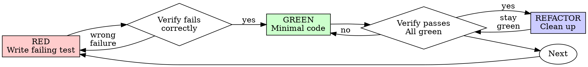

# 测试驱动开发（TDD）

## 概览

先写测试。观察它失败。编写最少代码让它通过。

**核心原则：** 如果你没看着测试失败，就不知道它是否在测正确的内容。

**违背规则的文字表述，就是违背规则的精神。**

## 何时使用

**始终适用：**
- 新功能
- 缺陷修复
- 重构
- 行为变更

**例外（请咨询你的人工伙伴）：**
- 临时原型
- 生成的代码
- 配置文件

想“这次跳过 TDD”吗？停下。这是在找借口。

## 铁律

```
NO PRODUCTION CODE WITHOUT A FAILING TEST FIRST
```

在测试前先写代码？删掉它。重头开始。

**无例外：**
- 不要把它当作“参考”
- 不要在编写测试时“改造”它
- 不要去看它
- 删除就是真正删除

从测试中全新实现。到此为止。

## 红-绿-重构



### RED - 编写失败测试

编写一个最小测试，说明应当发生什么。

<Good>
```typescript
test('retries failed operations 3 times', async () => {
  let attempts = 0;
  const operation = () => {
    attempts++;
    if (attempts < 3) throw new Error('fail');
    return 'success';
  };

  const result = await retryOperation(operation);

  expect(result).toBe('success');
  expect(attempts).toBe(3);
});
```
名称清晰、测试真实行为、只测一件事
</Good>

<Bad>
```typescript
test('retry works', async () => {
  const mock = jest.fn()
    .mockRejectedValueOnce(new Error())
    .mockRejectedValueOnce(new Error())
    .mockResolvedValueOnce('success');
  await retryOperation(mock);
  expect(mock).toHaveBeenCalledTimes(3);
});
```
名称模糊，只测试 mock 而不是代码
</Bad>

**要求：**
- 单一行为
- 名称清晰
- 真实代码（除非不可避免不使用 mocks）

### 验证 RED - 观察其失败

**强制执行。不要跳过。**

```bash
npm test path/to/test.test.ts
```

确认：
- 测试失败（不是报错）
- 失败信息符合预期
- 因功能缺失而失败（不是拼写错误）

**测试通过？** 你在测试的是现有行为。修复测试。

**测试报错？** 修复报错，重试直到它按预期失败。

### GREEN - 最小代码

编写最简单的代码让测试通过。

<Good>
```typescript
async function retryOperation<T>(fn: () => Promise<T>): Promise<T> {
  for (let i = 0; i < 3; i++) {
    try {
      return await fn();
    } catch (e) {
      if (i === 2) throw e;
    }
  }
  throw new Error('unreachable');
}
```
刚好够用
</Good>

<Bad>
```typescript
async function retryOperation<T>(
  fn: () => Promise<T>,
  options?: {
    maxRetries?: number;
    backoff?: 'linear' | 'exponential';
    onRetry?: (attempt: number) => void;
  }
): Promise<T> {
  // YAGNI
}
```
过度设计
</Bad>

不要添加功能，不要重构其他代码，也不要在测试范围之外“改进”。

### 验证 GREEN - 观察其通过

**强制执行。**

```bash
npm test path/to/test.test.ts
```

确认：
- 测试通过
- 其他测试仍然通过
- 输出干净（无报错、无警告）

**测试失败？** 修复代码，不要修测试。

**其他测试失败？** 立即修复。

### REFACTOR - 清理

仅在通过之后：
- 去除重复
- 改善命名
- 抽取辅助函数

保持测试通过。不要添加行为。

### 重复

继续下一个功能的下一条失败测试。

## 良好测试

| 质量 | Good | Bad |
|------|------|-----|
| **最小化** | 一件事。名称里有 “and” 吗？拆分。 | `test('validates email and domain and whitespace')` |
| **清晰** | 名称描述行为 | `test('test1')` |
| **体现意图** | 展示期望的 API | 模糊隐藏代码应实现的内容 |

在编写或修改任何测试时，阅读 [writing-good-tests.md](writing-good-tests.md) 以获取确保测试可靠的规则：
- 在编写前先写出会让测试失败的生产变更
- 断言真实行为，绝不基于 mock 的行为断言
- 将测试专用代码放在测试工具中，而不是生产类里
- 在 mock 依赖前先理解其副作用

## 常见借口

| 借口 | 现实 |
|--------|---------|
| “太简单不值得测试” | 简单的代码也会出问题。测试只需 30 秒。 |
| “我改完再测” | 事后写的测试往往会立即通过——这证明不了什么。它们可能测的是错的内容、测的是实现而非行为，或者漏掉你忘掉的边界场景。你没有看到它失败过，所以也没证明它能抓住这个问题。测试优先让它先失败。 |
| “事后测试能达到同样目标（重在精神不在形式）” | 事后测试回答“它现在做什么”；测试优先回答“它应该做什么”。事后测试会被你已写好的代码影响——你验证的是你想得到的情况，而不是你可能发现的情况。无证据的覆盖率只是虚假安全。 |
| “已经手工测试过了” | 手工测试是临时的：没有覆盖记录，代码改动时无法重跑，紧急时容易遗漏场景。“我试过时能用”并不等于完整。自动化测试每次都按同一方式执行。 |
| “删掉 X 小时的代码太浪费” | 沉没成本谬误——那部分时间无论如何都已花掉。真正的选择是：用 TDD 重写（高置信度）还是保留并事后补测（低置信度、很可能有缺陷）。保留不可信的代码才是浪费。 |
| “先留着作为参考，再写测试” | 你会去改它。这就是事后测试。删除就是真删除。 |
| “需要先探索一下” | 可以探索。探索后丢掉，回到 TDD。 |
| “很难测试就说明设计不清晰” | 听测试的反馈。不好测通常也意味着不好用。 |
| “TDD 会拖慢速度” | TDD 是务实路径：在提交前就发现缺陷，防止回归，支持你无畏重构。所谓“务实”的捷径，通常意味着在生产环境调试——更慢而不是更快。 |
| “手工测试更快” | 手工测试不能证明边界场景。每次改动都要重测。 |
| “现有代码没测试” | 你在改进它。先为现有代码补测试。 |

## 红旗 - 停止并重来

- 先写代码后写测试
- 实现后再测
- 测试立即通过
- 解释不了为什么测试失败
- 测试“后来”补上
- 用“这次例外”来合理化
- “我已经手工测试过了”
- “事后测试可以达到同样目的”
- “重在精神不在形式”
- “保留为参考”或“改造现有代码”
- “已经花了 X 小时，删掉会浪费”
- “TDD 太教条，我在务实”
- “这情况不一样，因为…….”

**以上任何一种，都意味着：删除代码。用 TDD 重新开始。**

## 示例：缺陷修复

**缺陷：** 空邮箱被接受

**RED**
```typescript
test('rejects empty email', async () => {
  const result = await submitForm({ email: '' });
  expect(result.error).toBe('Email required');
});
```

**验证 RED**
```bash
$ npm test
FAIL: expected 'Email required', got undefined
```

**GREEN**
```typescript
function submitForm(data: FormData) {
  if (!data.email?.trim()) {
    return { error: 'Email required' };
  }
  // ...
}
```

**验证 GREEN**
```bash
$ npm test
PASS
```

**REFACTOR**
如有需要，提取多字段校验逻辑。

## 验收清单

在标记工作完成前：

- [ ] 每个新增函数/方法都有测试
- [ ] 每个测试在实现前都已观察失败
- [ ] 每个测试因预期原因失败（功能缺失，而非拼写错误）
- [ ] 为每个测试编写最小实现
- [ ] 所有测试通过
- [ ] 输出干净（无错误、无警告）
- [ ] 测试使用真实代码（仅在不可避免时使用 mocks）
- [ ] 覆盖边界情况和错误

不能勾选所有项？你跳过了 TDD。重头再来。

## 卡住时

| 问题 | 解决方案 |
|---------|----------|
| 不知道如何测试 | 先写你期望的 API。先写断言。询问你的人工搭档。 |
| 测试过于复杂 | 设计过于复杂。简化接口。 |
| 必须 mock 一切 | 代码耦合过重。使用依赖注入。 |
| 测试设置庞大 | 抽取辅助函数。仍然复杂？简化设计。 |

## 调试集成

发现 bug？写出复现该 bug 的失败测试。遵循 TDD 循环。测试既能证明修复，又能防止回归。

不要在没有测试的情况下修复 bug。

## 最终规则

```
Production code → test exists and failed first
Otherwise → not TDD
```

未经你的人工搭档许可，不得有例外。
