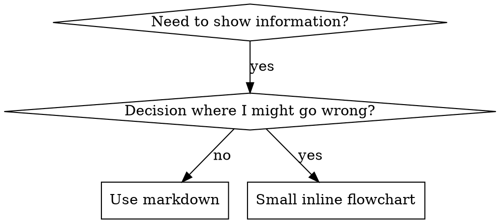

# 写作技能

## 概述

**Writing skills 是将测试驱动开发应用于流程文档。**

**个人技能位于你的运行时 skills 目录**（在 Claude Code 中为 `~/.claude/skills/`）— 参考 [codex-tools.md](../using-superpowers/references/codex-tools.md) 或 [gemini-tools.md](../using-superpowers/references/gemini-tools.md) 查看这些运行时的路径。Codex、Copilot CLI 和 Gemini CLI 也都将 `~/.agents/skills/` 识别为跨运行时别名。

你先编写测试用例（带子代理的压力场景）、观察其失败（基线行为）、编写技能（文档）、观察测试通过（代理遵从）、并重构（关闭漏洞）。

**核心原则：**如果你没有看过代理在没有该技能时的失败表现，你就不知道该技能是否教对了内容。

**必备背景：**你必须先理解 superpowers:test-driven-development 才能使用该技能。该技能定义了 TDD 的核心 RED-GREEN-REFACTOR 循环。本技能将 TDD 适配到文档中。

**官方指导：**关于 Anthropic 官方的技能编写最佳实践，请参见 anthropic-best-practices.md。本文档提供了与本技能 TDD 为中心方法互补的额外模式和指南。

## 什么是技能？

**技能（skill）**是已验证技术、模式或工具的参考指南。技能帮助未来代理快速找到并应用有效的方法。

**技能是：** 可复用的技术、模式、工具、参考指南

**技能不是：** 你曾经一次性解决某问题的叙述

## 技能的 TDD 映射

| TDD 概念 | 技能创建 |
|-------------|----------------|
| **测试用例** | 带子代理的压力场景 |
| **生产代码** | 技能文档（SKILL.md） |
| **测试失败（RED）** | 代理在无技能时违反规则（基线） |
| **测试通过（GREEN）** | 代理在技能存在时遵守 |
| **重构** | 在保持合规的同时关闭漏洞 |
| **先写测试** | 在编写技能前运行基线场景 |
| **观察失败** | 记录代理使用的准确化辩解 |
| **最小代码** | 针对这些具体违规编写技能 |
| **观察通过** | 验证代理现在是否遵守 |
| **重构循环** | 发现新的辩解 → 修补 → 重新验证 |

整个技能创建过程遵循 RED-GREEN-REFACTOR。

## 何时创建技能

**在以下情况下创建：**
- 技术方案对你来说不直观
- 你会在多个项目中反复查阅
- 模式适用范围广（非特定项目）
- 其他人也会受益

**不要为以下内容创建：**
- 一次性方案
- 其他地方已有文档的标准实践
- 项目特定约定（放入你的指令文件）
- 机械约束（若可用正则/校验自动执行，则自动化；把文档留给需要判断的场景）

## 技能类型

### 技法（Technique）
有可执行步骤的具体方法（基于条件等待、根因追踪）

### 模式（Pattern）
关于问题的思考方式（flatten-with-flags、test-invariants）

### 参考（Reference）
API 文档、语法指南、工具文档（office docs）

## 目录结构


```
skills/
  skill-name/
    SKILL.md              # 主参考（必需）
    supporting-file.*     # 仅在需要时
```

**扁平命名空间** - 所有技能位于同一可搜索命名空间

**分离文件：**
1. **重型参考**（100+ 行）- API 文档、完整语法
2. **可复用工具** - 脚本、工具、模板

**内联保留：**
- 原则与概念
- 代码模式（< 50 行）
- 其他所有内容

## SKILL.md 结构

**Frontmatter（YAML）：**
- 两个必填字段：`name` 和 `description`（见 [agentskills.io/specification](https://agentskills.io/specification) 获取全部支持字段）
- 总长度不超过 1024 个字符
- `name`：只能使用字母、数字和连字符（不允许括号和特殊字符）
- `description`：第三人称，仅描述何时使用（而非它做什么）
  - 以 “Use when...” 开头，聚焦触发条件
  - 包含具体症状、场景和上下文
  - **绝不总结技能的流程或工作流**（原因见 SDO 部分）
  - 尽量保持在 500 字以内

```markdown
---
name: Skill-Name-With-Hyphens
description: Use when [specific triggering conditions and symptoms]
---

# Skill Name

## Overview
What is this? Core principle in 1-2 sentences.

## When to Use
[Small inline flowchart IF decision non-obvious]

Bullet list with SYMPTOMS and use cases
When NOT to use

## Core Pattern (for techniques/patterns)
Before/after code comparison

## Quick Reference
Table or bullets for scanning common operations

## Implementation
Inline code for simple patterns
Link to file for heavy reference or reusable tools

## Common Mistakes
What goes wrong + fixes

## Real-World Impact (optional)
Concrete results
```


## 技能发现优化（SDO）

**发现性关键：** 未来代理需要找到你的技能

### 1. 详细描述字段

**目的：** 你的代理会读取描述来决定当前任务应加载哪些技能。它应回答：“我现在应该阅读这个技能吗？”

**格式：** 以 “Use when...” 开头，聚焦触发条件

**关键：描述=何时使用，而非技能内容**

描述只能说明触发条件。不要在描述中总结技能的过程或工作流。

**为何重要：** 测试显示，当描述总结了技能的工作流时，代理可能会直接按描述执行，而不是阅读完整技能内容。描述为 “code review between tasks” 导致代理只做一次评审，尽管技能流程图明确要求做两次评审（先规格合规再代码质量）。

当描述改为仅有 “Use when executing implementation plans with independent tasks” 后（不再总结流程），代理就会正确读取流程图并遵循两阶段评审过程。

**陷阱：** 总结流程的描述会成为代理走的捷径，技能正文会被跳过。

```yaml
# ❌ BAD: Summarizes workflow - agents may follow this instead of reading skill
description: Use when executing plans - dispatches subagent per task with code review between tasks

# ❌ BAD: Too much process detail
description: Use for TDD - write test first, watch it fail, write minimal code, refactor

# ✅ GOOD: Just triggering conditions, no workflow summary
description: Use when executing implementation plans with independent tasks in the current session

# ✅ GOOD: Triggering conditions only
description: Use when implementing any feature or bugfix, before writing implementation code
```

**内容：**
- 使用具体的触发条件、症状和信号来说明该技能何时适用
- 描述*问题*（竞态条件、行为不一致），而不是*语言特定症状*（setTimeout、sleep）
- 除非技能本身是特定技术，否则保持触发条件技术无关
- 如果技能是技术相关的，请在触发条件中明确说明
- 使用第三人称（会注入到系统提示中）
- **绝不总结技能的过程或工作流**

```yaml
# ❌ BAD: Too abstract, vague, doesn't include when to use
description: For async testing

# ❌ BAD: First person
description: I can help you with async tests when they're flaky

# ❌ BAD: Mentions technology but skill isn't specific to it
description: Use when tests use setTimeout/sleep and are flaky

# ✅ GOOD: Starts with "Use when", describes problem, no workflow
description: Use when tests have race conditions, timing dependencies, or pass/fail inconsistently

# ✅ GOOD: Technology-specific skill with explicit trigger
description: Use when using React Router and handling authentication redirects
```

### 2. 关键词覆盖

使用代理会搜索的词：
- 错误信息： "Hook timed out"、"ENOTEMPTY"、"race condition"
- 症状： "flaky"、"hanging"、"zombie"、"pollution"
- 同义词： "timeout/hang/freeze"、"cleanup/teardown/afterEach"
- 工具：实际命令、库名、文件类型

### 3. 描述性命名

**使用主动语态，动词开头：**
- ✅ `creating-skills` not `skill-creation`
- ✅ `condition-based-waiting` not `async-test-helpers`

### 4. 令牌效率（关键）

**问题：** getting-started 和经常被引用的技能会加载到每次对话中。每个 token 都很重要。

**目标字数：**
- getting-started 工作流：每个 <150 词
- 高频加载技能：总计 <200 词
- 其他技能：<500 词（仍需保持简洁）

**技巧：**

**将细节放到工具帮助中：**
```bash
# ❌ BAD: Document all flags in SKILL.md
search-conversations supports --text, --both, --after DATE, --before DATE, --limit N

# ✅ GOOD: Reference --help
search-conversations supports multiple modes and filters. Run --help for details.
```

**使用交叉引用：**
```markdown
# ❌ BAD: Repeat workflow details
When searching, dispatch subagent with template...
[20 lines of repeated instructions]

# ✅ GOOD: Reference other skill
Always use subagents (50-100x context savings). REQUIRED: Use [other-skill-name] for workflow.
```

**压缩示例：**
```markdown
# ❌ BAD: Verbose example (42 words)
your human partner: "How did we handle authentication errors in React Router before?"
You: I'll search past conversations for React Router authentication patterns.
[Dispatch subagent with search query: "React Router authentication error handling 401"]

# ✅ GOOD: Minimal example (20 words)
Partner: "How did we handle auth errors in React Router?"
You: Searching...
[Dispatch subagent → synthesis]
```

**消除冗余：**
- 不要重复交叉引用技能里已有的内容
- 不要解释命令已经显而易见的内容
- 不要给同一种模式提供多个示例

**核查：**
```bash
wc -w skills/path/SKILL.md
# getting-started workflows: aim for <150 each
# Other frequently-loaded: aim for <200 total
```

**按你实际执行的动作或核心洞见命名：**
- ✅ `condition-based-waiting` > `async-test-helpers`
- ✅ `using-skills` not `skill-usage`
- ✅ `flatten-with-flags` > `data-structure-refactoring`
- ✅ `root-cause-tracing` > `debugging-techniques`

**进行中的动名词（-ing）适合表达流程：**
- `creating-skills`，`testing-skills`，`debugging-with-logs`
- 主动形式，描述你正在采取的行动

### 5. 交叉引用其他技能

**在撰写引用其他技能的文档时：**

只使用技能名称，并带上明确的要求标记：
- ✅ Good: `**REQUIRED SUB-SKILL:** Use superpowers:test-driven-development`
- ✅ Good: `**REQUIRED BACKGROUND:** You MUST understand superpowers:systematic-debugging`
- ❌ Bad: `See skills/testing/test-driven-development`（不清楚是否必需）
- ❌ Bad: `@skills/testing/test-driven-development/SKILL.md`（会立即强制加载，消耗上下文）

**为何不用 @ 链接：** `@` 语法会立即加载文件，在你真正需要之前就消耗 200k+ 上下文。

## 流程图用法



**仅在以下场景使用流程图：**
- 非显而易见的决策点
- 你可能过早停止的过程循环
- “何时用 A 还是 B” 的决策

**请勿将流程图用于：**
- 参考材料 → 表格、列表
- 代码示例 → Markdown 代码块
- 线性指令 → 有序列表
- 没有语义含义的标签（step1、helper2）

参见本目录中的 `graphviz-conventions.dot` 了解 graphviz 样式规则。

**为你的搭档可视化：** 使用本目录中的 `render-graphs.js` 渲染技能流程图为 SVG：
```bash
./render-graphs.js ../some-skill           # Each diagram separately
./render-graphs.js ../some-skill --combine # All diagrams in one SVG
```

## 代码示例

**一份优秀示例胜过许多平庸示例**

选择最相关的语言：
- 测试技术 → TypeScript/JavaScript
- 系统调试 → Shell/Python
- 数据处理 → Python

**良好示例：**
- 完整且可运行
- 注释清楚解释原因（WHY）
- 来源于真实场景
- 明确展示模式
- 易于改造（非模板化示例）

**不要：**
- 用 5 种以上语言实现
- 制作“填空”模板
- 写出不自然的示例

你擅长迁移——一份优秀示例就够了。

## 文件组织

### Self-Contained Skill
```
defense-in-depth/
  SKILL.md    # Everything inline
```
适用场景：全部内容都能容纳，无需大量外部引用

### Skill with Reusable Tool
```
condition-based-waiting/
  SKILL.md    # Overview + patterns
  example.ts  # Working helpers to adapt
```
适用场景：工具是可复用代码，而不只是叙述性内容

### Skill with Heavy Reference
```
pptx/
  SKILL.md       # Overview + workflows
  pptxgenjs.md   # 600 lines API reference
  ooxml.md       # 500 lines XML structure
  scripts/       # Executable tools
```
适用场景：参考内容过大，不适合全部内嵌

## 铁律（与 TDD 一致）

```
NO SKILL WITHOUT A FAILING TEST FIRST
```

这条规则适用于新的技能和对现有技能的修改。

先写技能再测？删掉它，重写。
改技能不测？同样违背规则。

**无例外：**
- 不是“简单补充”
- 不是“只新增一节”
- 不是“文档更新”
- 不要将未测试的改动当作“参考”
- 不要在测试进行时“边改边适配”
- 删掉就是真删

**必须具备的背景：** `superpowers:test-driven-development` 说明了为什么这很重要。相同的原则也适用于文档。

## 测试所有技能类型

不同类型的技能需要不同的测试方法：

### 纪律约束型技能（规则/要求）

**示例：** TDD、完成前先验证、先设计后编码

**测试方式：**
- 学术问题：他们是否理解规则？
- 压力场景：他们在压力下是否遵守？
- 叠加压力：时间 + 已投入成本 + 疲劳
- 识别合理化借口并加入明确反制

**成功标准：** 在最大学习压力下仍遵循规则的代理

### 技术型技能（操作指南）

**示例：** condition-based-waiting、root-cause-tracing、defensive-programming

**测试方式：**
- 应用场景：他们能否正确应用该技术？
- 变体场景：他们能否处理边界情况？
- 信息缺失测试：说明是否存在空缺？

**成功标准：** 代理能成功将技术应用到新场景

### 模式型技能（思维模型）

**示例：** reducing-complexity、information-hiding concepts

**测试方式：**
- 识别场景：他们能否识别模式适用时机？
- 应用场景：能否使用该思维模型？
- 反例：能否判断何时不应应用？

**成功标准：** 代理能正确识别何时以及如何应用模式

### 参考型技能（文档/API）

**示例：** API 文档、命令参考、库指南

**测试方式：**
- 检索场景：能否找到正确的信息？
- 应用场景：能否正确使用检索到的信息？
- 缺口测试：常见用例是否覆盖？

**成功标准：** 代理能找到并正确应用参考信息

## 跳过测试的常见借口

| 借口 | 现实 |
|--------|---------|
| “技能显然很清楚” | 对你清楚 ≠ 对其他代理清楚。必须测试。 |
| “只是一个参考” | 参考资料可能有空缺、模糊段落。需要测试检索。 |
| “测试太夸张” | 未测试的技能有问题。始终如此。15 分钟测试可节省数小时。 |
| “出了问题再测” | 问题 = 代理无法使用该技能。请先测试再上线。 |
| “测试太麻烦” | 测试比上线后调试坏技能更不麻烦。 |
| “我对它有信心” | 过度自信注定有问题。还是要测试。 |
| “学术复核足够了” | 阅读 ≠ 使用。要测试应用场景。 |
| “没时间测试” | 上线未经测试的技能会让你之后花更多时间修复。 |

**以上所有内容都表示：在部署前进行测试。例外一律没有。**

## 将形式与故障类型匹配

在编写指导前，先对基线故障进行分类。为某一种故障类型“加固”的形式，在另一种故障类型上会明显起反作用。

| 基线故障 | 正确形式 | 错误形式 |
|---|---|---|
| 在压力下跳过/违反规则（明知更好却还是这么做） | 禁令 + 合理化表 + 红旗（见下文 Bulletproofing） | 软性指导（“prefer...”, “consider...”） |
| 遵守了规则，但输出形状错误（提示词冗长、结论被埋没、规格被重复表述） | 正向配方或契约：说明输出是什么——其组成部分、顺序 | 禁止清单（“don't restate”, “never narrate”） |
| 省略了他们已经会产出的某个必需元素 | 结构化：模板中必填字段或插槽 | 模板附近的散文提醒 |
| 行为应取决于某个条件 | 键控在可观测谓词上的条件（“if the brief exists, reference it”） | 无条件规则 + 例外条款 |

**为什么禁令在形状问题上会适得其反：** 在有竞争性激励（“让提示词自包含”）时，代理会与“不要 X”进行谈判。在 dispatch-prompt guidance 的对照措辞测试中，禁令分支产生了明显更多不想要的内容，且趋势上还不如完全无指导对照——请先对你自己的场景进行微基准测试，不要先入为主，但也不要默认使用禁令。配方式提示消除了谈判空间：输出要么符合规定形状，要么不符合。

**无论你选择哪种形式，规则如下：**
- **不要有细节例外条款。** “除非值得，别 X”会重新开启谈判——在同一套措辞测试中，给一个有效配方再加一个细微例外，会从稳定变成嘈杂。真实例外应作为可观测谓词下的独立条件来表达。
- **例外条款不会限定范围。** “该限制不适用于代码块”仍会抑制代码块。如果输出的某一部分必须豁免，应重构规则使其无法触达该部分。

## 面向合理化的 Bulletproofing 技能

像 TDD 这类需要约束执行力的技能必须抵抗合理化。代理在压力下很聪明，会主动寻找漏洞。

**范围：** 该工具包用于纪律性故障——代理明知规则却在压力下跳过该规则。对于输出形状错误或漏掉元素的情况，禁令式 bulletproofing 会适得其反；应使用《将形式与故障类型匹配》中的对应形式。

**心理学说明：** 理解“为何”说服技巧有效，有助于系统化应用。参见 persuasion-principles.md，了解研究依据（Cialdini, 2021; Meincke et al., 2025）中关于权威、承诺、稀缺、社会证明与从属原则的内容。

### 逐一封堵所有漏洞

不要只陈述规则——要明确禁止特定的规避方式：

<Bad>
```markdown
Write code before test? Delete it.
```
</Bad>

<Good>
```markdown
Write code before test? Delete it. Start over.

**No exceptions:**
- Don't keep it as "reference"
- Don't "adapt" it while writing tests
- Don't look at it
- Delete means delete
```
</Good>

### 处理“形式 vs 实质”辩解

尽早加入基础原则：

```markdown
**Violating the letter of the rules is violating the spirit of the rules.**
```

这会切断整类“我只是符合精神”的合理化论证。

### 建立合理化对照表

从基线测试中收集合理化（见下文测试部分）。所有代理给出的借口都应写入该表：

```markdown
| Excuse | Reality |
|--------|---------|
| "Too simple to test" | Simple code breaks. Test takes 30 seconds. |
| "I'll test after" | Tests passing immediately prove nothing. |
| "Tests after achieve same goals" | Tests-after = "what does this do?" Tests-first = "what should this do?" |
```

### 创建红旗清单

让代理在合理化时能快速自检：

```markdown
## Red Flags - STOP and Start Over

- Code before test
- "I already manually tested it"
- "Tests after achieve the same purpose"
- "It's about spirit not ritual"
- "This is different because..."

**All of these mean: Delete code. Start over with TDD.**
```

### 为违规症状更新 SDO

在描述中加入当你即将违反规则时的症状：

```yaml
description: use when implementing any feature or bugfix, before writing implementation code
```

## 用于技能的 RED-GREEN-REFACTOR

遵循 TDD 循环：

### RED：编写失败测试（基线）

用子代理在**没有技能**的情况下运行压力场景。记录精确行为：
- 他们做了哪些选择？
- 使用了哪些合理化（逐字引用）？
- 哪些压力触发了违规？

这就是“先看测试失败”——你必须先观察代理在缺乏技能时的自然行为，再去写技能。

### GREEN：编写最小技能

编写专门针对这些具体合理化的技能，不要为假设场景添加额外内容。

在同样场景下**带技能**运行测试。代理应当遵从。

### REFACTOR：封堵漏洞

代理出现了新的合理化吗？加入明确反制。重复测试直至足够可靠。

### 全场景前先做微测试措辞

完整的压力场景是最终门槛，但每轮都慢且昂贵。先用微测试验证措辞本身：

1. **每次调用一个全新语境样本**——一个原始 API 调用，或单次子代理（若你没有 API 访问）。系统提示词应是指导语将嵌入的真实语境（完整技能或提示词模板，而非孤立指导语）；用户消息是一个会诱发失败的任务。
2. **始终包含无指导对照组。** 如果对照组没有出现失败，那就没什么可修复的——停止，不要编写这份指导。
3. **每个变体做 5 次以上复现。** 单次样本容易误导。
4. **每个命中项都要人工复核。** 可以程序化打分，但模板回显与引用反例会伪装为命中；只靠自动计数会高估失败和成功。
5. **方差也是指标。** 指导落地后，复现结果应收敛到统一形状；五次复现出现五种解读说明措辞不够约束，应先收紧形式再加内容。

微测试用于验证措辞，它们不能替代纪律型技能的压力场景测试。

**测试方法：** 见 [testing-skills-with-subagents.md](testing-skills-with-subagents.md)，获取完整测试方法：
- 如何编写压力场景
- 压力类型（时间、沉没成本、权威、疲劳）
- 系统化封堵漏洞
- 元测试技术

## 反模式

### ❌ 叙事化示例
“In session 2025-10-03, we found empty projectDir caused...”
**为何不佳：** 过于具体，不具可复用性

### ❌ 多语言稀释
example-js.js, example-py.py, example-go.go
**为何不佳：** 质量平庸，维护负担重

### ❌ 流程图内嵌代码
```dot
step1 [label="import fs"];
step2 [label="read file"];
```
**为何不佳：** 无法直接复制粘贴，难以阅读

### ❌ 泛化标签
helper1, helper2, step3, pattern4
**为何不佳：** 标签应具有语义含义

## STOP：进入下一个技能前

**在编写任何技能后，你必须停止并完成部署流程。**

**禁止：**
- 一次性创建多个技能且不测试每一个
- 在当前技能未验证前进入下一个技能
- 因“批量更高效”而跳过测试

**以下部署清单对每个技能都是强制性的。**

发布未测试的技能等同于发布未测试的代码，违反质量标准。

## 技能创建清单（基于 TDD）

**重要：每个清单项都要创建对应的待办。**

**RED 阶段 - 编写失败测试：**
- [ ] 创建压力场景（纪律性技能需包含 3+ 组合压力）
- [ ] 在没有技能的情况下运行场景，并逐字记录基线行为
- [ ] 识别合理化/失败中的模式

**GREEN 阶段 - 编写最小技能：**
- [ ] 名称仅使用字母、数字和连字符（不含括号/特殊字符）
- [ ] YAML frontmatter 含必需 `name` 与 `description` 字段（最长 1024 个字符；见 [spec](https://agentskills.io/specification)）
- [ ] description 以 “Use when...” 开头，并包含具体触发条件/症状
- [ ] description 使用第三人称撰写
- [ ] 在全文中包含可搜索关键词（errors、symptoms、tools）
- [ ] 提供清晰概览与核心原则
- [ ] 处理 RED 阶段识别出的具体基线失败
- [ ] 指导形式与失败类型匹配（见《将形式与故障类型匹配》）
- [ ] 对行为塑造类指导：针对无指导对照进行措辞微测试（5+ 轮，手工逐条阅读每个命中项）——纯参考类技能不适用
- [ ] 代码内联或链接到单独文件
- [ ] 一个高质量示例（非多语言）
- [ ] 在带技能情况下运行场景并验证代理已遵守

**REFACTOR 阶段 - 封堵漏洞：**
- [ ] 识别测试中新出现的合理化解释
- [ ] 添加显式计数器（如果是纪律性技能）
- [ ] 从所有测试迭代中构建合理化表
- [ ] 创建红旗清单
- [ ] 反复重测直到“子弹头级”可靠

**质量检查：**
- [ ] 仅在决策不明显时添加小流程图
- [ ] 快速参考表
- [ ] 常见错误部分
- [ ] 不要使用叙事性文字
- [ ] 支持文件仅用于工具或重参考

**部署：**
- [ ] 将技能提交到 git 并推送到你的 fork（如已配置）
- [ ] 如具有广泛价值，考虑通过 PR 反哺回馈

## 发现流程

未来其他代理如何找到你的技能：

1. **遇到问题**（“测试不稳定”）
2. **搜索技能**（grep 描述、浏览类别）
3. **找到 SKILL**（描述匹配）
4. **扫描概览**（是否相关？）
5. **阅读模式**（快速参考表）
6. **加载示例**（仅在实现时）

**优化该流程** - 尽早且频繁地加入可检索词。
