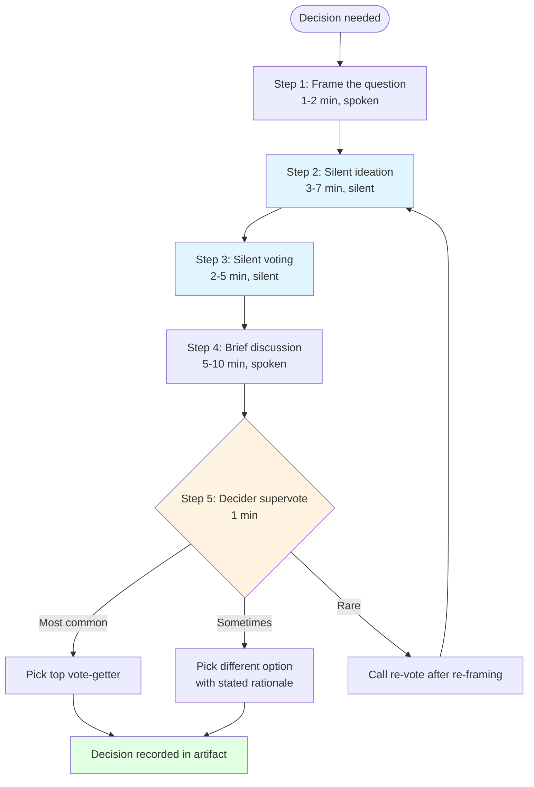

<!-- PM-Skills | https://github.com/product-on-purpose/pm-skills | Apache 2.0 -->

# 记录与投票

在 20-30 分钟内完成一次结构化的团队决策。静默贡献环节会在群体动力压缩选项空间之前，先展现独立思考；明确的决策者最终裁决票则完成选择。整个过程会产出一份书面审计记录，记录决策结果以及曾考虑过的替代方案。

## 适用场景

- 一个由 3-10 人组成的小团队需要在广泛收集意见的基础上快速做出决策。
- 群体迷思、地位偏见或最强势发言者主导决策确实存在风险。
- 工作坊或会议中的某个环节需要先进行静默构思，再展开公开讨论。
- 决策需要留下审计记录（考虑过什么、为什么最终选项胜出）。
- 决策权限明确（存在一名决策者，并且在场或可以参与）。
- 在 Foundation Sprint 和 Design Sprint 的决策环节中被广泛使用。

## 不适用场景

- 决策由一个人负责，而这个人只需要自行做出决定。请直接依据判断决策。
- 团队已经自然形成共识。投票的额外流程会增加摩擦，却没有带来价值。
- 决策的重要性高到需要更长时间的审议（数天的调查、书面提案、正式评审）。记录与投票是一个 25 分钟的工具，而不是治理流程。
- 没有决策者可参与，并且团队无权自行结束决策。请推迟到决策者能够参加时再进行。

## 五步协议

```text
1. 界定问题（1-2 分钟）
2. 静默构思（3-7 分钟，视复杂程度而定）
3. 静默投票（2-5 分钟，多选或单选）
4. 简短讨论投票分布（5-10 分钟）
5. 决策者最终裁决票（1 分钟）
```

总计：根据时间分配不同，需要 12-25 分钟。对于非简单决策，默认用时为 25 分钟。



静默步骤（蓝色）可以防止锚定效应。决策者的最终裁决票（琥珀色）有三种合法结果；当问题界定有误时，回到静默构思是恢复路径。

### 第一步：界定问题

在白板上写下决策问题，用一句话表达，确保含义明确。示例：

- "我们的 Foundation Sprint 应该在第 1 天确定哪个目标客户细分群体？"
- "哪份解决方案草图应进入周三的故事板？"
- "哪个冲刺问题应成为周五记分卡中的主要行？"

需要避免的不佳提问方式：

- 复合问题（“哪个客户**以及**哪个问题”）
- 是非题（应使用其他工具）
- 开放式探索（“我们应该怎么做？”）

### 第 2 步：静默构想

每位参与者都以静默、独立的方式提出选项。可以使用墙上的便利贴、Miro board 中的单元格，或共享文档中的行。不要交谈。在计时结束前，不得阅读其他人的贡献。

引导者**必须**确保全程保持安静。口头贡献会违背这一流程的目的。

### 第 3 步：静默投票

匿名展示所有贡献（如果团队已达成一致，也可以标注贡献者）。每位参与者获得 N 张选票（多选投票轮次通常为 2–3 张，单选决胜投票则为 1 张）。使用圆点、贴纸、表情回应或数字进行静默投票。投票期间不得讨论。

### 第 4 步：简短讨论

呈现得票最高的 2–3 个选项。每位投票支持首选选项的人简要说明原因。引导者负责计时（最多 5–10 分钟）。如果讨论扩展到排名靠后的选项，引导者应将讨论拉回。

这是团队发现意外情况（“我之前没意识到我们在 X 上已经达成一致了”）或不意外情况（“我们因为已知原因在 A 和 B 之间分歧”）的环节。但这里不是重新争论问题框架的地方。

### 第 5 步：决策者最终投票

决策者宣布选定的选项。决策者可以选择得票最高的选项（最常见），也可以在说明理由后选择其他选项（有时会这样做），或者在讨论后要求重新投票（很少这样做）。

最终投票就是决策。将其明确记录在产物中。不要让最终投票模糊成持续讨论；团队需要看到决策已经落定。

## 输出结构

该 skill 会生成一个包含以下内容的单一打包产物：

1. 决策问题（逐字记录）
2. 静默构想板（所有贡献、时间戳，以及根据团队约定记录的贡献者）
3. 投票摘要（每个选项的票数；如果已约定标注贡献者，则记录每个选项的投票者）
4. 讨论记录（简要记录浮现出的理由）
5. 决策记录（选定的选项 + 决策者姓名 + 非显而易见情况下的决策者理由）

请参阅 `references/TEMPLATE.md` 了解规范结构，并参阅 `references/EXAMPLE.md` 了解使用 Brainshelf 图书目录 Foundation Sprint 讨论串的完整示例。

## 常见陷阱

- **跳过静默构想。** “我们直接讨论吧”会使整个流程失去意义。团队最终产出的内容，和不使用该工具时没有区别。
- **跳过决策者最终投票。** 这会导致共识逐渐偏移。讨论结束时没有记录下来的决策。
- **讨论阶段过长。** 五分钟的讨论会变成二十分钟的争论。引导者必须严格限时，并将讨论拉回。
- **问题框架过于复合或模糊。** “我们应该如何处理 X？”不是一个可决策的问题。在调用该工具前，应先重新构建问题。
- **没有看到贡献就开始投票。** 如果在构想阶段就公开贡献，投票会受到最先看到的想法影响。必须确保保持静默。
- **把决策者的选择当作建议。** 最终投票就是决策；如果决策者没有决策权限，那么坐在决策者位置上的人就不对。

## 决策者角色

在 Note-and-Vote 中，决策者有三项职责：

1. 在静默构思开始前，**明确问题**（或批准主持人对问题的表述）。
2. 在讨论期间**倾听**，而不是主导讨论。讨论的目的是挖掘静默投票无法揭示的内容。
3. 当超级投票与团队的首选不一致时，以明确的理由进行**超级投票**。

如果决策者一贯只是认可团队的最高票选项，就没有发挥价值。如果决策者一贯不作说明地推翻团队选择，就无法建立信任。这两种情况都表明，担任该角色的人选不合适。

## 权威来源

Character Capital 在 https://www.character.vc/guide/note-and-vote 发布了 Note-and-Vote 指南的权威版本。Knapp 和 Zeratsky 在 *Sprint*（设计冲刺背景）和 *Click*（Foundation Sprint 背景）中都介绍了 Note-and-Vote 的变体。

此 pm-skills 实现遵循 Character 协议，并明确采用五步结构。

## 跨系列使用

`tool-note-and-vote` 是一个独立工具，不属于任何冲刺系列。它会在 `foundation-sprint-skills` 和 `design-sprint-skills` 系列成员的决策环节中多次调用。这些系列中的 SKILL.md 文件会以内嵌方式引用 `tool-note-and-vote`，而不是嵌入该协议。

该技能也可用于冲刺场景之外：会议、规划会或研讨会中的任何参与式决策都可以调用它。