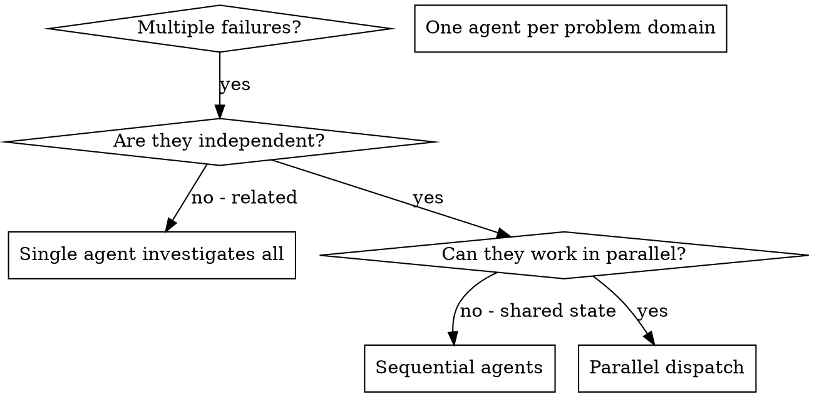

# 派发并行代理

## 概述

你将任务委派给拥有隔离上下文的专用代理。通过精确地构造它们的指令和上下文，你可以确保它们保持专注并成功完成任务。它们绝不应继承你会话的上下文或历史——你所构造的正是它们所需的内容。这同时也能为你自己的协调工作保留上下文。

当你遇到多个互不相关的故障（不同的测试文件、不同的子系统、不同的 bug）时，按顺序逐个排查会浪费时间。每项排查都是独立的，可以并行进行。

**核心原则：** 为每个独立的问题域派发一个代理。让它们并发工作。

## 何时使用



**在以下情况使用：**
- 3 个以上测试文件因不同的根本原因而失败
- 多个子系统各自独立损坏
- 每个问题无需其他问题的上下文即可理解
- 各项排查之间没有共享状态

**在以下情况不要使用：**
- 故障彼此相关（修复一个可能会连带修复其他）
- 需要理解完整的系统状态
- 代理之间会相互干扰

## 模式

### 1. 识别独立域

按损坏的部分对故障进行分组：
- 文件 A 的测试：工具审批流程
- 文件 B 的测试：批量完成行为
- 文件 C 的测试：中止功能

每个域都是独立的——修复工具审批不会影响中止测试。

### 2. 创建专注的代理任务

每个代理获得：
- **明确的范围：** 一个测试文件或子系统
- **清晰的目标：** 让这些测试通过
- **约束：** 不要更改其他代码
- **预期输出：** 你发现和修复内容的总结

### 3. 并行派发

在同一条响应中发出全部三个子代理派发——它们将并行运行：

```text
Subagent (general-purpose): "Fix agent-tool-abort.test.ts failures"
Subagent (general-purpose): "Fix batch-completion-behavior.test.ts failures"
Subagent (general-purpose): "Fix tool-approval-race-conditions.test.ts failures"
# All three run concurrently.
```

同一条响应中的多个派发调用 = 并行执行。每条响应一个 = 顺序执行。

### 4. 审查与整合

当代理返回时：
- 阅读每份总结
- 验证各修复之间不冲突
- 运行完整测试套件
- 整合所有更改

## 代理提示词结构

好的代理提示词应做到：
1. **专注** - 一个清晰的问题域
2. **自包含** - 理解问题所需的全部上下文
3. **输出明确** - 代理应该返回什么？

```markdown
Fix the 3 failing tests in src/agents/agent-tool-abort.test.ts:

1. "should abort tool with partial output capture" - expects 'interrupted at' in message
2. "should handle mixed completed and aborted tools" - fast tool aborted instead of completed
3. "should properly track pendingToolCount" - expects 3 results but gets 0

These are timing/race condition issues. Your task:

1. Read the test file and understand what each test verifies
2. Identify root cause - timing issues or actual bugs?
3. Fix by:
   - Replacing arbitrary timeouts with event-based waiting
   - Fixing bugs in abort implementation if found
   - Adjusting test expectations if testing changed behavior

Do NOT just increase timeouts - find the real issue.

Return: Summary of what you found and what you fixed.
```

## 常见错误

**❌ 过于宽泛：**“修复所有测试” - 代理会迷失方向
**✅ 具体：**“修复 agent-tool-abort.test.ts” - 范围聚焦

**❌ 缺少上下文：**“修复竞态条件” - 代理不知道问题在哪里
**✅ 提供上下文：**粘贴错误消息和测试名称

**❌ 没有约束：** 代理可能会重构一切
**✅ 设定约束：**“不要更改生产代码”或“只修复测试”

**❌ 输出含糊：**“修好它” - 你不知道改了什么
**✅ 明确：**“返回根本原因和所做更改的总结”

## 何时不该使用

**相关故障：**修复一个可能会连带修复其他 - 先一起排查
**需要完整上下文：**理解问题需要查看整个系统
**探索性调试：**你还不知道哪里出了问题
**共享状态：**代理会相互干扰（编辑相同的文件、使用相同的资源）

## 会话中的真实示例

**场景：**大规模重构后，3 个文件中出现 6 个测试失败

**失败：**
- agent-tool-abort.test.ts：3 个失败（时序问题）
- batch-completion-behavior.test.ts：2 个失败（工具未执行）
- tool-approval-race-conditions.test.ts：1 个失败（执行计数 = 0）

**决策：**独立域——中止逻辑、批量完成、竞态条件各自独立

**派发：**
```
Agent 1 → Fix agent-tool-abort.test.ts
Agent 2 → Fix batch-completion-behavior.test.ts
Agent 3 → Fix tool-approval-race-conditions.test.ts
```

**结果：**
- Agent 1：将超时替换为基于事件的等待
- Agent 2：修复了事件结构 bug（threadId 放错了位置）
- Agent 3：添加了对异步工具执行完成的等待

**整合：**所有修复相互独立，无冲突，完整测试套件全绿

**节省时间：**3 个问题并行解决而非顺序解决

## 关键优势

1. **并行化** - 多项排查同时进行
2. **专注** - 每个代理范围很窄，需要跟踪的上下文更少
3. **独立性** - 代理之间互不干扰
4. **速度** - 用解决 1 个问题的时间解决 3 个问题

## 验证

代理返回后：
1. **审查每份总结** - 了解改动了什么
2. **检查冲突** - 代理是否编辑了相同的代码？
3. **运行完整测试套件** - 验证所有修复协同工作
4. **抽查** - 代理可能犯系统性错误

## 实际影响

来自调试会话（2025-10-03）：
- 3 个文件中共 6 个失败
- 并行派发了 3 个代理
- 所有排查并发完成
- 所有修复均成功整合
- 代理更改之间零冲突
