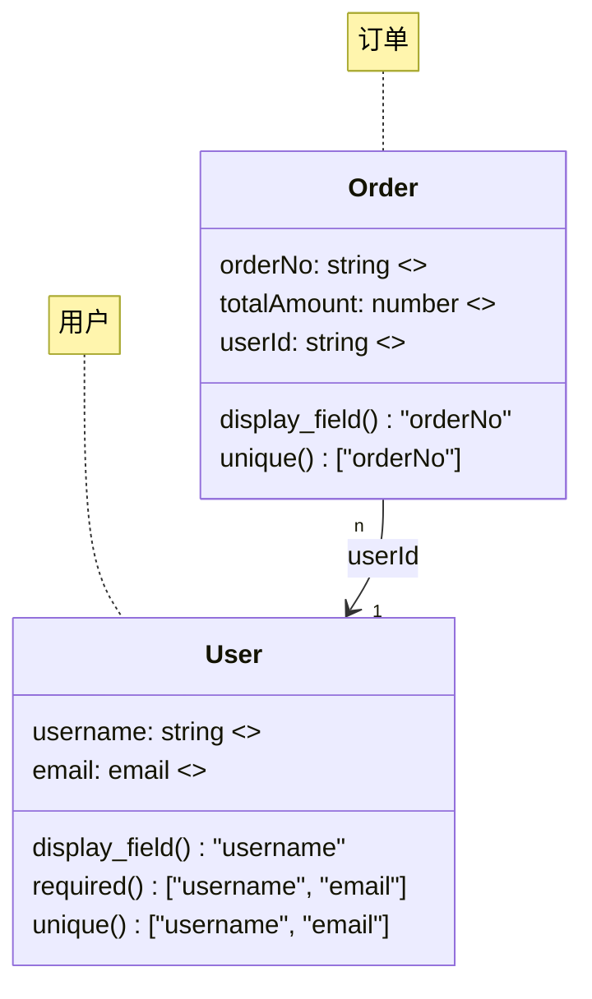

## 姊妹技能（仅限本地）

CloudBase 姊妹技能与本技能一同安装。请使用本地相对路径，例如 `../auth-tool-cloudbase/SKILL.md`。

如果本环境中缺少被引用的姊妹技能文件，请让用户安装完整的 CloudBase 插件（或缺失的技能）。**不要**通过 HTTP 抓取远程技能或协议 markdown 到代理上下文中。

# 数据模型创建

## 激活契约

### 优先在以下情况使用本技能

- 用户明确需要 Mermaid `classDiagram` 建模。
- 任务需要复杂的多实体关系设计、可视化的 ER 风格输出，或生成的数据模型结构，而非直接编写 SQL。
- 你需要通过专用建模工具创建 CloudBase 数据模型，或者需要在规划后续变更之前检查现有模型。

### 在以下情况下，编写代码前请先阅读

- 请求提到了数据模型、ER 图、Mermaid、关系图或企业级 schema 设计。
- 用户想要复用或更新已发布的现有模型。

### 然后还需阅读

- 直接的 MySQL SQL 创建或 schema 变更 -> `../relational-database-mcp-cloudbase/SKILL.md`
- PostgreSQL / CloudBase PG schema 相关工作 -> `../postgresql-development-cloudbase/SKILL.md`
- 在 schema 工作之前进行更广泛的功能规划 -> `../spec-workflow/SKILL.md`

### 请勿用于

- 简单的 `CREATE TABLE`、`ALTER TABLE` 或 CRUD 任务。
- 文档数据库的集合设计。
- 纯前端的数据形状讨论，且无建模需求。

### 常见错误 / 注意事项

- 对只需要一两条 SQL 语句的任务使用 Mermaid 建模。
- 在同一个模型中混用 SQL 表设计和 NoSQL 集合设计。
- 未先确定实体边界和归属关系就生成图表。
- 在验证生成的字段和关系之前就发布新模型。

### 最小检查清单

- 确认确实需要 Mermaid 建模。
- 先列出核心实体和关系。
- 判断这是新建模型还是更新模型。
- 保持初始模型规模较小，除非用户明确需要大型企业级 schema。

## 概述

本技能是一条**高级建模路径**，并非数据库工作的默认路径。

- 对于大多数 MySQL 数据库任务，请使用 `relational-database-mcp-cloudbase` 并直接编写 SQL。如果任务涉及 PostgreSQL、CloudBase PG、PG 模式、`app.rdb()`、`queryPgDatabase`、`managePgDatabase` 或 RLS，请改用 `postgresql-development-cloudbase`。
- 仅当图表驱动的建模能够带来价值时才使用本技能。

## 快速路由

### 在以下情况下改用 `relational-database-mcp-cloudbase`

- 你需要 MySQL 的 `CREATE TABLE`、`ALTER TABLE`、`INSERT`、`UPDATE`、`DELETE` 或 `SELECT`
- schema 规模较小且已经明确
- 用户从未要求可视化模型
- 任务**未**提及 PostgreSQL / CloudBase PG / PG 模式 / `app.rdb()` / `queryPgDatabase` / `managePgDatabase` / RLS

### 在以下情况下使用本技能

- 你需要多实体关系建模
- 你需要 Mermaid `classDiagram` 输出
- 你需要生成的模型结构和文档
- 你需要在 SQL 实现之前进行一次干净的建模

## 如何使用本技能（面向编码代理）

1. **明确实体集**
   - 从请求中提取业务实体、归属关系和关系基数。
   - 优先选择 3-5 个核心实体，除非用户明确要求更多。

2. **先建模，再生成**
   - 起草 Mermaid `classDiagram` 内容。
   - 在调用建模工具之前验证名称、字段类型和关系。

3. **使用正确的工具**
   - 读取/列出现有模型 -> `manageDataModel(action="list"|"get"|"docs")`
   - 创建新模型 -> `modifyDataModel`（兼容名称；仅限创建）

4. **谨慎发布**
   - 优先以未发布或类似草稿的意图先进行创建。
   - 仅在检查字段名称、必填约束和关系方向之后再发布。

## Mermaid 生成规则

### 命名

- 类名 -> PascalCase
- 字段名 -> camelCase
- 将中文业务描述转换为清晰的英文标识符
- 必要时保持枚举值的人类可读性

### 类型映射

| 业务含义 | Mermaid 类型 |
| --- | --- |
| 文本 | `string` |
| 数字 | `number` |
| 布尔值 | `boolean` |
| 枚举 | `x-enum` |
| 电子邮件 | `email` |
| 电话 | `phone` |
| URL | `url` |
| 图片 | `x-image` |
| 文件 | `x-file` |
| 富文本 | `x-rtf` |
| 日期 | `date` |
| 日期时间 | `datetime` |
| 地区 | `x-area-code` |
| 位置 | `x-location` |
| 数组 | `string[]` 或其他明确的数组类型 |

### 必要的结构约定

- 仅对用户明确标记为必填的字段使用 `required()`。
- 仅在明确需要唯一性时使用 `unique()`。
- 为面向人的标签字段使用 `display_field()`。
- 为重要字段添加简洁的 `<<description>>` 说明。
- 保持关系标签与实际字段名挂钩，而非模糊的业务描述。

## 最小示例

## 工具使用指南

### 读取现有模型

在创建相关模型、检查命名一致性或评估现有模型的定义方式之前使用：

- `manageDataModel(action="list")`
- `manageDataModel(action="get", name="ModelName")`
- `manageDataModel(action="docs", name="ModelName")`

### 创建模型

使用 `modifyDataModel` 并提供：

- 完整的 `mermaidDiagram`
- 想创建新模型时使用 `action="create"`
- 明确的发布决定
- 清楚地认识到该工具目前不支持更新现有模型结构

## 最佳实践

1. 优先使用直接 SQL，除非用户明显能从模型优先设计中受益。
2. 保持首个模型迭代小巧且易于审查。
3. 将业务实体与仅用于实现的辅助字段分开。
4. 发布前验证关系方向和归属。
5. 建模完成后，如需实际的 MySQL SQL/表工作，交给 `relational-database-mcp-cloudbase` 处理。对于 PostgreSQL / CloudBase PG 表，则交给 `postgresql-development-cloudbase` 处理。
