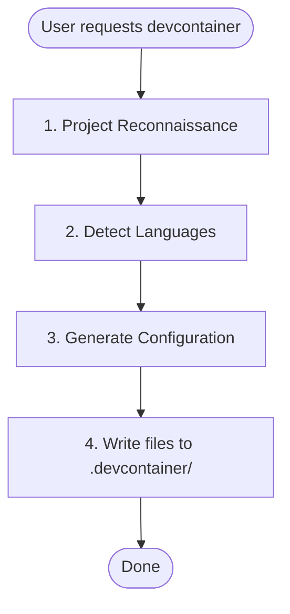

# Devcontainer 搭建技能

创建一个预配置好的 devcontainer，包含 Claude Code 和针对特定语言的工具链。

## 何时使用

- 用户要求“设置 devcontainer”或“添加 devcontainer 支持”
- 用户想要一个沙箱化的 Claude Code 开发环境
- 用户需要具有持久化配置的隔离开发环境

## 何时不使用

- 用户已有 devcontainer 配置，只需要修改
- 用户询问的是一般性的 Docker 或容器问题
- 用户想要部署生产环境容器（本技能仅用于开发）

## 工作流程



## 阶段 1：项目侦察

### 推断项目名称

按以下顺序检查（使用第一个匹配项）：

1. `package.json` → `name` 字段
2. `pyproject.toml` → `project.name`
3. `Cargo.toml` → `package.name`
4. `go.mod` → module 路径（`/` 之后的最后一段）
5. 兜底使用目录名称

转换为 slug：转为小写，将空格/下划线替换为连字符。

### 检测语言技术栈

| 语言 | 检测文件 |
|----------|-----------------|
| Python | `pyproject.toml`, `*.py` |
| Node/TypeScript | `package.json`, `tsconfig.json` |
| Rust | `Cargo.toml` |
| Go | `go.mod`, `go.sum` |

### 多语言项目

如果检测到多种语言，按以下优先级顺序全部配置：

1. **Python** - 主要语言，使用 Dockerfile 安装 uv + Python
2. **Node/TypeScript** - 使用 devcontainer feature
3. **Rust** - 使用 devcontainer feature
4. **Go** - 使用 devcontainer feature

对于多语言的 `postCreateCommand`，将所有设置命令串联起来：
```
uv run /opt/post_install.py && uv sync && npm ci
```

所有检测到的语言的扩展和设置都应合并到配置中。

## 阶段 2：生成配置

从 `resources/` 目录中的基础模板开始。替换以下占位符：

- `{{PROJECT_NAME}}` → 人类可读的名称（例如 "My Project"）
- `{{PROJECT_SLUG}}` → 用于卷的 slug（例如 "my-project"）

然后应用下方针对特定语言的修改。

## 基础模板功能

基础模板包括：

- **Claude Code**，附带市场插件（anthropics/skills、trailofbits/skills、trailofbits/skills-curated）
- 通过 bubblewrap 和 socat 实现的**沙箱**
- 通过 uv 安装的 **Python 3.13**（二进制快速下载）
- 通过 fnm（Fast Node Manager）安装的 **Node 22**
- 用于基于 AST 的代码搜索的 **ast-grep**
- 具有 NET_ADMIN 能力的**网络隔离工具**（iptables、ipset）
- **安全挂载**：`.devcontainer/` 以只读方式挂载，以防止容器逃逸
- **令牌转发**：通过 `remoteEnv` 转发 `CLAUDE_CODE_OAUTH_TOKEN` 和 `ANTHROPIC_API_KEY`
- **现代 CLI 工具**：ripgrep、fd、fzf、tmux、git-delta

---

## 特定语言章节

### Python 项目

**检测：** `pyproject.toml`、`requirements.txt`、`setup.py` 或 `*.py` 文件

**Dockerfile 新增内容：**

基础 Dockerfile 已通过 uv 包含 Python 3.13。如果需要其他版本（从 `pyproject.toml` 检测得到），请修改 Python 安装：

```dockerfile
# Install Python via uv (fast binary download, not source compilation)
RUN uv python install <version> --default
```

**devcontainer.json 扩展：**

添加到 `customizations.vscode.extensions`：
```json
"ms-python.python",
"ms-python.vscode-pylance",
"charliermarsh.ruff"
```

添加到 `customizations.vscode.settings`：
```json
"python.defaultInterpreterPath": ".venv/bin/python",
"[python]": {
  "editor.defaultFormatter": "charliermarsh.ruff",
  "editor.codeActionsOnSave": {
    "source.organizeImports": "explicit"
  }
}
```

**postCreateCommand：**
如果存在 `pyproject.toml`，则串联命令：
```
rm -rf .venv && uv sync && uv run /opt/post_install.py
```

---

### Node/TypeScript 项目

**检测：** `package.json` 或 `tsconfig.json`

**无需新增 Dockerfile 内容：** 基础模板已通过 fnm（Fast Node Manager）包含 Node 22。

**devcontainer.json 扩展：**

添加到 `customizations.vscode.extensions`：
```json
"dbaeumer.vscode-eslint",
"esbenp.prettier-vscode"
```

添加到 `customizations.vscode.settings`：
```json
"editor.defaultFormatter": "esbenp.prettier-vscode",
"editor.codeActionsOnSave": {
  "source.fixAll.eslint": "explicit"
}
```

**postCreateCommand：**
根据 lockfile 检测包管理器，并与基础命令串联：
- `pnpm-lock.yaml` → `uv run /opt/post_install.py && pnpm install --frozen-lockfile`
- `yarn.lock` → `uv run /opt/post_install.py && yarn install --frozen-lockfile`
- `package-lock.json` → `uv run /opt/post_install.py && npm ci`
- 无 lockfile → `uv run /opt/post_install.py && npm install`

---

### Rust 项目

**检测：** `Cargo.toml`

**需添加的 features：**

```json
"ghcr.io/devcontainers/features/rust:1": {}
```

**devcontainer.json 扩展：**

添加到 `customizations.vscode.extensions`：
```json
"rust-lang.rust-analyzer",
"tamasfe.even-better-toml"
```

添加到 `customizations.vscode.settings`：
```json
"[rust]": {
  "editor.defaultFormatter": "rust-lang.rust-analyzer"
}
```

**postCreateCommand：**
如果存在 `Cargo.lock`，使用锁定构建：
```
uv run /opt/post_install.py && cargo build --locked
```
如果没有 lockfile，使用标准构建：
```
uv run /opt/post_install.py && cargo build
```

---

### Go 项目

**检测：** `go.mod`

**需添加的 features：**

```json
"ghcr.io/devcontainers/features/go:1": {
  "version": "latest"
}
```

**devcontainer.json 扩展：**

添加到 `customizations.vscode.extensions`：
```json
"golang.go"
```

添加到 `customizations.vscode.settings`：
```json
"[go]": {
  "editor.defaultFormatter": "golang.go"
},
"go.useLanguageServer": true
```

**postCreateCommand：**
```
uv run /opt/post_install.py && go mod download
```

---

## 参考资料

如需更多指导，请参阅：
- `references/dockerfile-best-practices.md` - 层优化、多阶段构建、架构支持
- `references/features-vs-dockerfile.md` - 何时使用 devcontainer features 与自定义 Dockerfile

---

## 添加持久卷

在 `devcontainer.json` 中新增挂载的模式：

```json
"mounts": [
  "source={{PROJECT_SLUG}}-<purpose>-${devcontainerId},target=<container-path>,type=volume"
]
```

常见的新增内容：
- `source={{PROJECT_SLUG}}-cargo-${devcontainerId},target=/home/vscode/.cargo,type=volume`（Rust）
- `source={{PROJECT_SLUG}}-go-${devcontainerId},target=/home/vscode/go,type=volume`（Go）

---

## 输出文件

在项目的 `.devcontainer/` 目录中生成以下文件：

1. `Dockerfile` - 容器构建指令
2. `devcontainer.json` - VS Code/devcontainer 配置
3. `post_install.py` - 创建后的设置脚本
4. `.zshrc` - Shell 配置
5. `install.sh` - 用于管理 devcontainer 的 CLI 辅助工具（`devc` 命令）

---

## 验证清单

在向用户展示文件之前，请验证：

1. 所有 `{{PROJECT_NAME}}` 占位符均已替换为人类可读的名称
2. 所有 `{{PROJECT_SLUG}}` 占位符均已替换为 slug 化的名称
3. `devcontainer.json` 中的 JSON 语法有效（无尾随逗号、嵌套正确）
4. 已为所有检测到的语言添加了相应的特定语言扩展
5. `postCreateCommand` 包含所有必需的设置命令（使用 `&&` 串联）

---

## 用户说明

生成完成后，告知用户：

1. 如何启动：“在 VS Code 中打开并选择 'Reopen in Container'”
2. 备选方式：`devcontainer up --workspace-folder .`
3. CLI 辅助工具：运行 `.devcontainer/install.sh self-install` 将 `devc` 命令添加到 PATH
